# ArcadeMatrix

🇬🇧 English | 🇫🇷 [Français](README_FR.md) | 🇪🇸 [Español](README_ES.md)

📺 **Video Demo / Présentation :** https://youtu.be/2sA5wLVozRQ?si=T1gn6MYDwpq2-54c

Welcome to the open-source ESP32 firmware for HUB75 LED matrix displays! This project allows you to display Arcade clocks, animated GIFs, live weather, and even **MUGEN fighting game sprites** simulated directly on a real LED matrix.

---

> [!IMPORTANT]
> ### ⚡ One-Click Web Installer (Browser Flash)
> Flash your ESP32 board directly from your web browser (Chrome / Edge / Opera) in one click with zero software to install!
> 
> 👉 **[🚀 Launch ArcadeMatrix Web Installer](https://red77290.github.io/ArcadeMatrix/)**
> 
> | Firmware Version | Compatible Hardware Board | Web Installer Button |
> | :--- | :--- | :--- |
> | **ESP32-DevKit (Classic)** | ESP32-DevKitC, NodeMCU-32S, WROOM-32 (4MB Flash) | Select **ESP32 (Standard)** |
> | **ESP32-S3 Waveshare** | Waveshare ESP32-S3 Matrix Board (32MB Flash + 16MB PSRAM (N32R16)) | Select **ESP32-S3 (Waveshare)** |

---

## 💾 Releases & SD Card Kit

**[⬇️ Download Latest Pre-built Release & SD Card Kit](https://github.com/red77290/ArcadeMatrix/releases/latest)**
- **Firmware Bundles**: Pick `ArcadeMatrix-esp32dev.zip` or `ArcadeMatrix-esp32s3_waveshare.zip` depending on your board (contains `firmware-*.bin`, `bootloader-*.bin`, `partitions-*.bin`, and `boot_app0.bin` for manual `esptool.py` flashing - see [Getting Started](docs/GETTING_STARTED.md#flashing-a-pre-built-release)).
- **SD Card Starter Kit (`ArcadeMatrix-sdcard.zip`)**: Ready-to-copy root folder structure containing `config.json`, GIF/MUGEN asset folders, and playlist indexing scripts.


## 🕹️ Built-in Engines & Hardware Simulations

Every engine in ArcadeMatrix is engineered with **zero dynamic allocations and zero mutex contention** on the Core 1 hot-path, guaranteeing a rock-solid 60 FPS refresh rate. Below are hardware-accurate simulations of each engine running on physical HUB75 displays:

| Engine / ID | Hardware Simulation | Description & Key Features |
| :--- | :---: | :--- |
| **Desk Master Dashboard**<br>`dashboard` | 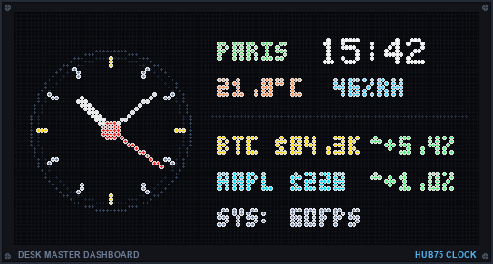 | Complete horizontal desk deck with handcrafted analog watch dial, smooth sweeping second hand, world clocks, SHTC3 indoor climate, and live Binance cryptos & Yahoo Finance stocks ticker. |
| **Retro Game Clock**<br>`clock` | 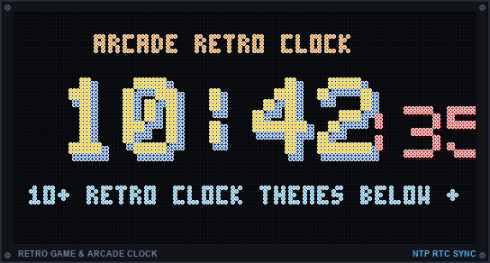<br><br>[👉 **View 10+ Retro Clocks Showcase ➔**](#-legendary-retro-game-clocks-showcase--hardware-simulations) | Signature animated retro arcade and console clocks (Metal Slug, Castlevania, Mario, Mega Man, Sonic, Pokédex, Pac-Man, Tetris, World Clock, Matrix Rain...) with 100% bit-perfect sprites. |
| **WebRadio & Music Player**<br>`music` | 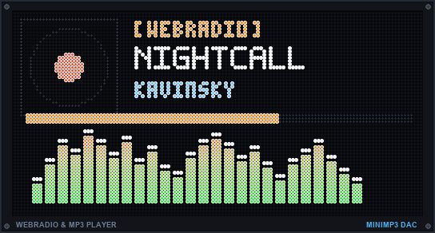 | Autonomous streaming audio with linear real-time MP3 decoding (`minimp3`), Everest ES8311 I2S DAC output, album artwork, and dynamic 64-band audio visualizer. |
| **Spotify Now Playing**<br>`spotify` | 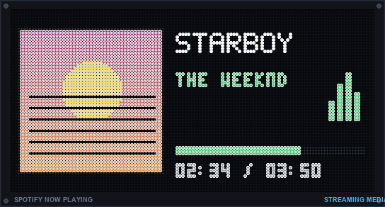 | Real-time track display with full-color album artwork, scrolling artist/title, animated mini equalizer bars, and track progress. |
| **Google Cast & Nest**<br>`googlecast` | 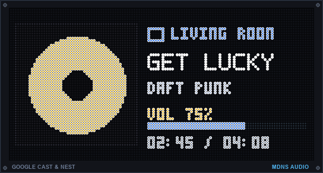 | Automatic mDNS discovery of Google Home / Nest Audio devices with live streaming media artwork, volume, and playback progress. |
| **Crypto Ticker & Chart**<br>`crypto` | 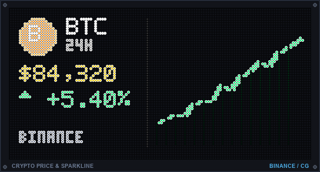 | Live Binance / CoinGecko prices, 24h change badge, and real-time historical sparkline charts with smart TTL caching. |
| **Stock Market Ticker**<br>`stock` | 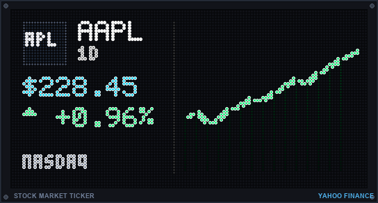 | Real-time quotes from Yahoo Finance, 1D % badges, and intraday sparkline area charts for NASDAQ/S&P stocks and ETFs. |
| **Weather Forecast**<br>`weather` | 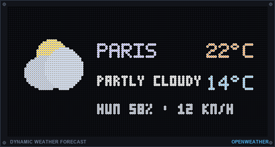 | Live outdoor conditions, high/low temperatures, humidity, wind, and animated retro icons via OpenWeatherMap & Open-Meteo. |
| **Climate Sensor**<br>`temp` | 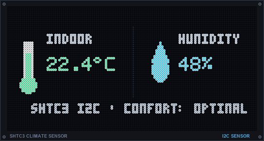 | Real-time indoor temperature (°C/°F) and relative humidity via on-board SHTC3 I2C sensor with dynamic comfort indicators. |
| **SPL Decibel Meter**<br>`decibel` | 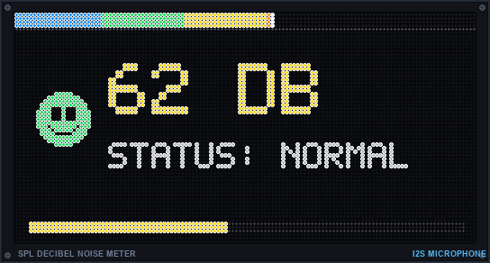 | Calibrated SPL ambient noise monitoring with reactive arcade smileys, top VS fighting healthbar gauge, and segmented VU meter. |
| **System Telemetry HUD**<br>`sysinfo` | 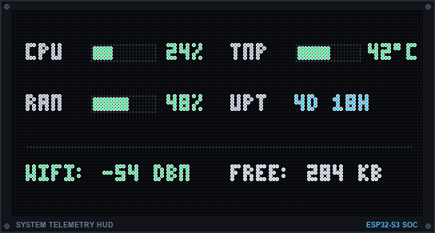 | Real-time dual-column monitor of CPU usage (%), RAM (%), SoC hardware temperature (°C/°F), and Uptime with vibrant gauge bars. |
| **Live News Ticker**<br>`gnews` | 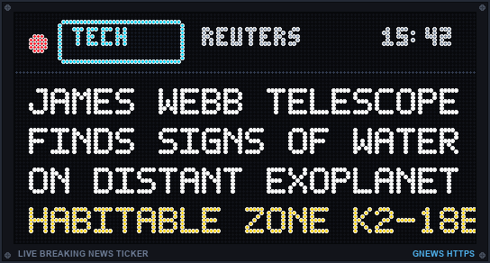 | Real-time breaking headlines with topic pills (`[TECH]`, `[WORLD]`, `[BIZ]`), live pulsing red beacon, and smooth sub-pixel scrolling ticker. |
| **Home Assistant & MQTT**<br>`mqttdata` | 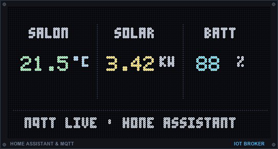 | Stream Home Assistant dashboards, sensor values, 24h historical charts, and local weather via MQTT with ready-to-use blueprints. |
| **Audio Visualizer**<br>`visualizer` | 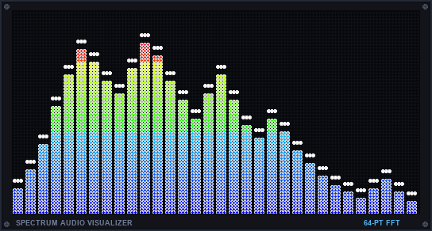 | Real-time 32-band rainbow spectrum bars with peak hold dots, oscilloscope waveforms, and radial audio reactive modes. |
| **Animated GIF Player**<br>`gif` | 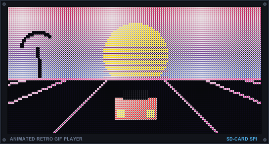 | Smooth 60 FPS playback of retro animations and SD card playlists with zero-copy DMA canvas acceleration. |
| **Scrolling Text Banner**<br>`message` | 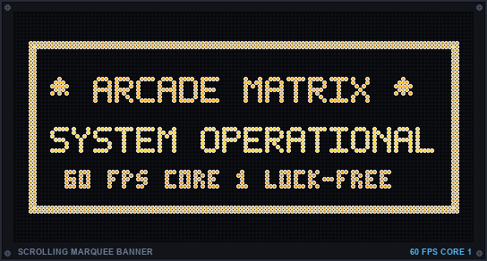 | Customizable dot-matrix marquee signs with glowing amber typography, multiple scroll directions, and REST API triggers. |
| **Arcade Cabinet Marquee**<br>`marquee` | 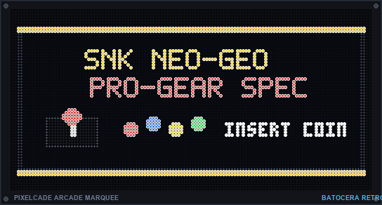 | Displays official illuminated arcade marquees via Pixelcade integration for Batocera, Recalbox, and RetroPie gaming setups. |
| **Calendar & Date**<br>`date` | 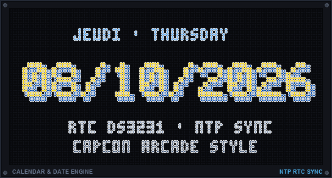 | Large arcade-styled date with 3D Capcom/Nintendo drop shadows, multi-language support (EN, FR, ES), and NTP/RTC DS3231 synchronization. |

> [!NOTE]
> **Hardware Rendering Notice:** The engine preview displays and clock showcase posters shown in this documentation are high-fidelity software simulations designed to illustrate visual layouts, animations, and telemetry widgets. Actual hardware rendering on a physical HUB75 LED matrix panel may differ depending on LED pitch, optical acrylic diffusion, viewing distance, and ambient brightness.

---

## 🎮 Legendary Retro Game Clocks (Showcase & Hardware Simulations)

> [!NOTE]
> All clock screen previews below are software simulations. Real-life hardware rendering on physical RGB LED panels may have subtle differences in color temperature, brightness, and optical diffusion.

> [!IMPORTANT]
> **Hardware Profile Availability (ESP32-S3 vs ESP32 Standard):**
> Due to high-resolution Flash ROM asset footprints on boards with 4 MB Flash, **Metal Slug** (Theme 41), **Pokédex** (Theme 32), **World Clock** (Theme 33), and **Words Clock** (Theme 37) are exclusive to **ESP32-S3 boards (16 MB Flash)**. On classic ESP32 DevKit boards, selecting these themes automatically falls back gracefully to the standard Arcade Clock.

ArcadeMatrix includes a signature collection of handcrafted, hardware-synchronized retro arcade and console clocks rendered with 100% bit-perfect original sprites in full 60 FPS, with zero dynamic allocations on the Core 1 hot-path:

### 1. Metal Slug: Super Vehicle-001 (SNK Neo Geo) — Theme 41 *(ESP32-S3 only)*
*Authentic SNK Neo Geo pixel art with Arabian desert bazaar backdrop, Marco Rossi combat animations, Rebel Di-Cokka tank, patrol helicopter, and heavy machine gun firefights.*


### 2. Castlevania (Konami NES) — Theme 31
*Gothic clock tower Belfry with Simon Belmont climbing the grand stone staircase toward Dracula's chamber, authentic pedestal torch, flapping vampire bat across the blood moon, and high-legibility ivory digits.*


### 3. Super Mario Bros (NES) — Theme 30
*Mushroom Kingdom Overworld with 100% authentic SMB1 brick blocks; Mario runs across the screen and jumps under the digit block to trigger an elastic bounce and digit flip (with green Koopa shell kick and gold coin pop in 128x32 compact mode).*


### 4. Mega Man (Capcom NES) — Theme 35
*Capcom Wily Castle fortress with separated technical platforms, life gauge, sleeping Metool, and Mega Man firing his Buster shot at the minute pod.*


### 5. Sonic The Hedgehog (Sega Genesis) — Theme 39
*Green Hill Zone checkered platforms, spinning gold rings, red spring, Motobug badnik, and Sonic idle/spin-dash jumping animations.*


### 6. Pokémon Pokédex (Nintendo Game Boy) — Theme 32 *(ESP32-S3 only)*
*Authentic dual-screen Pokédex (Pocket Index) interface with creature inspection viewport, animated Pikachu sprite, PKMN font digital clock, live seconds telemetry bar, and blinking LED status sensor.*
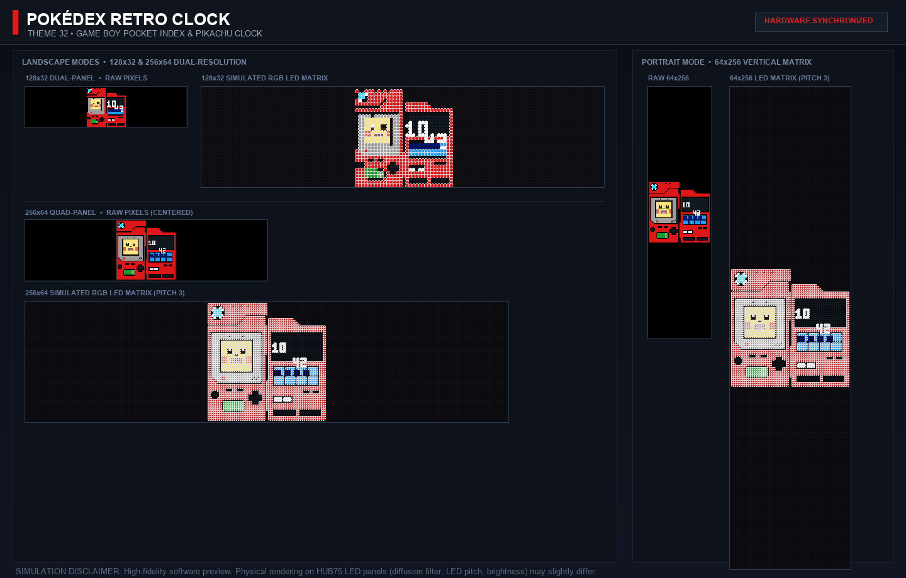

### 7. Pac-Man Arcade (Namco 1980) — Theme 26
*Original Namco arcade maze with blue neon corridors, energizers, dots, animated Pac-Man, and 4 chasing ghosts (Blinky, Pinky, Inky, Clyde).*
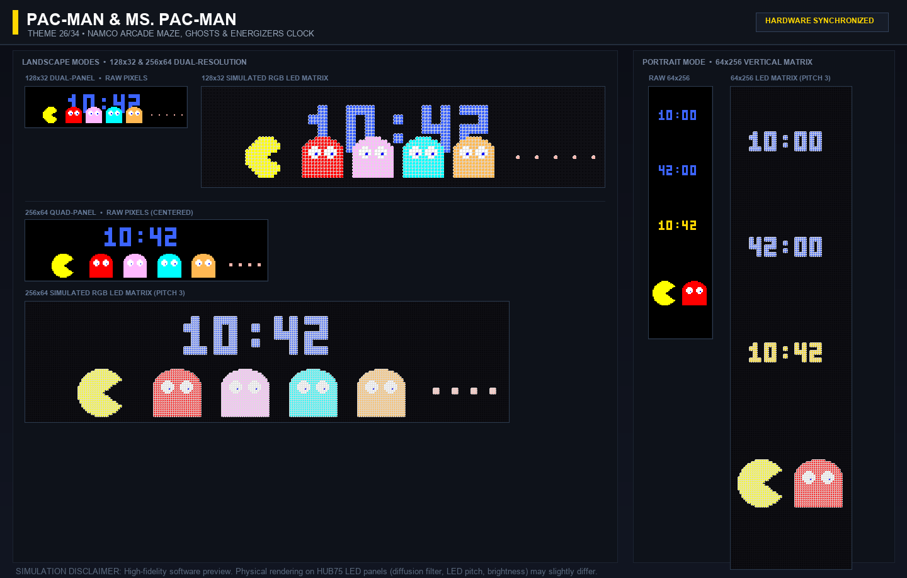

### 8. Russian Tetris (Alexey Pajitnov / Game Boy) — Theme 23
*Legendary falling block puzzle with dynamic 3D-beveled mino bricks (I, J, L, O, S, T, Z) cascading down to assemble the hours and minutes in real-time.*
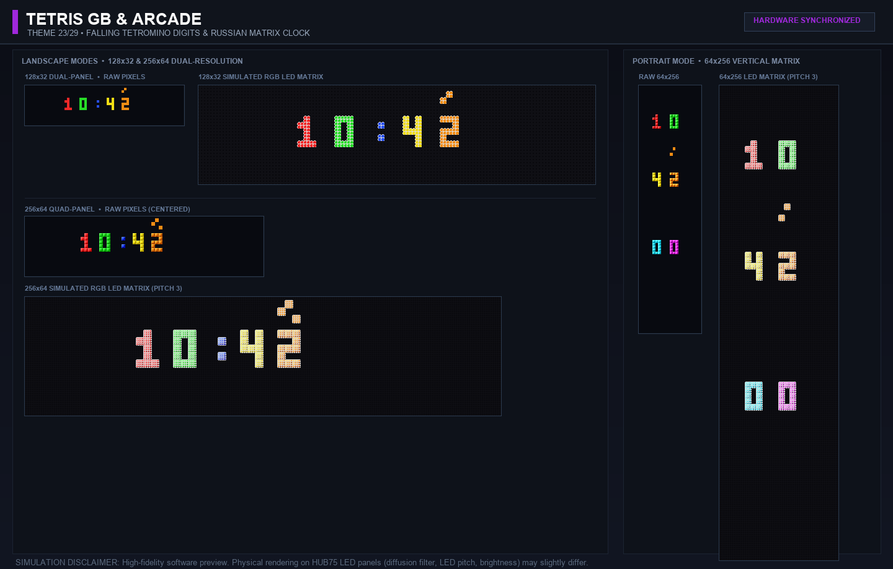

### 9. World Clock & Solar Terminator — Theme 33 *(ESP32-S3 only)*
*High-resolution continental world map with dynamic day/night solar terminator calculating real-time solar declination, local meridian marker, and dual UTC/local time.*
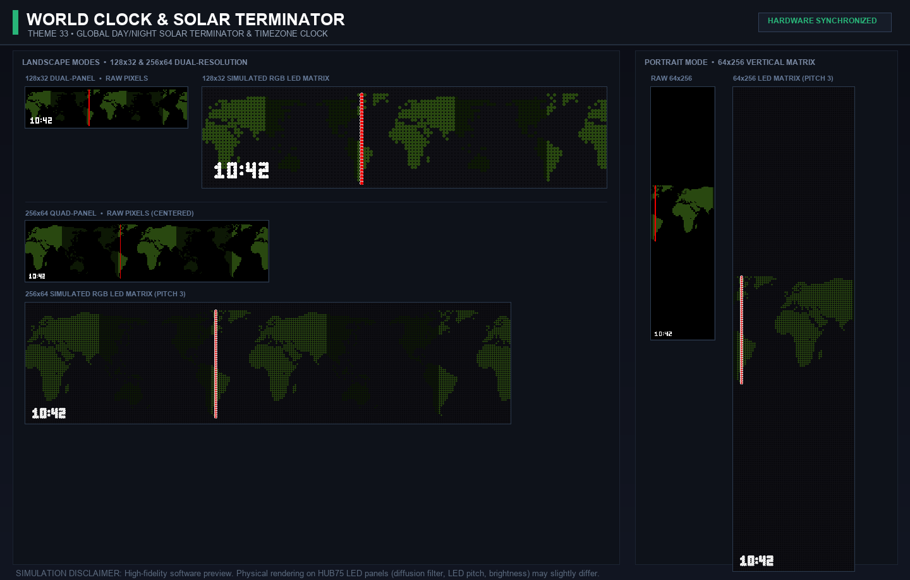

### 10. True Matrix Rain (The Wachowskis 1999) — Theme 21
*Iconic digital rain with phosphor green glyph cascades, randomized drop speeds, blazing white lead heads, fading persistence trails, and glowing neon clock digits.*
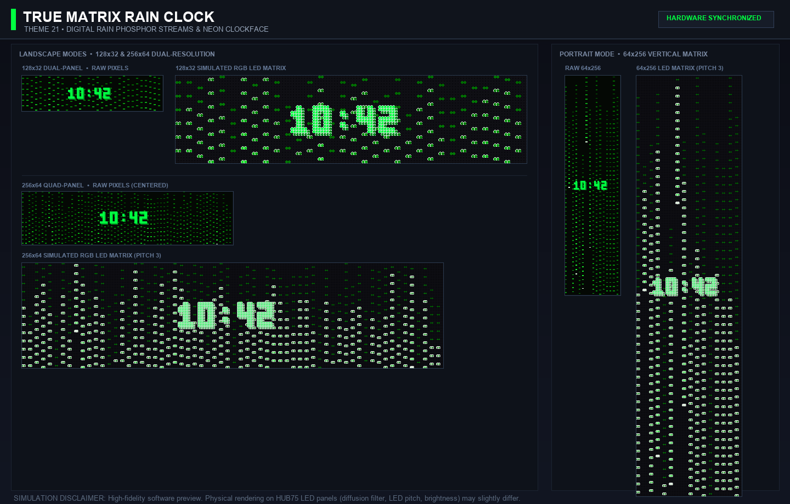

---

## 🚀 Universal Engine Compatibility: Auto Depth & Auto Buffer

ArcadeMatrix features an advanced, memory-aware execution pipeline that allows all 18 engines (including heavy engines like `AnimatedGIF`, `Stock`, `Crypto`, and `MUGEN`) to run on **classic ESP32 DevKit boards with 0 KB PSRAM** as well as flagship **ESP32-S3 boards with 16 MB PSRAM**:

- **🎨 Auto Color Depth (`dynamic_color_depth`)**:
  - **Rich 8-Bit Visuals by Default**: Clocks, fighting game animations, visualizers, messages, and marquees render at maximum 8-bit color depth (up to 256 brightness levels per RGB channel).
  - **Dynamic Sandbox Memory Reclamation**: When network engines (`stock`, `crypto`, `weather`, `gnews`) need to perform HTTPS requests, the HUB75 DMA engine temporarily downshifts to 4 bits under hardware blanking. This instantly frees **16 to 24 KB of contiguous DMA DRAM**, ensuring plenty of room for TLS handshakes and chunked JSON parsing without memory fragmentation.
  - **0 ms Instant Transitions**: When stock quotes, crypto prices, and sparkline charts are fresh in cache (`needsTlsFetch() == false`), the downshift is skipped completely. Stock and Crypto activate immediately in **full 8 bits with 0 ms transition time (zero display blanking)**.

- **⚡ Auto Buffering Pipeline (`render_pipeline: auto`)**:
  - **PSRAM Acceleration**: On ESP32-S3 boards, allocates a 16-bit canvas in PSRAM with double DMA buffers (`canvas_double`) for buttery-smooth 60 FPS tear-free rendering.
  - **SRAM1 Canvas Isolation**: On classic ESP32 chips, allocates the 8 KB off-screen canvas in **SRAM1** (non-DMA, CPU-only DRAM) during early boot before Wi-Fi and WebServer start. This preserves **8,192 bytes of contiguous DMA-capable memory in SRAM2**, preventing memory starvation.
  - **Tear-Free Single DMA**: Uses `Hub75BulkEncoder` sequential row bursts to commit frames atomically, eliminating scanline tearing even on single-buffered displays.

## SD Card Structure
Format your SD card to **FAT32** or **exFAT**. Your SD card should look like this:
```
SD:/
  ├─ config.json
  ├─ gifs/
  │  │   └─ mario.gif
  └─ fighters_32/
      ├─ backgrounds/
      │   └─ stage1.raw
      └─ ryu/
          ├─ idle.fgt
          └─ attack.fgt
  └─ fighters_64/
      ├─ (same structure for 64px tall panels)
```
*Note: The `www/` folder is no longer required on the SD card as the Web UI is now baked directly into the ESP32 firmware!*

## Configuration (`config.json`)
The `config.json` file located at the root of your SD card is exhaustive. It contains parameters for the Matrix size, color depth, clock themes, idle rotation order, and MUGEN sprite backgrounds.
Open the `config.json` provided in the `release/sdCard/` folder to see all possible values.

## MUGEN Sprite Extraction (The `mugen_extractor.py` Script)
To display fighters in the `SPRITES` module, the ESP32 expects `.fgt` raw files. Since the ESP32 is not powerful enough to decode complex MUGEN character formats natively, we provide a custom Python script to convert them and generate an `index.txt` manifest containing perfect bounding boxes and virtual ground values.

### How to use the extractor:
1. Make sure you have Python 3 installed with the `Pillow` library (`pip install Pillow`), or just run `tools/mugen_extractor/start_extractor.sh`/`.bat` which sets this up for you automatically.
2. Go to the `tools/mugen_extractor/` folder in the repository.
3. Run the script, pointing `--src` at your MUGEN `chars/` folder:
   ```bash
   python mugen_extractor.py --src /Path/To/Your/Mugen/chars --dest ./fighters_32
   # Or with custom scaling (e.g., --scale 0.5 to scale down by 50% saving 75% RAM):
   python mugen_extractor.py --src /Path/To/Your/Mugen/chars --dest ./fighters_64 --scale 0.5
   ```
4. The script generates `.fgt` files along with an `index.txt`/`index.json` manifest in the `--dest` folder. Run it twice (with `--dest ./fighters_32` and `--dest ./fighters_64`) if you want assets for both matrix sizes.
5. Copy the resulting `fighters_32/` or `fighters_64/` folder to your SD card.

For full details, please read the documentation inside `tools/mugen_extractor/README.md`.

### Sprite Backgrounds
Fighters need an arena! You can define the background they fight on by placing a raw image file (e.g., `stage1.raw`) in `SD:/fighters_32/backgrounds/`.
Then, link this background in your `config.json` under the `[DATE]` section (backgrounds are used to spice up the date module!):
```ini
BACKGROUND_SPRITE=stage1.raw
```

## GIF Playlist Indexing (Web UI folder selection)
The Web UI lets you tick/untick which `gifs/` subfolders play during the idle rotation, but it needs a `playlists.json` manifest to know what's on the SD card. GIF playback itself works fine without it (the engine always reads files directly from the SD card) - this step is only needed if you want to use that checkbox selector.

> [!TIP]
> **Web UI File Manager & Uploader (No SD card removal needed!):**
> You can now manage playlists, create/delete folders, rename items, and upload animated GIFs directly through the browser using the Web UI **GIF File Manager** card with native Horizontal / Vertical orientation support, with automatic background re-indexing — implemented by [@TooncesToo](https://github.com/TooncesToo)!
> 
> Alternatively, for batch offline preparation on your computer:
2. Run one of the native scripts in `tools/gif_indexation/` - no Python required:
   ```bash
   ./generate_index.sh /Volumes/SDCARD      # macOS/Linux - pass the SD root or its gifs/ folder
   ```
   ```powershell
   .\generate_index.ps1 -Path E:\           # Windows
   ```
3. This creates `gifs/playlists.json` on the SD card. Re-run it whenever you add, remove, or rename a folder inside `gifs/`.

For full details, see `tools/gif_indexation/README.md`.

## Custom Fonts (BDF → AMF conversion)
The Clock, Date, and scrolling Message can use custom bitmap fonts loaded from the SD card instead of the ~6 fonts compiled into the firmware, using the same `.bdf` fonts `ArcadeMatrix_RPi` already ships. The ESP32 has no on-device BDF parser though, so they must be converted to the compact `.amf` format first.

1. Copy your `.bdf` font(s) into the `fonts/` folder on your SD card.
2. Run the batch converter:
   ```bash
   python3 tools/bdf_to_amfont/bdf_to_amfont.py /Volumes/SDCARD   # pass the SD root or its fonts/ folder
   ```
   (No external dependencies required. Standard Python only.)
3. This converts each `.bdf` to an equivalently named `.amf` in-place. The resulting fonts immediately appear in the Web UI Settings page (Clock/Date "Font" dropdowns) - no restart required.

For full details, check `tools/bdf_to_amfont/README.md`.

## ⚡ Hardware Compatibility & Engine Matrix

| Engine / Feature | Category | ESP32-S3 (Waveshare Board) | ESP32 Classic (DevKit / `esp32dev`) | Hardware / Network Requirement |
| :--- | :--- | :---: | :---: | :--- |
| **Clock Engine (`clock`)** | `info` | 🟢 60 FPS | 🟢 60 FPS | Dynamic fonts, arcade/retro watch faces |
| **Animated GIFs (`gifs`)** | `media` | 🟢 Fullspeed 60 FPS | 🟢 Fullspeed 60 FPS | Micro-SD Card (Yoko / Tate orientations) |
| **M.U.G.E.N Combat (`fighter`)** | `arcade` | 🟢 60 FPS | 🟢 60 FPS | Micro-SD Card (RGB565 sprite streaming) |
| **Desk Deck Dashboard (`dashboard`)** | `info` | 🟢 10 FPS | 🟢 10 FPS | Wi-Fi (Multi-widget clock, weather & market) |
| **Real-Time Crypto (`crypto`)** | `finance` | 🟢 10 FPS (8 bits) | 🟢 10 FPS (8 bits cached) | Wi-Fi, HTTPS/TLS (Binance, CoinGecko) |
| **Stock Market & Sparklines (`stock`)** | `finance` | 🟢 10 FPS (8 bits) | 🟢 10 FPS (8 bits cached) | Wi-Fi, HTTPS/TLS (Yahoo Finance) |
| **Live Breaking News (`gnews`)** | `news` | 🟢 30 FPS | 🟢 30 FPS | Wi-Fi, HTTPS/TLS (GNews API) |
| **Live Weather Forecasts (`weather`)** | `info` | 🟢 10 FPS | 🟢 10 FPS | Wi-Fi (OpenWeatherMap, Open-Meteo) |
| **Date & Calendar (`date`)** | `info` | 🟢 30 FPS | 🟢 30 FPS | Local system time & optional sprite backdrop |
| **Scrolling Text Ticker (`message`)** | `text` | 🟢 60 FPS | 🟢 60 FPS | Sub-pixel 60 FPS text scroller |
| **System Telemetry (`sysinfo`)** | `system` | 🟢 10 FPS | 🟢 10 FPS | Real-time CPU, RAM, Temp & Uptime gauges |
| **Retro Gameroom Marquee (`marquee`)** | `arcade` | 🟢 60 FPS | 🟢 60 FPS | MQTT / Batocera / Recalbox / RetroPie |
| **Spotify Now Playing (`spotify`)** | `media` | 🟢 30 FPS | 🟢 30 FPS | Wi-Fi, HTTPS/TLS, Spotify Web API |
| **Google Cast Display (`google_cast`)** | `media` | 🟢 30 FPS | 🟢 30 FPS | Wi-Fi, mDNS local discovery |
| **Autonomous WebRadio (`music`)** | `media` | 🟢 30 FPS (I2S DAC) | ❌ Incompatible | Built-in ES8311 DAC & PSRAM required |
| **Audio Spectrum Visualizer (`audiovisualizer`)** | `audio` | 🟢 60 FPS (I2S Mic) | ❌ Incompatible | Built-in ES7210 microphone array required |
| **SPL Decibel Sound Meter (`decibel`)** | `audio` | 🟢 30 FPS (I2S Mic) | ❌ Incompatible | Built-in ES7210 microphone array required |
| **Indoor Climate Sensor (`temp`)** | `sensor` | 🟢 30 FPS (I2C SHTC3) | ❌ Incompatible | Built-in SHTC3 temperature/humidity sensor required |
| **Home Assistant & MQTT Data (`mqttdata`)** | `info` | 🟢 30 FPS | 🟢 30 FPS | MQTT Broker / Home Assistant Blueprints |

👉 *For the comprehensive technical breakdown (FPS, RAM, and DMA budgets), see the [Engine Compatibility Matrix](docs/ENGINE_COMPATIBILITY_MATRIX.md).*

> [!NOTE]
> ### 💡 ESP32 Classic (`esp32dev`) Full TLS Compatibility & Smart Transition Prefetch
> The classic ESP32 (WROOM-32 without PSRAM) is now **fully compatible** with TLS/HTTPS engines (`crypto`, `stock`, `gnews`, `weather`) thanks to an advanced **DMA-released memory sandbox**:
> 1. **Why the ~1s pause on the first rotation?** On classic ESP32, concurrent HUB75 DMA scanning and mbedTLS cryptographic handshakes cannot run simultaneously due to contiguous internal SRAM constraints. During the transition into a TLS engine, the firmware temporarily releases the DMA framebuffer, opening an **89 KB clean memory window** to prefetch all quotes, charts, and icons over HTTP/1.1 keep-alive in ~700 ms before reconfiguring the panel.
> 2. **Instant Subsequent Rotations:** This brief transition fetch occurs **only once** on the initial rotation! For all subsequent rotations during the cache lifetime (configurable via UI, e.g. 10 to 15 minutes), the engine serves cached quotes and sparkline charts directly from RAM at **full 8-bit color depth with zero transition delay and zero network overhead**.
> 3. **Automatic Refresh:** When the cache TTL expires, the engine cleanly performs a single background refresh on the next rotation and restarts the fresh cache cycle.

> [!NOTE]
> **Dynamic Hardware Probing & Graceful Degradation:** All hardware sensors (Gyroscope `QMI8658`, Microphone `ES7210`, DAC `ES8311`, Temperature `SHTC3`) are dynamically probed on the I2C/I2S bus at startup. If a sensor or peripheral is absent on your board, the feature is **automatically disabled safely without crashing**, falling back to manual settings in the Web UI.

- **ESP32-S3 Waveshare RGB Matrix Board (`esp32s3_waveshare`)**: **100% Compatible with all features.** Highly recommended. Required for large **256x64 True Matrix panels**, autonomous WebRadio audio streaming, Gyroscope auto-rotation, and leverages built-in hardware sensors (Decibel, Temp, Speaker DAC) out of the box.
- **Classic ESP32 (WROOM-32 / `esp32dev`)**: Dual-core Tensilica Xtensa LX6 @ 240MHz. Fully supports animations, Web UI, MUGEN, and now all HTTPS/TLS cloud engines (`crypto`, `stock`, `gnews`, `weather`) on **128x32 / 64x32 matrix panels**. Built-in physical audio/temp sensors are absent from standard DevKits unless wired externally.

## Compilation
To compile the firmware yourself, you must use **PlatformIO**.
- For 128x32: A standard ESP32 WROOM is sufficient (`pio run -e esp32dev`).
- For 256x64: An **ESP32-S3 with PSRAM** is required (`pio run -e esp32s3_waveshare`).

Run the following command to build:
```bash
pio run -e esp32s3_waveshare
```

## 📚 Further Documentation
- [Getting Started (PlatformIO setup, build, flash, logs)](docs/GETTING_STARTED.md)
- [Web Installer (flash from your browser, no CLI needed)](webinstaller/README.md) - *goes live once this repo is public (GitHub Pages requires a public repo on the free plan); until then, use the pre-built firmware above.*
- [Hardware Guide](docs/HARDWARE.md)
- [Wiring Guide](docs/WIRING.md)
- [Configuration Guide](docs/CONFIGURATION.md)
- [Developer Guide](docs/DEVELOPER.md)
- [Home Assistant Integration Guide](docs/HOME_ASSISTANT.md)
- [Home Assistant Blueprints](tools/home_assistant/blueprints/)
- [Architecture](docs/ARCHITECTURE.md)

## 🙏 Acknowledgments

A huge thanks to the open-source community and the creators of the incredible libraries that power this project:
- **[ESP32-HUB75-MatrixPanel-DMA](https://github.com/mrfaptastic/ESP32-HUB75-MatrixPanel-DMA)** by mrfaptastic
- **[AnimatedGIF](https://github.com/bitbank2/AnimatedGIF)** & **[PNGdec](https://github.com/bitbank2/PNGdec)** by bitbank2
- **[ESPAsyncWebServer](https://github.com/mathieucarbou/ESPAsyncWebServer)** by mathieucarbou
- **[ArduinoJson](https://github.com/bblanchon/ArduinoJson)** by bblanchon
- **[PubSubClient](https://github.com/knolleary/pubsubclient)** by knolleary
- **[PicoMQTT](https://github.com/mlesniew/PicoMQTT)** by mlesniew
- **[Adafruit GFX](https://github.com/adafruit/Adafruit-GFX-Library)** by Adafruit
- **[SdFat](https://github.com/greiman/SdFat)** by greiman
- **[Clockwise](https://github.com/jnthas/clockwise)** by Jonathas Amaral Barbosa (@jnthas) for the pixel art clock designs and retro assets (Mario, Pokédex, World Map, Words).
- **[@TooncesToo](https://github.com/TooncesToo)** (Erik Jerue) for developing the Home Assistant & MQTT Data engine with ready-to-use blueprints, the network GIF library API, multi-file uploader, Web UI file manager with dual-orientation support on both ESP32 and Raspberry Pi, clockface optimizations, and outstanding cross-platform contributions.

Special thanks to the **RPiTeam** for the awesome pack of 600 GIFs!

## 📜 License
This project is licensed under the **[PolyForm Noncommercial License 1.0.0](LICENSE)**.

**In short:** you're free to use, modify, and share this project for any noncommercial purpose (personal use, hobby builds, research, education, non-profit/public institutions) - see the full [LICENSE](LICENSE) file for the exact terms. **Any commercial use (selling assembled units, kits, or derived products/services) requires a separate license - contact [Red1L](https://github.com/red77290) to discuss commercial terms.**
