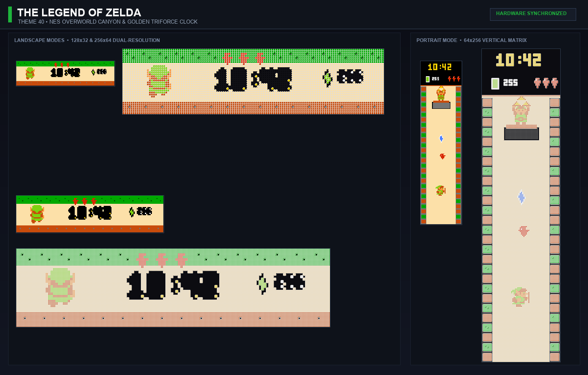
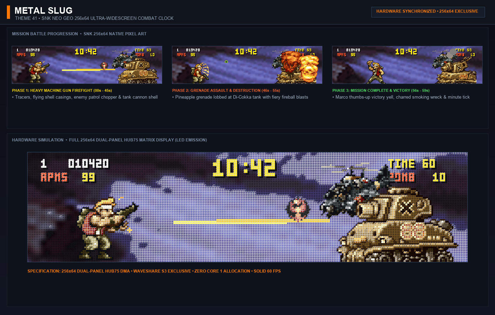
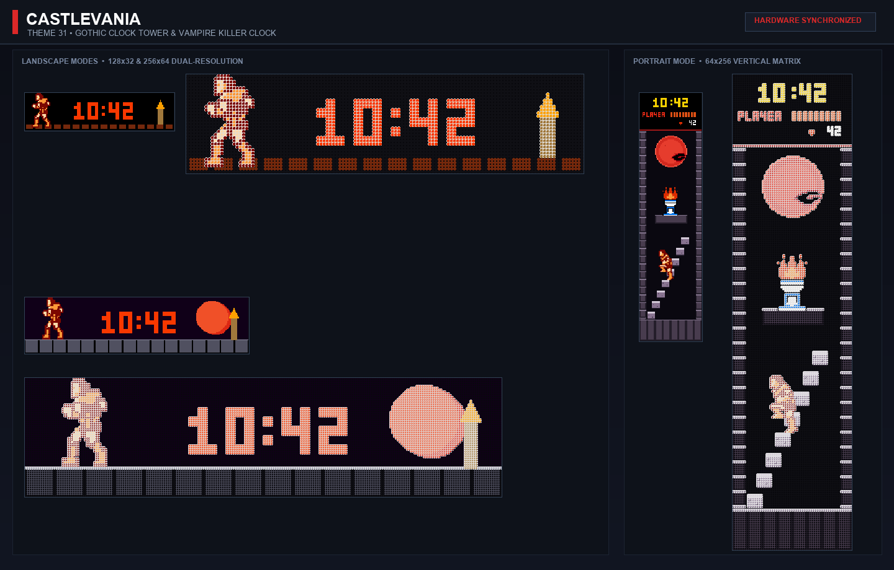
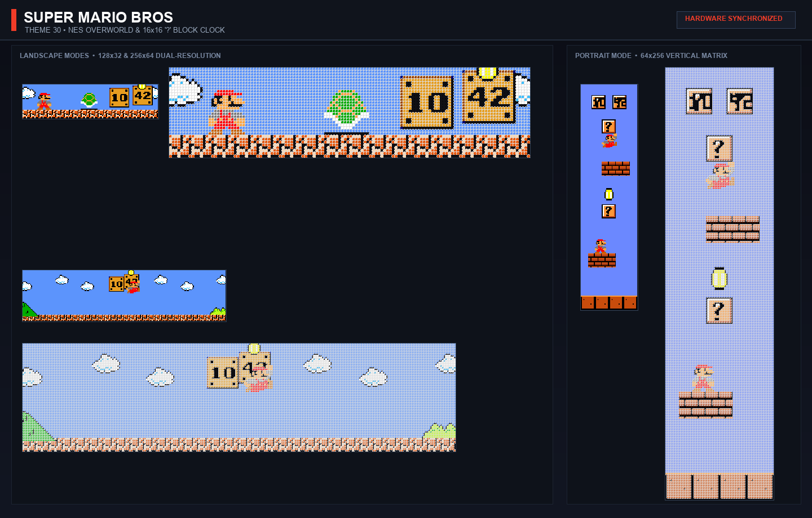
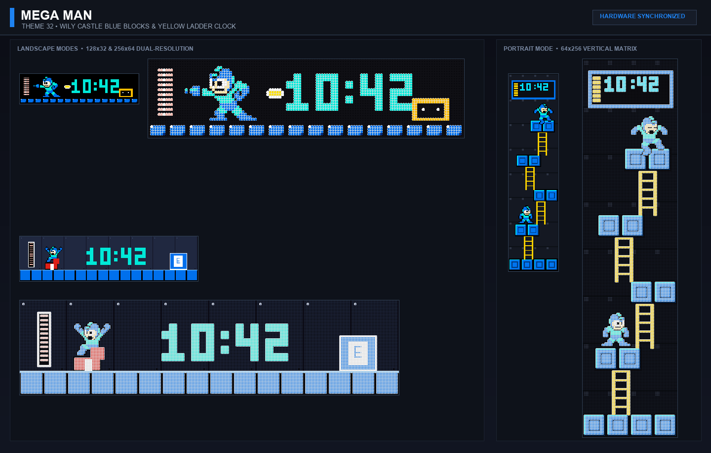
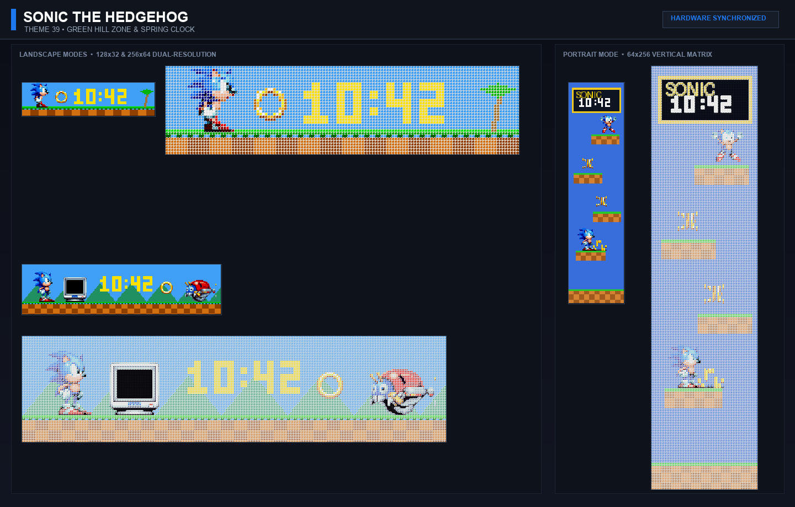
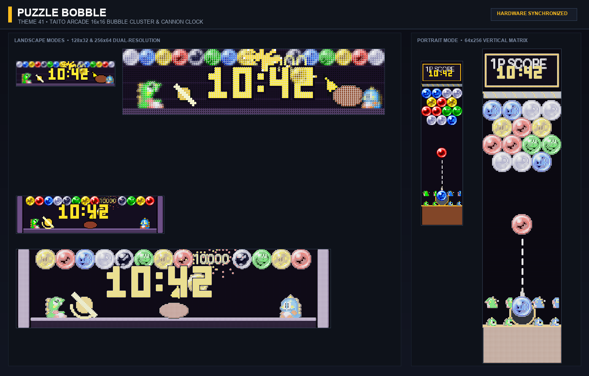

# ArcadeMatrix

🇬🇧 [English](README.md) | 🇫🇷 [Français](README_FR.md) | 🇪🇸 Español

📺 **Demostración en Video / Presentación:** https://youtu.be/2sA5wLVozRQ?si=T1gn6MYDwpq2-54c

¡Bienvenido al firmware de código abierto para ESP32 diseñado para controlar matrices LED HUB75! Este proyecto te permite mostrar relojes Arcade, GIFs animados, el tiempo en directo y **sprites de juegos de lucha MUGEN** simulados directamente en una matriz LED real.

---

> [!IMPORTANT]
> ### ⚡ Instalación Rápida por Navegador Web (Web Installer)
> ¡Flashea tu placa ESP32 directamente desde tu navegador (Chrome / Edge / Opera) en un solo clic sin necesidad de instalar ningún software!
> 
> 👉 **[🚀 Iniciar ArcadeMatrix Web Installer](https://red77290.github.io/ArcadeMatrix/)**
> 
> | Versión de Firmware | Placa de Hardware Compatible | Botón Web Installer |
> | :--- | :--- | :--- |
> | **ESP32-DevKit (Clásico)** | ESP32-DevKitC, NodeMCU-32S, WROOM-32 (4MB Flash) | Selecciona **ESP32 (Estándar)** |
> | **ESP32-S3 Waveshare** | Waveshare ESP32-S3 Matrix Board (32MB Flash + 16MB PSRAM (N32R16)) | Selecciona **ESP32-S3 (Waveshare)** |

---

## 💾 Releases y Kit de Tarjeta SD

**[⬇️ Descargar la última Release precompilada y Kit de Tarjeta SD](https://github.com/red77290/ArcadeMatrix/releases/latest)**
- **Archivos de Firmware**: Elige `ArcadeMatrix-esp32dev.zip` o `ArcadeMatrix-esp32s3_waveshare.zip` según tu placa (contiene `firmware-*.bin`, `bootloader-*.bin`, `partitions-*.bin` y `boot_app0.bin` para flasheo manual con `esptool.py`; consulta [Primeros pasos](docs/GETTING_STARTED_ES.md#flashing-a-pre-built-release)).
- **Kit de Tarjeta SD (`ArcadeMatrix-sdcard.zip`)**: Contiene la estructura de carpetas lista para copiar a la raíz de la tarjeta SD (`config.json`, carpetas GIFs/MUGEN y scripts de indexación).

## Características
- **Gran selección de relojes animados (`clock`):** relojes interactivos que incluyen Arcade clásico, Binary, Cyberpunk, Flip, Word, **Pac-Man**, **Tetris**, **SlotMachine**, **Pong**, **MatrixRain (Katakana)** y **Versus (Mugen)**.
- **📻 WebRadio Autónoma y Motor Musical (`music`):** Streaming de audio en segundo plano con decodificación de tramas MP3 lineal en tiempo real (`minimp3`), salida DAC I2S Everest ES8311 de alta fidelidad (streaming WebRadio por Wi-Fi — *nota: Bluetooth es solo BLE 5.0 para configuración, sin streaming de audio Bluetooth Classic A2DP*), carátulas de álbumes PNG a todo color, artista/título desplazable y visualizador de audio FFT de 64 puntos Cooley-Tukey dinámico.
- **🧭 Auto-Rotación de Pantalla Giroscópica de 6 Ejes (`QMI8658` / `GyroHAL`):** Orientación automática de pantalla ($0^\circ, 90^\circ, 180^\circ, 270^\circ$) mediante detección física del vector de gravedad, histéresis antivibración de 500 ms, offset mecánico de montaje y calibración en 1 clic desde la Web UI.
- **🎵 Spotify Now Playing (`spotify`):** visualización en tiempo real de la pista actual con carátula del álbum a todo color, desplazamiento artista/título, barra de progreso y ecualizador de audio animado.
- **📡 Google Cast & Nest (`google_cast`):** descubrimiento automático mDNS de altavoces Google Home / Nest Audio y visualización en directo de carátulas, progreso y volumen de reproducción.
- **🖥️ Monitor de Sistema (`sysinfo`):** supervisión en tiempo real del uso de CPU (%), RAM (%), temperatura de hardware del SoC (°C/°F) y Uptime con barras de nivel y temas visuales retro.
- **🥊 Motor de Combate M.U.G.E.N (`fighter`):** auténticos combates con sprites retro (Street Fighter, KOF, DBZ, Marvel...) extraídos directamente en RGB565 sin tirones, en modo independiente o en overlay sobre relojes.
- **📈 Tickers y Gráficos de Cripto / Bolsa (`crypto`, `stock`):** cotizaciones en vivo, variaciones % en 24h y gráficos sparkline históricos desde CoinGecko, Binance y Yahoo Finance con caché inteligente.
- **📰 Noticias y Ticker GNews en Vivo (`gnews`):** titulares y noticias destacadas en tiempo real por temas (Tecnología, Mundo, Economía, Ciencia, Deportes...), baliza luminosa de directo, desplazamiento subpíxel fluido a 60 FPS y filtrado multiidioma/regional.
- **🌦️ Pronóstico del Clima Dinámico (`weather`):** clima actual, temperatura, pronósticos para 3 días e iconos retro animados mediante OpenWeatherMap.
- **🌡️ Temperatura y Humedad Interior (SHTC3):** Pantalla adaptativa (°C/°F), iconos Pixel Art de termómetro y agua, y endpoint REST  para integración con Home Assistant.
- **📊 Motor Home Assistant y Datos MQTT (`mqttdata`):** ¡Muestra en tiempo real tus paneles de Home Assistant, valores de sensores, tablas multi-entidad, gráficos históricos de 24 horas y pronósticos meteorológicos locales mediante MQTT! Cero plantillas complejas necesarias gracias a los [Blueprints de Home Assistant](https://github.com/red77290/ArcadeMatrix/tree/main/tools/home_assistant/blueprints) listos para importar y a la [Guía de integración de Home Assistant](docs/HOME_ASSISTANT_ES.md) — implementado por [@TooncesToo](https://github.com/TooncesToo).
- **🔊 Sonómetro y Medidor de Decibelios (Uso para Salón de Arcade / Gaming Room :) :** Medición en tiempo real del nivel de ruido con 6 smileys en Pixel Art (<45dB 😊 a >88dB 🚨) y Visualizador de Audio. **¡Ideal para controlar el nivel sonoro en una sala de arcade ruidosa, gaming room o fiesta retro!** ([🎥 Ver la Demo](https://youtu.be/Ljx5W2vFIU8?si=efGPixHGv7h8kcQU))
- **🎵 Visualizador de Música Rítmica:** 4 modos de visualización prioritaria (Spectrum Equalizer con retención de picos, Oscilloscope Waveform, Radial Circles y Neon Fire).
- **Interfaz web Wi-Fi:** accede a `http://arcadematrix.local` para gestionar playlists, calibrar la orientación de la pantalla y cambiar la configuración en vivo.
- **🗂️ Biblioteca GIF de Red y Gestor de Archivos Web (`gifs`):** Tarjeta de gestor de archivos integrada en la Web UI que permite explorar carpetas, subir GIFs animados por Wi-Fi sin extraer la tarjeta SD, crear/eliminar carpetas, renombrar y reindexar automáticamente en segundo plano. Soporte nativo de doble orientación (`?orientation=yoko|tate`) para visualizaciones horizontales (Yoko) y verticales (Tate) — realizado por [@TooncesToo](https://github.com/TooncesToo).
- **Motor GIF (`gifs`):** Reproducción fluida de GIFs almacenados en la tarjeta SD.
- **Soporte MQTT (`marquee`):** Se integra perfectamente con Batocera y Recalbox para mostrar marquesinas de juegos.
- **Actualizaciones OTA:** Flashea actualizaciones de firmware de forma inalámbrica directamente a través de la Web UI.
- **Soporte ESP32-S3 Waveshare:** Soporte completo para placas ESP32-S3 de gama alta y paneles 256x64 True Matrix mediante DMA.

## 🎮 Relojes Retro Legendarios (Posters & Simulaciones HUB75)

ArcadeMatrix incluye una colección exclusiva de relojes retro de arcade y consolas sincronizados por hardware, renderizados con sprites originales 100 % fieles al píxel a 60 FPS estables, con cero asignaciones dinámicas en el bucle caliente Core 1:

### 1. The Legend of Zelda (NES) — Tema 40
*Cañón Overworld de Hyrule en 8 bits auténtico, Link animado caminando, obtención de la Trifuerza dorada en la cima y HUD de NES completo con corazones y rupias.*


### 2. Metal Slug (SNK Neo Geo) — Tema 41
*Misión 2 en zona de guerra árabe con progresión de combate en 3 fases: tiroteo con ametralladora pesada por Marco Rossi, asalto con granadas y bolas de fuego explosivas sacudiendo el campo de batalla, y grito de victoria con el pulgar hacia arriba ante los restos humeantes del tanque Di-Cokka. Formato panorámico nativo 256x64 exclusivo para Waveshare S3 y configuraciones de doble panel.*


### 3. Castlevania (Konami NES) — Tema 31
*Campanario gótico con Simon Belmont subiendo la gran escalera de piedra hacia los aposentos de Drácula, antorcha parpadeante en pedestal, murciélago vampiro cruzando la luna de sangre y HUD gótico con barras de salud y corazones.*


### 4. Super Mario Bros (NES) — Tema 30
*Overworld del Reino Champiñón con bloques de ladrillo y de interrogación 16x16 originales, Mario saltando para golpear bloques y liberar monedas, y Goombas animados.*


### 5. Mega Man (Capcom NES) — Tema 35
*Fortaleza de Wily con los bloques azules clásicos de Capcom, escalera amarilla y el bombardero azul en acción.*


### 6. Sonic The Hedgehog (Sega Genesis) — Tema 39
*Plataformas ajedrezadas de Green Hill Zone, anillos dorados giratorios, muelle rojo y animaciones de espera y spin-dash de Sonic.*


### 7. Puzzle Bobble / Bust-A-Move (Taito Arcade) — Tema 17
*Rompecabezas arcade de burbujas de Taito con techo de acero auténtico, densos racimos de burbujas brillantes 16x16, flecha de puntería y Bub & Bob operando el cañón de engranajes.*


## 🚀 Compatibilidad Universal de Motores: Auto Depth & Auto Buffer

ArcadeMatrix integra un canal de ejecución avanzado y consciente de la memoria que permite que los 18 motores (incluidos los más exigentes como `AnimatedGIF`, `Stock`, `Crypto` y `MUGEN`) funcionen sin problemas tanto en placas **ESP32 clásicas con 0 KB de PSRAM** como en potentes **ESP32-S3 con 16 MB de PSRAM**:

- **🎨 Auto Color Depth (`dynamic_color_depth`)**:
  - **Gráficos Ricos en 8 Bits por Defecto**: Relojes, animaciones de lucha MUGEN, visualizadores, mensajes y marquesinas se procesan con una profundidad de color máxima de 8 bits (hasta 256 niveles de brillo por canal RGB).
  - **Recuperación Dinámica de Sandbox de Memoria**: Cuando los motores de red (`stock`, `crypto`, `weather`, `gnews`) necesitan realizar peticiones HTTPS, el controlador HUB75 DMA pasa temporalmente a 4 bits bajo apagado de hardware (blanking OE). Esto libera al instante entre **16 y 24 KB de RAM DMA contigua**, garantizando margen holgado para las conexiones TLS y el procesamiento JSON sin fragmentar la memoria dinámica.
  - **Transiciones Instantáneas de 0 ms**: Tan pronto como los datos de mercado y gráficos están en caché (`needsTlsFetch() == false`), la reducción a 4 bits se omite. Stock y Crypto se activan de inmediato en **calidad total de 8 bits con 0 ms de retardo (cero cortes en pantalla)**.

- **⚡ Canalización de Búfer Automática (`render_pipeline: auto`)**:
  - **Aceleración PSRAM**: En placas ESP32-S3, asigna un canvas de 16 bits en PSRAM con búfer doble DMA (`canvas_double`) para una fluidez absoluta a 60 FPS sin desgarro de pantalla.
  - **Aislamiento DMA en SRAM1**: En chips ESP32 estándar, el canvas fuera de pantalla de 8 KB se pre-asigna en **SRAM1** (DRAM interna exclusiva de CPU) en el arranque temprano antes de iniciar Wi-Fi y el servidor Web. Esto salvaguarda **8.192 bytes de memoria contigua apta para DMA en la SRAM2**, evitando la inanición del heap.
  - **Búfer Simple sin Desgarro**: Utiliza ráfagas secuenciales con `Hub75BulkEncoder` para sincronizar las tramas, eliminando el tearing incluso en configuraciones con un solo búfer DMA.

## Estructura de la tarjeta SD
Formatea tu tarjeta SD en **FAT32** o **exFAT**. Tu tarjeta SD debería verse así:
```
SD:/
  ├─ config.json
  ├─ gifs/
  │  │   └─ mario.gif
  └─ fighters_32/
      ├─ backgrounds/
      │   └─ stage1.raw
      └─ ryu/
          ├─ idle.fgt
          └─ attack.fgt
  └─ fighters_64/
      └─ (misma estructura para paneles de 64px de alto)
```
*Nota: la carpeta `www/` ya no es necesaria en la tarjeta SD, ya que la interfaz web ahora está integrada directamente en el firmware del ESP32.*

## Configuración (`config.json`)
El archivo `config.json` situado en la raíz de tu tarjeta SD es exhaustivo. Contiene parámetros para el tamaño de la matriz, la profundidad de color, los temas de reloj, el orden de rotación en reposo y los fondos de sprites MUGEN.
Abre el `config.json` incluido en la carpeta `release/sdCard/` para ver todos los valores posibles.

## Extracción de sprites MUGEN (script `mugen_extractor.py`)
Para mostrar luchadores en el módulo `SPRITES`, el ESP32 espera archivos brutos `.fgt`. Como el ESP32 no es lo bastante potente para decodificar de forma nativa formatos complejos de personajes MUGEN, proporcionamos un script Python personalizado para convertirlos y generar un manifiesto `index.txt` con cajas englobantes perfectas y valores de suelo virtual.

### Cómo usar el extractor:
1. Asegúrate de tener Python 3 instalado con la biblioteca `Pillow` (`pip install Pillow`), o simplemente ejecuta `tools/mugen_extractor/start_extractor.sh`/`.bat`, que lo instala automáticamente por ti.
2. Ve a la carpeta `tools/mugen_extractor/` dentro del repositorio.
3. Ejecuta el script apuntando `--src` a tu carpeta `chars/` de MUGEN:
   ```bash
   python mugen_extractor.py --src /Ruta/A/Tus/Personajes/Mugen/chars --dest ./fighters_32
   # O con un factor de escala personalizado (ej: --scale 0.5 para reducir al 50% ahorrando 75% de RAM):
   python mugen_extractor.py --src /Ruta/A/Tus/Personajes/Mugen/chars --dest ./fighters_64 --scale 0.5
   ```
4. El script genera los archivos `.fgt` junto con un manifiesto `index.txt`/`index.json` en la carpeta `--dest`. Ejecútalo dos veces (con `--dest ./fighters_32` y `--dest ./fighters_64`) si quieres assets para ambos tamaños de matriz.
5. Copia la carpeta resultante `fighters_32/` o `fighters_64/` a tu tarjeta SD.

Para ver todos los detalles, consulta la documentación en `tools/mugen_extractor/README_ES.md`.

### Fondos de sprites
¡Los luchadores necesitan una arena! Puedes definir el fondo en el que luchan colocando un archivo de imagen bruto (por ejemplo, `stage1.raw`) en `SD:/fighters_32/backgrounds/`.
Luego, vincula este fondo en tu `config.json` bajo la sección `[DATE]` (¡los fondos sirven para dar más vida al módulo de fecha!):
```ini
BACKGROUND_SPRITE=stage1.raw
```

## Indexación de playlists GIF (selección de carpetas en la Web UI)
La Web UI te permite marcar/desmarcar qué subcarpetas de `gifs/` se reproducen durante la rotación en reposo, pero necesita un manifiesto `playlists.json` para saber qué hay en la tarjeta SD. La reproducción de GIF funciona perfectamente sin él (el motor siempre lee los archivos directamente desde la tarjeta SD) - este paso solo es necesario si quieres usar ese selector de casillas.

> [!TIP]
> **Gestor de Archivos y Subida Web (¡Sin extraer la tarjeta SD!):**
> Ahora puedes gestionar playlists, crear/eliminar carpetas, renombrar y subir GIFs animados directamente desde tu navegador con la tarjeta **GIF File Manager** en la Web UI, con soporte nativo Horizontal / Vertical y reindexación automática en segundo plano — desarrollado por [@TooncesToo](https://github.com/TooncesToo).

1. Organiza tus GIF en subcarpetas dentro de `gifs/` en tu tarjeta SD, por ejemplo `gifs/mario/`, `gifs/sonic/` (cada subcarpeta se convierte en una playlist seleccionable; los archivos `.gif` sueltos directamente en `gifs/` siempre se reproducen y no necesitan este paso).
2. Ejecuta uno de los scripts nativos en `tools/gif_indexation/` - sin necesidad de Python:
   ```bash
   ./generate_index.sh /Volumes/SDCARD      # macOS/Linux - pasa la raíz de la SD o su carpeta gifs/
   ```
   ```powershell
   .\generate_index.ps1 -Path E:\           # Windows
   ```
3. Esto crea `gifs/playlists.json` en la tarjeta SD. Vuelve a ejecutarlo cada vez que agregues, elimines o renombres una carpeta dentro de `gifs/`.

Para ver todos los detalles, consulta `tools/gif_indexation/README_ES.md`.

## Fuentes personalizadas (conversión BDF → AMF)
El Reloj, la Fecha y el mensaje desplazante pueden usar fuentes bitmap personalizadas cargadas desde la tarjeta SD en lugar de las ~6 fuentes compiladas en el firmware, usando las mismas fuentes `.bdf` que `ArcadeMatrix_RPi` ya incluye. Sin embargo, el ESP32 no tiene un analizador BDF a bordo, por lo que primero deben convertirse al formato compacto `.amf`.

1. Copia tu(s) fuente(s) `.bdf` en la carpeta `fonts/` de tu tarjeta SD.
2. Ejecuta el convertidor por lotes:
   ```bash
   python3 tools/bdf_to_amfont/bdf_to_amfont.py /Volumes/SDCARD   # pasa la raíz de la SD o su carpeta fonts/
   ```
   (No requiere dependencias externas. Solo Python estándar.)
3. Esto convierte cada `.bdf` en un `.amf` del mismo nombre en el mismo lugar. Las fuentes resultantes aparecen de inmediato en la página de Configuración de la interfaz web (menús desplegables "Font" de Reloj/Fecha) - sin necesidad de reiniciar.

Para todos los detalles, revisa `tools/bdf_to_amfont/README_ES.md`.

## ⚡ Compatibilidad de Hardware y Motores

| Motor / Funcionalidad | Categoría | ESP32-S3 (Placa Waveshare) | ESP32 Clásico (DevKit / `esp32dev`) | Requisito de Hardware / Red |
| :--- | :--- | :---: | :---: | :--- |
| **Reloj y Watch Faces (`clock`)** | `info` | 🟢 60 FPS | 🟢 60 FPS | Fuentes bitmap dinámicas, temas retro/arcade |
| **Animaciones GIFs (`gifs`)** | `media` | 🟢 Fullspeed 60 FPS | 🟢 Fullspeed 60 FPS | Tarjeta Micro-SD (orientaciones Yoko / Tate) |
| **Combate M.U.G.E.N (`fighter`)** | `arcade` | 🟢 60 FPS | 🟢 60 FPS | Tarjeta Micro-SD (streaming sprites RGB565) |
| **Panel Desk Deck (`dashboard`)** | `info` | 🟢 10 FPS | 🟢 10 FPS | Wi-Fi (Reloj multi-widget, clima y mercados) |
| **Criptomonedas en Tiempo Real (`crypto`)** | `finance` | 🟢 10 FPS (8 bits) | 🟢 10 FPS (8 bits en caché) | Wi-Fi, HTTPS/TLS (Binance, CoinGecko) |
| **Bolsa de Valores y Gráficos Sparklines (`stock`)** | `finance` | 🟢 10 FPS (8 bits) | 🟢 10 FPS (8 bits en caché) | Wi-Fi, HTTPS/TLS (Yahoo Finance) |
| **Noticias en Directo (`gnews`)** | `news` | 🟢 30 FPS | 🟢 30 FPS | Wi-Fi, HTTPS/TLS (API GNews) |
| **Tiempo en Directo (`weather`)** | `info` | 🟢 10 FPS | 🟢 10 FPS | Wi-Fi (OpenWeatherMap, Open-Meteo) |
| **Fecha y Calendario (`date`)** | `info` | 🟢 30 FPS | 🟢 30 FPS | Hora del sistema local y fondo sprite opcional |
| **Texto Desplazable (`message`)** | `text` | 🟢 60 FPS | 🟢 60 FPS | Desplazador de texto sub-píxel a 60 FPS |
| **Telemetría del Sistema (`sysinfo`)** | `system` | 🟢 10 FPS | 🟢 10 FPS | Indicadores en tiempo real CPU, RAM, Temp y Uptime |
| **Marquesina Retro Arcade (`marquee`)** | `arcade` | 🟢 60 FPS | 🟢 60 FPS | MQTT / Batocera / Recalbox / RetroPie |
| **Spotify Now Playing (`spotify`)** | `media` | 🟢 30 FPS | 🟢 30 FPS | Wi-Fi, HTTPS/TLS, API Web de Spotify |
| **Pantalla Google Cast (`google_cast`)** | `media` | 🟢 30 FPS | 🟢 30 FPS | Wi-Fi, descubrimiento local mDNS |
| **WebRadio Autónoma (`music`)** | `media` | 🟢 30 FPS (DAC I2S) | ❌ Incompatible | Requiere DAC ES8311 y PSRAM |
| **Visualizador de Espectro Audio FFT (`audiovisualizer`)** | `audio` | 🟢 60 FPS (Micro I2S) | ❌ Incompatible | Requiere conjunto de doble micro ES7210 |
| **Medidor de Decibelios SPL (`decibel`)** | `audio` | 🟢 30 FPS (Micro I2S) | ❌ Incompatible | Requiere conjunto de doble micro ES7210 |
| **Sensor de Clima Interior (`temp`)** | `sensor` | 🟢 30 FPS (I2C SHTC3) | ❌ Incompatible | Requiere sensor de temperatura/humedad SHTC3 |
| **Home Assistant y Datos MQTT (`mqttdata`)** | `info` | 🟢 30 FPS | 🟢 30 FPS | Broker MQTT / Blueprints de Home Assistant |

👉 *Para el desglose técnico exhaustivo (presupuestos de FPS, RAM interna y DMA), consulta la [Matriz de Compatibilidad de Motores](docs/ENGINE_COMPATIBILITY_MATRIX.md).*

> [!NOTE]
> ### 💡 Compatibilidad Total TLS en ESP32 Clásico (`esp32dev`) y Prefetch Inteligente de Transición
> El ESP32 estándar (WROOM-32 sin PSRAM) ahora es **totalmente compatible** con los motores conectados HTTPS/TLS (`crypto`, `stock`, `gnews`, `weather`) gracias a un **espacio de memoria seguro con liberación de DMA**:
> 1. **¿Por qué una pausa de ~1 segundo en la primera rotación?** En el ESP32 clásico, el escaneo físico HUB75 DMA y el protocolo criptográfico mbedTLS no pueden coexistir a la vez debido a los límites de SRAM interna contigua (~45 KB requeridos por mbedTLS). Durante la transición hacia un motor TLS, el firmware libera temporalmente el framebuffer DMA, abriendo una **ventana de memoria limpia de 89 KB** para descargar por lotes todas las cotizaciones, gráficos e iconos en keep-alive HTTP/1.1 en ~700 ms antes de reconfigurar la pantalla.
> 2. **Rotaciones Siguientes Instantáneas:** ¡Este prefetch de transición ocurre **solo una vez** en la rotación inicial! Para todas las rotaciones siguientes mientras la caché esté vigente (configurable desde la UI, ej. de 10 a 15 minutos), el motor muestra instantáneamente los datos desde la RAM a **profundidad completa de 8 bits, sin retraso de transición ni tráfico de red**.
> 3. **Actualización Automática:** Cuando expira el tiempo de vida (TTL) de la caché, el motor realiza limpiamente una actualización en la siguiente rotación y reinicia el ciclo.

> [!NOTE]
> **Detección de Hardware Dinámica y Degradación Suave:** Todos los sensores de hardware (Giroscopio `QMI8658`, Micrófono `ES7210`, DAC `ES8311`, Sensor de temperatura `SHTC3`) se sondean dinámicamente en el bus I2C/I2S durante el arranque. Si un periférico o sensor no está presente, la funcionalidad se **desactiva automáticamente de forma segura sin bloqueos**, recurriendo al control manual a través de la Web UI.

- **Placa ESP32-S3 Waveshare RGB Matrix (`esp32s3_waveshare`)**: **100% Compatible con todas las características.** Altamente recomendada. Necesaria para paneles grandes **256x64 True Matrix**, streaming de WebRadio, rotación giroscópica y utiliza los sensores integrados (Decibelios, Temperatura, DAC) directamente de fábrica.
- **ESP32 Clásico (WROOM-32 / `esp32dev`)**: Procesador de doble núcleo Tensilica Xtensa LX6 @ 240MHz. Soporta animaciones principales, interfaz web, MUGEN y ahora todos los motores en la nube HTTPS/TLS (`crypto`, `stock`, `gnews`, `weather`) para paneles **128x32 / 64x32**. Los sensores físicos de audio/temperatura están ausentes en los DevKits estándar a menos que se conecten externamente.

## Compilación
Para compilar el firmware por tu cuenta, debes usar **PlatformIO**.
- Para 128x32: un ESP32 WROOM estándar es suficiente.
- Para 256x64: se recomienda encarecidamente un **ESP32-S3 con PSRAM** para evitar cuelgues por falta de memoria con doble búfer.

Ejecuta el siguiente comando para compilar:
```bash
pio run -e esp32dev
```

## 📚 Documentación adicional
- [Primeros pasos (instalación de PlatformIO, compilación, flasheo, logs)](docs/GETTING_STARTED_ES.md)
- [Web Installer (flasheo desde tu navegador, sin CLI)](webinstaller/README_ES.md) - *estará disponible cuando este repositorio sea público (GitHub Pages requiere un repositorio público en el plan gratuito); hasta entonces, usa el firmware precompilado de arriba.*
- [Guía de hardware](docs/HARDWARE_ES.md)
- [Guía de cableado](docs/WIRING_ES.md)
- [Guía de configuración](docs/CONFIGURATION_ES.md)
- [Guía para desarrolladores](docs/DEVELOPER_ES.md)
- [Guía de integración con Home Assistant](docs/HOME_ASSISTANT_ES.md)
- [Blueprints de Home Assistant](tools/home_assistant/blueprints/)
- [Arquitectura](docs/ARCHITECTURE_ES.md)

## 🙏 Agradecimientos

Un enorme agradecimiento a la comunidad de código abierto y a los creadores de las increíbles bibliotecas que impulsan este proyecto:
- **[ESP32-HUB75-MatrixPanel-DMA](https://github.com/mrfaptastic/ESP32-HUB75-MatrixPanel-DMA)** por mrfaptastic
- **[AnimatedGIF](https://github.com/bitbank2/AnimatedGIF)** & **[PNGdec](https://github.com/bitbank2/PNGdec)** por bitbank2
- **[ESPAsyncWebServer](https://github.com/mathieucarbou/ESPAsyncWebServer)** por mathieucarbou
- **[ArduinoJson](https://github.com/bblanchon/ArduinoJson)** por bblanchon
- **[PubSubClient](https://github.com/knolleary/pubsubclient)** por knolleary
- **[PicoMQTT](https://github.com/mlesniew/PicoMQTT)** por mlesniew
- **[Adafruit GFX](https://github.com/adafruit/Adafruit-GFX-Library)** por Adafruit
- **[SdFat](https://github.com/greiman/SdFat)** por greiman
- **[@TooncesToo](https://github.com/TooncesToo)** por desarrollar el motor de Home Assistant y Datos MQTT con blueprints listos para usar, la API de biblioteca GIF de red, subida de archivos múltiples y gestor de archivos Web UI con soporte de doble orientación tanto en ESP32 como en Raspberry Pi.

¡Un agradecimiento especial al **RPiTeam** por el increíble pack de 600 GIFs!

## 📜 Licencia
Este proyecto está licenciado bajo la **[PolyForm Noncommercial License 1.0.0](LICENSE)**.

**En resumen:** eres libre de usar, modificar y compartir este proyecto para cualquier propósito no comercial (uso personal, proyectos hobbyistas, investigación, educación, organizaciones públicas/sin fines de lucro) - consulta el archivo [LICENSE](LICENSE) completo para los términos exactos. **Cualquier uso comercial (venta de unidades ensambladas, kits, o productos/servicios derivados) requiere una licencia separada - contacta a [Red1L](https://github.com/red77290) para discutir los términos comerciales.**
