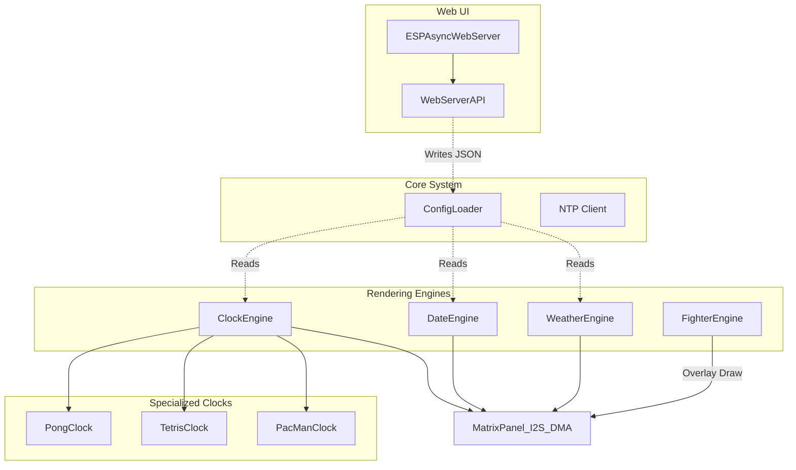

# Architecture Overview (ESP32)

This document provides a comprehensive overview of the ArcadeMatrix architecture specifically tailored for the ESP32 microcontroller. 

---

## 1. Core Philosophy: Hardware Constraints

Unlike the Raspberry Pi version which uses a decoupled, high-level Python rendering pipeline, the ESP32 version is written in **C++** and designed around strict hardware constraints:
- **RAM Limits (320KB internal):** We cannot afford to instantiate heavy off-screen dynamic canvases or use a multi-layered Renderer pipeline. Every byte counts.
- **CPU Constraints (240MHz):** To maintain 60 FPS on the matrix, rendering must be extremely fast. 
- **Direct DMA Access:** Instead of building an image and sending it, the code often draws primitives directly to the hardware's DMA buffer using the `ESP32 HUB75 LED MATRIX PANEL DMA Display` library and `Adafruit GFX`.

---

## 2. The Monolithic Engine Structure

Because of the constraints above, the ESP32 uses a **Monolithic Engine Structure**.

### Diagram

### Components

1. **Standalone Engines (`src/ClockEngine.cpp`, `src/DateEngine.cpp`, etc.)**: Each engine is a closed system. It manages its own state and contains its own logic to draw directly to the matrix hardware.
2. **Specialized Clocks**: For complex themes (e.g., Pong, PacMan), the logic is encapsulated into separate C++ classes (`PongClock.cpp`), but they still receive a pointer to the matrix hardware and draw their own pixels. There is no separation between "Renderer" and "Clock" here.
3. **Fighter Engine (SD Card Streaming)**: The ESP32 does not have enough memory to load an entire MUGEN sprite sheet. Instead, the `FighterEngine` uses a custom streaming format (`.fgt`) and reads binary sprite frames directly from the SD card buffer frame-by-frame, drawing them over the active engine.

---

## 3. Threading and Asynchronous Web Server

The ESP32 uses an **Asynchronous Web Server** (`ESPAsyncWebServer`).

- **The Main Loop (`loop()` in `main.cpp`)**: This loop must run as fast as possible. It calls the currently active engine's `loop()` function to draw the next frame.
- **The Web Server**: Because it is asynchronous, incoming HTTP requests (like saving settings or changing the clock theme) do not block the main rendering loop. The API parses the incoming JSON using `ArduinoJson`, updates the `ConfigLoader` struct in memory, and flags a reload if necessary.

### Dual-Core Utilization (Multiprocessing)

The ESP32 (and ESP32-S3) are dual-core microcontrollers, and this architecture implicitly leverages both cores via the underlying Arduino/ESP-IDF framework:

- **Core 0 (PRO_CPU):** Handles the Wi-Fi stack, TCP/IP networking, and the `ESPAsyncWebServer`. This ensures that heavy network traffic or API requests do not stutter the display.
- **Core 1 (APP_CPU):** Handles the main application `loop()`, running the `ClockEngine`, `FighterEngine`, and executing all mathematical logic for animations.
- **DMA Controller (Hardware Co-processor):** While Core 1 calculates the *next* frame, the ESP32's DMA (Direct Memory Access) controller constantly blasts the *current* frame's pixel data to the LED Matrix over I2S. This costs 0% CPU.

Because this separation of concerns is handled automatically by `ESPAsyncWebServer` and the DMA library, we do not need to manually spawn FreeRTOS tasks (`xTaskCreatePinnedToCore`) in our application code, keeping the codebase simpler while still achieving full multiprocessing performance.

---

## 4. Fonts and SD Card

- **SD Card Dependency:** Because the ESP32 has limited flash memory, all assets (GIFs, `.fgt`
  fighters) must be stored on an external SD card connected via SPI.
- **Font Rendering:** The system relies on `Adafruit GFX` bitmap fonts compiled directly into the
  firmware (`src/engines/fonts/`, currently 7 fonts across 3 arcade publisher styles). Unlike the Raspberry Pi
  version, there is **no runtime loading of `.bdf`/`.ttf` fonts from the SD card** today — all fonts
  must be compiled in. (An earlier draft of this document claimed BDF-from-SD loading existed; that
  was aspirational and did not match the actual code — see the project plan for a proposed SD-loadable
  bitmap font format.)

---

## 5. Reliability: Watchdog and OTA Updates

- **Hardware Watchdog:** `main.cpp` initializes the ESP-IDF task watchdog (`esp_task_wdt_init`,
  30s timeout) as the very first step of `setup()`, before touching the SD card or the matrix. If
  `setup()` or `loop()` ever hangs longer than that (SD mount failure, matrix DMA init failure,
  an unexpected infinite loop, WiFi driver lockup, ...) the ESP32 self-reboots instead of staying
  bricked until someone finds and power-cycles it. The two existing `while (1) { delay(100); }`
  critical-failure loops (SD mount failed / matrix init failed) are intentionally **not** fed, so
  they still trigger a watchdog reboot (retry loop) rather than hanging forever silently.
- **OTA Updates (`/api/ota` via `Update.h`):** writes the new firmware image to the *inactive* OTA
  partition slot and reboots into it immediately once the upload completes without error.
  **Important limitation:** this project uses the stock Arduino-ESP32 build (no custom `sdkconfig`),
  which does **not** enable `CONFIG_BOOTLOADER_APP_ROLLBACK_ENABLE`. This means there is currently
  **no automatic rollback** if a bad OTA image boots into a crash loop — unlike ESP-IDF's native
  app-rollback feature (which requires explicitly calling `esp_ota_mark_app_valid_cancel_rollback()`
  after a successful boot, plus a bootloader built with rollback support). Recovery from a bad OTA
  update today requires either a serial/USB reflash, or flashing a known-good image again over OTA
  if the device is still reachable on Wi-Fi. Enabling true rollback would require moving off the
  default Arduino-ESP32 build toward a custom `sdkconfig.defaults` (PlatformIO's `espidf` framework,
  or `board_build.embed_txtfiles`-based sdkconfig overrides) — flagged as a future hardening task,
  not implemented in this pass to avoid an unverified bootloader-level change.

