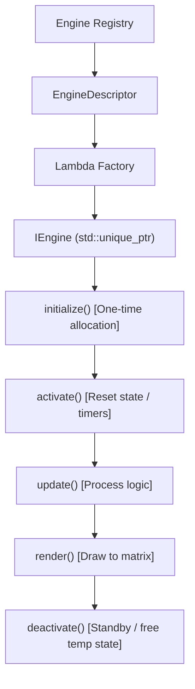

🇬🇧 English | 🇫🇷 [Français](ARCHITECTURE_FR.md) | 🇪🇸 [Español](ARCHITECTURE_ES.md)

# Architecture Overview (ESP32 — C++)

This document provides a comprehensive technical overview of the ArcadeMatrix architecture on ESP32 in **C++**. It details hardware isolation, capability gating, the "Lazy-Once" engine lifecycle, the Display Arbiter, additive overlays, and the dynamic configuration pipeline.

---

## 1. Global Architecture

ArcadeMatrix follows a strict separation of concerns from the WebUI down to the physical LED Matrix:

```text
                    ┌──────────────────────────┐
                    │         WebUI            │
                    │ schema-driven / dynamic  │
                    └────────────┬─────────────┘
                                 │
                                 ▼
                    ┌──────────────────────────┐
                    │       REST API            │
                    │ engines / instances /     │
                    │ hardware / options        │
                    └────────────┬─────────────┘
                                 │
                                 ▼
                    ┌──────────────────────────┐
                    │    Configuration Layer    │
                    │ ConfigLoader              │
                    │ ConfigSanitizer           │
                    │ DictionaryEngineConfig    │
                    └────────────┬─────────────┘
                                 │
                                 ▼
              ┌──────────────────────────────────────┐
              │           Engine Registry            │
              │                                      │
              │ EngineDescriptor                     │
              │ metadata / capabilities /            │
              │ requirements / schema / factory      │
              └──────────────────┬───────────────────┘
                                 │
                         requirement gating
                                 │
                                 ▼
              ┌──────────────────────────────────────┐
              │         EngineRegistrar              │
              │                                      │
              │ HardwareCapabilities                 │
              │ → meetsRequirements()                │
              └──────────────────┬───────────────────┘
                                 │
                                 ▼
              ┌──────────────────────────────────────┐
              │            HardwareHAL               │
              │                                      │
              │ PSRAM / Microphone / Temp / Gyro     │
              └──────────────────┬───────────────────┘
                                 │
                         runtime detection
                                 │
                                 ▼
              ┌──────────────────────────────────────┐
              │        HardwareProfile.h             │
              │                                      │
              │ ESP32_STD / WAVESHARE_S3             │
              │ PIN MAP — FROZEN & TESTED            │
              └──────────────────────────────────────┘
```

---

## 2. Core Philosophy & Constraints

Unlike Linux-based platforms, the ESP32 is an embedded micro-controller running on bare metal / FreeRTOS with strict constraints:
- **Internal SRAM vs PSRAM**: Classic ESP32 boards have ~320 KB of internal SRAM, shared between the Wi-Fi/AsyncTCP stacks and DMA descriptors. The Waveshare ESP32-S3 adds 16 MB Octal PSRAM.
- **Direct DMA HUB75 Access**: Frame buffers are written directly to I2S DMA memory without OS abstraction.
- **Compile-Time vs Runtime Separation**:
  - `HardwareProfile.h` defines board identity and physical pin mappings (strictly frozen and validated).
  - `HardwareHAL` detects peripheral presence at runtime (PSRAM bytes, microphone, temperature sensor, gyroscope stub).
  - `EngineRegistrar` performs requirement gating (`meetsRequirements`).

---

## 3. The "Lazy-Once" Engine Lifecycle

To avoid heap fragmentation and Out-Of-Memory crashes, engines are instantiated on-demand via the `EngineRegistry` factory:



### Lifecycle Methods (`IEngine`):

| Method | Role | Execution Timing | Memory Rule |
|---|---|---|---|
| `initialize()` | Initial setup & buffer allocation | First activation only | Only place allowed for heavy allocations |
| `activate()` | Prepare engine state | Each time rotation switches to this engine | No allocations |
| `update()` | Compute state & step animations | Every display frame | Zero allocation |
| `render()` | Draw pixels to `MatrixPanel_I2S_DMA` | Every display frame | Direct DMA writing |
| `deactivate()` | Release active handles/connections | When switching away | Close files / pause audio |
| `onConfigChanged()`| Live hot reload from API | When settings are modified | Updates runtime parameters in-place |
| `isFinished()` | Sequence completion signal | Polled in rotation loop | Returns true when animation is complete |
| `isRealtime()` | Dynamic framerate query | Loop frame limiter | Returns true for animated clocks/visualizers |
| `selfPaced()` | Pacing model query | Rotation manager | True for GIF player (counts items, not time) |
| `setRotationBudget()`| Sets budget (e.g. N items) | On module switch | Used by self-paced engines |
| `allowsOverlay()` | Overlay compatibility query | Display Arbiter / loop | True if additive overlays can composite |

---

## 4. Hardware Capability Model & Gating

Engines declare what they can do (`EngineCapabilities`) and what they strictly require (`EngineRequirements`):

```cpp
struct EngineRequirements {
    bool needsPsram = false;
    bool needsAudio = false;
    bool needsTempSensor = false;
    bool needsGyroscope = false;
    bool needsNetwork = false;
    bool needsSd = false;
};
```

During boot, `EngineRegistrar::registerAll()` inspects `HardwareHAL::capabilities()`. If an engine requires PSRAM or audio that is physically absent on the board, it is skipped at registration and a reason is recorded. The WebUI retrieves this via `GET /api/engines` and displays an explicit badge (e.g. *Unavailable: Requires PSRAM*).

---

## 5. Rendering Pipeline & Additive Overlays

Display rendering is governed by `DisplayArbiter` priorities:

```text
             DisplayArbiter
                   │
                   ▼
        ┌────────────────────┐
        │ Primary source     │
        │ MQTT / Marquee /   │
        │ Message / GIF /    │
        │ Visualizer /       │
        │ Rotation           │
        └─────────┬──────────┘
                  │
                  ▼
             render()
                  │
                  ▼
          ┌───────────────┐
          │ Overlay Pass  │  (FighterEngine, etc.
          │               │   if active & allowsOverlay == true)
          └───────┬───────┘
                  │
                  ▼
          matrix.flipDMABuffer()
```

- **Additive Compositing**: Overlays (such as the M.U.G.E.N `FighterEngine`) render directly on top of the primary engine without calling `matrix.fillScreen(0)`.
- **Automatic Suppression**: If the primary source is MQTT, Batocera Marquee, or an engine that returns `allowsOverlay() == false` (e.g. `GifEngine`), overlays are automatically bypassed.

---

## 6. Configuration Layer & Hot Reload

1. **`ConfigLoader`**: Loads and parses `/config.json` from SD.
2. **`ConfigSanitizer`**: Validates integer bounds, floats, boolean strings, and enum options against `ConfigSchema`. Injects defaults if missing.
3. **`onConfigChanged()`**: When a mutation is received via `POST /api/instances` or `POST /api/settings`, configuration is persisted to SD and dispatched to the running engine instance without requiring a device reboot.
