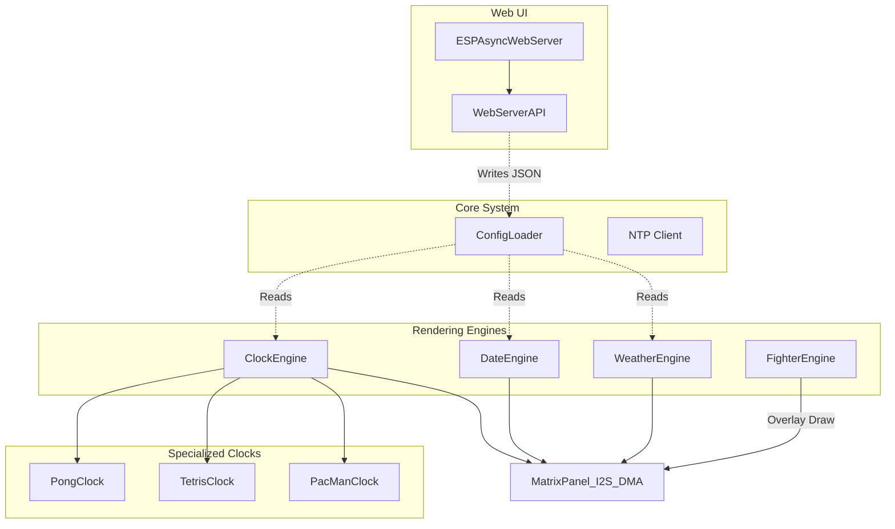

# Architecture Overview (ESP32)

This document provides a comprehensive overview of the ArcadeMatrix architecture specifically tailored for the ESP32 microcontroller. 

---

## 1. Core Philosophy: Hardware Constraints

Unlike the Raspberry Pi version which uses a decoupled, high-level Python rendering pipeline, the ESP32 version is written in **C++** and designed around strict hardware constraints:
- **RAM Limits (320KB internal):** We cannot afford to instantiate heavy off-screen dynamic canvases or use a multi-layered Renderer pipeline. Every byte counts.
- **CPU Constraints (240MHz):** To maintain 60 FPS on the matrix, rendering must be extremely fast. 
- **Direct DMA Access:** Instead of building an image and sending it, the code often draws primitives directly to the hardware's DMA buffer using the `ESP32 HUB75 LED MATRIX PANEL DMA Display` library and `Adafruit GFX`.

---

## 2. The Monolithic Engine Structure

Because of the constraints above, the ESP32 uses a **Monolithic Engine Structure**.

### Diagram

### Components

1. **Standalone Engines (`src/ClockEngine.cpp`, `src/DateEngine.cpp`, etc.)**: Each engine is a closed system. It manages its own state and contains its own logic to draw directly to the matrix hardware.
2. **Specialized Clocks**: For complex themes (e.g., Pong, PacMan), the logic is encapsulated into separate C++ classes (`PongClock.cpp`), but they still receive a pointer to the matrix hardware and draw their own pixels. There is no separation between "Renderer" and "Clock" here.
3. **Fighter Engine (SD Card Streaming)**: The ESP32 does not have enough memory to load an entire MUGEN sprite sheet. Instead, the `FighterEngine` uses a custom streaming format (`.fgt`) and reads binary sprite frames directly from the SD card buffer frame-by-frame, drawing them over the active engine.

---

## 3. Threading and Asynchronous Web Server

The ESP32 uses an **Asynchronous Web Server** (`ESPAsyncWebServer`).

- **The Main Loop (`loop()` in `main.cpp`)**: This loop must run as fast as possible. It calls the currently active engine's `loop()` function to draw the next frame.
- **The Web Server**: Because it is asynchronous, incoming HTTP requests (like saving settings or changing the clock theme) do not block the main rendering loop. The API parses the incoming JSON using `ArduinoJson`, updates the `ConfigLoader` struct in memory, and flags a reload if necessary.

---

## 4. Fonts and SD Card

- **SD Card Dependency:** Because the ESP32 has limited flash memory, all assets (GIFs, `.bdf` fonts, `.fgt` fighters) must be stored on an external SD card connected via SPI.
- **Font Rendering:** The system relies on `Adafruit GFX` for standard fonts. For complex scaling, it uses a custom implementation to read `.bdf` files from the SD card.
