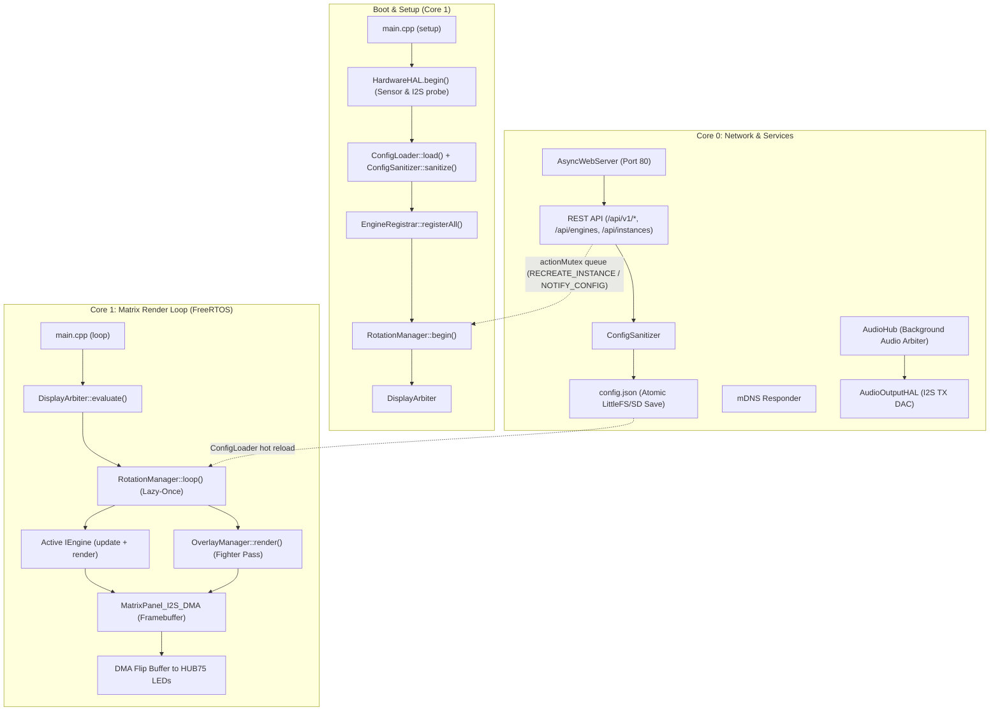
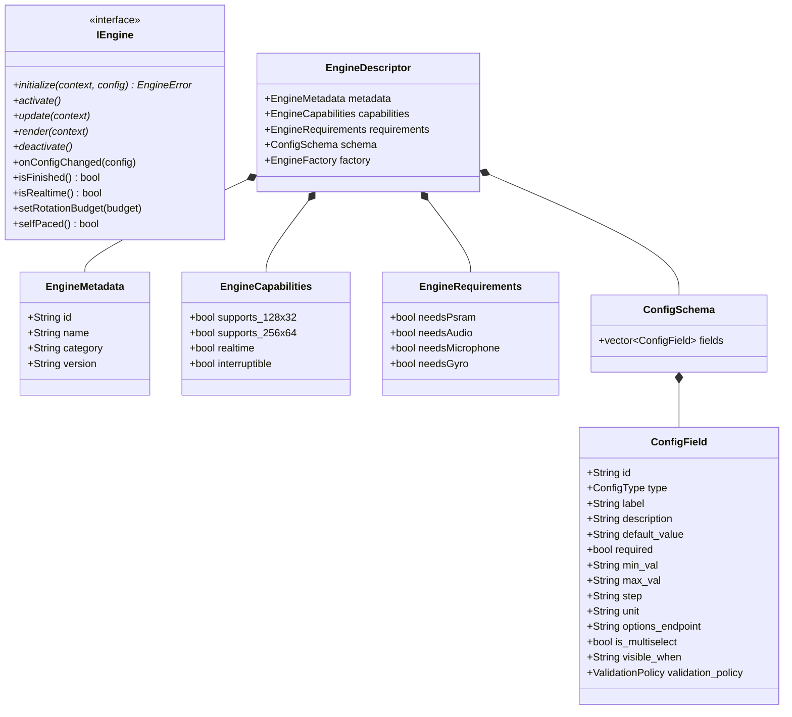
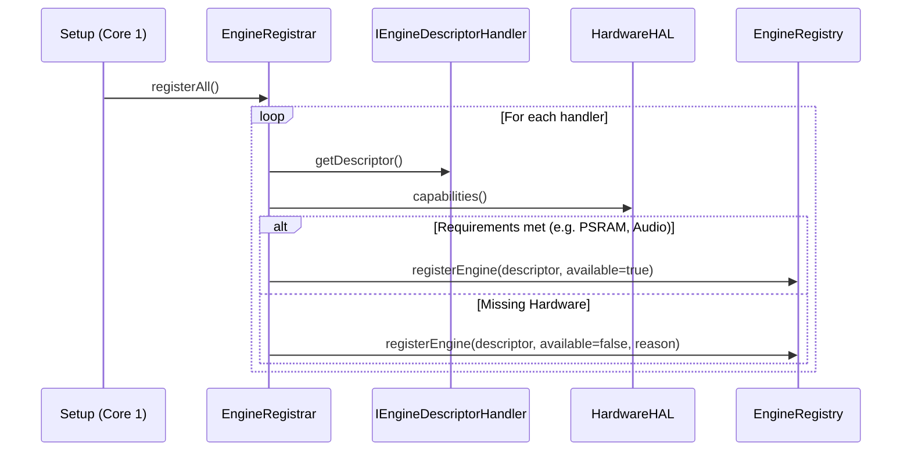
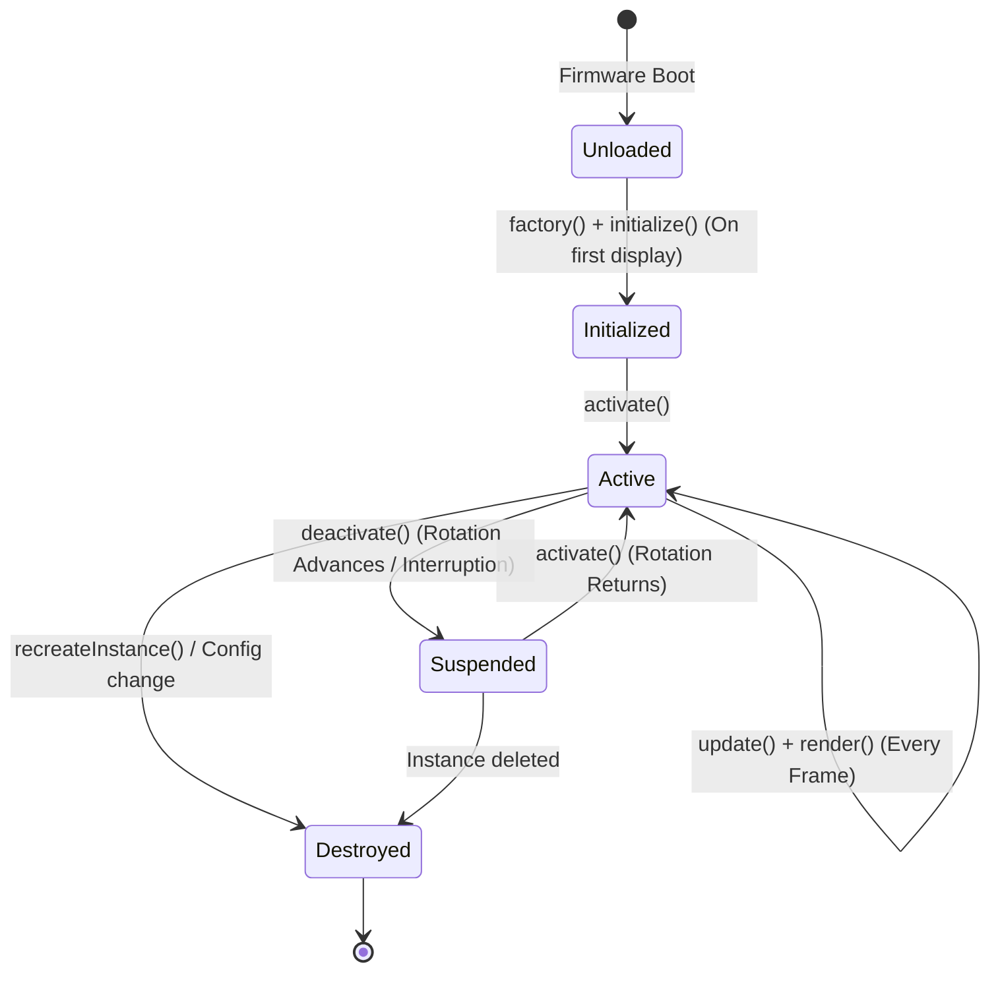
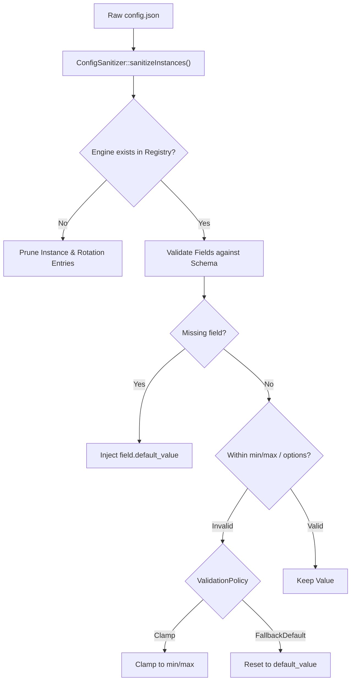
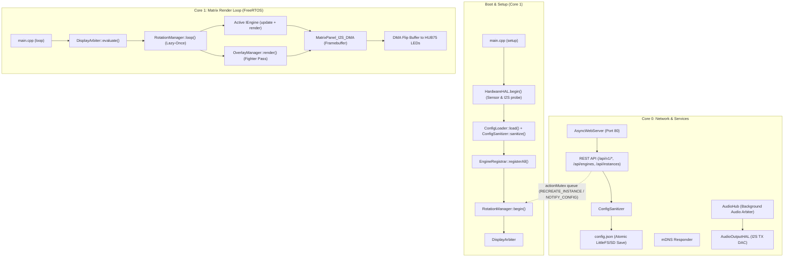

🇬🇧 English | 🇫🇷 [Français](ARCHITECTURE_FR.md) | 🇪🇸 [Español](ARCHITECTURE_ES.md)

# Architecture Overview (ESP32 — C++ / FreeRTOS)

This document is the **deep, exhaustive** reference for the ArcadeMatrix architecture on ESP32 & ESP32-S3 (written in **C++** with **FreeRTOS**). It covers the design philosophy, the complete `IEngine` contract, the auto-discovery `EngineRegistry` & `EngineRegistrar`, the "Lazy-Once" lifecycle, the self-healing configuration pipeline, the schema-driven dynamic WebUI (including **custom / dynamic option lists**), the `DisplayArbiter`, the transverse `OverlayManager` (Fighter Compositor), the dual-core threading model, and the autonomous Audio / Gyroscope subsystems.

> If you want to **add** an engine or a config field, read [DEVELOPER.md](DEVELOPER.md). This document explains **why** and **how** the system behaves; the developer guide explains **what to type**.

---

## Table of Contents

1. [Design Philosophy: Embedded Constraints & Zero Heap Churn](#1-design-philosophy-embedded-constraints--zero-heap-churn)
2. [High-Level Component Map](#2-high-level-component-map)
3. [The Engine Contract (`IEngine` Model)](#3-the-engine-contract-iengine-model)
4. [Auto-Discovery: Registry, Registrar, Handlers & Gating](#4-auto-discovery-registry-registrar-handlers--gating)
5. [The "Lazy-Once" Instance Lifecycle](#5-the-lazy-once-instance-lifecycle)
6. [Configuration Model: `config.json` → Instances](#6-configuration-model-configjson--instances)
7. [Self-Healing: the `ConfigSanitizer`](#7-self-healing-the-configsanitizer)
8. [Config Propagation & Zero-Reboot Hot Reload](#8-config-propagation--zero-reboot-hot-reload)
9. [Schema-Driven Dynamic UI & Options Endpoints](#9-schema-driven-dynamic-ui--options-endpoints)
10. [Internationalization Architecture (i18n) & Single Source of Truth](#10-internationalization-architecture-i18n--single-source-of-truth)
11. [Hardware Abstraction Layer (`HardwareHAL`) & Capabilities Gating](#11-hardware-abstraction-layer-hardwarehal--capabilities-gating)
12. [The Display Arbiter: Multi-Source Priority Resolution](#12-the-display-arbiter-multi-source-priority-resolution)
13. [The Transverse Overlay Compositor (`OverlayManager`)](#13-the-transverse-overlay-compositor-overlaymanager)
14. [Dual-Core Runtime & FreeRTOS Task Isolation](#14-dual-core-runtime--freertos-task-isolation)
15. [Frame Pacing & DMA Double-Buffering](#15-frame-pacing--dma-double-buffering)
16. [Autonomous Audio Subsystem Architecture (`AudioHub` & `AudioOutputHAL`)](#16-autonomous-audio-subsystem-architecture-audiohub--audiooutputhal)
17. [Gyroscopic Orientation Architecture (`GyroHAL` & `DisplayOrientationManager`)](#17-gyroscopic-orientation-architecture-gyrohal--displayorientationmanager)
18. [HTTP REST API Surface](#18-http-rest-api-surface)
19. [Build Metadata & Telemetry](#19-build-metadata--telemetry)

---

## 1. Design Philosophy: Embedded Constraints & Zero Heap Churn

Unlike a Raspberry Pi or PC with gigabytes of RAM, the standard ESP32 operates within ~320 KB of internal SRAM (and up to 8 MB PSRAM on ESP32-S3). The HUB75 LED matrix driver consumes substantial DMA RAM and requires steady timing to avoid screen flickering or glitching.

To achieve 60 FPS performance without memory fragmentation:

- **Allocate once, mutate in place:** Buffers, animation arrays, and strings are allocated during `initialize()` and reused each frame (`clear()`, pointer reuse).
- **Lazy-Once Instance Lifecycle:** An engine is instantiated only when its configured instance is first displayed, then cached for the lifetime of the firmware ("Lazy-Once").
- **Core Isolation:** Core 1 runs the high-priority rendering loop (`DisplayArbiter`, active engine `update()`/`render()`, `OverlayManager`, DMA swap), while Core 0 handles network I/O, AsyncWebServer, mDNS, background audio decoders, and sensor polling.
- **Transverse Features are Overlays, NOT Engines:** Features that visually composite on top of other content (like MUGEN Fighters) live in `OverlayManager`, keeping `EngineRegistry` purely for main content engines.

---

## 2. High-Level Component Map



The two CPU cores communicate safely through:
- `std::mutex` and action queues (`actionMutex`, `pendingActions`) for atomic commands.
- Shared `ConfigLoader` instances with synchronized snapshots.
- Immutable state snapshots (`AudioPlaybackState`) for rendering.

---

## 3. The Engine Contract (`IEngine` Model)

Every display feature implements the `IEngine` contract (`include/core/EngineContract.h`). The core runtime manipulates `IEngine*` polymorphically without compile-time coupling to concrete engine types.



### Lifecycle Methods in Detail

| Method | Default | When to Override |
| :-- | :-- | :-- |
| `initialize()` | — | **Always.** Pre-allocate buffers, decode static bitmaps, load fonts. |
| `activate()` | — | **Always.** Cheap reset of transient state (chronometers, frame index). |
| `update()` | — | **Always.** Business and animation logic each frame. |
| `render()` | — | **Always.** Draw pixels into `context->getMatrix()`. |
| `deactivate()` | — | **Always.** Stop network/timers, close file handles. |
| `onConfigChanged()` | no-op | **If engine has settings.** Re-read values in place without recreation. |
| `isFinished()` | `false` | If engine has an intrinsic end (e.g. cycle completed) to advance rotation early. |
| `isRealtime()` | `true` | Return `true` for 60 FPS animations; return `false` for static 20 FPS displays. |
| `setRotationBudget()`| no-op | If count-based (e.g. play N GIFs). Receives the rotation entry count. |
| `selfPaced()` | `false` | If true, duration timer does not force-advance; engine drives advance via `isFinished()`. |

---

## 4. Auto-Discovery: Registry, Registrar, Handlers & Gating

Instead of hardcoding engine instantiations in `main.cpp`:

1. Each engine provides a descriptor handler (`IEngineDescriptorHandler`) returning its `EngineDescriptor`.
2. At boot, `EngineRegistrar::registerAll()` inspects `hardwareHAL.capabilities()` against each descriptor's `EngineRequirements` (e.g. `needsPsram`, `needsAudio`, `needsMicrophone`).
3. Only engines meeting hardware requirements are registered as active in `EngineRegistry`. Unsupported engines are flagged with `available: false` and a human-readable `unavailable_reason`.



---

## 5. The "Lazy-Once" Instance Lifecycle

`RotationManager` manages instances defined in `config.instances`:



- **Lazy Initialization:** An engine instance is created via its factory and initialized (`initialize()`) only the **first time** it is displayed.
- **Persistent Caching:** Once initialized, the instance remains resident in memory (`activeEngines[instance_id]`) to prevent heap churn.
- **Activation & Deactivation:** Switching instances calls `deactivate()` on the old engine and `activate()` on the new one.

---

## 6. Configuration Model: `config.json` → Instances

ArcadeMatrix uses an instance-based architecture:

```json
{
  "system": { "brightness": 128, "lang": "fr" },
  "display": { "auto_rotate": true, "manual_rotation": 0 },
  "audio": { "master_volume": 80, "enable_bluetooth": true, "enable_webradio": true },
  "rotation": [
    { "instance_id": "clock_main", "duration": 15, "overlays": { "fighter": true } },
    { "instance_id": "weather_paris", "duration": 10 },
    { "instance_id": "music_main", "duration": 20, "overlays": { "fighter": true } }
  ],
  "instances": [
    { "id": "clock_main", "engine_id": "clock", "config": { "theme": "street_fighter" } },
    { "id": "weather_paris", "engine_id": "weather", "config": { "city": "Paris" } },
    { "id": "music_main", "engine_id": "music_player", "config": { "show_progress": true } }
  ]
}
```

---

## 7. Self-Healing: the `ConfigSanitizer`

The `ConfigSanitizer` enforces schema validity at startup and on every REST API save:



---

## 8. Config Propagation & Zero-Reboot Hot Reload

When configuration is modified via the WebUI or API:
1. `ConfigLoader` saves the updated JSON atomically.
2. An action is queued in `RotationManager`:
   - `RotationAction::NOTIFY_CONFIG_CHANGED`: The running instance receives `onConfigChanged()` to re-read settings in place without allocation.
   - `RotationAction::RECREATE_INSTANCE`: If critical parameters change, the instance is safely destroyed and re-instantiated on next display.
3. **Zero reboot required.**

---

## 9. Schema-Driven Dynamic UI & Options Endpoints

The WebUI contains **zero hardcoded forms for engines**.
- The frontend fetches `GET /api/engines` to discover all engine schemas (`ConfigField`).
- Config types (`BOOLEAN`, `INTEGER`, `FLOAT`, `STRING`, `SELECT`, `MULTISELECT`, `COLOR`) render appropriate controls.
- Dynamic options endpoints (`options_endpoint`, e.g. `/api/clocks/themes`, `/api/fighters/list`, `/api/audio/radios`) populate dropdowns on the fly from the firmware backend.

---

## 10. Internationalization Architecture (i18n) & Single Source of Truth

ArcadeMatrix supports multilingual operations (English, French, Spanish) across both the backend engine descriptors and the dynamic frontend WebUI.
- Translation dictionaries exist in centralized files (`src/core/I18n.cpp`).
- Engine schemas provide canonical English labels and descriptions, with i18n lookup keys automatically translated on the frontend according to `config.system.lang`.

---

## 11. Hardware Abstraction Layer (`HardwareHAL`) & Capabilities Gating

`HardwareHAL` abstracts all physical board peripherals:
- **Profiles:** `ESP32_STD` vs `WAVESHARE_S3`.
- **Wiring Protection:** `HardwareProfile.h` pins are **frozen and immutable**.
- **Capabilities Snapshot (`AudioCapabilities`):**
  ```cpp
  struct AudioCapabilities {
      bool input = false;          // I2S Microphone / ADC available
      bool output = false;         // I2S Speaker / DAC available
      bool fullDuplex = false;      // Simultaneous RX + TX supported
      uint32_t maxSampleRate = 44100;
      uint8_t maxChannels = 2;
      bool bluetoothClassic = false;
      bool psram = false;
  };
  ```

---

## 12. The Display Arbiter & Display Runtime (`DisplayArbiter`, `DisplayRuntime`)

ArcadeMatrix completely decouples display decision resolution from engine lifecycle execution:

```text
[ Emergency Alerts / OTA ] (Priority 100, ONE_SHOT / UNTIL_CANCELLED)
             ↓
[ Real-time Interruption: MQTT Marquee / Live Alert ] (Priority 75)
             ↓
[ Audio Visualizer / Active Engine Request ] (Priority 60)
             ↓
[ Active Carousel Rotation: Clock / Weather / MusicEngine ] (Priority 50)
             ↓
[ Fallback Screen: Default Digital Clock ] (Priority 10)
```

### Deterministic Zero-Allocation & SPSC Lock-Free Architecture
- **Single Producer, Single Consumer (SPSC) Command Queue:** Core 0 (Web server, MQTT listener, AudioHub) submits requests asynchronously via `m_displayArbiter.submitRequest(request)` and `cancelRequest(sourceId)`. These commands are pushed into a lock-free circular buffer (`LockFreeSPSCQueue<ArbiterCommand, 16>`).
- **Single Owner on Core 1:** Core 1 is the **sole owner** of the static slot array (`std::array<DisplayRequestSlot, 8>`). At the beginning of `DisplayArbiter::evaluate()`, Core 1 drains pending commands and resolves priorities in $O(1)$ with **ZERO mutex locking** and **ZERO heap allocations**.
- **Pure Decision Contract:** `DisplayArbiter::evaluate()` returns a lightweight `DisplayDecision` struct containing only semantic IDs (`sourceId`, `engineHandle`, `priority`, `requestId`, `needsClear`, `allowsOverlay`, `isRealtime`), completely free of raw `IEngine*` pointers.
- **Canonical `EngineHandle` Identity:** Instances are identified by a POD `EngineHandle` (`descriptorId[32]`, `instanceId[32]`) avoiding dynamic String allocations. `DisplayRuntime::resolveEngine()` resolves engines canonically without heuristics (`sourceId / 10`).
- **Auto-Consumed `ONE_SHOT`:** Non-recurring alerts (e.g. startup banner, system notifications) are atomically cleared upon evaluation.
- **Request ID Preservation:** Request refreshes preserve their unique `requestId` unless an explicit timer restart is requested.

### Centralized Display Lifecycle & Preemption Matrix (`DisplayRuntime`)
- **Exclusive Lifecycle Owner:** `DisplayRuntime` is the **sole owner** of display engine lifecycle transitions (`activate()`, `deactivate()`, `pause()`, `resume()`).
- **Preemption vs Rotation Lifecycle Semantics:**
  - **Temporary Preemption (e.g. MQTT Message over Clock):** Outgoing engine receives `pause()`, incoming alert receives `activate()`.
  - **End of Preemption (Return to Baseline):** Completed alert receives `deactivate()`, paused baseline engine receives `resume()`, preserving internal state and animation phase.
  - **Carousel Transition (e.g. Clock → Weather):** Outgoing engine receives `deactivate()`, incoming engine receives `activate()`.
- **Preemption & Overlay Compositing:** If the active session permits overlays (`decision.allowsOverlay == true`), `OverlayManager` composites transverse effects (e.g. MUGEN Fighters) seamlessly on top of the rendered frame.

---

## 13. Formally Proven SRSW Lock-Free Configuration (`ConfigSnapshot`)

To eliminate cross-core race conditions and avoid holding mutexes on Core 1's time-critical render hot path:
- **Single-Reader Single-Writer (SRSW) Triple Buffering:** `ConfigLoader` maintains `ConfigSnapshot _snapshots[3]`, `std::atomic<uint8_t> _publishedSlot{0}`, and `mutable std::atomic<uint8_t> _readingSlot{0xFF}`.
- **Reader Pinning & Double-Check Protocol (Core 1):** When Core 1 starts a frame, `getSnapshot()` acquires `_publishedSlot`, publishes `_readingSlot = slot`, and double-checks for concurrent publication. It accesses the immutable snapshot with zero allocations and releases it via `releaseSnapshot()` at frame end.
- **Writer Exclusion Invariant (Core 0):** When publishing mutations, Core 0 selects a `targetSlot` $\in \{0, 1, 2\}$ such that $\text{targetSlot} \neq \text{published} \land \text{targetSlot} \neq \text{reading}$. With 3 physical buffers, at least one free slot is **strictly and mathematically guaranteed** available, making data corruption impossible even during infinite rapid WebUI writes.
- **Linearizability & Checksum:** Each publication increments a monotonic version and computes `checksum = (version ^ 0x5A5A5A5A) + instances.size()`, ensuring linear consistency across threads.
- **Transactional Mutations:** All configuration modifications from Core 0 pass through `config.mutate([&](ConfigLoader& cfg) { ... })`.

---

## 14. Transverse Overlay Compositor (`OverlayManager`)

Transverse visual effects (such as **MUGEN Fighters**) composite on top of the active background engine:
- `OverlayManager` renders after the active engine's `render()` pass.
- Fighters read `.fgt.gz` compressed sprite sequences from LittleFS/SD.
- Any engine (`Clock`, `Weather`, `GIF`, `MusicEngine`) can have the Fighter overlay enabled per rotation item in `config.rotation[i].overlays.fighter`.
- **Fighter is an overlay, NOT an engine in `EngineRegistry`.** When a priority source (e.g. Marquee or MQTT alert) preempts rotation, `DisplayRuntime` passes an empty overlay config, safely suspending overlay execution without tearing down background assets.

---

## 15. Dual-Core Runtime & FreeRTOS Task Isolation

- **Core 0 (Services & Networking):**
  - `AsyncWebServer` handling HTTP requests and REST API mutations.
  - Background audio sessions (`AudioSessionManager`, `WebRadioService`, `BluetoothAudioService`).
  - Audio analysis (`AudioAnalysisService` FFT calculation).
  - Sensor polling (`HardwareHAL`, `GyroHAL`).
- **Core 1 (Realtime Graphics):**
  - `DisplayRuntime::update()` & `DisplayArbiter::evaluate()`.
  - Frame pacing via `FrameScheduler` (60 FPS for realtime engines, 20-30 FPS for static screens).
  - Active engine `update()` & `render()`.
  - Transverse Overlay compositing (`OverlayManager::render()`).
  - HUB75 DMA buffer swap.

### Deep Memory Management & Hardware Partitioning (ESP32 vs ESP32-S3 PSRAM)

The ESP32 platform exhibits distinct hardware memory tiers:

| Hardware Board | Internal SRAM | External PSRAM | DMA Memory | SSL / TLS Strategy | Max Resolution |
| :--- | :--- | :--- | :--- | :--- | :--- |
| **ESP32 Classic (`esp32dev`)** | ~320 KB (shared with FreeRTOS & WiFi) | None | Internal SRAM (DMA-capable) | **Gated Off:** TLS buffers (~45-60 KB each) starve DMA, causing crashes. Heavy SSL engines (Crypto, Stock) are disabled via `EngineCapabilities`. | `128x32` / `64x32` |
| **ESP32-S3 Waveshare (`esp32s3_waveshare`)** | ~320 KB (core SRAM) | **8 MB / 16 MB Octal PSRAM** | PSRAM-backed DMA Buffers (`MALLOC_CAP_SPIRAM`) | **Full Support:** `WiFiClientSecure` and mbedTLS internal ring buffers allocate into PSRAM, leaving SRAM completely free for uninterrupted display DMA. | `256x64` / `64x256` |

#### How the SSL / TLS Memory Exhaustion Was Solved
On resource-constrained microcontrollers, establishing HTTPS/TLS connections requires large cryptographic handshake buffers (input/output fragment buffers of 16 KB + ASN.1 parsing + session state ≈ 45 KB per connection). On standard ESP32 boards, concurrent execution of HUB75 DMA buffers (~16-32 KB) and multiple TLS connections caused severe heap fragmentation and heap starvation panics (`Guru Meditation Error: Core 0 panic'ed (LoadProhibited)`).

This was solved through a two-tiered architectural strategy:
1. **Capabilities Gating on Classic ESP32:** Heavy network engines (`CryptoEngine`, `StockEngine`) declare `EngineRequirements::needsPsram = true`. On boards without PSRAM, `ConfigSanitizer` automatically gates them off safely without crashing.
2. **PSRAM Allocation Routing on ESP32-S3:** On ESP32-S3 boards, all large memory consumers (PNG decoding buffers in `ArtworkService`, MP3 ring buffers in `WebRadioService`, and TLS socket buffers in `WiFiClientSecure`) are routed directly to Octal PSRAM via `heap_caps_malloc(..., MALLOC_CAP_SPIRAM)`. Internal SRAM remains dedicated solely to FreeRTOS kernel tasks and time-critical hardware interrupts.

#### Concurrency: Seamless Simultaneous Audio & 60 FPS Video
Real-time audio decoding and HUB75 matrix scanning operate concurrently without micro-stutters:
- **Core 0 (Audio & Network Pipeline):** Runs `WebRadioService` MP3 frame decoding (`minimp3`) and Bluetooth A2DP Sink callbacks into a lock-free circular buffer, continuously feeding the Everest `ES8311` I2S DAC.
- **Core 1 (Matrix Render Loop):** Runs the HUB75 DMA display driver, rendering engines, and `OverlayManager` at a rock-solid 60 FPS cadence.
- **Lock-Free State Handshake:** `AudioHub` publishes atomic `AudioPlaybackState` snapshots with incrementing `generation` IDs. The rendering engine on Core 1 reads snapshots instantly without blocking or acquiring mutexes on the audio thread.

---

## 2. High-Level Component Map



---

## 3. The Engine Contract (`IEngine`)

Every display engine implements the abstract `IEngine` contract defined in [`include/core/EngineContract.h`](file:///Users/red1l/Documents/work/git/perso/ArcadeMatrix/include/core/EngineContract.h):

```cpp
class IDisplayGeometryAware {
public:
    virtual ~IDisplayGeometryAware() = default;
    virtual void onDisplayGeometryChanged(const DisplayGeometry& geometry) = 0;
};

class IEngine : public IDisplayGeometryAware {
public:
    virtual ~IEngine() = default;

    // Lifecycle
    virtual EngineError initialize(EngineContext* context, const EngineConfig* config) = 0;
    virtual void activate() = 0;
    virtual void update(EngineContext* context) = 0;
    virtual void render(EngineContext* context) = 0;
    virtual void deactivate() = 0;
    
    // Dynamic Configuration
    virtual void onConfigChanged(const EngineConfig* config) {}
    
    // Geometry Awareness (rebuilds geometry-derived caches on rotation)
    virtual void onDisplayGeometryChanged(const DisplayGeometry& geometry) override {}
    
    // Capabilities & Flow
    virtual bool isFinished() const { return false; }
    virtual bool isRealtime() const { return false; }
    virtual bool selfPaced() const { return false; }
    virtual bool allowsOverlay() const { return true; }
    virtual bool allowRotation() const { return true; }
    virtual bool hasNewFrame() const { return true; }
    virtual bool needsClear() const { return true; }
};
```

---

## 20. Multi-Resolution & Declarative Geometry Architecture

ArcadeMatrix supports any matrix resolution across Landscape, Square, and TATE (Portrait) formats (`64x32`, `128x32`, `256x64`, `128x64`, `64x64`, `32x64`, `32x128`, `64x128`, `64x256`).

### The Golden Rule of Responsive Rendering
> **Renderers are orientation-agnostic and do NOT contain `if (layoutClass)` branches.**
> Classification is performed **once** by a dedicated pure `*LayoutCalculator` (or `*SourceSelector`), returning a declarative layout structure composed of bounded `Rect` structures. The renderer draws exclusively into these pre-calculated rectangles.

```text
                 DisplayGeometry (width, height, rotation, layoutClass, version)
                                       │
                                LayoutHelper (Stateless)
                                       │
                    ┌──────────────────┴──────────────────┐
                    ▼                                     ▼
           *LayoutCalculator                     *GeometryAdapter
           (e.g. MusicLayout)                    (e.g. FighterGeometry)
                    │                                     │
                    ▼                                     ▼
             Layout / Rects                        Geometry (groundY, spawns)
                    │                                     │
                    └──────────────────┬──────────────────┘
                                       ▼
                             Single Pure Renderer
```

### Deterministic Layout Classification (`LayoutClass`)
```cpp
enum class LayoutClass : uint8_t {
    WIDE,       // W >= (H * 3) / 2  (Landscape 64x32, 128x32, 128x64, 256x64)
    SQUARE,     // Intermediate ratios (Square 64x64)
    PORTRAIT,   // H >= (W * 3) / 2 && H < W * 3  (TATE 32x64, 64x128)
    TALL        // H >= W * 3  (Ultra-tall 32x128, 64x256)
};
```

### Strict Multi-Core Lifecycle Sequencing
1. Orientation changes (triggered by Gyroscope or Web API) are scheduled asynchronously.
2. The hardware rotation `display->setRotation(newRot)` is executed **strictly within the render loop on Core 1 at the apex of the visual transition**.
3. `DisplayGeometry` is updated directly from the live `display->width()` / `display->height()` and increments its `version` counter.
4. `onDisplayGeometryChanged(geometry)` is dispatched to the active engine and `OverlayManager`.
5. Engines with geometry-derived caches (`MatrixRainClock`, `TetrisClock`, `VisualizerEngine`, `FighterEngine`, `DashboardEngine`) reconfigure their caches in place without resetting business state.
6. The first full frame rendered post-apex displays a perfectly aligned, artifact-free layout.

### Dual-GIF Architecture (YOKO & TATE)
- `SD:/gifs/` holds landscape-optimized GIFs (YOKO).
- `SD:/gifs_tate/` holds portrait-optimized GIFs (TATE).
- `GifSourceSelector` resolves the appropriate primary and fallback directories based on `DisplayGeometry`. `GifEngine` remains completely decoupled from layout classes and utilizes `LayoutHelper::aspectFit()` per frame for optimal letterboxing/pillarboxing.

---

## 18. HTTP REST API Surface

| Method | Route | Description |
| :-- | :-- | :-- |
| `GET` | `/api/v1/system/status` | Heap, PSRAM, uptime, WiFi, capabilities. |
| `GET` | `/api/engines` | Returns all engine descriptors and schemas. |
| `GET` | `/api/instances` | Returns active instances and configurations. |
| `POST`| `/api/instances` | Creates or updates an engine instance. |
| `GET` | `/api/rotation` | Returns current playlist rotation. |
| `POST`| `/api/rotation` | Updates playlist rotation sequence. |
| `GET` | `/api/audio/status` | Current audio playback state, source, volume. |
| `POST`| `/api/audio/volume` | Adjusts master audio volume (0-100%). |
| `GET` | `/api/gyro/status` | Current gravity vector, active rotation, and transition FX. |
| `POST`| `/api/gyro/calibrate` | 1-Click zero reference calibration ($0^\circ$ Normal). |
| `POST`| `/api/display/orientation` | Sets manual rotation, mounting offset, and transition FX. |
| `POST`| `/api/display/test-transition` | Triggers a live preview of rotation transition effects. |

---

## 19. Build Metadata & Telemetry

The `/api/v1/system/version` endpoint exposes the exact build fingerprint (`git_commit`, `build_timestamp`, `firmware_version`), ensuring traceability between source code and running firmware.
