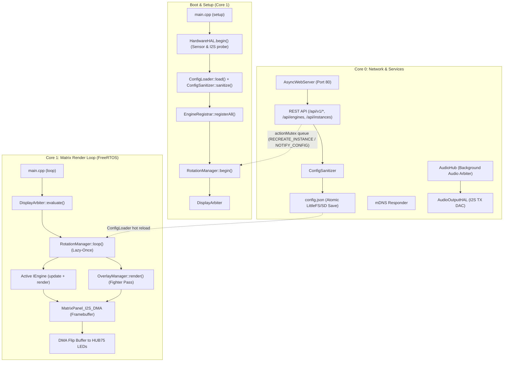

🇬🇧 English | 🇫🇷 [Français](ARCHITECTURE_FR.md) | 🇪🇸 [Español](ARCHITECTURE_ES.md)

# Architecture Overview (ESP32 — C++ / FreeRTOS)

This document is the **deep, exhaustive** reference for the ArcadeMatrix architecture on ESP32 & ESP32-S3 (written in **C++** with **FreeRTOS**). It covers the design philosophy, the complete `IEngine` contract, the auto-discovery `EngineRegistry` & `EngineRegistrar`, the "Lazy-Once" lifecycle, the self-healing configuration pipeline, the schema-driven dynamic WebUI, the `DisplayArbiter`, the transverse `OverlayManager` (Fighter Compositor), and the dual-core threading model.

> If you want to **add** an engine or a config field, read [DEVELOPER.md](DEVELOPER.md). This document explains **why** and **how** the system behaves; the developer guide explains **what to type**.

---

## Table of Contents

1. [Design Philosophy: Embedded Constraints & Zero Heap Churn](#1-design-philosophy-embedded-constraints--zero-heap-churn)
2. [High-Level Component Map](#2-high-level-component-map)
3. [The Engine Contract (`IEngine` Model)](#3-the-engine-contract-iengine-model)
4. [Auto-Discovery: Registry, Registrar, Handlers & Gating](#4-auto-discovery-registry-registrar-handlers--gating)
5. [The "Lazy-Once" Instance Lifecycle](#5-the-lazy-once-instance-lifecycle)
6. [Configuration Model: `config.json` → Instances](#6-configuration-model-configjson--instances)
7. [Self-Healing: the `ConfigSanitizer`](#7-self-healing-the-configsanitizer)
8. [Config Propagation & Zero-Reboot Hot Reload](#8-config-propagation--zero-reboot-hot-reload)
9. [Schema-Driven Dynamic UI & Options Endpoints](#9-schema-driven-dynamic-ui--options-endpoints)
10. [Hardware Abstraction Layer (`HardwareHAL`) & Capabilities Gating](#10-hardware-abstraction-layer-hardwarehal--capabilities-gating)
11. [The Display Arbiter: Multi-Source Priority Resolution](#11-the-display-arbiter-multi-source-priority-resolution)
12. [The Transverse Overlay Compositor (`OverlayManager`)](#12-the-transverse-overlay-compositor-overlaymanager)
13. [Dual-Core Runtime & FreeRTOS Isolation](#13-dual-core-runtime--freertos-isolation)
14. [Frame Pacing & DMA Double-Buffering](#14-frame-pacing--dma-double-buffering)
15. [Autonomous Audio Subsystem Architecture (`AudioHub` & `AudioOutputHAL`)](#15-autonomous-audio-subsystem-architecture-audiohub--audiooutputhal)
16. [Gyroscopic Orientation Architecture (`GyroHAL` & `DisplayOrientationManager`)](#16-gyroscopic-orientation-architecture-gyrohal--displayorientationmanager)
17. [HTTP REST API Surface](#17-http-rest-api-surface)
18. [Build Metadata & Telemetry](#18-build-metadata--telemetry)

---

## 1. Design Philosophy: Embedded Constraints & Zero Heap Churn

Unlike a Raspberry Pi or PC with gigabytes of RAM, the standard ESP32 operates within ~320 KB of internal SRAM (and up to 8 MB PSRAM on ESP32-S3). The HUB75 LED matrix driver consumes substantial DMA RAM and requires steady timing to avoid screen flickering or glitching.

To achieve 60 FPS performance without memory fragmentation:

- **Allocate once, mutate in place:** Buffers, animation arrays, and strings are allocated during `initialize()` and reused each frame (`clear()`, pointer reuse).
- **Lazy-Once Instance Lifecycle:** An engine is instantiated only when its configured instance is first displayed, then cached for the lifetime of the firmware ("Lazy-Once").
- **Core Isolation:** Core 1 runs the high-priority rendering loop (`DisplayArbiter`, active engine `update()`/`render()`, `OverlayManager`, DMA swap), while Core 0 handles network I/O, AsyncWebServer, mDNS, background audio decoders, and sensor polling.
- **Transverse Features are Overlays, NOT Engines:** Features that visually composite on top of other content (like MUGEN Fighters) live in `OverlayManager`, keeping `EngineRegistry` purely for main content engines.

---

## 2. High-Level Component Map



---

## 3. The Engine Contract (`IEngine` Model)

Every display feature implements the `IEngine` contract (`include/core/EngineContract.h`). The core runtime manipulates `IEngine*` polymorphically without compile-time coupling to concrete engine types:

```cpp
class IEngine {
public:
    virtual ~IEngine() = default;

    // --- Mandatory lifecycle ---
    virtual EngineError initialize(EngineContext* context, const EngineConfig* config) = 0;
    virtual void activate() = 0;
    virtual void update(EngineContext* context) = 0;
    virtual void render(EngineContext* context) = 0;
    virtual void deactivate() = 0;

    // --- Optional overrides ---
    virtual void onConfigChanged(const EngineConfig* config) {}
    virtual bool isFinished() const { return false; }
    virtual bool isRealtime() const { return true; }
    virtual void setRotationBudget(uint32_t budget) {}
    virtual bool selfPaced() const { return false; }
};
```

---

## 4. Auto-Discovery: Registry, Registrar, Handlers & Gating

Instead of hardcoding engine instantiations in `main.cpp`:

1. Each engine provides a descriptor handler (`IEngineDescriptorHandler`) returning its `EngineDescriptor` (metadata, schema, capabilities, hardware requirements, and factory lambda).
2. At boot, `EngineRegistrar::registerAll()` inspects `hardwareHAL.capabilities()` against each descriptor's `EngineRequirements` (e.g. `needsPsram`, `needsAudio`, `needsMicrophone`).
3. Only engines meeting hardware requirements are registered as active in `EngineRegistry`. Unsupported engines are flagged with `available: false` and a human-readable `unavailable_reason`, allowing the WebUI to inform the user cleanly.

```text
EngineModule (MyEngine.h)
    ↓
IEngineDescriptorHandler
    ↓
EngineRegistrar::registerAll()
    ↓ (Checks HardwareHAL capabilities)
EngineRegistry (Registered Factories & Schema)
```

---

## 5. The "Lazy-Once" Instance Lifecycle

`RotationManager` manages instances defined in `config.instances`:

1. **Lazy Initialization:** An engine instance is created via its factory and initialized (`initialize()`) only the **first time** it is displayed.
2. **Persistent Caching:** Once initialized, the instance remains resident in memory (`activeEngines[instance_id]`) to prevent heap churn.
3. **Activation & Deactivation:** Switching instances calls `deactivate()` on the old engine and `activate()` on the new one.
4. **Self-Paced vs Budgeted:** Engines can run for a configured duration or signal completion early via `isFinished()`.

---

## 6. Configuration Model: `config.json` → Instances

ArcadeMatrix uses an instance-based architecture:

```json
{
  "system": { "brightness": 128, "lang": "fr" },
  "display": { "auto_rotate": true, "manual_rotation": 0 },
  "rotation": [
    { "instance_id": "clock_main", "duration": 15, "overlays": { "fighter": true } },
    { "instance_id": "weather_paris", "duration": 10 },
    { "instance_id": "music_main", "duration": 20, "overlays": { "fighter": true } }
  ],
  "instances": [
    { "id": "clock_main", "engine_id": "clock", "config": { "theme": "street_fighter" } },
    { "id": "weather_paris", "engine_id": "weather", "config": { "city": "Paris" } },
    { "id": "music_main", "engine_id": "music_player", "config": { "show_progress": true } }
  ]
}
```

---

## 7. Self-Healing: the `ConfigSanitizer`

The `ConfigSanitizer` enforces schema validity at startup and on every REST API save:
- Missing fields are populated with default values.
- Integer/Float fields are clamped to `[min, max]` ranges.
- Unknown option keys are reset to safe fallbacks.
- Dangling rotation entries (pointing to non-existent instances) are pruned automatically.

---

## 8. Config Propagation & Zero-Reboot Hot Reload

When configuration is modified via the WebUI or API:
1. `ConfigLoader` saves the updated JSON atomically.
2. An action is queued in `RotationManager`:
   - `RotationAction::NOTIFY_CONFIG_CHANGED`: The running instance receives `onConfigChanged()` to re-read settings in place without allocation.
   - `RotationAction::RECREATE_INSTANCE`: If critical parameters (like panel geometry or major buffers) change, the instance is safely destroyed and re-instantiated on next display.
3. **Zero reboot required.**

---

## 9. Schema-Driven Dynamic UI & Options Endpoints

The WebUI contains **zero hardcoded forms for engines**.
- The frontend fetches `GET /api/engines` to discover all engine schemas (`ConfigField`).
- Config types (`BOOLEAN`, `INTEGER`, `FLOAT`, `STRING`, `SELECT`, `MULTISELECT`, `COLOR`) render appropriate controls.
- Dynamic options endpoints (`options_endpoint`, e.g. `/api/clocks/themes`, `/api/fighters/list`, `/api/audio/radios`) populate dropdowns on the fly from the firmware backend.

---

## 10. Hardware Abstraction Layer (`HardwareHAL`) & Capabilities Gating

`HardwareHAL` abstracts all physical board peripherals:
- **Profiles:** `ESP32_STD` vs `WAVESHARE_S3`.
- **Wiring Protection:** `HardwareProfile.h` pins are **frozen and immutable**.
- **Capabilities Snapshot (`AudioCapabilities`):**
  ```cpp
  struct AudioCapabilities {
      bool input = false;          // I2S Microphone available
      bool output = false;         // I2S DAC available
      bool fullDuplex = false;      // Simultaneous RX + TX support
      uint32_t maxSampleRate = 44100;
      uint8_t maxChannels = 2;
      bool bluetoothClassic = false;
      bool psram = false;
  };
  ```

---

## 11. The Display Arbiter: Multi-Source Priority Resolution

`DisplayArbiter` decides what content owns the matrix at any moment:

```text
[ Emergency Alerts / OTA ] (Priority 100)
             ↓
[ Real-time Interruption: MQTT Marquee / Live Alert ] (Priority 75)
             ↓
[ Active Carousel Rotation: Clock / Weather / MusicEngine ] (Priority 50)
             ↓
[ Fallback Screen: Default Digital Clock ] (Priority 10)
```

Audio playback continues independently in the background even if a higher-priority visual source preempts the display.

---

## 12. The Transverse Overlay Compositor (`OverlayManager`)

Transverse visual effects (such as **MUGEN Fighters**) composite on top of the active background engine:
- `OverlayManager` renders after the active engine's `render()` pass.
- Fighters read `.fgt.gz` compressed sprite sequences from LittleFS/SD.
- Any engine (`Clock`, `Weather`, `GIF`, `MusicEngine`) can have the Fighter overlay enabled per rotation item in `config.rotation[i].overlays.fighter`.
- **Fighter is an overlay, NOT an engine in `EngineRegistry`.**

---

## 13. Dual-Core Runtime & FreeRTOS Isolation

- **Core 0 (Services & Networking):**
  - `AsyncWebServer` handling HTTP requests.
  - Background audio tasks (`WebRadioService`, `BluetoothAudioService`, `SpotifyConnectService`, `AirPlayAudioService`).
  - Audio analysis (`AudioAnalysisService` FFT calculation).
  - Sensor polling (`HardwareHAL`, `GyroHAL`).
- **Core 1 (Realtime Graphics):**
  - Display Arbiter evaluation.
  - Active engine `update()` & `render()`.
  - Transverse Overlay compositing.
  - HUB75 DMA buffer swap.

---

## 14. Frame Pacing & DMA Double-Buffering

The rendering loop on Core 1 targets steady 60 FPS for realtime engines (`isRealtime() == true`) and 20 FPS for static screens, utilizing hardware DMA double-buffering (`mxconfig.double_buff = true`).

---

## 15. Autonomous Audio Subsystem Architecture (`AudioHub` & `AudioOutputHAL`)

The audio subsystem is an autonomous background infrastructure decoupled from display rendering:

```text
Audio Services (BT, Spotify, AirPlay, WebRadio)
    ↓ (PCM + Metadata)
AudioHub (State, Generation ID & Arbitration)
    ├──► AudioOutputHAL (I2S TX DAC Hardware)
    ├──► AudioAnalysisService (FFT Spectrum / RMS)
    └──► ArtworkService (PSRAM Image Cache)
            ↓
      AudioPlaybackState
            ↓
       MusicEngine (Visual Presentation Only)
```

- **`AudioHub`** arbitrates active sources and updates an event-driven `AudioPlaybackState` with an incrementing `generation` counter.
- **`AudioOutputHAL`** is the sole abstraction interfacing with physical I2S DAC hardware.
- **`MusicEngine`** is a standard engine that renders state snapshots (`AudioPlaybackState`) without touching audio hardware or network sockets.
- **Audio survives display preemption:** Turning off `MusicEngine` does not stop audio playback.

---

## 16. Gyroscopic Orientation Architecture (`GyroHAL` & `DisplayOrientationManager`)

- **`GyroHAL`** reads acceleration vectors from I2C sensors (`MPU6050`, `QMI8658`) and computes abstract orientation (`ROT_0`, `ROT_90`, `ROT_180`, `ROT_270`) with a 500 ms hysteresis debounce.
- **`DisplayOrientationManager`** applies matrix rotation globally (`display->setRotation()`).
- **Engines remain orientation-agnostic**, automatically rendering into the active `display->width()` and `display->height()`.

---

## 17. HTTP REST API Surface

| Method | Route | Description |
| :-- | :-- | :-- |
| `GET` | `/api/v1/system/status` | Heap, PSRAM, uptime, WiFi, capabilities. |
| `GET` | `/api/engines` | Returns all engine descriptors and schemas. |
| `GET` | `/api/instances` | Returns active instances and configurations. |
| `POST`| `/api/instances` | Creates or updates an engine instance. |
| `GET` | `/api/rotation` | Returns current playlist rotation. |
| `POST`| `/api/rotation` | Updates playlist rotation sequence. |
| `GET` | `/api/audio/status` | Current audio playback state, source, volume. |
| `POST`| `/api/audio/volume` | Adjusts master audio volume (0-100%). |
| `GET` | `/api/gyro/status` | Current gravity vector and suggested orientation. |
| `POST`| `/api/display/orientation` | Sets manual rotation or enables auto-rotation. |

---

## 18. Build Metadata & Telemetry

The `/api/v1/system/version` endpoint exposes the exact build fingerprint (`git_commit`, `build_timestamp`, `firmware_version`), ensuring traceability between source code and running firmware.
