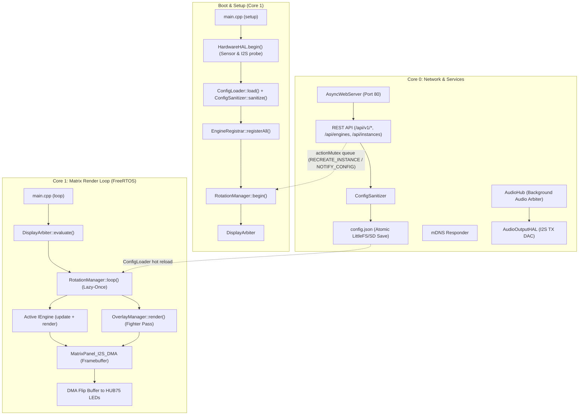
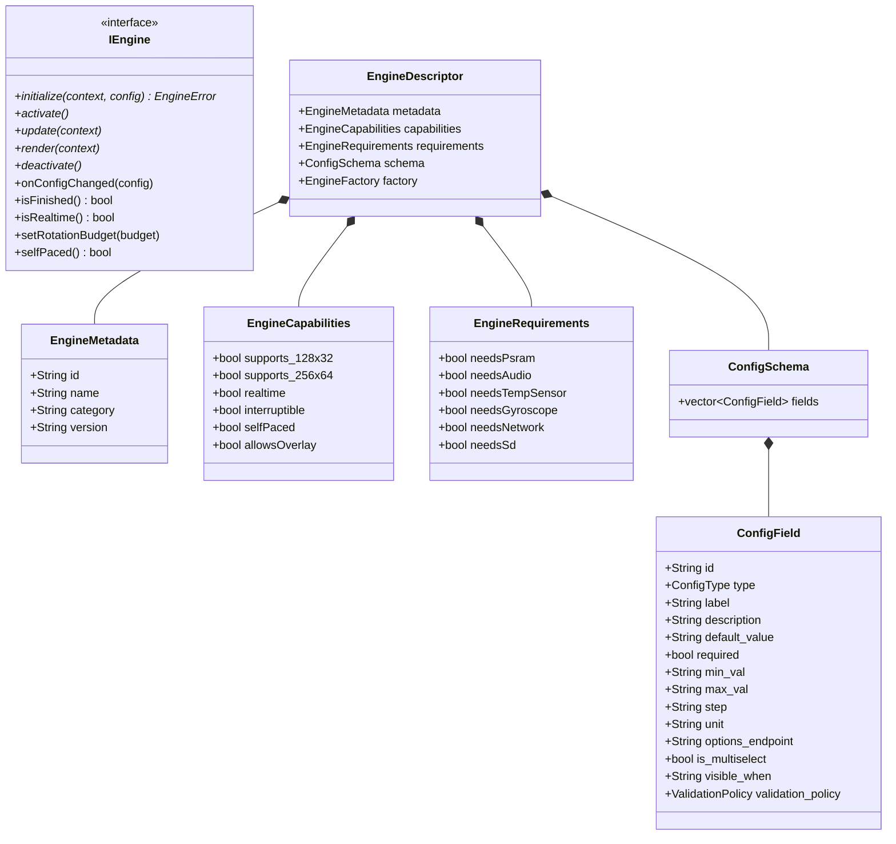
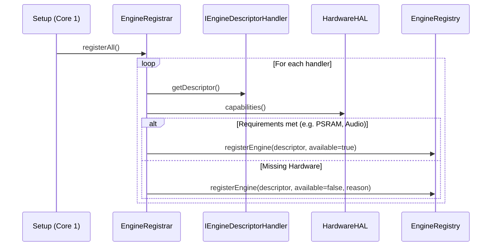
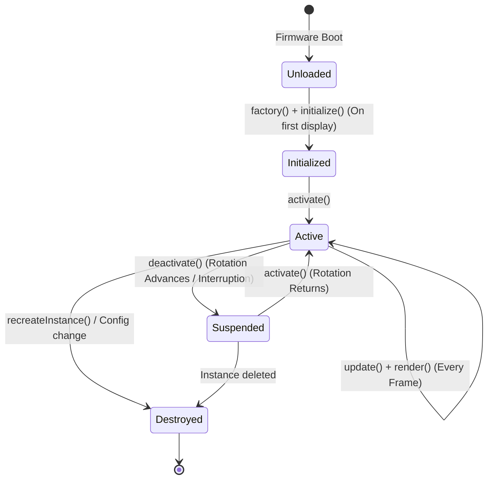
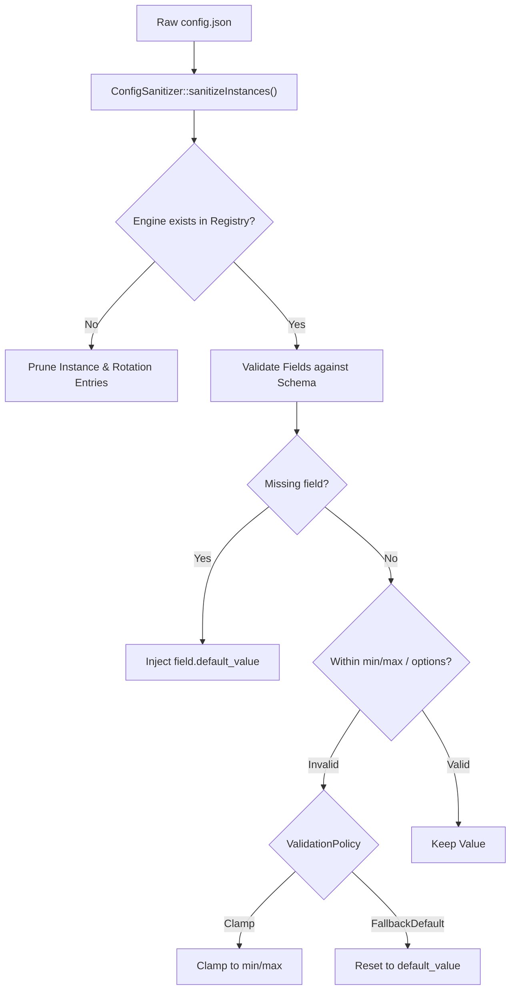
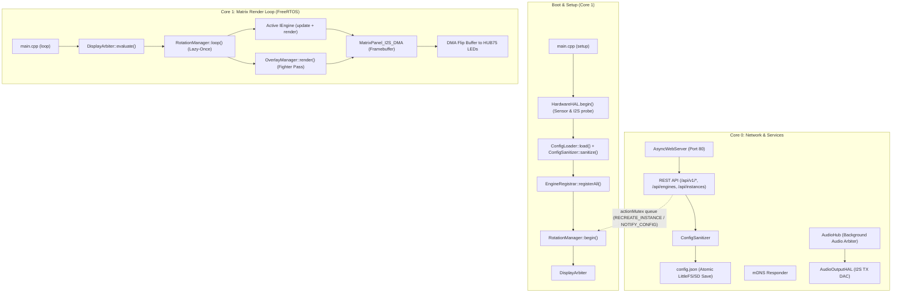

🇬🇧 English | 🇫🇷 [Français](ARCHITECTURE_FR.md) | 🇪🇸 [Español](ARCHITECTURE_ES.md)

# Architecture Overview (ESP32 — C++ / FreeRTOS)

This document is the **deep, exhaustive** reference for the ArcadeMatrix architecture on ESP32 & ESP32-S3 (written in **C++** with **FreeRTOS**). It covers the design philosophy, the complete `IEngine` contract, the auto-discovery `EngineRegistry` & `EngineRegistrar`, the "Lazy-Once" lifecycle, the self-healing configuration pipeline, the schema-driven dynamic WebUI (including **custom / dynamic option lists**), the `DisplayArbiter`, the transverse `OverlayManager` (Fighter Compositor), the dual-core threading model, and the autonomous Audio / Gyroscope subsystems.

> If you want to **add** an engine or a config field, read [DEVELOPER.md](DEVELOPER.md). This document explains **why** and **how** the system behaves; the developer guide explains **what to type**.

---

## Table of Contents

1. [Design Philosophy: Embedded Constraints & Zero Heap Churn](#1-design-philosophy-embedded-constraints--zero-heap-churn)
2. [High-Level Component Map](#2-high-level-component-map)
3. [The Engine Contract (`IEngine` Model)](#3-the-engine-contract-iengine-model)
4. [Auto-Discovery: Registry, Registrar, Handlers & Gating](#4-auto-discovery-registry-registrar-handlers--gating)
5. [The "Lazy-Once" Instance Lifecycle](#5-the-lazy-once-instance-lifecycle)
6. [Configuration Model: `config.json` → Instances](#6-configuration-model-configjson--instances)
7. [Self-Healing: the `ConfigSanitizer`](#7-self-healing-the-configsanitizer)
8. [Config Propagation & Zero-Reboot Hot Reload](#8-config-propagation--zero-reboot-hot-reload)
9. [Schema-Driven Dynamic UI & Options Endpoints](#9-schema-driven-dynamic-ui--options-endpoints)
10. [Internationalization Architecture (i18n) & Single Source of Truth](#10-internationalization-architecture-i18n--single-source-of-truth)
11. [Hardware Abstraction Layer (`HardwareHAL`) & Capabilities Gating](#11-hardware-abstraction-layer-hardwarehal--capabilities-gating)
12. [The Display Arbiter: Multi-Source Priority Resolution](#12-the-display-arbiter-multi-source-priority-resolution)
13. [The Transverse Overlay Compositor (`OverlayManager`)](#13-the-transverse-overlay-compositor-overlaymanager)
14. [Dual-Core Runtime & FreeRTOS Task Isolation](#14-dual-core-runtime--freertos-task-isolation)
15. [Frame Pacing & DMA Double-Buffering](#15-frame-pacing--dma-double-buffering)
16. [Autonomous Audio Subsystem Architecture (`AudioHub` & `AudioOutputHAL`)](#16-autonomous-audio-subsystem-architecture-audiohub--audiooutputhal)
17. [Gyroscopic Orientation Architecture (`GyroHAL` & `DisplayOrientationManager`)](#17-gyroscopic-orientation-architecture-gyrohal--displayorientationmanager)
18. [HTTP REST API Surface](#18-http-rest-api-surface)
19. [Build Metadata & Telemetry](#19-build-metadata--telemetry)

---

## 1. Design Philosophy: Embedded Constraints & Zero Heap Churn

Unlike a Raspberry Pi or PC with gigabytes of RAM, the standard ESP32 operates within ~320 KB of internal SRAM (and up to 8 MB PSRAM on ESP32-S3). The HUB75 LED matrix driver consumes substantial DMA RAM and requires steady timing to avoid screen flickering or glitching.

To achieve 60 FPS performance without memory fragmentation:

- **Allocate once, mutate in place:** Buffers, animation arrays, and strings are allocated during `initialize()` and reused each frame (`clear()`, pointer reuse).
- **Lazy-Once Instance Lifecycle:** An engine is instantiated only when its configured instance is first displayed, then cached for the lifetime of the firmware ("Lazy-Once").
- **Core Isolation:** Core 1 runs the high-priority rendering loop (`DisplayArbiter`, active engine `update()`/`render()`, `OverlayManager`, DMA swap), while Core 0 handles network I/O, AsyncWebServer, mDNS, background audio decoders, and sensor polling.
- **Transverse Features are Overlays, NOT Engines:** Features that visually composite on top of other content (like MUGEN Fighters) live in `OverlayManager`, keeping `EngineRegistry` purely for main content engines.

---

## 2. High-Level Component Map



The two CPU cores communicate safely through:
- `std::mutex` and action queues (`actionMutex`, `pendingActions`) for atomic commands.
- Shared `ConfigLoader` instances with synchronized snapshots.
- Immutable state snapshots (`AudioPlaybackState`) for rendering.

---

## 3. The Engine Contract (`IEngine` Model)

Every display feature implements the `IEngine` contract (`include/core/EngineContract.h`). The core runtime manipulates `IEngine*` polymorphically without compile-time coupling to concrete engine types.



### Lifecycle Methods in Detail

| Method | Default | When to Override |
| :-- | :-- | :-- |
| `initialize()` | — | **Always.** Pre-allocate buffers, decode static bitmaps, load fonts. |
| `activate()` | — | **Always.** Cheap reset of transient state (chronometers, frame index). |
| `update()` | — | **Always.** Business and animation logic each frame. |
| `render()` | — | **Always.** Draw pixels into `context->getMatrix()`. |
| `deactivate()` | — | **Always.** Stop network/timers, close file handles. |
| `onConfigChanged()` | no-op | **If engine has settings.** Re-read values in place without recreation. |
| `isFinished()` | `false` | If engine has an intrinsic end (e.g. cycle completed) to advance rotation early. |
| `isRealtime()` | `true` | Return `true` for 60 FPS animations; return `false` for static 20 FPS displays. |
| `setRotationBudget()`| no-op | If count-based (e.g. play N GIFs). Receives the rotation entry count. |
| `selfPaced()` | `false` | If true, duration timer does not force-advance; engine drives advance via `isFinished()`. |

---

## 4. Auto-Discovery: Registry, Registrar, Handlers & Gating

Instead of hardcoding engine instantiations in `main.cpp`:

1. Each engine provides a descriptor handler (`IEngineDescriptorHandler`) returning its `EngineDescriptor`.
2. At boot, `EngineRegistrar::registerAll()` inspects `hardwareHAL.capabilities()` against each descriptor's `EngineRequirements` (e.g. `needsPsram`, `needsAudio`, `needsMicrophone`).
3. Only engines meeting hardware requirements are registered as active in `EngineRegistry`. Unsupported engines are flagged with `available: false` and a human-readable `unavailable_reason`.



---

## 5. The "Lazy-Once" Instance Lifecycle

`RotationManager` manages instances defined in `config.instances`:



- **Lazy Initialization:** An engine instance is created via its factory and initialized (`initialize()`) only the **first time** it is displayed.
- **Persistent Caching:** Once initialized, the instance remains resident in memory (`activeEngines[instance_id]`) to prevent heap churn.
- **Activation & Deactivation:** Switching instances calls `deactivate()` on the old engine and `activate()` on the new one.

---

## 6. Configuration Model: `config.json` → Instances

ArcadeMatrix uses an instance-based architecture:

```json
{
  "system": { "brightness": 128, "lang": "fr" },
  "display": { "auto_rotate": true, "manual_rotation": 0 },
  "audio": { "master_volume": 80, "enable_bluetooth": true, "enable_webradio": true },
  "rotation": [
    { "instance_id": "clock_main", "duration": 15, "overlays": { "fighter": true } },
    { "instance_id": "weather_paris", "duration": 10 },
    { "instance_id": "music_main", "duration": 20, "overlays": { "fighter": true } }
  ],
  "instances": [
    { "id": "clock_main", "engine_id": "clock", "config": { "theme": "street_fighter" } },
    { "id": "weather_paris", "engine_id": "weather", "config": { "city": "Paris" } },
    { "id": "music_main", "engine_id": "music_player", "config": { "show_progress": true } }
  ]
}
```

---

## 7. Self-Healing: the `ConfigSanitizer`

The `ConfigSanitizer` enforces schema validity at startup and on every REST API save:



---

## 8. Config Propagation & Zero-Reboot Hot Reload

When configuration is modified via the WebUI or API:
1. `ConfigLoader` saves the updated JSON atomically.
2. An action is queued in `RotationManager`:
   - `RotationAction::NOTIFY_CONFIG_CHANGED`: The running instance receives `onConfigChanged()` to re-read settings in place without allocation.
   - `RotationAction::RECREATE_INSTANCE`: If critical parameters change, the instance is safely destroyed and re-instantiated on next display.
3. **Zero reboot required.**

---

## 9. Schema-Driven Dynamic UI & Options Endpoints

The WebUI contains **zero hardcoded forms for engines**.
- The frontend fetches `GET /api/engines` to discover all engine schemas (`ConfigField`).
- Config types (`BOOLEAN`, `INTEGER`, `FLOAT`, `STRING`, `SELECT`, `MULTISELECT`, `COLOR`) render appropriate controls.
- Dynamic options endpoints (`options_endpoint`, e.g. `/api/clocks/themes`, `/api/fighters/list`, `/api/audio/radios`) populate dropdowns on the fly from the firmware backend.

---

## 10. Internationalization Architecture (i18n) & Single Source of Truth

ArcadeMatrix supports multilingual operations (English, French, Spanish) across both the backend engine descriptors and the dynamic frontend WebUI.
- Translation dictionaries exist in centralized files (`src/core/I18n.cpp`).
- Engine schemas provide canonical English labels and descriptions, with i18n lookup keys automatically translated on the frontend according to `config.system.lang`.

---

## 11. Hardware Abstraction Layer (`HardwareHAL`) & Capabilities Gating

`HardwareHAL` abstracts all physical board peripherals:
- **Profiles:** `ESP32_STD` vs `WAVESHARE_S3`.
- **Wiring Protection:** `HardwareProfile.h` pins are **frozen and immutable**.
- **Capabilities Snapshot (`AudioCapabilities`):**
  ```cpp
  struct AudioCapabilities {
      bool input = false;          // I2S Microphone / ADC available
      bool output = false;         // I2S Speaker / DAC available
      bool fullDuplex = false;      // Simultaneous RX + TX supported
      uint32_t maxSampleRate = 44100;
      uint8_t maxChannels = 2;
      bool bluetoothClassic = false;
      bool psram = false;
  };
  ```

---

## 12. The Display Arbiter & Display Runtime (`DisplayArbiter`, `DisplayRuntime`)

ArcadeMatrix completely decouples display decision resolution from engine lifecycle execution:

```text
[ Emergency Alerts / OTA ] (Priority 100, ONE_SHOT / UNTIL_CANCELLED)
             ↓
[ Real-time Interruption: MQTT Marquee / Live Alert ] (Priority 75)
             ↓
[ Audio Visualizer / Active Engine Request ] (Priority 60)
             ↓
[ Active Carousel Rotation: Clock / Weather / MusicEngine ] (Priority 50)
             ↓
[ Fallback Screen: Default Digital Clock ] (Priority 10)
```

### Deterministic Zero-Allocation & SPSC Lock-Free Architecture
- **Single Producer, Single Consumer (SPSC) Command Queue:** Core 0 (Web server, MQTT listener, AudioHub) submits requests asynchronously via `m_displayArbiter.submitRequest(request)` and `cancelRequest(sourceId)`. These commands are pushed into a lock-free circular buffer (`LockFreeSPSCQueue<ArbiterCommand, 16>`).
- **Single Owner on Core 1:** Core 1 is the **sole owner** of the static slot array (`std::array<DisplayRequestSlot, 8>`). At the beginning of `DisplayArbiter::evaluate()`, Core 1 drains pending commands and resolves priorities in $O(1)$ with **ZERO mutex locking** and **ZERO heap allocations**.
- **Pure Decision Contract:** `DisplayArbiter::evaluate()` returns a lightweight `DisplayDecision` struct containing only semantic IDs (`sourceId`, `engineHandle`, `priority`, `requestId`, `needsClear`, `allowsOverlay`, `isRealtime`), completely free of raw `IEngine*` pointers.
- **Canonical `EngineHandle` Identity:** Instances are identified by a POD `EngineHandle` (`descriptorId[32]`, `instanceId[32]`) avoiding dynamic String allocations. `DisplayRuntime::resolveEngine()` resolves engines canonically without heuristics (`sourceId / 10`).
- **Auto-Consumed `ONE_SHOT`:** Non-recurring alerts (e.g. startup banner, system notifications) are atomically cleared upon evaluation.
- **Request ID Preservation:** Request refreshes preserve their unique `requestId` unless an explicit timer restart is requested.

### Centralized Display Lifecycle & Preemption Matrix (`DisplayRuntime`)
- **Exclusive Lifecycle Owner:** `DisplayRuntime` is the **sole owner** of display engine lifecycle transitions (`activate()`, `deactivate()`, `pause()`, `resume()`).
- **Preemption vs Rotation Lifecycle Semantics:**
  - **Temporary Preemption (e.g. MQTT Message over Clock):** Outgoing engine receives `pause()`, incoming alert receives `activate()`.
  - **End of Preemption (Return to Baseline):** Completed alert receives `deactivate()`, paused baseline engine receives `resume()`, preserving internal state and animation phase.
  - **Carousel Transition (e.g. Clock → Weather):** Outgoing engine receives `deactivate()`, incoming engine receives `activate()`.
- **Preemption & Overlay Compositing:** If the active session permits overlays (`decision.allowsOverlay == true`), `OverlayManager` composites transverse effects (e.g. MUGEN Fighters) seamlessly on top of the rendered frame.

---

## 13. Formally Proven SRSW Lock-Free Configuration (`ConfigSnapshot`)

To eliminate cross-core race conditions and avoid holding mutexes on Core 1's time-critical render hot path:
- **Atomic 4-State Machine (`SlotState`):** `ConfigLoader` manages 3 physical snapshot buffers through explicit atomic states: `FREE`, `WRITING`, `PUBLISHED`, and `READING`.
- **Linearizable CAS Reader Pinning (`Core 1`):** `ConfigSnapshotGuard guard = config.acquireSnapshot();` executes an atomic CAS loop: `_slotStates[slot].compare_exchange_weak(PUBLISHED, READING)` with acquire semantics. Access to `_snapshots[slot]` is **strictly impossible prior to CAS success**. The move-only RAII guard automatically transitions the slot upon destruction.
- **Safe Reclamation & Deferred Publication (`Core 0`):** The writer dynamically reserves a `FREE` slot or reclaims an old `PUBLISHED` slot via `compare_exchange_strong(PUBLISHED, FREE)`. If all 3 slots are occupied (`READING + PUBLISHED + WRITING`), `_publishPending = true;` is set and the writer **returns immediately without busy-waiting or `yield()`**, ensuring consolidated publication on the next frame.
- **Linearizability & Checksum Validation:** Monotonic versioning with double-magic and checksum integrity validation ensures linear consistency across threads.
- **Transactional Mutations:** All configuration modifications from Core 0 pass through `config.mutate([&](ConfigLoader& cfg) { ... })`.

---

## 14. Transverse Overlay Compositor (`OverlayManager`)

Transverse visual effects (such as **MUGEN Fighters**) composite on top of the active background engine:
- `OverlayManager` renders after the active engine's `render()` pass.
- Fighters read `.fgt.gz` compressed sprite sequences from LittleFS/SD.
- Any engine (`Clock`, `Weather`, `GIF`, `MusicEngine`) can have the Fighter overlay enabled per rotation item in `config.rotation[i].overlays.fighter`.
- **Fighter is an overlay, NOT an engine in `EngineRegistry`.** When a priority source (e.g. Marquee or MQTT alert) preempts rotation, `DisplayRuntime` passes an empty overlay config, safely suspending overlay execution without tearing down background assets.
- **Engine Overlay Gating (`allowsOverlay()`):** High-cadence engines (`GifEngine`) override `bool allowsOverlay() const override { return false; }`, preventing compositing overhead and preserving 30+ FPS playback on full-motion animations.
- **Non-Destructive Transparent Rendering:** Overlays (`FighterEngine`) render strictly via transparent pixel writes (`if (color != anim->transparentColor) matrix->drawPixel(...)`). They never erase previous bounding boxes with opaque rectangles (`fillRect(..., 0)`), ensuring underlying clock digits and canvas backgrounds remain completely intact.

---

## 15. Dual-Core Runtime & FreeRTOS Task Isolation

- **Core 0 (Services & Networking):**
  - `AsyncWebServer` handling HTTP requests and REST API mutations.
  - Background audio sessions (`AudioSessionManager`, `WebRadioService`, `BluetoothAudioService`).
  - Audio analysis (`AudioAnalysisService` FFT calculation).
  - Sensor polling (`HardwareHAL`, `GyroHAL`).
- **Core 1 (Realtime Graphics):**
  - `DisplayRuntime::update()` & `DisplayArbiter::evaluate()`.
  - Frame pacing via `FrameScheduler` (60 FPS for realtime engines, 20-30 FPS for static screens). A self-pacing engine can report `nextFrameDueInMs()` and the scheduler wakes for it, so GIF frame delays are honoured to the millisecond instead of being rounded up to the next 16 ms tick.
  - Active engine `update()` & `render()`.
  - Transverse Overlay compositing (`OverlayManager::render()`).
  - HUB75 DMA buffer swap.

### Deep Memory Management & Hardware Partitioning (ESP32 vs ESP32-S3 PSRAM)

The ESP32 platform exhibits distinct hardware memory tiers:

| Hardware Board | Internal SRAM | External PSRAM | DMA Memory | SSL / TLS Strategy | Max Resolution |
| :--- | :--- | :--- | :--- | :--- | :--- |
| **ESP32 Classic (`esp32dev`)** | ~320 KB (shared with FreeRTOS & WiFi) | None | Internal SRAM (DMA-capable) | **Gated Off:** TLS buffers (~45-60 KB each) starve DMA, causing crashes. Heavy SSL engines (Crypto, Stock) are disabled via `EngineCapabilities`. | `128x32` / `64x32` |
| **ESP32-S3 Waveshare (`esp32s3_waveshare`)** | ~320 KB (core SRAM) | **8 MB / 16 MB Octal PSRAM** | Internal SRAM only (`MALLOC_CAP_INTERNAL \| MALLOC_CAP_DMA`) | **Internal-DRAM-only, serialized:** mbedTLS uses the stock ESP-IDF/Arduino allocator (never PSRAM — see below). All TLS handshakes system-wide are serialized through `NetworkBudget::ScopedTlsHandshakeLock`. | `256x64` / `64x256` |

#### How the SSL / TLS Memory Exhaustion Was Solved (and why mbedTLS never uses PSRAM)
On resource-constrained microcontrollers, establishing HTTPS/TLS connections requires large cryptographic handshake buffers (input/output fragment buffers of 16 KB + ASN.1 parsing + session state ≈ 45 KB per connection). On standard ESP32 boards, concurrent execution of HUB75 DMA buffers (~16-32 KB) and multiple TLS connections caused severe heap fragmentation and heap starvation panics (`Guru Meditation Error: Core 0 panic'ed (LoadProhibited)`).

An earlier iteration of this codebase attempted to solve this by routing mbedTLS's dynamic allocations to PSRAM via a custom `mbedtls_platform_set_calloc_free()` hook (`MbedTlsAllocator`), on the theory that internal DRAM would then be fully reserved for real-time networking and display DMA. **Live hardware testing proved this actively corrupts the display**: on the ESP32-S3 Waveshare board, the HUB75 framebuffer is itself PSRAM-resident (`-D SPIRAM_DMA_BUFFER`, required because moving it to internal DRAM would cost ~64 KB of internal DRAM this board cannot spare). mbedTLS's ~32 KB combined TLS record buffers are exactly the kind of large, bursty PSRAM access that contends with the HUB75 GDMA engine's continuous PSRAM reads for the framebuffer over the shared PSRAM cache — any TLS handshake with PSRAM-resident buffers reliably blanked the display within seconds. **This allocator has been reverted and removed** (`MbedTlsAllocator.cpp/.h` deleted); mbedTLS is back to the stock, 100%-internal-DRAM allocator on both targets, matching `v3.1.0` behavior.

Display integrity takes strict priority over TLS reliability: a TLS fetch that fails due to internal DRAM pressure degrades gracefully (cached values are kept — see `DashboardDataProvider`, `YahooFinanceProvider`, `BinanceProvider`), whereas a corrupted display cannot recover without a reboot. Since internal DRAM is now the sole home for both TLS and DMA/networking, the actual fix is **admission control + serialization**, not allocator routing:
1. **Capabilities Gating on Classic ESP32:** Heavy network engines (`CryptoEngine`, `StockEngine`) declare `EngineRequirements::needsPsram = true`. On boards without PSRAM, `ConfigSanitizer` automatically gates them off safely without crashing.
2. **System-Wide TLS Serialization (`NetworkBudget::ScopedTlsHandshakeLock`):** Every TLS call site in the codebase (Dashboard weather/markets, Crypto, Stock, Spotify, Google Cast, Artwork, Marquee HTTPS fallback, GNews, Pixelcade sync) constructs a `ScopedTlsHandshakeLock` immediately before `WiFiClientSecure::connect()`. This is a single global FreeRTOS mutex: only one TLS handshake may be in flight anywhere in the firmware at any time, bounding peak internal-DRAM demand from concurrent handshakes to a single ~32 KB reservation instead of N-way overlap. **Atomicity fix (this round):** the constructor re-validates `NetworkBudget::canStartTlsSession()` *while already holding the mutex*, immediately before reporting success — closing a TOCTOU race where the budget could have been checked, found sufficient, and then invalidated by another handshake/allocation while this task was still waiting (up to 5s) to acquire the contended mutex. A cheap, non-authoritative `canStartTlsSession()` pre-check is still allowed at call sites purely to avoid blocking on an already-known-insufficient budget; only the lock's internal post-acquire re-check is authoritative.
3. **Known open limitation:** the serialization above prevents crashes/display corruption, but does **not** solve underlying internal-DRAM fragmentation. On live hardware, with `Dashboard` active, free internal DRAM has been observed to drop from ~65 KB to a fragmented plateau of ~11-12 KB (largest block ~3 KB) within about 3 minutes of uptime. Since `canStartTlsSession()` requires `largestInternalBlock >= 16896 bytes`, **once this plateau is reached, `GoogleCastEngine` (and any other TLS consumer) can be denied admission indefinitely** — this currently manifests as **Google Cast never successfully connecting / rendering anything** once the system has been up for a few minutes with Dashboard or other engines active, even though mDNS discovery of the Cast device itself succeeds. This is an accepted degradation path (no crash, no corruption) but is **not yet solved** — see the Fragmentation / Future Work note below.

#### Resource Hierarchy & Opportunistic Service Tiering

To maintain system-wide stability across network, storage, audio, and visual subsystems under FreeRTOS memory pressure, ArcadeMatrix implements an explicit resource prioritization policy:

```text
                    CORE 0
                       │
        ┌──────────────┼──────────────┐
        │              │              │
     Network         Audio          Storage
        │              │              │
     Cast TLS       ES7210/I2S       SDMMC
        │              │              │
        └──────────────┼──────────────┘
                       │
                 resource budget
                       │
                FighterEngine
                ArtworkService
                  (optional)
```

1. **Critical Services (Guaranteed Resources):**
   - **Display DMA & Matrix Scanning:** Core 1 scan loop has hard real-time priority.
   - **AsyncWebServer (Port 80) & mDNS:** Core 0 sockets must never be starved by background client sockets.
   - **Audio Subsystem:** I2S microphone capture (ES7210) and playback DAC (ES8311).
   - **Transversal Cast Stream:** Persistent CastV2 streaming engine on Core 0.
   - **Storage Layer (SDMMC):** Requires contiguous internal DMA bounce buffers (`MALLOC_CAP_DMA`).
2. **Opportunistic Services (Strictly Subordinate & Abandonable):**
   - **`FighterEngine` Overlay:** Must cut short immediately upon memory scarcity (`heap < 30 KB`, `dma < 16 KB`, `psram < 1 MB`) or missing files without monopolizing the SDMMC bus or CPU.
   - **`ArtworkService` HTTPS Downloads:** Must verify `NetworkBudget::canStartTlsSession()` before allocating and requesting album art. Thumbnail parameters (`=w64-h64-c` on Google CDN) cap download sizes to 16 KB to protect PSRAM GDMA bandwidth. Core 1 reads immutable lock-free POD snapshots (`ArtworkSnapshot`) without heap allocations or mutexes.

#### Stateful Networking vs Socket Descriptor Exhaustion (CastV2)
- Transversal protocols (Google Cast) maintain a persistent `WiFiClientSecure` connection across polling cycles with active protocol heartbeats (`PING` every 5s).
- Repeated teardown and recreation of TLS clients creates an accumulation of TCP sockets in `TIME_WAIT` (120-second lwIP lifetime). When 48 descriptors are occupied, the OS rejects new incoming connections (`ECONNABORTED = 113`), rendering the WebUI unreachable (`ERR_ADDRESS_UNREACHABLE`).
- Reconnection backoff is paced at $\ge 15\text{ seconds}$, bounding maximum concurrent `TIME_WAIT` sockets to 8.
- The reconnect path itself is now gated by `NetworkBudget::ScopedTlsHandshakeLock` like every other TLS call site; a denied reconnect is retried after a short 2s cooldown rather than busy-looping.

#### Hardware DMA Gating (`esp-sha` & SDMMC)
- ESP32-S3 hardware SHA acceleration allocates internal DMA memory (`MALLOC_CAP_DMA | MALLOC_CAP_INTERNAL`). If largest DMA block $< 4096$ bytes, `esp-sha: Failed to allocate buf memory` causes TLS handshakes to fail.
- `NetworkBudget::canStartTlsSession()` admits TLS handshakes only when `freeDma >= 16 KB` and `largestDma >= 4 KB`.
- `sdmmc_read_blocks failed (257)` (`ESP_ERR_NO_MEM`) has been observed under the same internal-DRAM fragmentation conditions: SDMMC also requires a contiguous internal DMA bounce buffer it cannot get from PSRAM. This is currently only mitigated indirectly (via TLS serialization reducing overall pressure) and is **not yet root-caused as a standalone fix** — it can still occur under heavy fragmentation from non-TLS sources.

#### Engine Retirement Release Barrier (Anti-UAF, Core 1 → Core 0 handoff)
Engines are always destroyed on Core 0 (`Core0LifecycleDispatcher`), never on Core 1, and never synchronously with the `deactivate()` call that removes them from rotation. To guarantee zero use-after-free between the moment Core 1 stops using an engine and the moment Core 0 actually destroys it, `RotationManager::retireEngineSlot()` enforces an explicit, ordered **Release Barrier** before an engine's `unique_ptr` is ever moved into the `EngineRetirementQueue`:
1. `engine->deactivate()` — non-blocking, state-only (Core 1).
2. Clear `currentActiveInstanceId` if it matches.
3. `DisplayRuntime::purgeEngineReferences(engine, instanceId)` — removes the pointer from `m_session.activeEngine` **and** every matching entry in the bounded preemption stack, so no lingering Core-1-owned reference can dereference the engine after this point.
4. `engine->setResourceState(EngineResourceState::CORE1_RELEASED)` — a new explicit state (`EngineContract.h`) marking the point past which Core 1 provably holds no reference.
5. Sever the local `instanceId` slot immediately (never again findable via `findActiveEngine()`).
6. Move the `unique_ptr` into `Core0LifecycleDispatcher::retire()`; only after a successful `shutdownForDestruction()` on Core 0 does the state advance to `RETIRED` (or `QUARANTINED` on timeout — see ADR-0004).

This single barrier function replaced three previously-duplicated, slightly-inconsistent inline retirement sequences (instance recreation, rotation pruning, and pending-retry-on-full-queue), one of which did not clear `currentActiveInstanceId` before moving the engine, and none of which purged `DisplayRuntime`'s preemption stack — a latent dangling-pointer risk if a retired engine was still present in the preemption stack (e.g. immediately after preempting the module the user just removed from rotation).

#### Memory Domain Segregation & PSRAM-First for Large Transient Buffers
To prevent concurrent network consumers (AsyncWebServer / AsyncTCP serving WebUI requests) and cryptographic engines (Google Cast mbedTLS) from starving LwIP and triggering software socket aborts (`ECONNABORTED = 113`):
1. **Application-Owned JSON in PSRAM:** All REST API schema and configuration endpoints in `WebServerAPI` instantiate `SpiRamJsonDocument` instead of `DynamicJsonDocument`, routing large JSON trees and string dictionaries to the 15 MB PSRAM pool. AsyncTCP and LwIP transport buffers remain in internal DRAM.
2. **Graphics Canvas Buffer in PSRAM:** Large non-DMA framebuffers (such as `GifEngine`'s 32 KB canvas) prioritize PSRAM allocation (`MALLOC_CAP_SPIRAM | MALLOC_CAP_8BIT`), freeing over 32 KB of permanent internal DRAM at boot.
3. **Dual-Mode Presentation: Shadow Buffer vs. Row-Burst FastBlit (`GifEngine::blitCanvas` & `FastMatrixPanel::blitCanvas565`):**
   With the HUB75 DMA buffer residing in PSRAM on 256×64 displays, every `drawPixel()` incurs one read-modify-write plus one cache write-back per colour bitplane. Pushing a full 256×64 frame via scattered 16-bit pixel writes took ~68 ms and capped animations to 7–14 FPS. ArcadeMatrix implements a dual-mode presentation strategy:
   - **Delta Shadow Blitting ($< 400$ dirty pixels):** For low-motion animations, static art, or subtle partial updates, `GifEngine` maintains a PSRAM shadow copy of what it last drew into each DMA buffer, updating only modified pixels.
   - **Row-Burst FastBlit ($\ge 400$ dirty pixels, ~2.4% of panel):** For full-motion video, scrolling arcade backgrounds (e.g. Metal Slug), and fast-action scenes, the engine switches automatically to `FastMatrixPanel::blitCanvas565()`. This bypasses 131,072 scattered 16-bit accesses by converting full scanlines into sequential row-burst writes directly into the back-buffer DMA plane words. Full-frame blit latency drops from ~68 ms to **~26 ms**, unlocking a rock-solid **30–33+ FPS** cadence on large 256×64 panels.
4. **CIE 1931 Pre-Scaled Bit-Depth LUTs (`initLuts(depth)`):**
   When the upstream HUB75 DMA library compiles with native 8-bit depth, setting runtime `colorDepth < 8` (e.g. 5 or 6 bits per channel) causes high brightness values ($\ge 64$ or $32$) to wrap around modulo $2^{\text{depth}}$, corrupting bright colors and gradients. `FastMatrixPanel::initLuts(depth)` pre-calculates gamma-corrected luminance tables scaled to $(1 \ll \text{depth}) - 1$ with round-half-up bit-shifting (`(lumConvTab_8bit[val] + round) >> (8 - depth)`). This enables running **5-bit color depth** safely: the DMA buffer shrinks from 262 KB to 163 KB, refresh rate reaches 120 Hz without PWM bit truncation (`lsbMsbTransitionBit`), and Core 1 frame stalls on complex clock overlays are eliminated.
5. **Zero-Flicker Screen Clearance (`FastMatrixPanel::fillScreen(0)`):**
   `fillScreen(0)` opens nearly every engine's frame. The upstream library's `setBrightness8()` writes Output Enable (OE) modulation pulses to **both buffer 0 and buffer 1**. In double-buffered mode, mutating the front buffer while GDMA is actively streaming bytes to physical LEDs produces horizontal tearing and scanline flicker (analogous to RPi hardware pulse interference). `FastMatrixPanel::fillScreen(0)` directly masks out color bits (`ptr[x] &= BITMASK_RGB12_CLEAR`) exclusively on the **back buffer (`m_back`)** in $\sim 0.8\text{ ms}$, preserving OE, LAT, and address lines without touching the actively scanning front buffer.
6. **AsyncTCP Task Core Isolation & Sizing:** The `async_tcp` service task is sized to 8192 bytes and pinned strictly to Core 0 (`CONFIG_ASYNC_TCP_RUNNING_CORE=0`), isolating network callbacks from the Core 1 60 FPS display hot path.
7. **Google Cast Reconnect Backoff:** Reconnections are paced with exponential backoff (5s, 10s, 20s, 60s) initialized upon session drop, avoiding tight reconnection loops during bursty HTTP activity.
8. **Periodic 5-Second Render Telemetry:** Non-blocking scalar telemetry in `AppRuntime::update()` logs present FPS, GIF FPS, blit duration, decode duration, and free heap to the serial console every 5 seconds with zero dynamic heap allocation.

#### Concurrency: Seamless Simultaneous Audio & 60 FPS Video
Real-time audio decoding and HUB75 matrix scanning operate concurrently without micro-stutters:
- **Core 0 (Audio & Network Pipeline):** Runs `WebRadioService` MP3 frame decoding (`minimp3`) and audio network stream management into a lock-free circular buffer, continuously feeding the Everest `ES8311` I2S DAC.
- **Core 1 (Matrix Render Loop):** Runs the HUB75 DMA display driver, rendering engines, and `OverlayManager` at a rock-solid 60 FPS cadence.
- **Lock-Free State Handshake:** `AudioHub` publishes atomic `AudioPlaybackState` snapshots with incrementing `generation` IDs. The rendering engine on Core 1 reads snapshots instantly without blocking or acquiring mutexes on the audio thread.

#### Known Open Issues (as of this round, not yet resolved)
- **Google Cast currently renders nothing / never connects** once the system has been up for a few minutes with other engines (notably `Dashboard`) active: mDNS discovery succeeds, but the TLS handshake is repeatedly denied by `canStartTlsSession()` because the system settles into a fragmented internal-DRAM plateau (~11-12 KB free, ~3 KB largest block) below the 16896-byte largest-block admission threshold. No crash or display corruption occurs — this is the intended fail-safe behavior of the admission gate — but the underlying fragmentation is not fixed, only its consequences contained.
- **`sdmmc_read_blocks failed (257)`** still occurs intermittently under heavy fragmentation (observed alongside the above); `ConfigLoader` and `GifEngine` recover gracefully (backup restore / skip), but the root allocation-pressure cause is shared with the TLS admission problem above and needs a dedicated defragmentation or reservation strategy (e.g. a small dedicated internal-DRAM pool reserved at boot for DMA-capable transactions) rather than best-effort admission gating.
- A prior live-hardware session observed a Task Watchdog Timeout / `abort()` / reboot at ~5.5 minutes uptime while `GifEngine` was active with severely fragmented heap and Cast TLS retries running concurrently. The most recent soak test (after the TLS admission-atomicity fix) ran ~6 minutes without that crash recurring, but the test was ended by an intentional physical USB unplug before a longer window could confirm the fix's durability — **this crash is not yet confirmed fixed**, only not-yet-reproduced under the new serialization.


---

## 2. High-Level Component Map



---

## 3. The Engine Contract (`IEngine`)

Every display engine implements the abstract `IEngine` contract defined in [`include/core/EngineContract.h`](file:///Users/red1l/Documents/work/git/perso/ArcadeMatrix/include/core/EngineContract.h):

```cpp
class IDisplayGeometryAware {
public:
    virtual ~IDisplayGeometryAware() = default;
    virtual void onDisplayGeometryChanged(const DisplayGeometry& geometry) = 0;
};

class IEngine : public IDisplayGeometryAware {
public:
    virtual ~IEngine() = default;

    // Lifecycle
    virtual EngineError initialize(EngineContext* context, const EngineConfig* config) = 0;
    virtual void activate() = 0;
    virtual void update(EngineContext* context) = 0;
    virtual void render(EngineContext* context) = 0;
    virtual void deactivate() = 0;
    
    // Dynamic Configuration
    virtual void onConfigChanged(const EngineConfig* config) {}
    
    // Geometry Awareness (rebuilds geometry-derived caches on rotation)
    virtual void onDisplayGeometryChanged(const DisplayGeometry& geometry) override {}
    
    // Capabilities & Flow
    virtual bool isFinished() const { return false; }
    virtual bool isRealtime() const { return false; }
    virtual bool selfPaced() const { return false; }
    virtual bool allowsOverlay() const { return true; }
    virtual bool allowRotation() const { return true; }
    virtual bool hasNewFrame() const { return true; }
    virtual bool needsClear() const { return true; }
};
```

---

## 20. Multi-Resolution & Declarative Geometry Architecture

ArcadeMatrix supports any matrix resolution across Landscape, Square, and TATE (Portrait) formats (`64x32`, `128x32`, `256x64`, `128x64`, `64x64`, `32x64`, `32x128`, `64x128`, `64x256`).

### The Golden Rule of Responsive Rendering
> **Renderers are orientation-agnostic and do NOT contain `if (layoutClass)` branches.**
> Classification is performed **once** by a dedicated pure `*LayoutCalculator` (or `*SourceSelector`), returning a declarative layout structure composed of bounded `Rect` structures. The renderer draws exclusively into these pre-calculated rectangles.

```text
                 DisplayGeometry (width, height, rotation, layoutClass, version)
                                       │
                                LayoutHelper (Stateless)
                                       │
                    ┌──────────────────┴──────────────────┐
                    ▼                                     ▼
           *LayoutCalculator                     *GeometryAdapter
           (e.g. MusicLayout)                    (e.g. FighterGeometry)
                    │                                     │
                    ▼                                     ▼
             Layout / Rects                        Geometry (groundY, spawns)
                    │                                     │
                    └──────────────────┬──────────────────┘
                                       ▼
                             Single Pure Renderer
```

### Deterministic Layout Classification (`LayoutClass`)
```cpp
enum class LayoutClass : uint8_t {
    WIDE,       // W >= (H * 3) / 2  (Landscape 64x32, 128x32, 128x64, 256x64)
    SQUARE,     // Intermediate ratios (Square 64x64)
    PORTRAIT,   // H >= (W * 3) / 2 && H < W * 3  (TATE 32x64, 64x128)
    TALL        // H >= W * 3  (Ultra-tall 32x128, 64x256)
};
```

### Strict Multi-Core Lifecycle Sequencing
1. Orientation changes (triggered by Gyroscope or Web API) are scheduled asynchronously.
2. The hardware rotation `display->setRotation(newRot)` is executed **strictly within the render loop on Core 1 at the apex of the visual transition**.
3. `DisplayGeometry` is updated directly from the live `display->width()` / `display->height()` and increments its `version` counter.
4. `onDisplayGeometryChanged(geometry)` is dispatched to the active engine and `OverlayManager`.
5. Engines with geometry-derived caches (`MatrixRainClock`, `TetrisClock`, `VisualizerEngine`, `FighterEngine`, `DashboardEngine`) reconfigure their caches in place without resetting business state.
6. The first full frame rendered post-apex displays a perfectly aligned, artifact-free layout.

### Dual-GIF Architecture (YOKO & TATE)
- `SD:/gifs/` holds landscape-optimized GIFs (YOKO).
- `SD:/gifs_tate/` holds portrait-optimized GIFs (TATE).
- `GifSourceSelector` resolves the appropriate primary and fallback directories based on `DisplayGeometry`. `GifEngine` remains completely decoupled from layout classes and utilizes `LayoutHelper::aspectFit()` per frame for optimal letterboxing/pillarboxing.

---

## 18. HTTP REST API Surface

| Method | Route | Description |
| :-- | :-- | :-- |
| `GET` | `/api/v1/system/status` | Heap, PSRAM, uptime, WiFi, capabilities. |
| `GET` | `/api/engines` | Returns all engine descriptors and schemas. |
| `GET` | `/api/instances` | Returns active instances and configurations. |
| `POST`| `/api/instances` | Creates or updates an engine instance. |
| `GET` | `/api/rotation` | Returns current playlist rotation. |
| `POST`| `/api/rotation` | Updates playlist rotation sequence. |
| `GET` | `/api/audio/status` | Current audio playback state, source, volume. |
| `POST`| `/api/audio/volume` | Adjusts master audio volume (0-100%). |
| `GET` | `/api/gyro/status` | Current gravity vector, active rotation, and transition FX. |
| `POST`| `/api/gyro/calibrate` | 1-Click zero reference calibration ($0^\circ$ Normal). |
| `POST`| `/api/display/orientation` | Sets manual rotation, mounting offset, and transition FX. |
| `POST`| `/api/display/test-transition` | Triggers a live preview of rotation transition effects. |
| `GET` | `/api/gifs/library` | Playlist folders of one library with file counts (from `playlists.json`). |
| `GET` | `/api/gifs/files` | Files of one playlist folder, streamed from its `index.txt`. |
| `GET` | `/api/gifs/file` | Serve one media file (inline preview; `download=1` for an attachment). |
| `POST`| `/api/gifs/upload` | Multipart upload into a playlist folder (rotation suspended while writing). |
| `POST`| `/api/gifs/mkdir` | Create a playlist folder. |
| `POST`| `/api/gifs/rename` | Rename a folder, or a file when `name` is given. |
| `POST`| `/api/gifs/reindex` | Rebuild `index.txt` + `playlists.json` for **both** libraries (background task, `202`). |
| `GET` | `/api/gifs/reindex/status` | Rescan progress (`running`, `done/total`, `files`, `eta`, `last_result`). |
| `DELETE`| `/api/gifs/reindex` | Cancel a running rescan (honoured between folders). |
| `DELETE`| `/api/gifs/file` | Delete one file. |
| `DELETE`| `/api/gifs/folder` | Delete a playlist folder recursively. |

Every `/api/gifs/*` route takes an optional `orientation=yoko|tate` parameter selecting the horizontal
(`/gifs`) or vertical (`/gifs_tate`) library, matching the split `GifEngine` already makes between the two
roots. Omitting it means `yoko`. `POST /api/gifs/reindex` ignores it and always walks both roots, so
vertical display playlists are rebuilt too; the rescan slot is claimed atomically, and a second request
while one is running answers `409`.

---

## 19. Build Metadata & Telemetry

The `/api/v1/system/version` endpoint exposes the exact build fingerprint (`git_commit`, `build_timestamp`, `firmware_version`), ensuring traceability between source code and running firmware.

---

## 21. Ownership Contract & Control-Plane Boundaries

ArcadeMatrix enforces a strict multi-core separation between asynchronous control planes and the real-time display hot path:

```text
DisplayArbiter
    └── calculates dominant intent only (pure stateless decision engine)

DisplayRuntime
    ├── owns active session state
    ├── owns lifecycle transitions (activate, pause, resume, deactivate)
    ├── owns preemption stack (PreemptionStack<PreemptionEntry, 4>)
    └── classifies internal REFRESH vs external PREEMPT / RESUME / REPLACE

RotationManager
    ├── owns selectable engine instances (MAX_ACTIVE_ENGINES = 32)
    ├── creates engine instances on cold path (REST API / configuration)
    └── exposes allocation-free lookup on hot path (findActiveEngine())

AppRuntime
    └── owns event-driven engine instances (Pixelcade, Audio, MQTT handlers)
```

### 21.1 Comprehensive Display FSM Transition Matrix

| Transition Sequence | Classification | Lifecycle Side Effects | Stack & Depth State |
| :--- | :--- | :--- | :--- |
| **A $\to$ A (same req/source)** | Internal `REFRESH` | `0` (no pause, no activate, in-place metadata update) | Depth unchanged |
| **A $\to$ B (normal rotation)** | `REPLACE` | `deactivate(A) → activate(B)` | Depth = 0 |
| **A $\to$ B (preemptive alert)** | `PREEMPT` | `pause(A) → push(A) → activate(B)` | Depth increments |
| **A $\to$ B $\to$ B refresh** | Internal `REFRESH` | `0` (updates `requestId` in-place) | Depth unchanged |
| **A $\to$ B $\to$ C (stacked alert)**| `PREEMPT` | `pause(B) → push(B) → activate(C)` | Depth = 2 |
| **A $\to$ B $\to$ C $\to$ C refresh**| Internal `REFRESH` | `0` (updates `requestId` in-place) | Depth = 2 |
| **A $\to$ B $\to$ C $\to$ C timeout**| `RESUME` | `deactivate(C) → pop(B) → resume(B)` | Depth = 1 |
| **A $\to$ B $\to$ cancel B** | `RESUME` | `deactivate(B) → pop(A) → resume(A)` | Depth = 0 |
| **A $\to$ B $\to$ cancel A** | None | `0` (submerged A discarded from stack if expired) | B remains active |
| **A $\to$ unresolvable target** | Transactional rejection | `0` (transition rejected silently, A intact) | Depth unchanged |
| **ROTATION target not bound yet** | Deferred binding | `0` (session binds to ROTATION, engine attached on a later `update()`) | Depth unchanged |
| **Saturated stack (depth=4) $\to$ new alert** | Transactional rejection | `0` (preemption rejected cleanly, top session intact)| Depth = 4 |
| **Unresolvable parent $\to$ RESUME** | Transactional rejection | `0` (RESUME rejected without corrupting active child)| Child remains active |
| **Independent REPLACE over an active stack** | `REPLACE` | `deactivate(All) → activate(New)` | Depth reset to 0 |
| **Priority A(10) vs B(5)** | A dominates | `0` (A stays active) | Depth unchanged |
| **Priority A(5) vs B(10)** | `PREEMPT` | `pause(A) → push(A) → activate(B)` | Depth increments |

---

## 22. Validation Architecture & Testing Framework

ArcadeMatrix features a comprehensive 3-tier validation pipeline ensuring 100% test coverage and zero regressions:

```text
┌─────────────────────────────────────────────────────────────────────────────┐
│                       3-Tier Validation Pipeline                            │
├──────────────────────┬───────────────────────────────┬──────────────────────┤
│ Tier 1: Local PIO    │ Tier 2: QEMU Emulation CI     │ Tier 3: Dual-Target  │
│ Unit Test Suites     │ Hardware Emulated Execution   │ Compilation          │
├──────────────────────┼───────────────────────────────┼──────────────────────┤
│ • test_api           │ • scripts/run_qemu_tests.py   │ • esp32dev           │
│ • test_core          │ • ESP32 dual-core bootloader  │ • esp32s3_waveshare  │
│ • test_engines       │ • UART Unity test runner      │ • Full static check  │
│ • test_hardware      │ • Zero host device dependency │ • Binary size check  │
│ • test_providers     │ • Automated GitHub Actions CI │                      │
│ • test_retrofrontend │                               │                      │
│ • test_utils         │                               │                      │
└──────────────────────┴───────────────────────────────┴──────────────────────┘
```

1. **Tier 1 — Local PlatformIO Compilation (`pio test`):** 7 comprehensive test suites compiling test firmware binaries with `Unity` test assertions to verify symbol resolution and type contracts without requiring a physical board attached.
2. **Tier 2 — QEMU Hardware Emulation Execution (`scripts/run_qemu_tests.py`):** Automated test harness booting each compiled test firmware image inside an emulated ESP32 CPU (Espressif QEMU), capturing and evaluating the UART serial output for `UNITY_END()` success codes.
3. **Tier 3 — Dual-Target Compilation:** Ensures complete firmware build compatibility across classic ESP32 Dual-Core (I2S DMA) and ESP32-S3 (LCD DMA) target hardware platforms.

### 22.1 ValidationPolicy Contract as a Violation Handler

In ArcadeMatrix, `ValidationPolicy` defines the deterministic recovery action executed whenever a configuration field fails validation constraints:

- `Clamp`: Constrains out-of-bounds numeric values to `[min_val, max_val]`.
- `FallbackDefault`: Restores the field value to `field.default_value` upon constraint violation.
- `Accept`: Accepts custom/unconstrained user values as-is (used for freeform text or unconstrained URLs).
- `Reject`: Discards the invalid configuration and restores the documented default.
