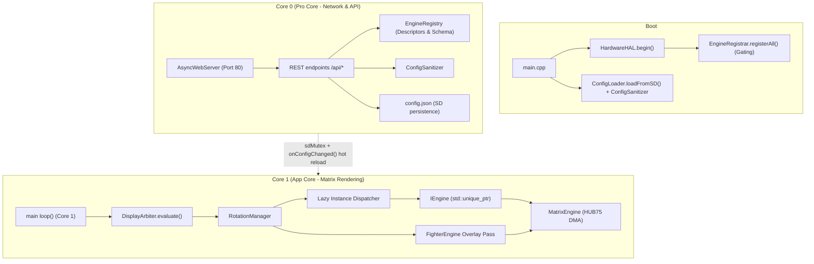
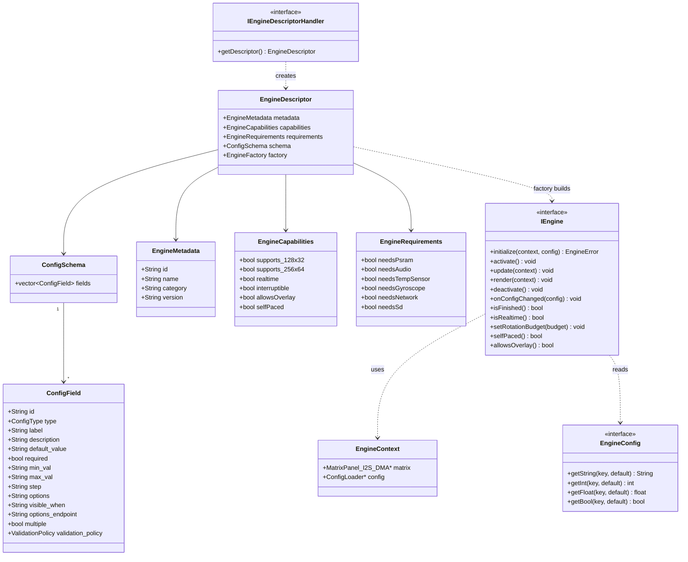
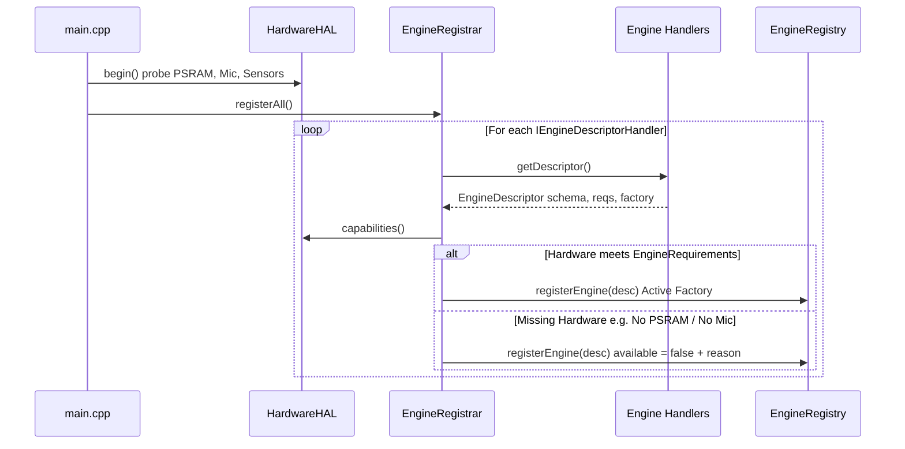
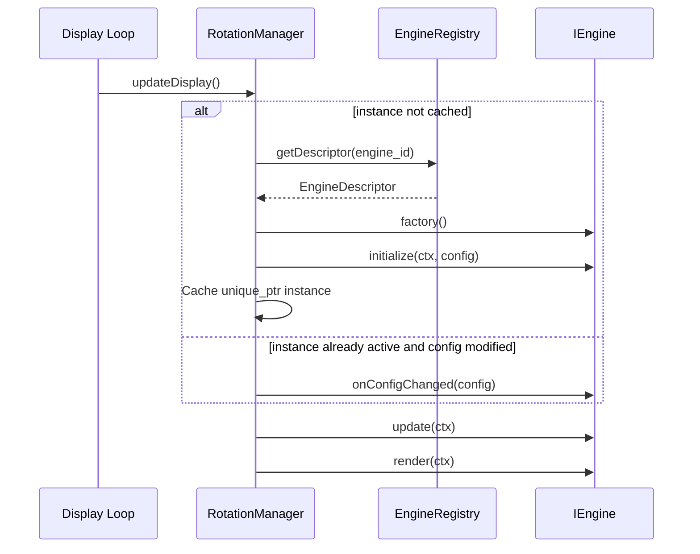
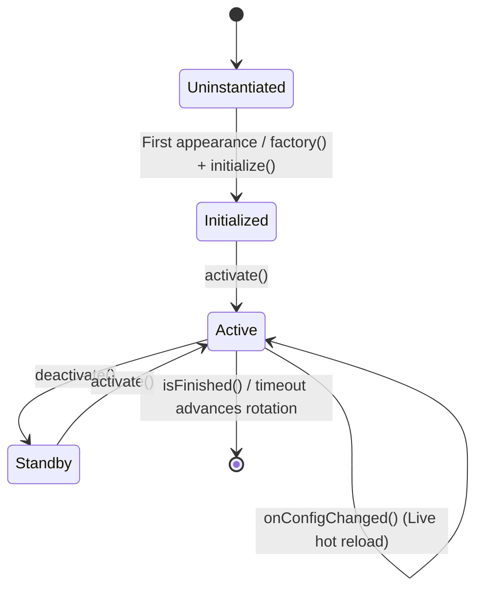
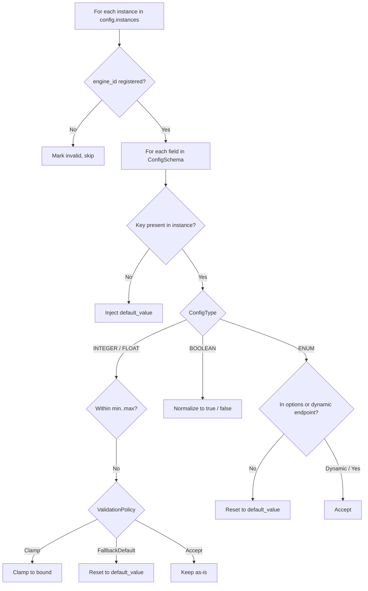

🇬🇧 English | 🇫🇷 [Français](ARCHITECTURE_FR.md) | 🇪🇸 [Español](ARCHITECTURE_ES.md)

# Architecture Overview (ESP32 — C++)

This document is the **deep, exhaustive** reference for the ArcadeMatrix architecture on ESP32 (written in **C++**). It covers the design philosophy, severe embedded hardware constraints, the full `IEngine` contract, the auto-discovery `EngineRegistry`, the "Lazy-Once" lifecycle, the self-healing configuration pipeline, the schema-driven dynamic UI (including **dynamic / custom option lists**), the `DisplayArbiter`, the Fighter overlay compositor, the dual-core FreeRTOS threading model, and the hardware isolation layer.

> If you want to **add** an engine or a config field, read [DEVELOPER.md](DEVELOPER.md). This document explains **why** and **how** the system behaves; the developer guide explains **what to type**.

---

## Table of Contents

1. [Design Philosophy: Hardware Constraints & Memory Strategy](#1-design-philosophy-hardware-constraints--memory-strategy)
2. [High-Level Component Map](#2-high-level-component-map)
3. [The Engine Contract (Class Model)](#3-the-engine-contract-class-model)
4. [Auto-Discovery: Registry, Descriptor & Factory](#4-auto-discovery-registry-descriptor--factory)
5. [The "Lazy-Once" Lifecycle](#5-the-lazy-once-lifecycle)
6. [Configuration Model: `config.json` → Instances](#6-configuration-model-configjson--instances)
7. [Self-Healing: the ConfigSanitizer](#7-self-healing-the-configsanitizer)
8. [Config Propagation & Hot Reload](#8-config-propagation--hot-reload)
9. [Schema-Driven Dynamic UI & Custom Lists](#9-schema-driven-dynamic-ui--custom-lists)
10. [The Display Arbiter](#10-the-display-arbiter)
11. [The Fighter Overlay Compositor](#11-the-fighter-overlay-compositor)
12. [Runtime Isolation & Dual-Core Threading Model](#12-runtime-isolation--dual-core-threading-model)
13. [Rendering Cadence & Adaptive Limiter](#13-rendering-cadence--adaptive-limiter)
14. [HTTP API Surface](#14-http-api-surface)
15. [Build Metadata](#15-build-metadata)

---

## 1. Design Philosophy: Hardware Constraints & Memory Strategy

Unlike Linux-based platforms (like the Raspberry Pi) which enjoy hundreds of megabytes of RAM, the ESP32 is a resource-constrained bare-metal micro-controller running FreeRTOS:

- **Internal SRAM vs. Octal PSRAM:**
  - **ESP32 Standard (`esp32dev`):** Has ~320 KB of internal SRAM, shared among the FreeRTOS kernel, Wi-Fi stack, AsyncTCP network buffers, and HUB75 DMA descriptors. The remaining heap is typically 120–180 KB.
  - **Waveshare ESP32-S3 (`esp32s3_waveshare`):** Has 320 KB internal SRAM plus **16 MB of Octal PSRAM**, allowing larger frame buffers (up to 256x64), deep quote history caches, and animated sprites.
- **Heap Fragmentation is the Primary Enemy:** In C++, dynamic memory allocation (`malloc`, `new`, `String` concatenation, resizing `std::vector`) inside periodic render loops fragments the heap and inevitably triggers kernel panics (`Guru Meditation Error` or `AsyncTCP failed to start task`).
- **Direct DMA HUB75 Pipeline:** Drawing primitives write directly into the I2S DMA memory buffers without OS abstraction layers.

Three cardinal architecture rules emerge:

1. **Allocate once, mutate in place.** Buffers and objects are pre-allocated in `initialize()` and mutated in place during `update()` and `render()`.
2. **Instantiate lazily, cache forever.** An engine is constructed only when first scheduled by rotation or requested by priority ("Lazy-Once"), keeping inactive modules out of RAM.
3. **Isolate Core 0 and Core 1.** Network I/O, WebServer, and MQTT run asynchronously on Core 0, while the 60 FPS matrix render loop runs uninterrupted on Core 1.

---

## 2. High-Level Component Map



The system uses a shared `sdMutex` to protect SD card bus access between Core 0 (API uploads/config saves) and Core 1 (GIF streaming/fonts), and dispatches hot reload notifications in place without restarting.

---

## 3. The Engine Contract (Class Model)

Every display module (clocks, weather, GIF player, crypto tickers, visualizers, etc.) implements the abstract `IEngine` contract:



### Method Lifecycle & Responsibilities

| Method | Invocation | Responsibility | Memory Rules |
| :-- | :-- | :-- | :-- |
| `initialize()` | Exactly once on first display | Heavy buffer allocation, bitmap decoding, font setup. | **Only** location allowed for large dynamic allocations. |
| `activate()` | Each time engine becomes visible | Cheap state reset (chronometer, sprite position). | Zero allocation. |
| `update()` | Every display frame | Business logic calculation. | Zero allocation. Mutate pre-allocated members. |
| `render()` | Every display frame | Pixel drawing into `MatrixPanel_I2S_DMA`. | Direct DMA buffer manipulation. Zero allocation. |
| `deactivate()` | When rotation moves away | Close file handles, pause network/audio. | Release temporary active resources. |
| `onConfigChanged()`| On live API setting mutation | Re-read values in place without destroying instance. | Zero re-allocation. |
| `isFinished()` | Polled in rotation loop | Signals early completion (e.g. crypto token list complete). | Const query. |
| `isRealtime()` | Polled in frame limiter | Dynamic framerate query (~60 FPS vs ~20 FPS). | Const query. |
| `setRotationBudget()`| On module activation | Sets count-based budget (e.g. play N GIFs). | Receives rotation entry count value. |
| `selfPaced()` | Polled in rotation loop | If true, duration timer does not force-advance. | Driven by `isFinished()`. |
| `allowsOverlay()` | Polled by DisplayArbiter | If true, Fighter overlay can composite additively. | Bypasses overlays if false. |

---

## 4. Auto-Discovery: Registry, Descriptor & Factory

### Decoupled Registration via `IEngineDescriptorHandler`
The core framework does not hardcode concrete engine types in `main.cpp` or in a monolithic God-Class. Each engine encapsulates its own configuration schema, capabilities, and factory in a companion `IEngineDescriptorHandler`. 

At boot, `EngineRegistrar::registerAll()` iterates through the registered descriptor handlers:



```cpp
class ClockEngineDescriptorHandler : public IEngineDescriptorHandler {
public:
    EngineDescriptor getDescriptor() const override {
        EngineDescriptor desc;
        desc.metadata = { "clock", "Digital & Publisher Clock", "clocks", "3.0.0" };
        desc.capabilities = { .supports_128x32 = true, .supports_256x64 = true, .realtime = true, .allowsOverlay = true };
        desc.requirements = { .needsPsram = false, .needsAudio = false };
        desc.schema.fields = { /* ... */ };
        desc.factory = []() { return std::unique_ptr<IEngine>(new ClockEngine()); };
        return desc;
    }
};
```

### Requirement Gating
`EngineRegistrar::checkRequirements()` dynamically compares the engine's `EngineRequirements` against `HardwareHAL::capabilities()`. If an engine requires PSRAM or an audio microphone physically absent on the board:
1. Registration records `available = false` and a descriptive `reason` (e.g. *"Requires PSRAM"*).
2. The engine factory is safely withheld from the rotation loop.
3. `GET /api/engines` exposes the rejection reason to the WebUI to grey out unsupported features with explanatory badges.

---

## 5. The "Lazy-Once" Lifecycle

`RotationManager` manages instances lazily using `std::unique_ptr<IEngine>`:



### Lifecycle State Machine



---

## 6. Configuration Model: `config.json` → Instances

All configuration is persisted in a single `/config.json` file on the microSD card:

```json
{
  "instances": [
    {
      "instance_id": "clock_main",
      "engine_id": "clock",
      "config": {
        "theme": "12",
        "font": "default",
        "format24h": "true"
      }
    }
  ],
  "rotation": [
    { "instance_id": "clock_main", "duration_sec": 15 },
    { "instance_id": "weather_main", "duration_sec": 10 }
  ]
}
```

### Separation of Concerns
- **Engine Type (`engine_id`)**: The archetype (e.g. `clock`), defined in `EngineRegistry`.
- **Engine Instance (`instance_id`)**: A configured occurrence (e.g. `clock_main`, `clock_retro`), stored in `config.instances`.
- **Config Dictionary (`DictionaryEngineConfig`)**: Key-value pairs providing isolated settings to the engine.

---

## 7. Self-Healing: the ConfigSanitizer

`ConfigSanitizer::sanitizeInstances()` runs automatically at boot and upon every API write:



---

## 8. Config Propagation & Hot Reload

When a user modifies settings in the WebUI:
1. WebUI posts JSON payload to `POST /api/instances`.
2. `ConfigSanitizer` validates and normalizes all fields against the schema.
3. Configuration is saved to `/config.json` on the SD card.
4. `rotationManager->notifyConfigChanged(instanceId)` dispatches `onConfigChanged()` directly to the live running engine instance without restarting the ESP32.

---

## 9. Schema-Driven Dynamic UI & Custom Lists

The WebUI (`data/index.html`) contains **zero hardcoded forms**. It queries `GET /api/engines` and constructs the settings UI dynamically from `ConfigSchema`:

- **Dynamic Options (`options_endpoint`)**: Dropdowns for Clock Themes (`/api/themes`), Fonts (`/api/fonts`), and Playlists (`/api/playlists`) query firmware API endpoints asynchronously.
- **Hardware Badges**: Displays informative warning banners on unsupported modules (*"Unavailable: Requires PSRAM"*).
- **Multiselect**: Supports comma-separated list selections for playlist items.

---

## 10. The Display Arbiter

The `DisplayArbiter` evaluates priority display requests each frame:

```text
Priority Hierarchy:
1. MQTT Message (Priority 10)
2. Retro Gaming Marquee (Priority 8)
3. One-Shot GIF Animation (Priority 6)
4. Audio Visualizer Override (Priority 4)
5. Idle Rotation Loop (Priority 0)
```

---

## 11. The Fighter Overlay Compositor

The M.U.G.E.N `FighterEngine` operates as an **additive compositing pass**:
- When `rotationManager->allowsCurrentOverlay() == true` and `fighter_main.enabled == true`, `fighterOverlay` renders directly over the clock/weather matrix buffer.
- Never calls `matrix.fillScreen(0)` to prevent flickering.
- Automatically deactivated when high-priority sources (MQTT/Marquee/GIF) take the matrix.

---

## 12. Runtime Isolation & Dual-Core Threading Model

- **Core 0 (Pro Core)**: Handles Wi-Fi, AsyncTCP, REST API endpoints, and MQTT clients.
- **Core 1 (App Core)**: Dedicated exclusively to the 60 FPS display loop (`update()` + `render()` + DMA buffer flipping).
- **Thread Safety**: Bus interactions with the SD card are protected by `sdMutex` semaphores.

---

## 13. Rendering Cadence & Adaptive Limiter

To conserve power and reduce CPU heat:
- **Realtime Engines** (`isRealtime() == true`): Animated clocks, GIF player, Visualizer, Fighter run at **~60 FPS** (`interval = 16ms`).
- **Static Engines** (`isRealtime() == false`): Word Clock, Binary Clock, Static Weather run at **~20 FPS** (`interval = 50ms`).

---

## 14. HTTP API Surface

| Endpoint | Method | Role |
|---|---|---|
| `/api/hardware` | `GET` | Hardware profile, PSRAM bytes, microphone, sensor status. |
| `/api/engines` | `GET` | Complete list of descriptors, schemas, capabilities, requirements, availability. |
| `/api/instances` | `GET`, `POST` | CRUD engine instances with auto-sanitization and live hot reload. |
| `/api/themes` | `GET` | List of all 30 clock and date themes. |
| `/api/version` | `GET` | Version (`3.0.0`), Git commit hash, build timestamp, architecture. |
| `/api/settings` | `GET`, `POST` | Global system settings (matrix, wifi, mqtt, brightness). |
| `/api/status` | `GET` | Memory health, uptime, heap headroom. |
| `/api/sensor` | `GET` | Realtime SHTC3 temperature and humidity data. |

---

## 15. Build Metadata

`scripts/build_webui.py` auto-generates `src/core/BuildInfo.h` during build time:
- `BUILD_GIT_COMMIT`: Current Git commit short SHA.
- `BUILD_TIMESTAMP`: UTC compilation timestamp.
Exposed directly via `GET /api/version` and the WebUI footer.
