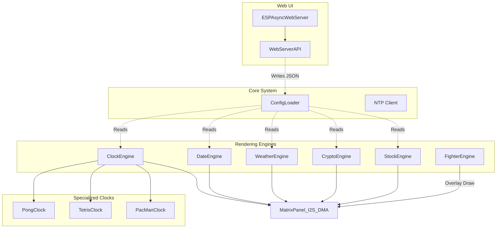

# Architecture Overview (ESP32)

🇬🇧 English | 🇫🇷 [Français](ARCHITECTURE_FR.md) | 🇪🇸 [Español](ARCHITECTURE_ES.md)

This document provides a comprehensive overview of the ArcadeMatrix architecture specifically tailored for the ESP32 microcontroller. 

---

## 1. Core Philosophy: Hardware Constraints

Unlike the Raspberry Pi version which uses a decoupled, high-level Python rendering pipeline, the ESP32 version is written in **C++** and designed around strict hardware constraints:
- **RAM Limits (320KB internal):** We cannot afford to instantiate heavy off-screen dynamic canvases or use a multi-layered Renderer pipeline. Every byte counts.
- **CPU Constraints (240MHz):** To maintain 60 FPS on the matrix, rendering must be extremely fast. 
- **Direct DMA Access:** Instead of building an image and sending it, the code often draws primitives directly to the hardware's DMA buffer using the `ESP32 HUB75 LED MATRIX PANEL DMA Display` library and `Adafruit GFX`.

---

## 2. Hardware-Coupled Modular Embedded Architecture with Direct Rendering

Rather than a heavy multi-layer abstraction, the ESP32 uses a **Hardware-Coupled Modular Embedded Architecture with Direct Rendering**.

### Diagram



### Components

1. **Standalone Engines (`src/ClockEngine.cpp`, `src/DateEngine.cpp`, `src/CryptoEngine.cpp`, `src/StockEngine.cpp`, etc.)**: Each engine is a closed system. It manages its own state and contains its own logic to draw directly to the matrix hardware.
2. **Crypto & Stock Engines**: Real-time asset market quote tickers. Features multi-API fallback strategy (CoinGecko Primary, CoinGecko Simple ID, Binance Fallback, Yahoo v8 Chart API), per-symbol configurable TTL caching, and prominent multi-row layout for 64px panels.
3. **Specialized Clocks**: For complex themes (e.g., Pong, PacMan), the logic is encapsulated into separate C++ classes (`PongClock.cpp`), but they still receive a pointer to the matrix hardware and draw their own pixels. There is no separation between "Renderer" and "Clock" here.
4. **Fighter Engine (SD Card Streaming)**: The ESP32 does not have enough memory to load an entire MUGEN sprite sheet. Instead, the `FighterEngine` uses a custom streaming format (`.fgt`) and reads binary sprite frames directly from the SD card buffer frame-by-frame, drawing them over the active engine.

---

## 3. Threading and Asynchronous Web Server

The ESP32 uses an **Asynchronous Web Server** (`ESPAsyncWebServer`).

- **The Main Loop (`loop()` in `main.cpp`)**: This loop must run as fast as possible. It calls the currently active engine's `loop()` function to draw the next frame.
- **The Web Server**: Because it is asynchronous, incoming HTTP requests (like saving settings or changing the clock theme) do not block the main rendering loop. The API parses the incoming JSON using `ArduinoJson`, updates the `ConfigLoader` struct in memory, and flags a reload if necessary.

### Dual-Core Utilization (Multiprocessing)

The ESP32 (and ESP32-S3) are dual-core microcontrollers, and this architecture implicitly leverages both cores via the underlying Arduino/ESP-IDF framework:

- **Core 0 (PRO_CPU):** Handles the Wi-Fi stack, TCP/IP networking, and the `ESPAsyncWebServer`. This ensures that heavy network traffic or API requests do not stutter the display.
- **Core 1 (APP_CPU):** Handles the main application `loop()`, running the `ClockEngine`, `FighterEngine`, and executing all mathematical logic for animations.
- **DMA Controller (Hardware Co-processor):** While Core 1 calculates the *next* frame, the ESP32's DMA (Direct Memory Access) controller constantly blasts the *current* frame's pixel data to the LED Matrix over I2S. This costs 0% CPU.

Because this separation of concerns is handled automatically by `ESPAsyncWebServer` and the DMA library, we do not need to manually spawn FreeRTOS tasks (`xTaskCreatePinnedToCore`) in our application code, keeping the codebase simpler while still achieving full multiprocessing performance.

---

## 4. Hardware Abstraction Layer & Sensor/Audio Coordination

`HardwareHAL` acts as a centralized physical hardware wrapper managing peripheral buses and sensor availability:

```text
                    ┌───────────────────┐
                    │   HardwareHAL     │
                    └─────────┬─────────┘
                              │
             ┌────────────────┼────────────────┐
             │                │                │
             ▼                ▼                ▼
          HUB75             I2C             I2S
          Matrix            SHTC3           ES7210
             │                │                │
             ▼                ▼                ▼
        Renderer         TempEngine      Audio sampling
                                             │
                                  ┌──────────┴─────────┐
                                  ▼                    ▼
                            DecibelEngine       VisualizerEngine

RotationManager
      │
      ├── TEMP ──► requires SHTC3 sensor (skips if missing)
      └── DECIBEL ─► requires audio sampling (skips if missing)
```

### Sensor & Audio Lifecycle Coordination
- **I2C Temperature & Humidity (SHTC3):** `HardwareHAL` initializes the I2C bus and probes the SHTC3 sensor at boot. If absent, `isTempSensorAvailable()` returns `false`, enabling `RotationManager` to automatically skip `MODULE_TEMP` without hanging or throwing errors.
- **I2S Audio Input (ES7210 ADC / Microphone):** Audio sampling is shared between `DecibelEngine` and `VisualizerEngine`. `HardwareHAL` tracks active sampling state (`startAudioSampling()` / `stopAudioSampling()`). The engines coordinate lifecycle start/stop signals.
- **Visualizer Pseudo-Spectrum Model:** `VisualizerEngine` processes time-domain audio samples into amplitude/energy band approximations ("pseudo-spectrum") tailored for high-FPS LED matrix visual effects.
- **Decibel Meter Model:** `DecibelEngine` computes RMS amplitude values converted to a calibratable relative sound-level indicator.

---

## 5. Fonts and SD Card

- **SD Card Dependency:** Because the ESP32 has limited flash memory, all assets (GIFs, `.fgt` fighters) must be stored on an external SD card connected via SPI.
- **Image/Animation Formats (`GifEngine`):** Three file types are supported side-by-side: `.gif`, `.raw`, and `.png`.
- **Font Rendering:** Native firmware bitmap fonts (`Adafruit GFX`) and custom `.amf` binary fonts loaded from SD card via `BitmapFontLoader`.

---

## 6. Dependency Injection & Providers
The project uses a Dependency Injection (DI) architecture for its API-driven engines (Crypto, Stock, Weather). Engines are decoupled from HTTP logic via interfaces (`IProvider` in C++, `traits` in Rust). This allows fallback mechanisms across multiple providers and enables comprehensive unit testing via Mocks.
