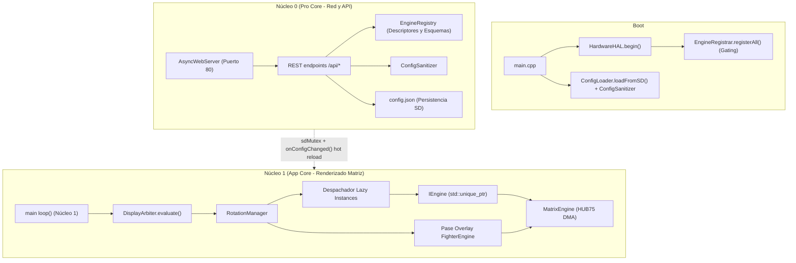
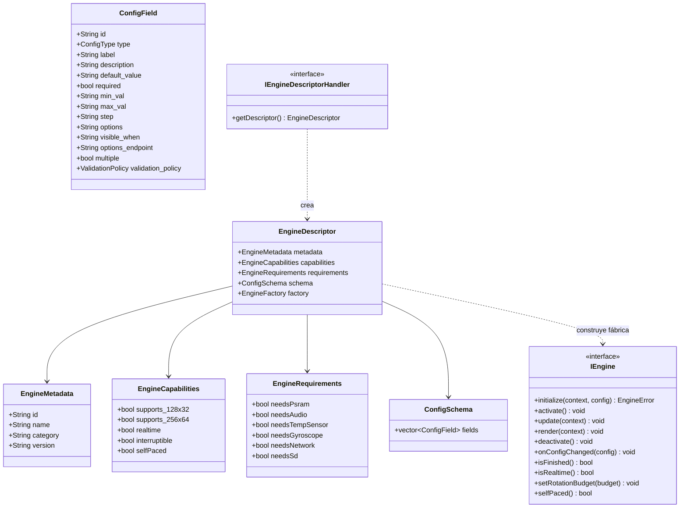
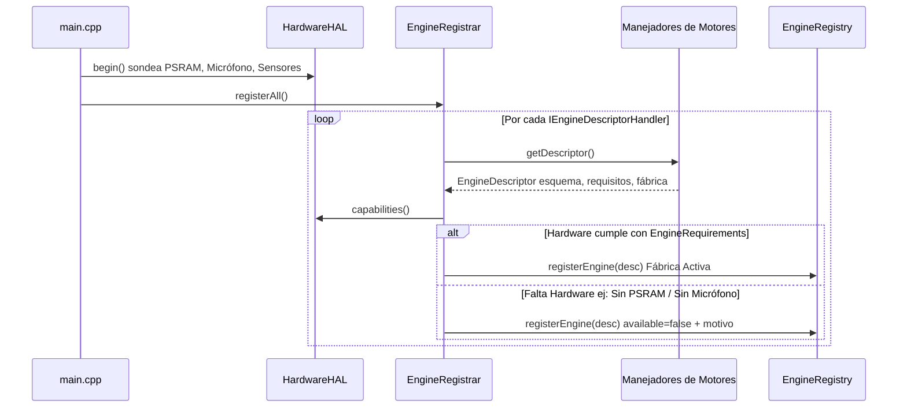
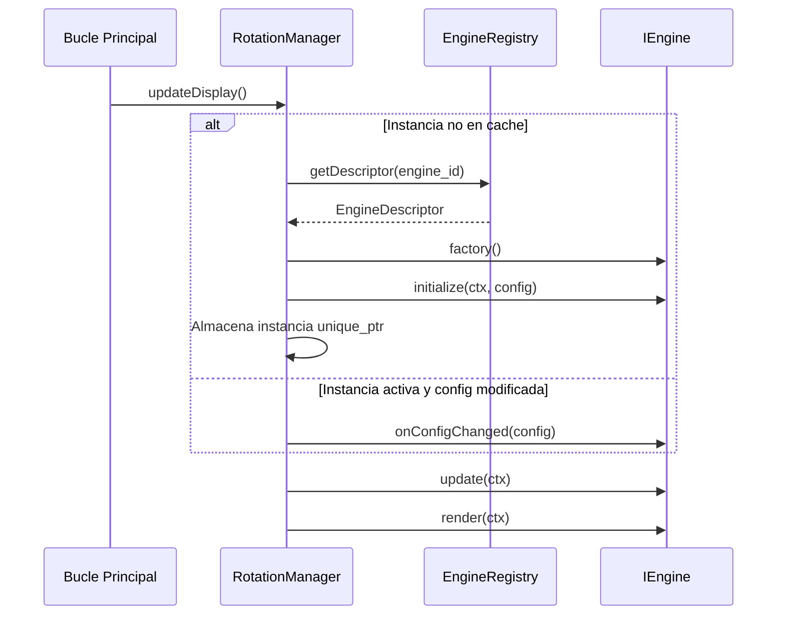

[English](ARCHITECTURE.md) | 🇫🇷 [Français](ARCHITECTURE_FR.md) | 🇪🇸 Español

# Resumen de la Arquitectura (ESP32 — C++)

Este documento es la referencia **técnica exhaustiva** de la arquitectura de ArcadeMatrix en ESP32 (desarrollado en **C++**). Cubre la filosofía de diseño, las estrictas restricciones de hardware embebido, el contrato completo `IEngine`, el `EngineRegistry` de autodescubrimiento, el ciclo de vida "Lazy-Once", el pipeline de autorreparación de configuración, la interfaz de usuario dinámica basada en esquemas (incluyendo **listas de opciones dinámicas y personalizadas**), el `DisplayArbiter`, el compositor de superposiciones (overlays) Fighter, el modelo de subprocesos FreeRTOS de doble núcleo y la capa de aislamiento de hardware.

> Si desea **añadir** un motor o un campo de configuración, consulte [DEVELOPER_ES.md](DEVELOPER_ES.md). Este documento explica **por qué** y **cómo** se comporta el sistema; la guía de desarrollo explica **qué codificar**.

---

## Tabla de Contenidos

1. [Filosofía de Diseño: Restricciones de Hardware y Gestión de Memoria](#1-filosofía-de-diseño-restricciones-de-hardware-y-gestión-de-memoria)
2. [Mapa de Componentes de Alto Nivel](#2-mapa-de-componentes-de-alto-nivel)
3. [El Contrato del Motor (Modelo de Clases)](#3-el-contrato-del-motor-modelo-de-clases)
4. [Autodescubrimiento: Registro, Descriptor y Fábrica](#4-autodescubrimiento-registro-descriptor-y-fábrica)
5. [El Ciclo de Vida "Lazy-Once"](#5-el-ciclo-de-vida-lazy-once)
6. [Modelo de Configuración: `config.json` → Instancias](#6-modelo-de-configuración-configjson--instancias)
7. [Autorreparación: el ConfigSanitizer](#7-autorreparación-el-configsanitizer)
8. [Propagación de Configuración y Recarga en Caliente](#8-propagación-de-configuración-y-recarga-en-caliente)
9. [Interfaz Web Dinámica Basada en Esquemas y Listas Dinámicas](#9-interfaz-web-dinámica-basada-en-esquemas-y-listas-dinámicas)
10. [El Árbitro de Pantalla (Display Arbiter)](#10-el-árbitro-de-pantalla-display-arbiter)
11. [El Compositor de Superposición Fighter (Overlay)](#11-el-compositor-de-superposición-fighter-overlay)
12. [Aislamiento en Tiempo de Ejecución y Modelo de Doble Núcleo](#12-aislamiento-en-tiempo-de-ejecución-y-modelo-de-doble-núcleo)
13. [Cadencia de Renderizado y Limitador Adaptable](#13-cadencia-de-renderizado-y-limitador-adaptable)
14. [Superficie de la API HTTP](#14-superficie-de-la-api-http)
15. [Metadatos de Compilación](#15-metadatos-de-compilación)

---

## 1. Filosofía de Diseño: Restricciones de Hardware y Gestión de Memoria

A diferencia de las plataformas Linux (como la Raspberry Pi) que cuentan con cientos de megabytes de memoria, el ESP32 es un microcontrolador que se ejecuta en bare-metal bajo FreeRTOS:

- **SRAM Interna vs. PSRAM Octal:**
  - **ESP32 Estándar (`esp32dev`):** Cuenta con ~320 KB de SRAM interna compartida entre el kernel de FreeRTOS, la pila Wi-Fi, los búferes de red AsyncTCP y los descriptores DMA HUB75. La memoria dinámica (heap) libre restante suele rondar entre 120 y 180 KB.
  - **Waveshare ESP32-S3 (`esp32s3_waveshare`):** Dispone de 320 KB de SRAM interna más **16 MB de PSRAM Octal**, lo que permite resoluciones mayores (hasta 256x64), historiales amplios para criptomonedas y bolsa, y sprites animados.
- **La Fragmentación de la Memoria es el Enemigo Crítico:** En C++, las asignaciones dinámicas periódicas (`malloc`, `new`, concatenaciones `String`, redimensionamientos de `std::vector`) dentro del bucle de visualización fragmentan la memoria y provocan bloqueos irrecuperables (`Guru Meditation Error` o fallos en sockets de red).
- **Canal Directo DMA HUB75:** Las operaciones de dibujo escriben directamente en la memoria DMA I2S sin capas intermedias.

Reglas esenciales de arquitectura:

1. **Asignar una vez, mutar en el lugar.** Los búferes se preasignan en `initialize()` y se reutilizan en `update()` y `render()`.
2. **Instanciar bajo demanda (lazy), conservar para siempre.** Un motor se crea solo cuando se programa por primera vez ("Lazy-Once"), manteniendo los módulos inactivos fuera de la memoria RAM.
3. **Aislar Núcleo 0 y Núcleo 1.** Las tareas de red y la API se ejecutan de forma asíncrona en el Núcleo 0, mientras que el bucle de renderizado a 60 FPS corre ininterrumpidamente en el Núcleo 1.

---

## 2. Mapa de Componentes de Alto Nivel



---

## 3. El Contrato del Motor (Modelo de Clases)

Todos los módulos de visualización implementan la interfaz `IEngine`:



### Ciclo de Vida y Responsabilidades

| Método | Momento de llamada | Función | Regla de Memoria |
| :-- | :-- | :-- | :-- |
| `initialize()` | Una sola vez en el primer render | Asignación de búferes, carga de fuentes/assets. | **Único** lugar permitido para asignaciones dinámicas pesadas. |
| `activate()` | En cada cambio hacia este motor | Reinicio de variables temporales y contadores. | Cero asignaciones. |
| `update()` | En cada fotograma de pantalla | Procesamiento de lógica y avance de estados. | Cero asignaciones. Modificar miembros existentes. |
| `render()` | En cada fotograma de pantalla | Escritura directa en `MatrixPanel_I2S_DMA`. | Manipulación DMA directa. Cero asignaciones. |
| `deactivate()` | Al salir de la rotación | Cierre de archivos y pausa de audio/red. | Liberación de recursos activos temporales. |
| `onConfigChanged()`| En cambios vía API | Aplicación inmediata de ajustes sin recrear instancia. | Cero reasignaciones. |
| `isFinished()` | Consultado en la rotación | Señala finalización anticipada de secuencia. | Consulta const. |
| `isRealtime()` | Consultado en el limitador FPS | Indicación de cadencia dinámica (~60 FPS vs ~20 FPS). | Consulta const. |
| `setRotationBudget()`| Al activar el módulo | Establece presupuesto por conteo (ej: reproducir N GIFs). | Recibe el valor numérico de la rotación. |
| `selfPaced()` | Consultado en rotación | Si es true, el temporizador de duración no fuerza el avance. | Controlado por `isFinished()`. |

---

## 4. Autodescubrimiento: Registro, Descriptor y Fábrica

### Registro Desacoplado mediante `IEngineDescriptorHandler`
El núcleo del framework no codifica tipos concretos de motores en `main.cpp` ni en una clase monolítica. Cada motor encapsula su propio esquema de configuración, capacidades y fábrica en un `IEngineDescriptorHandler`.

Al arrancar, `EngineRegistrar::registerAll()` itera sobre los manejadores registrados:



```cpp
class ClockEngineDescriptorHandler : public IEngineDescriptorHandler {
public:
    EngineDescriptor getDescriptor() const override {
        EngineDescriptor desc;
        desc.metadata = { "clock", "Reloj Digital y Publisher", "clocks", FIRMWARE_VERSION };
        desc.capabilities = { .supports_128x32 = true, .supports_256x64 = true, .realtime = true };
        desc.requirements = { .needsPsram = false, .needsAudio = false };
        desc.schema.fields = { /* ... */ };
        desc.factory = []() { return std::unique_ptr<IEngine>(new ClockEngine()); };
        return desc;
    }
};
```

### Control de Requisitos de Hardware (Gating)
`EngineRegistrar::checkRequirements()` compara `EngineRequirements` con `HardwareHAL::capabilities()`. Si falta hardware requerido (PSRAM o micrófono):
1. Se registra con `available = false` y la causa descriptiva (*"Requiere PSRAM"*).
2. La fábrica no se invoca en el bucle de rotación.
3. `GET /api/engines` envía la causa a la interfaz web para desactivar el motor con un mensaje explicativo.


---

## 5. El Ciclo de Vida "Lazy-Once"



---

## 6. Modelo de Configuración: `config.json` → Instancias

Toda la configuración se persiste en `/config.json` en la tarjeta microSD:

- **Tipo de Motor (`engine_id`)**: Arquetipo (ej: `clock`), registrado en `EngineRegistry`.
- **Instancia de Motor (`instance_id`)**: Ocurrencia configurada (ej: `clock_main`, `clock_retro`), en `config.instances`.
- **Diccionario de Configuración (`DictionaryEngineConfig`)**: Claves y valores aislados entregados al motor.

---

## 7. Autorreparación: el ConfigSanitizer

`ConfigSanitizer::sanitizeInstances()` se ejecuta en el arranque y tras cada escritura en la API:
- Verifica claves e inserta `default_value` si falta.
- Ajusta enteros y flotantes (`Clamp`) o aplica el valor por defecto (`FallbackDefault`).
- Normaliza valores booleanos (`true` / `false`) y valida opciones de enumeración.

---

## 8. Propagación de Configuración y Recarga en Caliente

1. La interfaz web envía JSON a `POST /api/instances`.
2. `ConfigSanitizer` valida y normaliza según el esquema.
3. Se guarda en la tarjeta SD.
4. `rotationManager->notifyConfigChanged(instanceId)` ejecuta `onConfigChanged()` en la instancia activa sin reiniciar la placa.

---

## 9. Interfaz Web Dinámica Basada en Esquemas

La interfaz web (`data/index.html`) es completamente dinámica:
- **Opciones Dinámicas (`options_endpoint`)**: Menús desplegables para Temas de reloj (`/api/themes`), Fuentes (`/api/fonts`) y Playlists (`/api/playlists`).
- **Avisos de Hardware**: Muestra advertencias informativas en módulos incompatibles (*"No disponible: Requiere PSRAM"*).

---

## 10. El Árbitro de Pantalla (Display Arbiter)

El `DisplayArbiter` evalúa cada fotograma las solicitudes de visualización para determinar la fuente principal activa:

```text
Jerarquía de prioridades de visualización:
1. Mensaje MQTT (Prioridad 100)
2. Visualizador de Audio (Prioridad 40)
3. Marquee Retrogaming (Prioridad 30)
4. Animación GIF One-Shot (Prioridad 20)
5. Bucle de Rotación / Reloj Idle (Prioridad 10)
```

El Árbitro determina **qué fuente principal** controla el framebuffer base. No administra las superposiciones.

---

## 11. Arquitectura de Superposición Transversal e Integración Fighter

El `OverlayManager` opera como una **capa de composición transversal** ejecutada después de que la fuente principal ha dibujado su framebuffer base:

```text
DisplayArbiter (Fuente Ganadora)
       ↓
Engine principal render() -> Framebuffer base
       ↓
OverlayManager (configurar overlays)
       ↓
FighterEngine composite() [si fue solicitado para esta entrada de rotación]
       ↓
matrix.update()
```

### Invariantes Arquitectónicos Clave:
1. **EngineRegistry $\ne$ OverlayManager:** Las fuentes de visualización seleccionables (`clock`, `weather`, `gifs`, etc.) residen en `EngineRegistry`. Los overlays (`Fighter`) residen exclusivamente en `OverlayManager`.
2. **Activación Controlada por el Usuario por Entrada de Rotación:** Los overlays se activan o desactivan por slot de rotación mediante `"overlays": { "fighter": true }`.
3. **Cero Excepciones por Motor:** `Clock + Fighter`, `GIF + Fighter`, `Weather + Fighter` son 100% legítimos. El framework no contiene ninguna regla que restrinja el Fighter en el motor GIF ni en ningún otro.
4. **Invariante Aditivo:** Los overlays componen de forma aditiva sobre píxeles existentes y **nunca** llaman a `matrix.clear()` ni borran el framebuffer base.
5. **Estabilidad del Heap en ESP32:** `OverlayManager` asigna `FighterEngine` perezosamente en la primera demanda y preserva la instancia en el heap entre rotaciones para evitar fragmentación. Durante una preempción (ej: mensaje MQTT), el overlay simplemente se desactiva sin liberar memoria heap.

---

## 12. Aislamiento en Tiempo de Ejecución y Doble Núcleo

- **Núcleo 0**: Wi-Fi, servidor Web asíncrono, API REST y MQTT.
- **Núcleo 1**: Bucle de renderizado a 60 FPS (`update()` + `render()` + intercambio de búfer DMA).
- **Protección de buses**: Acceso a tarjeta SD protegido mediante semáforo `sdMutex`.

---

## 13. Cadencia de Renderizado y Limitador Adaptable

- **Motores en Tiempo Real** (`isRealtime() == true`): Relojes animados, GIF, Visualizador, Fighter corren a **~60 FPS** (`16 ms`).
- **Motores Estáticos** (`isRealtime() == false`): Reloj de texto, reloj binario, clima estático corren a **~20 FPS** (`50 ms`) para optimizar energía y disipación térmica.

---

## 14. Superficie de la API HTTP

| Endpoint | Método | Función |
|---|---|---|
| `/api/hardware` | `GET` | Perfil de hardware, memoria PSRAM, estado de micrófono y sensores. |
| `/api/engines` | `GET` | Lista de descriptores, esquemas, capacidades, requisitos y disponibilidad. |
| `/api/instances` | `GET`, `POST` | CRUD de instancias con saneamiento y recarga en caliente. |
| `/api/themes` | `GET` | Lista de 30 temas de reloj y fecha. |
| `/api/version` | `GET` | Versión (`3.0.0`), commit Git, timestamp de compilación, arquitectura. |
| `/api/settings` | `GET`, `POST` | Ajustes globales del sistema (matriz, wifi, mqtt, brillo). |
| `/api/status` | `GET` | Estado de memoria, tiempo activo, margen de heap libre. |
| `/api/sensor` | `GET` | Lectura en vivo de temperatura y humedad del sensor SHTC3. |

---

## 15. Metadatos de Compilación

El script `scripts/build_webui.py` genera automáticamente `src/core/BuildInfo.h`:
- `FIRMWARE_VERSION`: Extraído de forma centralizada del archivo `VERSION`.
- `BUILD_GIT_COMMIT`: Hash corto del commit Git.
- `BUILD_TIMESTAMP`: Marca de tiempo UTC de compilación.
Accesible a través de `GET /api/version` y en el pie de página de la interfaz web.
