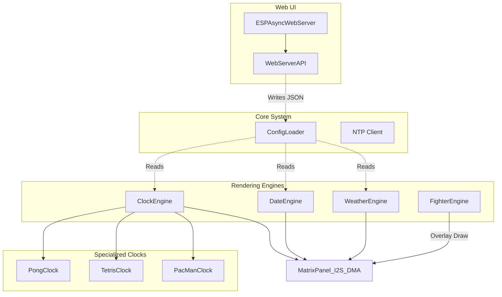

# Descripción general de la arquitectura (ESP32)

🇬🇧 [English](ARCHITECTURE.md) | 🇫🇷 [Français](ARCHITECTURE_FR.md) | 🇪🇸 Español

Este documento ofrece una visión general completa de la arquitectura de ArcadeMatrix, específicamente adaptada al microcontrolador ESP32.

---

## 1. Filosofía principal: restricciones de hardware

A diferencia de la versión Raspberry Pi, que utiliza una canalización de renderizado en Python desacoplada y de alto nivel, la versión ESP32 está escrita en **C++** y diseñada alrededor de restricciones de hardware estrictas:
- **Límites de RAM (320KB internos):** no podemos permitirnos instanciar canvas dinámicos pesados fuera de pantalla ni usar una canalización de renderizado multicapa. Cada byte cuenta.
- **Restricciones de CPU (240MHz):** para mantener 60 FPS en la matriz, el renderizado debe ser extremadamente rápido.
- **Acceso DMA directo:** en lugar de construir una imagen y enviarla, el código suele dibujar primitivas directamente en el búfer DMA del hardware usando la biblioteca `ESP32 HUB75 LED MATRIX PANEL DMA Display` y `Adafruit GFX`.

---

## 2. Arquitectura modular acoplada al hardware con renderizado directo

En lugar de una abstracción pesada de múltiples capas, el ESP32 utiliza una **arquitectura modular acoplada al hardware con renderizado directo**.

### Diagrama

### Componentes

1. **Motores autónomos (`src/ClockEngine.cpp`, `src/DateEngine.cpp`, etc.):** cada motor es un sistema cerrado. Gestiona su propio estado y contiene su propia lógica para dibujar directamente sobre el hardware de la matriz.
2. **Relojes especializados:** para temas complejos (por ejemplo, Pong o PacMan), la lógica se encapsula en clases C++ separadas (`PongClock.cpp`), pero siguen recibiendo un puntero al hardware de la matriz y dibujan sus propios píxeles. Aquí no existe separación entre «Renderer» y «Clock».
3. **Fighter Engine (streaming desde la tarjeta SD):** el ESP32 no tiene suficiente memoria para cargar una hoja completa de sprites MUGEN. En su lugar, `FighterEngine` usa un formato de streaming personalizado (`.fgt`) y lee frames binarios de sprites directamente desde el búfer de la tarjeta SD frame a frame, dibujándolos sobre el motor activo.

---

## 3. Hilos y servidor web asíncrono

El ESP32 utiliza un **servidor web asíncrono** (`ESPAsyncWebServer`).

- **El bucle principal (`loop()` en `main.cpp`):** este bucle debe ejecutarse lo más rápido posible. Llama a la función `loop()` del motor activo para dibujar el siguiente frame.
- **El servidor web:** al ser asíncrono, las peticiones HTTP entrantes (como guardar ajustes o cambiar el tema del reloj) no bloquean el bucle principal de renderizado. La API analiza el JSON entrante con `ArduinoJson`, actualiza en memoria la struct `ConfigLoader` y marca una recarga si hace falta.

### Uso del doble núcleo (multiprocessing)

El ESP32 (y el ESP32-S3) son microcontroladores de doble núcleo, y esta arquitectura aprovecha implícitamente ambos núcleos mediante el framework Arduino/ESP-IDF subyacente:

- **Core 0 (PRO_CPU):** maneja la pila Wi-Fi, la red TCP/IP y `ESPAsyncWebServer`. Esto garantiza que el tráfico de red intenso o las peticiones API no provoquen tirones en la pantalla.
- **Core 1 (APP_CPU):** maneja el `loop()` principal de la aplicación, ejecutando `ClockEngine`, `FighterEngine` y toda la lógica matemática de las animaciones.
- **Controlador DMA (coprocesador de hardware):** mientras el Core 1 calcula el frame *siguiente*, el controlador DMA (Direct Memory Access) del ESP32 envía continuamente los datos de píxeles del frame *actual* a la matriz LED por I2S. Esto cuesta 0 % de CPU.

Como esta separación de responsabilidades la gestionan automáticamente `ESPAsyncWebServer` y la biblioteca DMA, no necesitamos crear manualmente tareas FreeRTOS (`xTaskCreatePinnedToCore`) en el código de la aplicación. Así el codebase se mantiene más simple y aun así consigue un rendimiento multiproceso completo.

---

## 4. Fuentes y tarjeta SD

- **Dependencia de la tarjeta SD:** como el ESP32 tiene memoria flash limitada, todos los assets de ejecución (GIF, luchadores `.fgt`) deben almacenarse en una tarjeta SD externa conectada por SPI.
- **Formatos de imagen/animación (`GifEngine`):** se admiten tres tipos de archivo uno junto a otro en los mismos directorios de playlist, diferenciados solo por la extensión:
  - **`.gif`** — GIF animados, decodificados frame a frame mediante `AnimatedGIF` (bitbank2), en bucle indefinido hasta que avanza la playlist.
  - **`.raw`** — secuencia bruta de píxeles RGB565 específica del proyecto (little-endian, row-major, un frame completo detrás de otro, sin cabecera), la misma convención usada por `MarqueeEngine` y `tools/mugen_extractor`. Se reproduce a unos 20 FPS fijos. Útil para clips tipo «stop motion» prerenderizados que no se comprimen bien como GIF.
  - **`.png`** — imagen **estática**, decodificada una sola vez mediante `PNGdec` (bitbank2, mismo autor / misma forma de API que `AnimatedGIF`) directamente sobre la matriz, y luego mantenida en pantalla durante unos 5 segundos antes de que avance la playlist (o en bucle en su sitio para reproducción de un único archivo). Aquí PNG no tiene concepto de animación: para contenido animado usa `.gif`. Se acepta cualquier profundidad de bits / tipo de color PNG (paleta, escala de grises, RGBA, etc.): `PNGdec::getLineAsRGB565()` normaliza todo a RGB565 durante la decodificación.
  - **El redimensionado NO se realiza intencionadamente en el dispositivo** para ninguno de estos formatos; redimensiona las imágenes a la resolución objetivo del panel (128x32 o 256x64) fuera de línea antes de copiarlas a la tarjeta SD. Redimensionar en tiempo de ejecución es caro en CPU tanto en ESP32 como en ESP32-S3 y queda fuera del alcance.
- **Renderizado de fuentes:** la mayoría de los temas / relojes usan fuentes bitmap `Adafruit GFX` compiladas directamente dentro del firmware (`src/engines/fonts/`, actualmente 7 fuentes repartidas en 3 estilos de editores arcade); esto sigue siendo la ruta predeterminada y recomendada porque no consume acceso a la SD en tiempo de ejecución. Además, `BitmapFontLoader` (`src/core/BitmapFontLoader.h`/`.cpp`) puede cargar al arrancar una **fuente bitmap personalizada** desde la tarjeta SD en una estructura compatible con `GFXfont` asignada en heap, actualmente conectada a `MessageEngine` (el banner desplazable `/api/message`) mediante `[fonts] custom_font_path` en `conf.ini`. Primero hay que convertir las fuentes de origen desde BDF (el mismo formato de fuente bitmap que la versión Raspberry Pi ya incluye en `fonts/*.bdf`) al formato binario compacto `.amf` de ArcadeMatrix usando `tools/bdf_to_amfont/bdf_to_amfont.py`; consulta `docs/DEVELOPER_ES.md` para ver el flujo completo. Sigue sin haber renderizado en el dispositivo de fuentes `.ttf` / vectoriales ni parser BDF (queda fuera del alcance para un microcontrolador sin biblioteca de rasterización de fuentes); `.amf` es únicamente una tabla de glifos bitmap preconvertida.

---

## 5. Fiabilidad: watchdog y actualizaciones OTA

- **Watchdog de hardware:** `main.cpp` inicializa el watchdog de tareas de ESP-IDF (`esp_task_wdt_init`, timeout de 30 s) como el primer paso de `setup()`, antes de tocar la tarjeta SD o la matriz. Si `setup()` o `loop()` se bloquean más tiempo que eso (fallo al montar la SD, fallo al inicializar el DMA de la matriz, bucle infinito inesperado, bloqueo del driver WiFi, etc.), el ESP32 se reinicia solo en lugar de quedarse bloqueado hasta que alguien lo encuentre y lo apague/encienda. Los dos bucles críticos existentes `while (1) { delay(100); }` (fallo de montaje de SD / fallo de inicialización de la matriz) intencionadamente **no** alimentan el watchdog, para que provoquen un reinicio por watchdog (bucle de reintento) en lugar de colgarse para siempre en silencio.
- **Actualizaciones OTA (`/api/ota` vía `Update.h`):** escribe la nueva imagen del firmware en el *slot* de partición OTA inactivo y reinicia inmediatamente en él cuando la subida termina sin errores.
  **Limitación importante:** este proyecto usa el build estándar de Arduino-ESP32 (sin `sdkconfig` personalizado), que **no** activa `CONFIG_BOOTLOADER_APP_ROLLBACK_ENABLE`. Esto significa que actualmente **no hay rollback automático** si una imagen OTA defectuosa arranca en un bucle de crash, a diferencia de la función nativa de rollback de aplicaciones de ESP-IDF (que requiere llamar explícitamente a `esp_ota_mark_app_valid_cancel_rollback()` tras un arranque correcto, además de un bootloader compilado con soporte de rollback). Recuperarse hoy de una mala actualización OTA requiere o bien un reflash por serie/USB, o volver a flashear una imagen buena por OTA si el dispositivo sigue siendo accesible por Wi-Fi. Habilitar un rollback real exigiría abandonar el build predeterminado de Arduino-ESP32 y pasar a un `sdkconfig.defaults` personalizado (framework `espidf` de PlatformIO, o sobrescrituras sdkconfig vía `board_build.embed_txtfiles`), algo señalado como tarea futura de endurecimiento y no implementado en esta pasada para evitar un cambio no verificado a nivel de bootloader.

## Inyección de Dependencias y Proveedores
El proyecto utiliza una arquitectura de Inyección de Dependencias (DI) para los motores basados en API (Crypto, Stock, Clima). Los motores están desacoplados de la lógica HTTP a través de interfaces (`IProvider` en C++, `traits` en Rust). Esto permite mecanismos de respaldo entre múltiples proveedores y habilita pruebas unitarias exhaustivas mediante Mocks.
