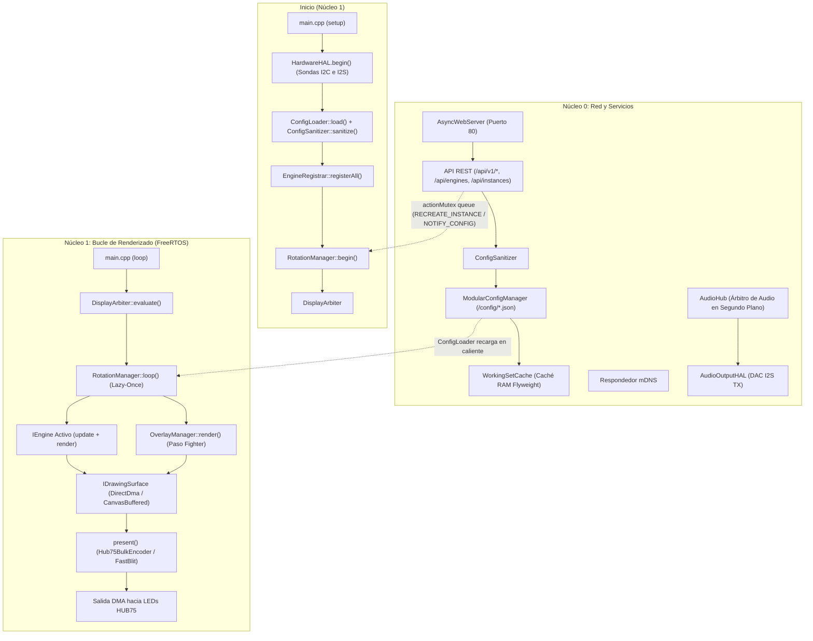
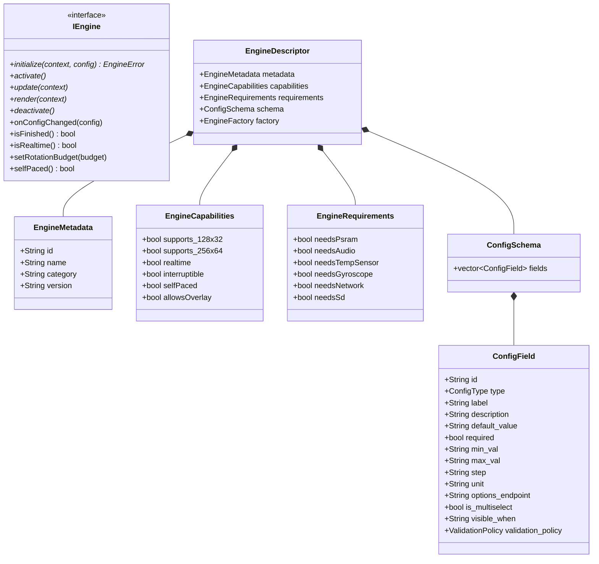

🇬🇧 [English](ARCHITECTURE.md) | 🇫🇷 [Français](ARCHITECTURE_FR.md) | 🇪🇸 Español

# Visión General de la Arquitectura (ESP32 — C++ / FreeRTOS)

Este documento es la referencia **exhaustiva y profunda** de la arquitectura de ArcadeMatrix en ESP32 & ESP32-S3 (desarrollado en **C++** con **FreeRTOS**). Detalla la filosofía de diseño, el contrato `IEngine`, el registro de autodescubrimiento `EngineRegistry` & `EngineRegistrar`, el ciclo de vida "Lazy-Once", el pipeline de configuración autorreparador (`ConfigSanitizer`), la interfaz WebUI dinámica basada en esquemas, el `DisplayArbiter`, el compositor de superposiciones transversales (`OverlayManager` para MUGEN Fighter), el modelo de subprocesos de doble núcleo, y los subsistemas autónomos de Audio y Giroscopio.

> Si desea **añadir** un motor o un campo de configuración, consulte [DEVELOPER.md](DEVELOPER_ES.md). Este documento explica el **por qué** y el **cómo** del sistema.

---

## Tabla de Contenidos

1. [Filosofía: Restricciones Embebidas y Cero Churn de Memoria](#1-filosof%C3%ADa-restricciones-embebidas-y-cero-churn-de-memoria)
2. [Mapa de Componentes de Alto Nivel](#2-mapa-de-componentes-de-alto-nivel)
3. [El Contrato del Motor (Modelo `IEngine`)](#3-el-contrato-del-motor-modelo-iengine)
4. [Autodescubrimiento: Registry, Registrar, Handlers y Gating](#4-autodescubrimiento-registry-registrar-handlers-y-gating)
5. [Ciclo de Vida de Instancia "Lazy-Once"](#5-ciclo-de-vida-de-instancia-lazy-once)
6. [Modelo de Configuración: `config.json` → Instancias](#6-modelo-de-configuraci%C3%B3n-configjson--instancias)
7. [Autorreparación: El `ConfigSanitizer`](#7-autorreparaci%C3%B3n-el-configsanitizer)
8. [Propagación y Recarga en Caliente sin Reinicio](#8-propagaci%C3%B3n-y-recarga-en-caliente-sin-reinicio)
9. [WebUI Dinámica y Endpoints de Opciones](#9-webui-din%C3%A1mica-y-endpoints-de-opciones)
10. [Arquitectura de Internacionalización (i18n) y Fuente Única](#10-arquitectura-de-internacionalizaci%C3%B3n-i18n-y-fuente-%C3%BAnica)
11. [Capa de Abstracción de Hardware (`HardwareHAL`) y Gating](#11-capa-de-abstracci%C3%B3n-de-hardware-hardwarehal-y-gating)
12. [El Árbitro de Pantalla (`DisplayArbiter`)](#12-el-%C3%A1rbitro-de-pantalla-displayarbiter)
13. [El Compositor de Superposiciones Transversales (`OverlayManager`)](#13-el-compositor-de-superposiciones-transversales-overlaymanager)
14. [Ejecución en Doble Núcleo y Aislamiento FreeRTOS](#14-ejecuci%C3%B3n-en-doble-n%C3%BAcleo-y-aislamiento-freertos)
15. [Regulación de Cuadros y Doble Búfer DMA](#15-regulaci%C3%B3n-de-cuadros-y-doble-b%C3%BAfer-dma)
16. [Subsistema de Audio Autónomo (`AudioHub` y `AudioOutputHAL`)](#16-subsistema-de-audio-aut%C3%B3nomo-audiohub-y-audiooutputhal)
17. [Orientación Giroscópica (`GyroHAL` y `DisplayOrientationManager`)](#17-orientaci%C3%B3n-girosc%C3%B3pica-gyrohal-y-displayorientationmanager)
18. [Superficie API REST HTTP](#18-superficie-api-rest-http)
19. [Metadatos de Compilación y Telemetría](#19-metadatos-de-compilaci%C3%B3n-y-telemetr%C3%ADa)

---

## 1. Filosofía: Restricciones Embebidas y Cero Churn de Memoria

El ESP32 estándar dispone de unos 320 KB de SRAM interna (y hasta 8 MB de PSRAM en ESP32-S3). El controlador de matriz LED HUB75 consume una cantidad importante de memoria DMA y requiere tiempos muy precisos para evitar parpadeos.

- **Asignar una vez, mutar en el sitio:** Búferes y matrices de animación se asignan en `initialize()` y se reutilizan en cada cuadro.
- **Ciclo de vida "Lazy-Once":** Un motor solo se instancia cuando su configuración se muestra por primera vez y se mantiene en memoria durante la ejecución.
- **Aislamiento de núcleos:** El Núcleo 1 está dedicado al renderizado gráfico en tiempo real, mientras que el Núcleo 0 maneja la red, `AsyncWebServer`, mDNS, decodificadores de audio y sensores.
- **Las funciones transversales son Overlays, NO Engines:** MUGEN Fighter reside en `OverlayManager`, manteniendo la pureza de `EngineRegistry`.

---

## 2. Mapa de Componentes de Alto Nivel



---

## 3. El Contrato del Motor (Modelo `IEngine`)

Cada motor implementa la interfaz `IEngine` (`include/core/EngineContract.h`):



---

## 4. Autodescubrimiento: Registry, Registrar, Handlers y Gating

1. Cada motor encapsula sus metadatos, su esquema `ConfigSchema`, sus requisitos de hardware `EngineRequirements` y su fábrica en un `IEngineDescriptorHandler`.
2. Al iniciar, `EngineRegistrar::registerAll()` compara los requisitos con `hardwareHAL.capabilities()`.
3. Solo los motores soportados se registran como activos en `EngineRegistry`. Los no compatibles se marcan con `available: false` y un motivo descriptivo para la WebUI.

---

## 5. Ciclo de Vida de Instancia "Lazy-Once"

- **Instanciación Perezosa:** Creado únicamente en la primera visualización.
- **Caché Permanente:** La instancia permanece en memoria en `activeEngines[instance_id]`.
- **Transiciones Limpias:** Llamadas a `deactivate()` y luego `activate()` en cada cambio de rotación.

---

## 6. Modelo de Configuración: `config.json` → Instancias

```json
{
  "system": { "brightness": 128, "lang": "fr" },
  "display": { "auto_rotate": true, "manual_rotation": 0 },
  "audio": { "master_volume": 80, "enable_bluetooth": true, "enable_webradio": true },
  "rotation": [
    { "instance_id": "clock_main", "duration": 15, "overlays": { "fighter": true } },
    { "instance_id": "weather_paris", "duration": 10 },
    { "instance_id": "music_main", "duration": 20, "overlays": { "fighter": true } }
  ],
  "instances": [
    { "id": "clock_main", "engine_id": "clock", "config": { "theme": "street_fighter" } },
    { "id": "weather_paris", "engine_id": "weather", "config": { "city": "Paris" } },
    { "id": "music_main", "engine_id": "music_player", "config": { "show_progress": true } }
  ]
}
```

---

## 7. Autorreparación: El `ConfigSanitizer`

Valida la configuración en cada guardado o inicio:
- Relleno de valores por defecto ausentes.
- Acotado automático (`clamp`) de valores numéricos.
- Eliminación de entradas de rotación huérfanas.

---

## 8. Propagación y Recarga en Caliente sin Reinicio

Las modificaciones de configuración se aplican de forma dinámica:
- `NOTIFY_CONFIG_CHANGED`: La instancia recibe `onConfigChanged()` para releer sus valores in situ.
- `RECREATE_INSTANCE`: La instancia se recrea limpiamente si cambian búferes críticos.

---

## 9. WebUI Dinámica y Endpoints de Opciones

La WebUI no contiene ningún formulario codificado de forma rígida. Consulta `GET /api/engines` para generar automáticamente los campos y usa `options_endpoint` para rellenar desplegables dinámicos.

---

## 10. Arquitectura de Internacionalización (i18n) y Fuente Única

Soporte nativo de inglés, francés y español:
- Diccionarios centralizados en `src/core/I18n.cpp`.
- Esquemas canónicos en inglés con traducción automática en la WebUI según `config.system.lang`.

---

## 11. Capa de Abstracción de Hardware (`HardwareHAL`) y Gating

- **Cableado 100% Congelado:** Los pines definidos en `HardwareProfile.h` son **estrictamente inmutables**.
- **Instantánea de Capacidades (`AudioCapabilities`):**
  ```cpp
  struct AudioCapabilities {
      bool input = false;          // Micrófono I2S
      bool output = false;         // DAC I2S
      bool fullDuplex = false;      // Soporte simultáneo RX + TX
      uint32_t maxSampleRate = 44100;
      uint8_t maxChannels = 2;
      bool bluetoothClassic = false;
      bool psram = false;
  };
  ```

---

## 12. El Árbitro de Pantalla (`DisplayArbiter`)

Resolución estricta de prioridades:
1. **Alertas de Emergencia / OTA** (Prioridad 100).
2. **Interrupciones en Tiempo Real (Mensajes MQTT / Alertas en Vivo)** (Prioridad 75).
3. **Carrusel de Rotación Activo (Reloj, Clima, Música)** (Prioridad 50).
4. **Pantalla de Reserva (Reloj Digital)** (Prioridad 10).

El audio en segundo plano continúa sonando incluso si un mensaje prioritario toma la pantalla.

---

## 13. El Compositor de Superposiciones Transversales (`OverlayManager`)

- Renderizado superpu- **Fighter es un overlay transversal, NO un engine en `EngineRegistry`.**
- **Aislamiento de Overlays por Motor (`allowsOverlay()`):** Los motores de alta tasa de cuadros (`GifEngine`) anulan `bool allowsOverlay() const override { return false; }`, evitando sobrecarga de composición y preservando un renderizado superior a 30 FPS en animaciones fluidas.
- **Renderizado Transparente No Destructivo:** Los overlays (`FighterEngine`) se dibujan exclusivamente mediante trazado de píxeles transparentes (`if (color != anim->transparentColor) matrix->drawPixel(...)`). Nunca borran cuadros delimitadores anteriores con rectángulos negros opacos (`fillRect(..., 0)`), manteniendo intactos los dígitos del reloj y el fondo subyacente.

---

## 14. Ejecución en Doble Núcleo y Aislamiento FreeRTOS

- **Núcleo 0:** Tareas asíncronas (Web, Audio, Sensores, Análisis FFT).
- **Núcleo 1:** Renderizado LED a 60 FPS, DMA, Overlay, Lógica visual. La regulación de cuadros mediante `FrameScheduler` respeta los retardos GIF al milisegundo en vez de redondearlos al tick de 16 ms.

### Estrategia TLS / mbedTLS: 100% SRAM Interna, Nunca PSRAM

Una iteración anterior enrutaba las asignaciones dinámicas de mbedTLS a la PSRAM mediante un hook `mbedtls_platform_set_calloc_free()` personalizado, buscando liberar la SRAM interna para el DMA de la pantalla. **Las pruebas en hardware real demostraron que esto corrompe la pantalla**: el framebuffer HUB75 también reside en PSRAM en esta placa, y los búferes de registro TLS de mbedTLS (~32 KB) compiten por la misma caché PSRAM que el motor GDMA de HUB75, apagando la pantalla en segundos. Este allocador (`MbedTlsAllocator`) fue **revertido y eliminado**; mbedTLS vuelve a usar el allocador estándar 100% SRAM interna, igual que en `v3.1.0`.

La integridad de la pantalla tiene prioridad estricta sobre la fiabilidad TLS. Como mitigación, cada punto de conexión TLS del firmware (Dashboard, Crypto, Bolsa, Spotify, Google Cast, Artwork, GNews, etc.) ahora serializa su negociación TLS mediante un mutex global (`NetworkBudget::ScopedTlsHandshakeLock`), de forma que solo una negociación TLS puede estar en curso a la vez en todo el sistema, acotando la demanda pico de SRAM interna. El umbral de admisión (`freeInternal >= 45 KB` y capacidad verificada de doble búfer de 16.5 KB / combinado >= 34.5 KB para cubrir simultáneamente los búferes in/out de mbedTLS) se revalida de forma atómica dentro del propio bloqueo, justo después de adquirirlo, para cerrar una posible condición de carrera TOCTOU entre la verificación de presupuesto y la adquisición del mutex.

**Mitigación de admisión fiable:** las descargas de carátulas en `ArtworkService` usan miniaturas `=w64-h64-c` limitadas a 16 KB en el CDN de Google para proteger el ancho de banda GDMA de la PSRAM, y el Core 1 consume snapshots POD inmutables sin bloqueos ni asignaciones en el hot path. Si la SRAM interna está fragmentada por otros motores, `canStartTlsSession()` deniega limpiamente la admisión (`result=REJECTED_BY_BUDGET`), evitando el fallo `MBEDTLS_ERR_SSL_ALLOC_FAILED (-32512)`. Google Cast reintenta mediante backoff exponencial sin desestabilizar el sistema.

#### Segregación de Dominios de Memoria y Prioridad a PSRAM para Búferes Grandes
Para evitar que consumidores de red concurrentes (AsyncWebServer / AsyncTCP sirviendo WebUI) y motores criptográficos (Google Cast mbedTLS) agoten los buffers de LwIP y provoquen abortos de sockets por software (`ECONNABORTED = 113`):
1. **JSON de la Aplicación en PSRAM:** Todos los endpoints y esquemas REST en `WebServerAPI` instancian `SpiRamJsonDocument` en vez de `DynamicJsonDocument`, derivando árboles JSON y cadenas hacia el pool de 15 MB de PSRAM. Los búferes de transporte de AsyncTCP y LwIP permanecen en la DRAM interna.
2. **Búfer de Canvas Gráfico en PSRAM:** Los búferes gráficos fuera de DMA directo (como el canvas de 32 KB de `GifEngine`) priorizan la asignación en PSRAM (`MALLOC_CAP_SPIRAM | MALLOC_CAP_8BIT`), liberando más de 32 KB de DRAM interna permanente al inicio.
3. **Presentación en Modo Dual: Shadow Buffer vs. FastBlit en Ráfaga de Filas (`GifEngine::blitCanvas` y `FastMatrixPanel::blitCanvas565`):**
   Con el búfer DMA HUB75 alojado en PSRAM en paneles de 256×64, cada `drawPixel()` incurre en una lectura-modificación-escritura más un volcado de caché por plano de color. Escribir un cuadro completo de 256×64 mediante píxeles dispersos tardaba ~68 ms y limitaba la animación a 7–14 FPS. ArcadeMatrix implementa una estrategia dual:
   - **Delta Blit con Shadow Buffer ($< 400$ píxeles modificados):** Para animaciones de baja dinámica o arte estático, `GifEngine` mantiene una copia espejo en PSRAM del último envío al búfer DMA y solo actualiza los píxeles modificados.
   - **FastBlit por Ráfaga de Filas ($\ge 400$ píxeles modificados, ~2.4% de la pantalla):** Para vídeo en movimiento, fondos arcade continuos (Metal Slug, Dragon Ball Z) y escenas de acción rápida, el motor conmuta automáticamente a `FastMatrixPanel::blitCanvas565()`. Esto evita 131.072 accesos dispersos de 16 bits convirtiendo líneas completas en ráfagas secuenciales escritas directamente en las palabras de planos DMA del back-buffer. La latencia de volcado cae de ~68 ms a **~26 ms**, desbloqueando **30 a 33+ FPS** estables en paneles de 256×64.
4. **Tablas de Profundidad de Color CIE 1931 Escaladas (`initLuts(depth)`):**
   Cuando la biblioteca HUB75 compila con tabla nativa de 8 bits, configurar una profundidad menor (`colorDepth < 8`, ej. 5 o 6 bits por canal) provoca que los valores altos de brillo ($\ge 64$ o $32$) se desborden módulo $2^{\text{depth}}$, corrompiendo colores claros y gradientes. `FastMatrixPanel::initLuts(depth)` precalcula tablas de luminancia corregidas por gamma escaladas a $(1 \ll \text{depth}) - 1$ con redondeo aritmético (`(lumConvTab_8bit[val] + round) >> (8 - depth)`). Esto permite operar con **5 bits** de forma segura: el búfer DMA se reduce de 262 KB a 163 KB, la tasa de refresco alcanza 120 Hz sin truncar bits PWM (`lsbMsbTransitionBit`), y se eliminan las pausas de cuadros de Core 1 en relojes complejos.
5. **Borrado de Pantalla sin Parpadeos (`FastMatrixPanel::fillScreen(0)`):**
   `fillScreen(0)` abre casi cada cuadro de los motores. La función original `setBrightness8()` escribe pulsos de modulación OE tanto en el **búfer 0 como en el búfer 1**. En modo de doble búfer, alterar el búfer frontal mientras GDMA transmite activamente los datos a los LEDs produce desgarro horizontal y parpadeo de barrido (análogo a la interferencia PWM en Raspberry Pi). `FastMatrixPanel::fillScreen(0)` enmascara directamente los bits de color (`ptr[x] &= BITMASK_RGB12_CLEAR`) exclusivamente en el **búfer trasero (`m_back`)** en $\sim 0.8\text{ ms}$, preservando las líneas OE, LAT y de dirección sin tocar el búfer frontal en emisión.
6. **Aislamiento de Núcleo y Pila de AsyncTCP:** La tarea de servicio `async_tcp` se dimensiona en 8192 bytes y se fija estrictamente al Core 0 (`CONFIG_ASYNC_TCP_RUNNING_CORE=0`), aislando callbacks de red del hot-path de 60 FPS del Core 1.
7. **Backoff de Reconexión de Google Cast:** Las reconnexiones aplican backoff exponencial (5s, 10s, 20s, 60s) inicializado ante la caída de sesión, evitando tormentas de reconexión durante ráfagas de tráfico HTTP.
8. **Telemetría Periódica de Renderizado (5s):** Registro escalar sin bloqueos en `AppRuntime::update()` que reporta en consola serie el framerate del bucle, el framerate físico en pantalla, el framerate del GIF, la duración de volcado (`blit`), decodificación y DRAM libre cada 5 segundos, sin asignaciones dinámicas en el heap.onexiones aplican backoff exponencial (5s, 10s, 20s, 60s) inicializado ante la caída de sesión, evitando tormentas de reconexión durante ráfagas de tráfico HTTP.

---

## 15. Regulación de Cuadros y Doble Búfer DMA

Mantenimiento de 60 FPS estables para animaciones en tiempo real con doble búfer DMA de hardware.

---

## 16. Subsistema de Audio Autónomo (`AudioHub` y `AudioOutputHAL`)

```text
Servicios de Audio (BT, Spotify, AirPlay, WebRadio)
    ↓ (PCM + Metadatos)
AudioHub (Estado, Generación y Arbitraje)
    ├──► AudioOutputHAL (Hardware DAC I2S TX)
    ├──► AudioAnalysisService (Espectro FFT / RMS)
    └──► ArtworkService (Caché de Imágenes en PSRAM)
            ↓
      AudioPlaybackState
            ↓
       MusicEngine (Solo Presentación Visual)
```

- **`AudioHub`** arbitra fuentes y actualiza un `AudioPlaybackState` con identificador `generation`.
- **`AudioOutputHAL`** es la única abstracción autorizada para comunicarse con el DAC físico.
- **`MusicEngine`** muestra el estado sin interactuar directamente con el hardware de audio ni sockets de red.

---

## 17. Orientación Giroscópica (`GyroHAL` y `DisplayOrientationManager`)

- **`GyroHAL`** lee aceleración I2C (`MPU6050`, `QMI8658`) y calcula la orientación abstracta (`ROT_0`, `ROT_90`, `ROT_180`, `ROT_270`) con filtro antirrebote de 500 ms.
- **`DisplayOrientationManager`** aplica la rotación al framebuffer (`display->setRotation()`).
- Los motores se adaptan automáticamente a su área de visualización.

---

## 18. Superficie API REST HTTP

| Método | Ruta | Descripción |
| :-- | :-- | :-- |
| `GET` | `/api/v1/system/status` | Heap, PSRAM, tiempo de actividad, Wi-Fi, capacidades. |
| `GET` | `/api/engines` | Lista de descriptores de motores y esquemas. |
| `GET` | `/api/instances` | Lista de instancias configuradas. |
| `POST`| `/api/instances` | Creación o edición de una instancia. |
| `GET` | `/api/rotation` | Lista de reproducción de rotación. |
| `POST`| `/api/rotation` | Actualización de la secuencia de rotación. |
| `GET` | `/api/audio/status` | Estado de reproducción de audio, fuente, volumen. |
| `POST`| `/api/audio/volume` | Ajuste del volumen de audio principal (0-100%). |
| `GET` | `/api/gyro/status` | Vector de gravedad y orientación sugerida. |
| `POST`| `/api/display/orientation` | Fijación manual de rotación o autorrotación. |
| `GET` | `/api/gifs/library` | Carpetas de playlists de una biblioteca con el número de archivos (desde `playlists.json`). |
| `GET` | `/api/gifs/files` | Archivos de una carpeta de playlist, transmitidos desde su `index.txt`. |
| `GET` | `/api/gifs/file` | Sirve un archivo multimedia (vista previa inline; `download=1` para descargar). |
| `POST`| `/api/gifs/upload` | Subida multipart a una carpeta de playlist (rotación suspendida durante la escritura). |
| `POST`| `/api/gifs/mkdir` | Crea una carpeta de playlist. |
| `POST`| `/api/gifs/rename` | Renombra una carpeta, o un archivo si se indica `name`. |
| `POST`| `/api/gifs/reindex` | Reconstruye `index.txt` + `playlists.json` de **ambas** bibliotecas (tarea en segundo plano, `202`). |
| `GET` | `/api/gifs/reindex/status` | Progreso del reescaneo (`running`, `done/total`, `files`, `eta`, `last_result`). |
| `DELETE`| `/api/gifs/reindex` | Cancela un reescaneo en curso (se atiende entre carpetas). |
| `DELETE`| `/api/gifs/file` | Elimina un archivo. |
| `DELETE`| `/api/gifs/folder` | Elimina recursivamente una carpeta de playlist. |

Cada ruta `/api/gifs/*` acepta un parámetro opcional `orientation=yoko|tate` que selecciona la biblioteca
horizontal (`/gifs`) o vertical (`/gifs_tate`), siguiendo la separación que `GifEngine` ya hace entre ambas
raíces. Si se omite, se usa `yoko`. `POST /api/gifs/reindex` lo ignora y siempre recorre ambas raíces, de
modo que las playlists de una máquina vertical también se reconstruyen; el turno de reescaneo se reserva de
forma atómica y una segunda petición responde `409`.

---

## 19. Metadatos de Compilación y Telemetría

El endpoint `/api/v1/system/version` expone la huella exacta de compilación (`git_commit`, `build_timestamp`, `firmware_version`).
