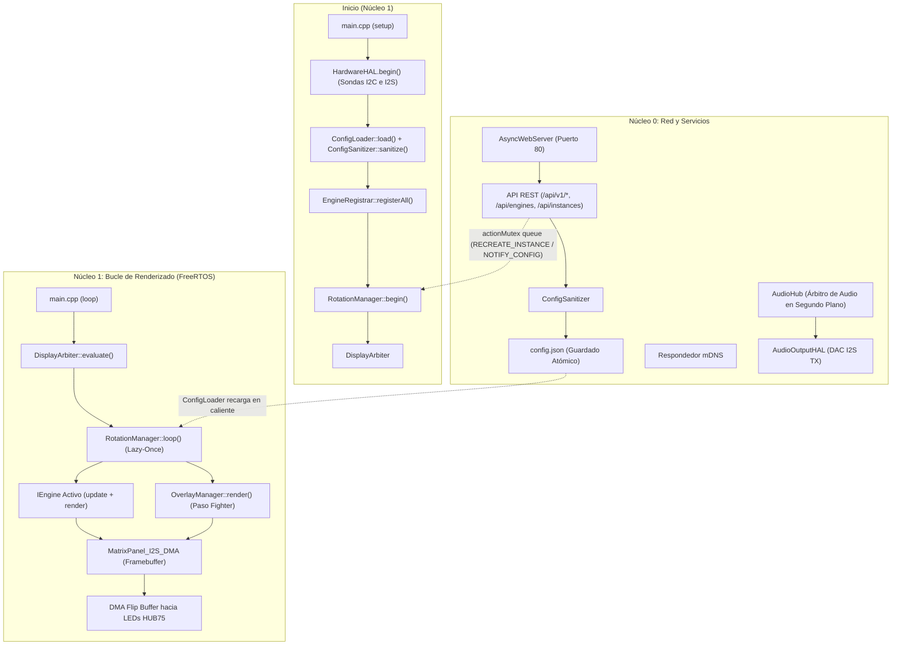
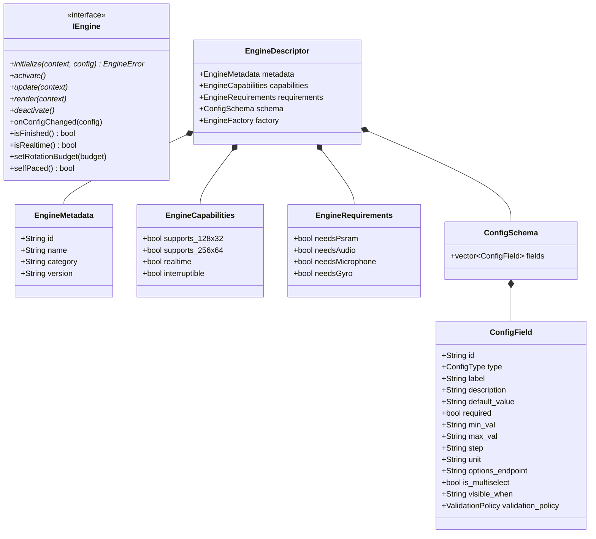

🇬🇧 [English](ARCHITECTURE.md) | 🇫🇷 [Français](ARCHITECTURE_FR.md) | 🇪🇸 Español

# Visión General de la Arquitectura (ESP32 — C++ / FreeRTOS)

Este documento es la referencia **exhaustiva y profunda** de la arquitectura de ArcadeMatrix en ESP32 & ESP32-S3 (desarrollado en **C++** con **FreeRTOS**). Detalla la filosofía de diseño, el contrato `IEngine`, el registro de autodescubrimiento `EngineRegistry` & `EngineRegistrar`, el ciclo de vida "Lazy-Once", el pipeline de configuración autorreparador (`ConfigSanitizer`), la interfaz WebUI dinámica basada en esquemas, el `DisplayArbiter`, el compositor de superposiciones transversales (`OverlayManager` para MUGEN Fighter), el modelo de subprocesos de doble núcleo, y los subsistemas autónomos de Audio y Giroscopio.

> Si desea **añadir** un motor o un campo de configuración, consulte [DEVELOPER.md](DEVELOPER_ES.md). Este documento explica el **por qué** y el **cómo** del sistema.

---

## Tabla de Contenidos

1. [Filosofía: Restricciones Embebidas y Cero Churn de Memoria](#1-filosof%C3%ADa-restricciones-embebidas-y-cero-churn-de-memoria)
2. [Mapa de Componentes de Alto Nivel](#2-mapa-de-componentes-de-alto-nivel)
3. [El Contrato del Motor (Modelo `IEngine`)](#3-el-contrato-del-motor-modelo-iengine)
4. [Autodescubrimiento: Registry, Registrar, Handlers y Gating](#4-autodescubrimiento-registry-registrar-handlers-y-gating)
5. [Ciclo de Vida de Instancia "Lazy-Once"](#5-ciclo-de-vida-de-instancia-lazy-once)
6. [Modelo de Configuración: `config.json` → Instancias](#6-modelo-de-configuraci%C3%B3n-configjson--instancias)
7. [Autorreparación: El `ConfigSanitizer`](#7-autorreparaci%C3%B3n-el-configsanitizer)
8. [Propagación y Recarga en Caliente sin Reinicio](#8-propagaci%C3%B3n-y-recarga-en-caliente-sin-reinicio)
9. [WebUI Dinámica y Endpoints de Opciones](#9-webui-din%C3%A1mica-y-endpoints-de-opciones)
10. [Arquitectura de Internacionalización (i18n) y Fuente Única](#10-arquitectura-de-internacionalizaci%C3%B3n-i18n-y-fuente-%C3%BAnica)
11. [Capa de Abstracción de Hardware (`HardwareHAL`) y Gating](#11-capa-de-abstracci%C3%B3n-de-hardware-hardwarehal-y-gating)
12. [El Árbitro de Pantalla (`DisplayArbiter`)](#12-el-%C3%A1rbitro-de-pantalla-displayarbiter)
13. [El Compositor de Superposiciones Transversales (`OverlayManager`)](#13-el-compositor-de-superposiciones-transversales-overlaymanager)
14. [Ejecución en Doble Núcleo y Aislamiento FreeRTOS](#14-ejecuci%C3%B3n-en-doble-n%C3%BAcleo-y-aislamiento-freertos)
15. [Regulación de Cuadros y Doble Búfer DMA](#15-regulaci%C3%B3n-de-cuadros-y-doble-b%C3%BAfer-dma)
16. [Subsistema de Audio Autónomo (`AudioHub` y `AudioOutputHAL`)](#16-subsistema-de-audio-aut%C3%B3nomo-audiohub-y-audiooutputhal)
17. [Orientación Giroscópica (`GyroHAL` y `DisplayOrientationManager`)](#17-orientaci%C3%B3n-girosc%C3%B3pica-gyrohal-y-displayorientationmanager)
18. [Superficie API REST HTTP](#18-superficie-api-rest-http)
19. [Metadatos de Compilación y Telemetría](#19-metadatos-de-compilaci%C3%B3n-y-telemetr%C3%ADa)

---

## 1. Filosofía: Restricciones Embebidas y Cero Churn de Memoria

El ESP32 estándar dispone de unos 320 KB de SRAM interna (y hasta 8 MB de PSRAM en ESP32-S3). El controlador de matriz LED HUB75 consume una cantidad importante de memoria DMA y requiere tiempos muy precisos para evitar parpadeos.

- **Asignar una vez, mutar en el sitio:** Búferes y matrices de animación se asignan en `initialize()` y se reutilizan en cada cuadro.
- **Ciclo de vida "Lazy-Once":** Un motor solo se instancia cuando su configuración se muestra por primera vez y se mantiene en memoria durante la ejecución.
- **Aislamiento de núcleos:** El Núcleo 1 está dedicado al renderizado gráfico en tiempo real, mientras que el Núcleo 0 maneja la red, `AsyncWebServer`, mDNS, decodificadores de audio y sensores.
- **Las funciones transversales son Overlays, NO Engines:** MUGEN Fighter reside en `OverlayManager`, manteniendo la pureza de `EngineRegistry`.

---

## 2. Mapa de Componentes de Alto Nivel



---

## 3. El Contrato del Motor (Modelo `IEngine`)

Cada motor implementa la interfaz `IEngine` (`include/core/EngineContract.h`):



---

## 4. Autodescubrimiento: Registry, Registrar, Handlers y Gating

1. Cada motor encapsula sus metadatos, su esquema `ConfigSchema`, sus requisitos de hardware `EngineRequirements` y su fábrica en un `IEngineDescriptorHandler`.
2. Al iniciar, `EngineRegistrar::registerAll()` compara los requisitos con `hardwareHAL.capabilities()`.
3. Solo los motores soportados se registran como activos en `EngineRegistry`. Los no compatibles se marcan con `available: false` y un motivo descriptivo para la WebUI.

---

## 5. Ciclo de Vida de Instancia "Lazy-Once"

- **Instanciación Perezosa:** Creado únicamente en la primera visualización.
- **Caché Permanente:** La instancia permanece en memoria en `activeEngines[instance_id]`.
- **Transiciones Limpias:** Llamadas a `deactivate()` y luego `activate()` en cada cambio de rotación.

---

## 6. Modelo de Configuración: `config.json` → Instancias

```json
{
  "system": { "brightness": 128, "lang": "fr" },
  "display": { "auto_rotate": true, "manual_rotation": 0 },
  "audio": { "master_volume": 80, "enable_bluetooth": true, "enable_webradio": true },
  "rotation": [
    { "instance_id": "clock_main", "duration": 15, "overlays": { "fighter": true } },
    { "instance_id": "weather_paris", "duration": 10 },
    { "instance_id": "music_main", "duration": 20, "overlays": { "fighter": true } }
  ],
  "instances": [
    { "id": "clock_main", "engine_id": "clock", "config": { "theme": "street_fighter" } },
    { "id": "weather_paris", "engine_id": "weather", "config": { "city": "Paris" } },
    { "id": "music_main", "engine_id": "music_player", "config": { "show_progress": true } }
  ]
}
```

---

## 7. Autorreparación: El `ConfigSanitizer`

Valida la configuración en cada guardado o inicio:
- Relleno de valores por defecto ausentes.
- Acotado automático (`clamp`) de valores numéricos.
- Eliminación de entradas de rotación huérfanas.

---

## 8. Propagación y Recarga en Caliente sin Reinicio

Las modificaciones de configuración se aplican de forma dinámica:
- `NOTIFY_CONFIG_CHANGED`: La instancia recibe `onConfigChanged()` para releer sus valores in situ.
- `RECREATE_INSTANCE`: La instancia se recrea limpiamente si cambian búferes críticos.

---

## 9. WebUI Dinámica y Endpoints de Opciones

La WebUI no contiene ningún formulario codificado de forma rígida. Consulta `GET /api/engines` para generar automáticamente los campos y usa `options_endpoint` para rellenar desplegables dinámicos.

---

## 10. Arquitectura de Internacionalización (i18n) y Fuente Única

Soporte nativo de inglés, francés y español:
- Diccionarios centralizados en `src/core/I18n.cpp`.
- Esquemas canónicos en inglés con traducción automática en la WebUI según `config.system.lang`.

---

## 11. Capa de Abstracción de Hardware (`HardwareHAL`) y Gating

- **Cableado 100% Congelado:** Los pines definidos en `HardwareProfile.h` son **estrictamente inmutables**.
- **Instantánea de Capacidades (`AudioCapabilities`):**
  ```cpp
  struct AudioCapabilities {
      bool input = false;          // Micrófono I2S
      bool output = false;         // DAC I2S
      bool fullDuplex = false;      // Soporte simultáneo RX + TX
      uint32_t maxSampleRate = 44100;
      uint8_t maxChannels = 2;
      bool bluetoothClassic = false;
      bool psram = false;
  };
  ```

---

## 12. El Árbitro de Pantalla (`DisplayArbiter`)

Resolución estricta de prioridades:
1. **Alertas de Emergencia / OTA** (Prioridad 100).
2. **Interrupciones en Tiempo Real (Mensajes MQTT / Alertas en Vivo)** (Prioridad 75).
3. **Carrusel de Rotación Activo (Reloj, Clima, Música)** (Prioridad 50).
4. **Pantalla de Reserva (Reloj Digital)** (Prioridad 10).

El audio en segundo plano continúa sonando incluso si un mensaje prioritario toma la pantalla.

---

## 13. El Compositor de Superposiciones Transversales (`OverlayManager`)

- Renderizado superpuesto tras el paso gráfico del motor activo.
- Decodificación de sprites animados `.fgt.gz` para luchadores MUGEN.
- **Fighter es un overlay transversal, NO un engine en `EngineRegistry`.**

---

## 14. Ejecución en Doble Núcleo y Aislamiento FreeRTOS

- **Núcleo 0:** Tareas asíncronas (Web, Audio, Sensores, Análisis FFT).
- **Núcleo 1:** Renderizado LED a 60 FPS, DMA, Overlay, Lógica visual.

---

## 15. Regulación de Cuadros y Doble Búfer DMA

Mantenimiento de 60 FPS estables para animaciones en tiempo real con doble búfer DMA de hardware.

---

## 16. Subsistema de Audio Autónomo (`AudioHub` y `AudioOutputHAL`)

```text
Servicios de Audio (BT, Spotify, AirPlay, WebRadio)
    ↓ (PCM + Metadatos)
AudioHub (Estado, Generación y Arbitraje)
    ├──► AudioOutputHAL (Hardware DAC I2S TX)
    ├──► AudioAnalysisService (Espectro FFT / RMS)
    └──► ArtworkService (Caché de Imágenes en PSRAM)
            ↓
      AudioPlaybackState
            ↓
       MusicEngine (Solo Presentación Visual)
```

- **`AudioHub`** arbitra fuentes y actualiza un `AudioPlaybackState` con identificador `generation`.
- **`AudioOutputHAL`** es la única abstracción autorizada para comunicarse con el DAC físico.
- **`MusicEngine`** muestra el estado sin interactuar directamente con el hardware de audio ni sockets de red.

---

## 17. Orientación Giroscópica (`GyroHAL` y `DisplayOrientationManager`)

- **`GyroHAL`** lee aceleración I2C (`MPU6050`, `QMI8658`) y calcula la orientación abstracta (`ROT_0`, `ROT_90`, `ROT_180`, `ROT_270`) con filtro antirrebote de 500 ms.
- **`DisplayOrientationManager`** aplica la rotación al framebuffer (`display->setRotation()`).
- Los motores se adaptan automáticamente a su área de visualización.

---

## 18. Superficie API REST HTTP

| Método | Ruta | Descripción |
| :-- | :-- | :-- |
| `GET` | `/api/v1/system/status` | Heap, PSRAM, tiempo de actividad, Wi-Fi, capacidades. |
| `GET` | `/api/engines` | Lista de descriptores de motores y esquemas. |
| `GET` | `/api/instances` | Lista de instancias configuradas. |
| `POST`| `/api/instances` | Creación o edición de una instancia. |
| `GET` | `/api/rotation` | Lista de reproducción de rotación. |
| `POST`| `/api/rotation` | Actualización de la secuencia de rotación. |
| `GET` | `/api/audio/status` | Estado de reproducción de audio, fuente, volumen. |
| `POST`| `/api/audio/volume` | Ajuste del volumen de audio principal (0-100%). |
| `GET` | `/api/gyro/status` | Vector de gravedad y orientación sugerida. |
| `POST`| `/api/display/orientation` | Fijación manual de rotación o autorrotación. |

---

## 19. Metadatos de Compilación y Telemetría

El endpoint `/api/v1/system/version` expone la huella exacta de compilación (`git_commit`, `build_timestamp`, `firmware_version`).
