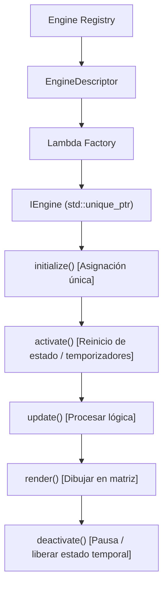

[English](ARCHITECTURE.md) | 🇫🇷 [Français](ARCHITECTURE_FR.md) | 🇪🇸 Español

# Resumen de la Arquitectura (ESP32 — C++)

Este documento proporciona una descripción técnica detallada de la arquitectura de ArcadeMatrix en ESP32 en **C++**. Explica el aislamiento de hardware, el control de capacidades (gating), el ciclo de vida "Lazy-Once" de los motores, el Árbitro de pantalla, las capas superpuestas (overlays) y el flujo de configuración dinámica.

---

## 1. Arquitectura Global

ArcadeMatrix mantiene una estricta separación de responsabilidades desde la interfaz web hasta el panel LED físico:

```text
                    ┌──────────────────────────┐
                    │         WebUI            │
                    │ controlada por esquema   │
                    └────────────┬─────────────┘
                                 │
                                 ▼
                    ┌──────────────────────────┐
                    │       REST API            │
                    │ engines / instances /     │
                    │ hardware / options        │
                    └────────────┬─────────────┘
                                 │
                                 ▼
                    ┌──────────────────────────┐
                    │  Capa de Configuración   │
                    │ ConfigLoader              │
                    │ ConfigSanitizer           │
                    │ DictionaryEngineConfig    │
                    └────────────┬─────────────┘
                                 │
                                 ▼
              ┌──────────────────────────────────────┐
              │           Engine Registry            │
              │                                      │
              │ EngineDescriptor                     │
              │ metadata / capabilities /            │
              │ requirements / schema / factory      │
              └──────────────────┬───────────────────┘
                                 │
                         gating de requisitos
                                 │
                                 ▼
              ┌──────────────────────────────────────┐
              │         EngineRegistrar              │
              │                                      │
              │ HardwareCapabilities                 │
              │ → meetsRequirements()                │
              └──────────────────┬───────────────────┘
                                 │
                                 ▼
              ┌──────────────────────────────────────┐
              │            HardwareHAL               │
              │                                      │
              │ PSRAM / Micrófono / Temp / Giro      │
              └──────────────────┬───────────────────┘
                                 │
                         detección en runtime
                                 │
                                 ▼
              ┌──────────────────────────────────────┐
              │        HardwareProfile.h             │
              │                                      │
              │ ESP32_STD / WAVESHARE_S3             │
              │ PIN MAP — CONGELADO Y VALIDADO       │
              └──────────────────────────────────────┘
```

---

## 2. Filosofía y Restricciones de Hardware

A diferencia de las plataformas Linux, el ESP32 es un microcontrolador que se ejecuta en bare metal / FreeRTOS bajo restricciones estrictas:
- **SRAM interna vs PSRAM**: Las placas ESP32 clásicas tienen ~320 KB de SRAM interna compartida entre Wi-Fi, AsyncTCP y descriptores DMA. La placa Waveshare ESP32-S3 añade 16 MB de PSRAM Octal.
- **Acceso Directo DMA HUB75**: Los búferes de fotogramas se envían directamente a la memoria DMA I2S sin capas intermedias.
- **Separación Compile-Time vs Runtime**:
  - `HardwareProfile.h` fija la identidad de la placa y los pines físicos (estrictamente congelados y probados).
  - `HardwareHAL` detecta la presencia real de periféricos en tiempo de ejecución (PSRAM, micrófono, sensor de temperatura, giroscopio).
  - `EngineRegistrar` aplica el filtrado de requisitos (`meetsRequirements`).

---

## 3. Ciclo de Vida "Lazy-Once" de los Motores

Para evitar la fragmentación de memoria y bloqueos por falta de memoria (OOM), los motores se instancian bajo demanda mediante la fábrica del `EngineRegistry`:



### Métodos del Contrato (`IEngine`):

| Método | Función | Momento de ejecución | Regla de memoria |
|---|---|---|---|
| `initialize()` | Configuración inicial y asignación de búferes | Solo en la primera activación | Único lugar permitido para asignaciones pesadas |
| `activate()` | Preparar el estado del motor | En cada cambio hacia este motor | Sin asignaciones |
| `update()` | Cálculo lógico y avance de animaciones | En cada fotograma | Cero asignaciones |
| `render()` | Dibujar píxeles en `MatrixPanel_I2S_DMA` | En cada fotograma | Escritura directa DMA |
| `deactivate()` | Liberar conexiones / recursos activos | Al cambiar a otro motor | Cerrar archivos / pausar audio |
| `onConfigChanged()`| Recarga en caliente desde la API | Al modificar ajustes | Actualiza variables en su lugar |
| `isFinished()` | Señal de finalización de secuencia | Consultado en el bucle de rotación | Devuelve true al terminar animación |
| `isRealtime()` | Indicación de cadencia dinámica | Limitador de FPS adaptable | True para relojes animados / visualizadores |
| `selfPaced()` | Modelo de avance autónomo | Gestor de rotación | True para reproductor GIF (cuenta N gifs) |
| `setRotationBudget()`| Establece presupuesto (ej: N gifs) | Al cambiar de módulo | Usado por motores self-paced |
| `allowsOverlay()` | Compatibilidad con capas superpuestas | Árbitro de pantalla / bucle | True si admite superposición aditiva |

---

## 4. Modelo de Capacidades y Filtrado de Hardware

Los motores declaran sus capacidades (`EngineCapabilities`) y requisitos estrictos (`EngineRequirements`):

```cpp
struct EngineRequirements {
    bool needsPsram = false;
    bool needsAudio = false;
    bool needsTempSensor = false;
    bool needsGyroscope = false;
    bool needsNetwork = false;
    bool needsSd = false;
};
```

Al iniciar, `EngineRegistrar::registerAll()` consulta `HardwareHAL::capabilities()`. Si un motor requiere PSRAM o micrófono no disponibles, se omite su registro y se documenta la causa. La interfaz web lo muestra claramente mediante `GET /api/engines` (ej: *No disponible: Requiere PSRAM*).

---

## 5. Canal de Renderizado y Overlays Aditivos

El renderizado se gestiona según las prioridades de `DisplayArbiter`:

```text
             DisplayArbiter
                   │
                   ▼
        ┌────────────────────┐
        │ Fuente Principal   │
        │ MQTT / Marquee /   │
        │ Message / GIF /    │
        │ Visualizer /       │
        │ Rotation           │
        └─────────┬──────────┘
                  │
                  ▼
             render()
                  │
                  ▼
          ┌───────────────┐
          │ Pase Overlay  │  (FighterEngine, etc.
          │               │   si está activo y allowsOverlay == true)
          └───────┬───────┘
                  │
                  ▼
          matrix.flipDMABuffer()
```

- **Composición Aditiva**: Los overlays (como `FighterEngine`) dibujan directamente sobre el búfer existente sin llamar a `matrix.fillScreen(0)`.
- **Supresión Automática**: Si la fuente activa es MQTT, Marquee Batocera o un motor con `allowsOverlay() == false` (ej: `GifEngine`), el overlay se desactiva y descarga automáticamente.

---

## 6. Configuración y Recarga en Caliente

1. **`ConfigLoader`**: Carga y analiza `/config.json` desde la tarjeta SD.
2. **`ConfigSanitizer`**: Valida límites de enteros, flotantes, cadenas booleanas y opciones de enumeración según `ConfigSchema`. Inserta valores por defecto si faltan.
3. **`onConfigChanged()`**: Cualquier cambio enviado por `POST /api/instances` o `POST /api/settings` se guarda en SD y se aplica al motor activo en vivo sin necesidad de reiniciar.
