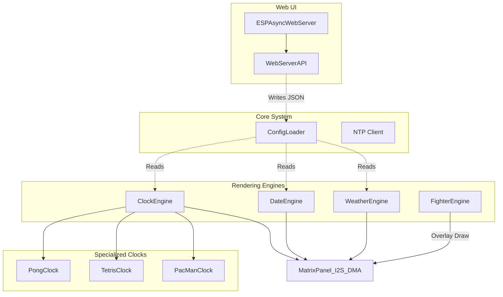

# Vue d’ensemble de l’architecture (ESP32)

🇬🇧 [English](ARCHITECTURE.md) | 🇫🇷 Français | 🇪🇸 [Español](ARCHITECTURE_ES.md)

Ce document fournit une vue d'ensemble complète de l'architecture d'ArcadeMatrix, spécifiquement adaptée au microcontrôleur ESP32.

---

## 1. Philosophie de base : contraintes matérielles

Contrairement à la version Raspberry Pi, qui utilise un pipeline de rendu Python découplé et de haut niveau, la version ESP32 est écrite en **C++** et conçue autour de contraintes matérielles strictes :
- **Limites de RAM (320KB internes) :** nous ne pouvons pas nous permettre d'instancier de lourds canvas dynamiques hors écran ni d'utiliser un pipeline de rendu multicouche. Chaque octet compte.
- **Contraintes CPU (240MHz) :** pour maintenir 60 FPS sur la matrice, le rendu doit être extrêmement rapide.
- **Accès DMA direct :** au lieu de construire une image puis de l'envoyer, le code dessine souvent des primitives directement dans le tampon DMA du matériel à l'aide de la bibliothèque `ESP32 HUB75 LED MATRIX PANEL DMA Display` et d'`Adafruit GFX`.

---

## 2. Structure de moteur monolithique

À cause des contraintes ci-dessus, l'ESP32 utilise une **structure de moteur monolithique**.

### Diagramme

### Composants

1. **Moteurs autonomes (`src/ClockEngine.cpp`, `src/DateEngine.cpp`, etc.) :** chaque moteur est un système fermé. Il gère son propre état et contient sa propre logique pour dessiner directement sur le matériel de la matrice.
2. **Horloges spécialisées :** pour les thèmes complexes (par ex. Pong, PacMan), la logique est encapsulée dans des classes C++ séparées (`PongClock.cpp`), mais elles reçoivent toujours un pointeur vers le matériel de la matrice et dessinent elles-mêmes leurs pixels. Il n'y a pas ici de séparation entre « Renderer » et « Clock ».
3. **Fighter Engine (streaming depuis la carte SD) :** l'ESP32 n'a pas assez de mémoire pour charger une feuille de sprites MUGEN entière. À la place, `FighterEngine` utilise un format de streaming personnalisé (`.fgt`) et lit les frames binaires de sprites directement depuis le tampon de la carte SD, frame par frame, en les dessinant par-dessus le moteur actif.

---

## 3. Threading et serveur Web asynchrone

L'ESP32 utilise un **serveur Web asynchrone** (`ESPAsyncWebServer`).

- **La boucle principale (`loop()` dans `main.cpp`) :** cette boucle doit tourner aussi vite que possible. Elle appelle la fonction `loop()` du moteur actuellement actif pour dessiner la frame suivante.
- **Le serveur Web :** comme il est asynchrone, les requêtes HTTP entrantes (par exemple l'enregistrement des paramètres ou le changement de thème d'horloge) ne bloquent pas la boucle principale de rendu. L'API analyse le JSON entrant avec `ArduinoJson`, met à jour en mémoire la struct `ConfigLoader` et déclenche un rechargement si nécessaire.

### Utilisation du double cœur (multiprocessing)

L'ESP32 (et l'ESP32-S3) sont des microcontrôleurs double cœur, et cette architecture exploite implicitement les deux cœurs via le framework Arduino/ESP-IDF sous-jacent :

- **Core 0 (PRO_CPU) :** gère la pile Wi-Fi, le réseau TCP/IP et `ESPAsyncWebServer`. Ainsi, un trafic réseau important ou des requêtes API ne provoquent pas de saccades sur l'affichage.
- **Core 1 (APP_CPU) :** gère la `loop()` principale de l'application, exécute `ClockEngine`, `FighterEngine` et toute la logique mathématique des animations.
- **Contrôleur DMA (coprocesseur matériel) :** pendant que le Core 1 calcule la frame *suivante*, le contrôleur DMA (Direct Memory Access) de l'ESP32 envoie en continu les données pixels de la frame *courante* vers la matrice LED via I2S. Cela coûte 0 % de CPU.

Comme cette séparation des responsabilités est gérée automatiquement par `ESPAsyncWebServer` et la bibliothèque DMA, nous n'avons pas besoin de créer manuellement des tâches FreeRTOS (`xTaskCreatePinnedToCore`) dans notre code applicatif. Le codebase reste ainsi plus simple tout en profitant de performances multiprocesseur complètes.

---

## 4. Polices et carte SD

- **Dépendance à la carte SD :** comme l'ESP32 dispose de peu de mémoire flash, tous les assets d'exécution (GIF, combattants `.fgt`) doivent être stockés sur une carte SD externe connectée en SPI.
- **Formats d'image/animation (`GifEngine`) :** trois types de fichiers sont pris en charge côte à côte dans les mêmes répertoires de playlist, distingués uniquement par leur extension :
  - **`.gif`** — GIF animés, décodés frame par frame via `AnimatedGIF` (bitbank2), en boucle indéfinie jusqu'à ce que la playlist avance.
  - **`.raw`** — séquence de pixels RGB565 brute spécifique au projet (little-endian, row-major, une frame complète après l'autre, sans en-tête), selon la même convention que `MarqueeEngine` et `tools/mugen_extractor`. Lu à un débit fixe d'environ 20 FPS. Utile pour des clips « stop motion » pré-rendus qui se compressent mal en GIF.
  - **`.png`** — image **statique**, décodée une seule fois via `PNGdec` (bitbank2, même auteur / même forme d'API qu'`AnimatedGIF`) directement sur la matrice, puis maintenue à l'écran pendant environ 5 secondes avant que la playlist avance (ou bouclée sur place en lecture mono-fichier). Ici, PNG n'a aucun concept d'animation : pour un contenu animé, utilisez `.gif`. Toute profondeur de bits / tout type de couleur PNG (palette, niveaux de gris, RGBA, etc.) est accepté : `PNGdec::getLineAsRGB565()` normalise tout en RGB565 pendant le décodage.
  - **Le redimensionnement n'est volontairement PAS effectué sur l'appareil** pour aucun de ces formats ; pré-redimensionnez les images à la résolution cible du panneau (128x32 ou 256x64) hors ligne avant de les copier sur la carte SD. Le redimensionnement à l'exécution coûte trop cher en CPU sur ESP32 comme sur ESP32-S3 et sort du périmètre.
- **Rendu des polices :** la plupart des thèmes / horloges utilisent des polices bitmap `Adafruit GFX` compilées directement dans le firmware (`src/engines/fonts/`, actuellement 7 polices couvrant 3 styles d'éditeurs arcade) ; cela reste la voie par défaut et recommandée car elle ne coûte aucun accès SD à l'exécution. En complément, `BitmapFontLoader` (`src/core/BitmapFontLoader.h`/`.cpp`) peut charger au démarrage une **police bitmap personnalisée** depuis la carte SD dans une structure compatible `GFXfont` allouée sur le tas, actuellement branchée sur `MessageEngine` (la bannière défilante `/api/message`) via `custom_font_path` de la section `[fonts]` de `conf.ini`. Les polices source doivent d'abord être converties depuis le format BDF (le même format de police bitmap déjà livré par la version Raspberry Pi dans `fonts/*.bdf`) vers le format binaire compact `.amf` d'ArcadeMatrix à l'aide de `tools/bdf_to_amfont/bdf_to_amfont.py` — voir `docs/DEVELOPER_FR.md` pour le workflow complet. Il n'existe toujours pas de rendu embarqué de polices `.ttf` / vectorielles ni de parseur BDF sur l'appareil (hors périmètre pour un microcontrôleur sans bibliothèque de rasterisation de polices) ; `.amf` n'est qu'une table de glyphes bitmap préconvertie.

---

## 5. Fiabilité : watchdog et mises à jour OTA

- **Watchdog matériel :** `main.cpp` initialise le watchdog de tâche ESP-IDF (`esp_task_wdt_init`, timeout de 30 s) comme toute première étape de `setup()`, avant de toucher à la carte SD ou à la matrice. Si `setup()` ou `loop()` se bloque plus longtemps que cela (échec de montage de la SD, échec d'initialisation DMA de la matrice, boucle infinie inattendue, blocage du pilote WiFi, ...), l'ESP32 redémarre tout seul au lieu de rester briqué jusqu'à ce que quelqu'un le trouve et coupe l'alimentation. Les deux boucles critiques existantes `while (1) { delay(100); }` (échec de montage SD / échec d'initialisation de la matrice) ne sont intentionnellement **pas** alimentées, afin de déclencher un redémarrage par watchdog (boucle de retry) plutôt qu'un blocage silencieux définitif.
- **Mises à jour OTA (`/api/ota` via `Update.h`) :** écrit la nouvelle image du firmware dans le *slot* de partition OTA inactif puis redémarre immédiatement dessus une fois l'upload terminé sans erreur.
  **Limitation importante :** ce projet utilise le build Arduino-ESP32 standard (pas de `sdkconfig` personnalisé), qui **n'active pas** `CONFIG_BOOTLOADER_APP_ROLLBACK_ENABLE`. Cela signifie qu'il n'existe actuellement **aucun rollback automatique** si une mauvaise image OTA démarre sur une boucle de crash — contrairement à la fonctionnalité native de rollback applicatif d'ESP-IDF (qui exige d'appeler explicitement `esp_ota_mark_app_valid_cancel_rollback()` après un boot réussi, ainsi qu'un bootloader compilé avec le support du rollback). La récupération après une mauvaise mise à jour OTA nécessite aujourd'hui soit un reflash série/USB, soit le flash d'une image saine à nouveau en OTA si l'appareil reste joignable en Wi-Fi. Activer un vrai rollback nécessiterait de quitter le build Arduino-ESP32 par défaut pour aller vers un `sdkconfig.defaults` personnalisé (framework `espidf` de PlatformIO, ou overrides sdkconfig via `board_build.embed_txtfiles`) — c'est identifié comme une tâche future de durcissement, non implémentée dans cette passe pour éviter un changement de niveau bootloader non vérifié.

---

## 6. Abstraction Matérielle (Injection Statique)

Pour supporter de multiples cartes (ESP32 classique, ESP32-S3 Waveshare, etc.) sans pénaliser les performances, le projet utilise un modèle d'**Injection Statique (Static Polymorphism)** plutôt que de l'injection de dépendances dynamique (interfaces avec méthodes `virtual`).

### Pourquoi pas de classes virtuelles (Orienté Objet) ?
En C++ embarqué, l'utilisation du mot-clé `virtual` force la création d'une "vtable" (une table de résolution dynamique des méthodes). Puisque l'ESP32 met à jour une matrice LED jusqu'à 60 fois par seconde, les sauts mémoire constants dus à la vtable gaspillent des cycles processeurs critiques et fragmentent le cache mémoire.

### La solution : Macros et Headers d'Abstraction
Toute la logique matérielle est résolue **au moment de la compilation** :
1. **`include/HardwareProfile.h`** : Agit comme un routeur statique. Il lit les flags de compilation envoyés par PlatformIO (par exemple `-D HARDWARE_PROFILE_WAVESHARE_S3`) et définit les macros de PIN (`MATRIX_R1_PIN`, `USE_SD_MMC`, etc.) correspondant exactement à la carte cible.
2. **`src/core/SDUtils.h`** : Agit comme une **Interface/Facade**. Il masque l'implémentation sous-jacente (`SD_MMC` pour l'ESP32-S3 ou `SdFat` pour l'ESP32 classique). La logique métier (`WebServerAPI.cpp`, `GifEngine.cpp`) appelle des méthodes génériques comme `openNextFileHelper(dir)` sans jamais utiliser de `#ifdef` en interne.

Ce modèle garantit que le code métier est totalement agnostique du matériel, tout en offrant un coût de performance (overhead) rigoureusement égal à zéro à l'exécution.
