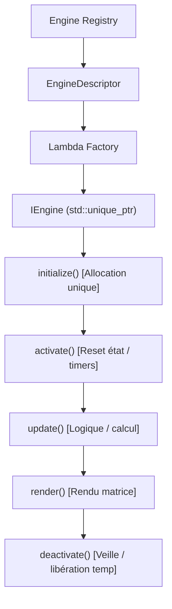

[English](ARCHITECTURE.md) | 🇫🇷 Français | 🇪🇸 [Español](ARCHITECTURE_ES.md)

# Vue d'ensemble de l'Architecture (ESP32 — C++)

Ce document présente l'architecture technique détaillée d'ArcadeMatrix sur ESP32 en **C++**. Il explique l'isolation matérielle, le gating des capacités, le cycle de vie « Lazy-Once » des moteurs, l'Arbiter d'affichage, les overlays additifs et le pipeline de configuration dynamique.

---

## 1. Architecture globale

ArcadeMatrix respecte une séparation stricte des responsabilités de l'interface Web jusqu'à la matrice LED physique :

```text
                    ┌──────────────────────────┐
                    │         WebUI            │
                    │ pilotée par schéma / dyn │
                    └────────────┬─────────────┘
                                 │
                                 ▼
                    ┌──────────────────────────┐
                    │       REST API            │
                    │ engines / instances /     │
                    │ hardware / options        │
                    └────────────┬─────────────┘
                                 │
                                 ▼
                    ┌──────────────────────────┐
                    │   Couche Configuration   │
                    │ ConfigLoader              │
                    │ ConfigSanitizer           │
                    │ DictionaryEngineConfig    │
                    └────────────┬─────────────┘
                                 │
                                 ▼
              ┌──────────────────────────────────────┐
              │           Engine Registry            │
              │                                      │
              │ EngineDescriptor                     │
              │ metadata / capabilities /            │
              │ requirements / schema / factory      │
              └──────────────────┬───────────────────┘
                                 │
                         gating requirements
                                 │
                                 ▼
              ┌──────────────────────────────────────┐
              │         EngineRegistrar              │
              │                                      │
              │ HardwareCapabilities                 │
              │ → meetsRequirements()                │
              └──────────────────┬───────────────────┘
                                 │
                                 ▼
              ┌──────────────────────────────────────┐
              │            HardwareHAL               │
              │                                      │
              │ PSRAM / Microphone / Temp / Gyro     │
              └──────────────────┬───────────────────┘
                                 │
                         détection runtime
                                 │
                                 ▼
              ┌──────────────────────────────────────┐
              │        HardwareProfile.h             │
              │                                      │
              │ ESP32_STD / WAVESHARE_S3             │
              │ PIN MAP — GELÉ & VALIDÉ              │
              └──────────────────────────────────────┘
```

---

## 2. Philosophie & Contraintes Matérielles

Contrairement aux systèmes Linux, l'ESP32 est un microcontrôleur bare metal / FreeRTOS soumis à des contraintes sévères :
- **SRAM interne vs PSRAM** : Les cartes ESP32 standard disposent de ~320 Ko de SRAM interne partagée avec le Wi-Fi, la pile AsyncTCP et les descripteurs DMA. La carte Waveshare ESP32-S3 ajoute 16 Mo de PSRAM Octal.
- **Accès Direct DMA HUB75** : Les pixels sont envoyés directement dans les tampons DMA I2S sans surcouche OS.
- **Séparation Compile-Time vs Runtime** :
  - `HardwareProfile.h` fige l'identité de la carte et les broches physiques (strictement gelées et validées).
  - `HardwareHAL` détecte la présence réelle des périphériques au runtime (PSRAM, micro, capteur de température, stub gyroscope).
  - `EngineRegistrar` applique le gating des prérequis (`meetsRequirements`).

---

## 3. Cycle de vie « Lazy-Once » des Moteurs

Pour éliminer la fragmentation de la heap et les crashs mémoire (OOM), les moteurs sont instanciés à la demande via la fabrique du `EngineRegistry` :



### Méthodes du Contrat (`IEngine`) :

| Méthode | Rôle | Moment d'exécution | Règle mémoire |
|---|---|---|---|
| `initialize()` | Initialisation et allocation des tampons | Première activation uniquement | Seul endroit autorisé pour les grosses allocations |
| `activate()` | Préparation de l'état du moteur | À chaque switch vers ce moteur | Aucune allocation |
| `update()` | Calcul logique et avancement d'animation | Chaque frame d'affichage | Zéro allocation |
| `render()` | Écriture des pixels sur `MatrixPanel_I2S_DMA` | Chaque frame d'affichage | Écriture directe DMA |
| `deactivate()` | Libération des handles actifs / réseau | Au changement de moteur | Fermeture de fichiers / pause audio |
| `onConfigChanged()`| Hot reload live depuis l'API | Lors d'une modification de paramètres | Met à jour les variables en place |
| `isFinished()` | Signal de fin de séquence | Interrogé dans la boucle de rotation | Renvoie true lorsque l'animation est finie |
| `isRealtime()` | Indication de cadence dynamique | Frame limiter adaptatif | True pour les horloges animées / visualizers |
| `selfPaced()` | Modèle d'avancement autonome | Rotation manager | True pour le lecteur GIF (compte N gifs, pas des secondes) |
| `setRotationBudget()`| Définit le budget (ex: N gifs) | Au changement de module | Utilisé par les moteurs self-paced |
| `allowsOverlay()` | Compatibilité avec les overlays | Display Arbiter / boucle | True si un overlay additif peut se superposer |

---

## 4. Modèle de Capacités & Gating Matériel

Les moteurs déclarent leurs fonctionnalités (`EngineCapabilities`) et leurs besoins stricts (`EngineRequirements`) :

```cpp
struct EngineRequirements {
    bool needsPsram = false;
    bool needsAudio = false;
    bool needsTempSensor = false;
    bool needsGyroscope = false;
    bool needsNetwork = false;
    bool needsSd = false;
};
```

Au boot, `EngineRegistrar::registerAll()` interroge `HardwareHAL::capabilities()`. Si un moteur requiert de la PSRAM ou un micro absent sur la carte, son enregistrement est ignoré et une raison est consignée. L'UI Web l'affiche clairement via `GET /api/engines` (ex: *Indisponible : Nécessite PSRAM*).

---

## 5. Pipeline de Rendu & Overlays Additifs

L'affichage est ordonnancé selon les priorités du `DisplayArbiter` :

```text
             DisplayArbiter
                   │
                   ▼
        ┌────────────────────┐
        │ Source Principale  │
        │ MQTT / Marquee /   │
        │ Message / GIF /    │
        │ Visualizer /       │
        │ Rotation           │
        └─────────┬──────────┘
                  │
                  ▼
             render()
                  │
                  ▼
          ┌───────────────┐
          │ Passe Overlay │  (FighterEngine, etc.
          │               │   si actif & allowsOverlay == true)
          └───────┬───────┘
                  │
                  ▼
          matrix.flipDMABuffer()
```

- **Composition Additive** : Les overlays (comme le `FighterEngine` M.U.G.E.N) dessinent directement sur le tampon existant sans faire de `matrix.fillScreen(0)`.
- **Masquage Automatique** : Si la source active est MQTT, Marquee Batocera, ou un moteur avec `allowsOverlay() == false` (ex: `GifEngine`), l'overlay est désactivé et déchargé.

---

## 6. Couche Configuration & Hot Reload

1. **`ConfigLoader`** : Charge et parse `/config.json` depuis la carte SD.
2. **`ConfigSanitizer`** : Valide les bornes des entiers, les flottants, les booléens et les options enum contre le `ConfigSchema`. Injecte les valeurs par défaut manquantes.
3. **`onConfigChanged()`** : Toute modification via `POST /api/instances` ou `POST /api/settings` est persistée sur SD et transmise au moteur actif sans aucun reboot matériel.
