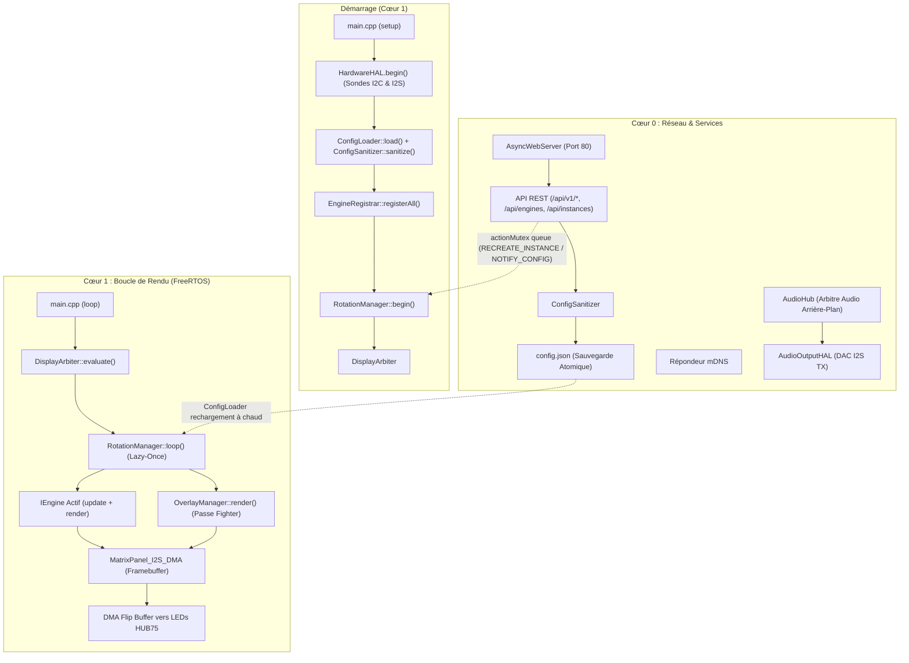
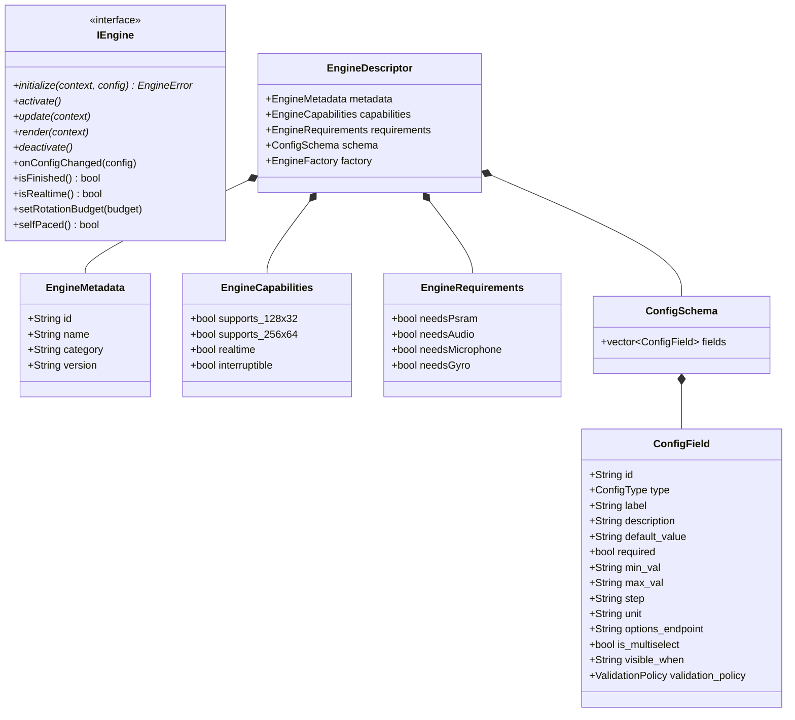

🇬🇧 [English](ARCHITECTURE.md) | 🇫🇷 Français | 🇪🇸 [Español](ARCHITECTURE_ES.md)

# Vue d'Ensemble de l'Architecture (ESP32 — C++ / FreeRTOS)

Ce document est la référence **exhaustive et approfondie** de l'architecture ArcadeMatrix sur ESP32 & ESP32-S3 (développé en **C++** avec **FreeRTOS**). Il détaille la philosophie de conception, le contrat `IEngine`, le registre d'auto-découverte `EngineRegistry` & `EngineRegistrar`, le cycle de vie "Lazy-Once", le pipeline de configuration auto-réparateur (`ConfigSanitizer`), l'interface WebUI dynamique pilotée par schéma, le `DisplayArbiter`, le compositeur d'overlay transverse (`OverlayManager` pour MUGEN Fighter), le modèle de threading double cœur, et les sous-systèmes autonomes Audio et Gyroscope.

> Si vous souhaitez **ajouter** un moteur ou un champ de configuration, lisez [DEVELOPER.md](DEVELOPER_FR.md). Ce document explique le **pourquoi** et le **comment** du système.

---

## Table des Matières

1. [Philosophie : Contraintes Embarquées & Zéro Churn Mémoire](#1-philosophie--contraintes-embarquées--zéro-churn-mémoire)
2. [Cartographie des Composants de Haut Niveau](#2-cartographie-des-composants-de-haut-niveau)
3. [Le Contrat Moteur (Modèle `IEngine`)](#3-le-contrat-moteur-modèle-iengine)
4. [Auto-Découverte : Registry, Registrar, Handlers & Gating](#4-auto-découverte--registry-registrar-handlers--gating)
5. [Cycle de Vie d'Instance "Lazy-Once"](#5-cycle-de-vie-dinstance-lazy-once)
6. [Modèle de Configuration : `config.json` → Instances](#6-modèle-de-configuration--configjson--instances)
7. [Auto-Réparation : Le `ConfigSanitizer`](#7-auto-réparation--le-configsanitizer)
8. [Propagation & Rechargement à Chaud sans Reboot](#8-propagation--rechargement-à-chaud-sans-reboot)
9. [WebUI Dynamique & Endpoints d'Options](#9-webui-dynamique--endpoints-doptions)
10. [Architecture d'Internationalisation (i18n) & Source Unique](#10-architecture-dinternationalisation-i18n--source-unique)
11. [Couche d'Abstraction Matérielle (`HardwareHAL`) & Gating](#11-couche-dabstraction-matérielle-hardwarehal--gating)
12. [L'Arbitre d'Affichage (`DisplayArbiter`)](#12-larbitre-daffichage-displayarbiter)
13. [Le Compositeur d'Overlay Transverse (`OverlayManager`)](#13-le-compositeur-doverlay-transverse-overlaymanager)
14. [Exécution Double-Cœur & Isolation FreeRTOS](#14-exécution-double-cœur--isolation-freertos)
15. [Régulation de Cadence & Double-Buffering DMA](#15-régulation-de-cadence--double-buffering-dma)
16. [Sous-Système Audio Autonome (`AudioHub` & `AudioOutputHAL`)](#16-sous-système-audio-autonome-audiohub--audiooutputhal)
17. [Orientation Gyroscopique (`GyroHAL` & `DisplayOrientationManager`)](#17-orientation-gyroscopique-gyrohal--displayorientationmanager)
18. [Surface API REST HTTP](#18-surface-api-rest-http)
19. [Métadonnées de Build & Télémétrie](#19-métadonnées-de-build--télémétrie)

---

## 1. Philosophie : Contraintes Embarquées & Zéro Churn Mémoire

L'ESP32 standard dispose d'environ 320 Ko de SRAM interne (et jusqu'à 8 Mo de PSRAM sur ESP32-S3). Le driver LED matrix HUB75 consomme une part importante de mémoire DMA et exige une cadence d'horloge très stable pour éviter tout scintillement.

Pour garantir un affichage fluide à 60 FPS sans fragmentation :
- **Allouer une seule fois, muter sur place :** Les buffers et tableaux d'animation sont créés dans `initialize()` et réutilisés à chaque frame.
- **Cycle de Vie "Lazy-Once" :** Un moteur n'est instancié que lorsque son instance configurée est affichée pour la première fois, puis conservé en mémoire pendant toute la durée d'exécution.
- **Isolation des Cœurs :** Le Cœur 1 est dédié au rendu graphique temps réel (`DisplayArbiter`, `IEngine::render()`, `OverlayManager`, DMA), tandis que le Cœur 0 gère le réseau, `AsyncWebServer`, mDNS, les décodeurs audio et les capteurs.
- **Les fonctionnalités transverses sont des Overlays, PAS des Engines :** MUGEN Fighter vit dans `OverlayManager`, préservant la pureté de `EngineRegistry`.

---

## 2. Cartographie des Composants de Haut Niveau



---

## 3. Le Contrat Moteur (Modèle `IEngine`)

Chaque moteur implémente l'interface `IEngine` (`include/core/EngineContract.h`) :



---

## 4. Auto-Découverte : Registry, Registrar, Handlers & Gating

1. Chaque moteur encapsule ses métadonnées, son schéma `ConfigSchema`, ses prérequis matériels `EngineRequirements` et sa factory dans un `IEngineDescriptorHandler`.
2. Au démarrage, `EngineRegistrar::registerAll()` compare les exigences avec `hardwareHAL.capabilities()`.
3. Seuls les moteurs supportés sont activés dans `EngineRegistry`. Les moteurs non compatibles sont enregistrés avec `available: false` et un message explicatif pour la WebUI.

---

## 5. Cycle de Vie d'Instance "Lazy-Once"

- **Instanciation Paresseuse :** Créé uniquement au premier affichage.
- **Cache Permanent :** L'instance reste en mémoire dans `activeEngines[instance_id]`.
- **Transitions Propres :** Appel de `deactivate()` puis `activate()` lors des rotations de carrousel.

---

## 6. Modèle de Configuration : `config.json` → Instances

```json
{
  "system": { "brightness": 128, "lang": "fr" },
  "display": { "auto_rotate": true, "manual_rotation": 0 },
  "audio": { "master_volume": 80, "enable_bluetooth": true, "enable_webradio": true },
  "rotation": [
    { "instance_id": "clock_main", "duration": 15, "overlays": { "fighter": true } },
    { "instance_id": "weather_paris", "duration": 10 },
    { "instance_id": "music_main", "duration": 20, "overlays": { "fighter": true } }
  ],
  "instances": [
    { "id": "clock_main", "engine_id": "clock", "config": { "theme": "street_fighter" } },
    { "id": "weather_paris", "engine_id": "weather", "config": { "city": "Paris" } },
    { "id": "music_main", "engine_id": "music_player", "config": { "show_progress": true } }
  ]
}
```

---

## 7. Auto-Réparation : Le `ConfigSanitizer`

Valide la configuration à chaque sauvegarde ou démarrage :
- Injection des valeurs par défaut manquantes.
- Bornage automatique (`clamp`) des valeurs numériques.
- Suppression des entrées de rotation orphelines.

---

## 8. Propagation & Rechargement à Chaud sans Reboot

Les modifications de configuration appliquées via l'API sont injectées en mémoire sans redémarrage :
- `NOTIFY_CONFIG_CHANGED` : L'instance reçoit `onConfigChanged()` pour relire ses valeurs sur place.
- `RECREATE_INSTANCE` : L'instance est recréée proprement si des buffers majeurs changent.

---

## 9. WebUI Dynamique & Endpoints d'Options

L'interface WebUI ne contient **aucun formulaire codé en dur**. Elle lit `GET /api/engines` pour générer automatiquement les champs de formulaire et interroge des endpoints dynamiques (`options_endpoint`, ex: `/api/clocks/themes`) pour garnir les listes déroulantes.

---

## 10. Architecture d'Internationalisation (i18n) & Source Unique

Prise en charge native de l'anglais, du français et de l'espagnol :
- Dictionnaires centralisés dans `src/core/I18n.cpp`.
- Schémas canoniques en anglais avec clés de traduction automatiques dans la WebUI selon `config.system.lang`.

---

## 11. Couche d'Abstraction Matérielle (`HardwareHAL`) & Gating

- **Câblage 100 % Gelé :** Les broches définies dans `HardwareProfile.h` sont **strictement immuables**.
- **Instantané des Capacités (`AudioCapabilities`) :**
  ```cpp
  struct AudioCapabilities {
      bool input = false;          // Microphone I2S
      bool output = false;         // DAC I2S
      bool fullDuplex = false;      // Support RX + TX simultanés
      uint32_t maxSampleRate = 44100;
      uint8_t maxChannels = 2;
      bool bluetoothClassic = false;
      bool psram = false;
  };
  ```

---

## 12. L'Arbitre d'Affichage (`DisplayArbiter`)

Résolution stricte des priorités d'affichage :
1. **Alertes d'Urgence / OTA** (Priorité 100).
2. **Interruptions Temps Réel (Messages MQTT / Alertes Live)** (Priorité 75).
3. **Carrousel de Rotation Actif (Horloge, Météo, Musique)** (Priorité 50).
4. **Écran de Repli (Horloge Digitale)** (Priorité 10).

L'audio d'arrière-plan continue de jouer même si un message prioritaire prend le contrôle de l'écran.

---

## 13. Le Compositeur d'Overlay Transverse (`OverlayManager`)

- Rendus superposés après la passe graphique du moteur d'arrière-plan.
- Décodage des sprites animés `.fgt.gz` pour les combattants MUGEN.
- Activation par rotation dans `config.rotation[i].overlays.fighter`.
- **Fighter est un overlay transverse, PAS un engine dans `EngineRegistry`.**

---

## 14. Exécution Double-Cœur & Isolation FreeRTOS

- **Cœur 0 :** Tâches asynchrones (Web, Audio, Capteurs, Analyse FFT).
- **Cœur 1 :** Rendu LED 60 FPS, DMA, Overlay, Logique d'affichage.

---

## 15. Régulation de Cadence & Double-Buffering DMA

Maintien d'un framerate stable à 60 FPS pour les animations temps réel avec double-buffering DMA matériel.

---

## 16. Sous-Système Audio Autonome (`AudioHub` & `AudioOutputHAL`)

```text
Services Audio (BT, Spotify, AirPlay, WebRadio)
    ↓ (PCM + Métadonnées)
AudioHub (État, Génération & Arbitrage)
    ├──► AudioOutputHAL (Hardware DAC I2S TX)
    ├──► AudioAnalysisService (Spectre FFT / RMS)
    └──► ArtworkService (Cache Image PSRAM)
            ↓
      AudioPlaybackState
            ↓
       MusicEngine (Présentation Visuelle Uniquement)
```

- **`AudioHub`** arbitre les sources et met à jour un `AudioPlaybackState` avec identifiant `generation`.
- **`AudioOutputHAL`** est l'unique abstraction autorisée à parler au DAC physique.
- **`MusicEngine`** affiche l'état sans jamais toucher au matériel audio ni aux sockets réseau.

---

### Gestion Avancée de la Mémoire (ESP32 vs ESP32-S3 avec PSRAM)

| Carte Matérielle | SRAM Interne | PSRAM Externe | Mémoire DMA | Stratégie SSL / TLS | Résolutions Max |
| :--- | :--- | :--- | :--- | :--- | :--- |
| **ESP32 Classic (`esp32dev`)** | ~320 Ko (partagée FreeRTOS / Wi-Fi) | Aucune | SRAM Interne (compatible DMA) | **Désactivé :** Les buffers TLS (~45-60 Ko) privent le DMA et causent des crashs. Moteurs SSL lourds (Crypto, Bourse) désactivés via `EngineCapabilities`. | `128x32` / `64x32` |
| **ESP32-S3 Waveshare (`esp32s3_waveshare`)** | ~320 Ko (SRAM centrale) | **8 Mo / 16 Mo Octal PSRAM** | Buffers DMA en PSRAM (`MALLOC_CAP_SPIRAM`) | **Support Total :** `WiFiClientSecure` et buffers mbedTLS alloués en PSRAM, laissant la SRAM libre pour le DMA d'affichage continu. | `256x64` / `64x256` |

#### Résolution de l'Épuisement Mémoire SSL / TLS
Sur microcontrôleur, une connexion HTTPS exige d'importants buffers d'échange cryptographique (16 Ko in/out + ASN.1 + état de session ≈ 45 Ko par socket). Sur l'ESP32 classique, la coexistence des buffers DMA HUB75 et de connexions TLS causait une fragmentation sévère de la heap.
- **Classic ESP32 :** Filtrage via `EngineRequirements::needsPsram = true`. `ConfigSanitizer` désactive automatiquement les moteurs lourds sans crash.
- **ESP32-S3 :** Allocation systématique en PSRAM (`heap_caps_malloc(..., MALLOC_CAP_SPIRAM)`) pour les buffers mbedTLS, MP3 et PNG, réservant la SRAM interne aux interruptions temps réel.

#### Concurrence : Audio Simultané & Rendu 60 FPS
- **Core 0 :** Décodage MP3 (`minimp3`), Bluetooth A2DP Sink, Wi-Fi et requêtes réseau.
- **Core 1 :** Rendu matriciel à 60 FPS ininterrompu et affichage d'overlays.
- **Communication sans verrou :** `AudioHub` publie des snapshots atomiques `AudioPlaybackState` avec identifiant `generation` incrémental, lus instantanément par le Core 1 sans blocage ni mutex.

---

## 20. Architecture Multi-Résolutions & Géométrie Déclarative

ArcadeMatrix prend en charge toutes les résolutions et orientations (`64x32`, `128x32`, `256x64`, `128x64`, `64x64`, `32x64`, `32x128`, `64x128`, `64x256`).

### La Règle d'Or du Rendu Responsif
> **Les renderers ne contiennent aucun embranchement `if (layoutClass)`.**
> La classification est effectuée **une seule fois** par une calculatrice pure `*LayoutCalculator` produisant des structures déclaratives de `Rect`s bornés. Le moteur de rendu dessine exclusivement dans ces rectangles.

```text
                 DisplayGeometry (width, height, rotation, layoutClass, version)
                                       │
                                LayoutHelper (Stateless)
                                       │
                    ┌──────────────────┴──────────────────┐
                    ▼                                     ▼
           *LayoutCalculator                     *GeometryAdapter
           (ex: MusicLayout)                     (ex: FighterGeometry)
                    │                                     │
                    ▼                                     ▼
             Layout / Rects                        Geometry (groundY, spawns)
                    │                                     │
                    └──────────────────┬──────────────────┘
                                       ▼
                             Renderer Pur Unique
```

### Séquencement Multi-Core Strict à l'Apex
1. La rotation matérielle `display->setRotation(newRot)` est appliquée **exclusivement sur le Core 1 à l'apex de la transition**.
2. `DisplayGeometry` est actualisée directement depuis les dimensions actives `display->width()` / `display->height()`.
3. `onDisplayGeometryChanged(geometry)` est notifié à l'engine actif et à l'`OverlayManager`.
4. Les moteurs avec caches géométriques (`MatrixRainClock`, `TetrisClock`, `VisualizerEngine`, `FighterEngine`) reconfigurent leurs structures dérivées sans réinitialiser la logique métier ni la partie en cours.

### Bibliothèque Dual-GIF (YOKO & TATE)
- `/gifs/` : Animations optimisées pour le mode paysage (YOKO).
- `/gifs_tate/` : Animations optimisées pour le mode portrait (TATE).
- `GifSourceSelector` résout dynamiquement le dossier primaire et le dossier de repli sans dépendance de layout dans `GifEngine`.

---

## 18. Surface API REST HTTP

| Méthode | Route | Description |
| :-- | :-- | :-- |
| `GET` | `/api/v1/system/status` | Heap, PSRAM, uptime, Wi-Fi, capacités. |
| `GET` | `/api/engines` | Liste des descripteurs de moteurs et schémas. |
| `GET` | `/api/instances` | Liste des instances configurées. |
| `POST`| `/api/instances` | Création ou modification d'une instance. |
| `GET` | `/api/rotation` | Liste de lecture de la rotation. |
| `POST`| `/api/rotation` | Mise à jour de la séquence de rotation. |
| `GET` | `/api/audio/status` | État de lecture audio, source, volume. |
| `POST`| `/api/audio/volume` | Réglage du volume audio principal (0-100%). |
| `GET` | `/api/gyro/status` | Vecteur gravité, rotation active et effets de transition. |
| `POST`| `/api/gyro/calibrate` | Calibration du point zéro de référence ($0^\circ$ Normal). |
| `POST`| `/api/display/orientation` | Forçage de rotation, offset de montage et effet de transition. |
| `POST`| `/api/display/test-transition` | Déclenche un test visuel de l'effet de transition. |

---

## 19. Métadonnées de Build & Télémétrie

L'endpoint `/api/v1/system/version` expose l'empreinte exacte du build (`git_commit`, `build_timestamp`, `firmware_version`).
