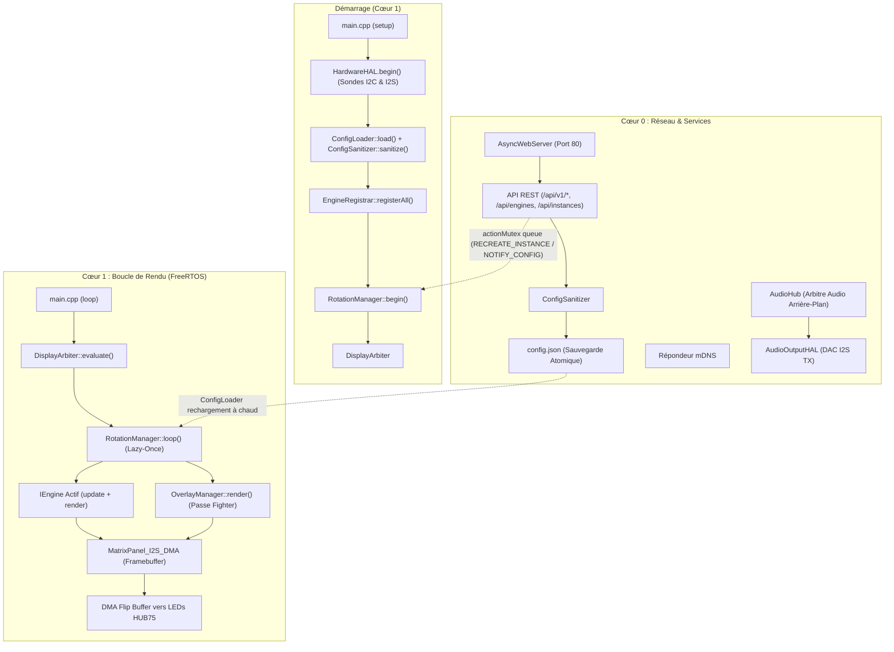
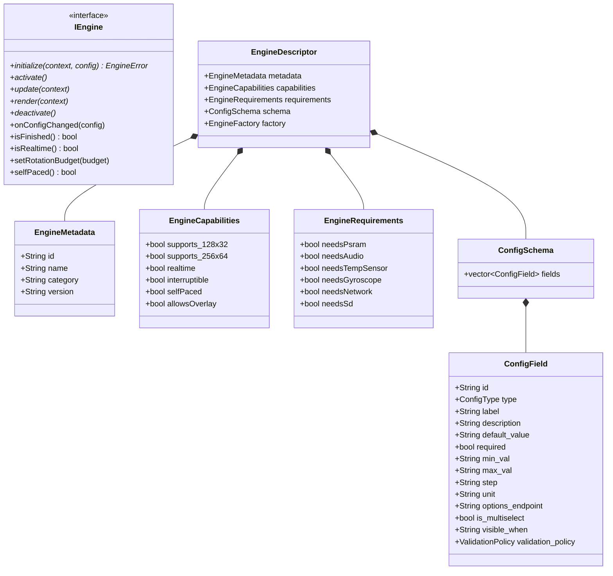

🇬🇧 [English](ARCHITECTURE.md) | 🇫🇷 Français | 🇪🇸 [Español](ARCHITECTURE_ES.md)

# Vue d'Ensemble de l'Architecture (ESP32 — C++ / FreeRTOS)

Ce document est la référence **exhaustive et approfondie** de l'architecture ArcadeMatrix sur ESP32 & ESP32-S3 (développé en **C++** avec **FreeRTOS**). Il détaille la philosophie de conception, le contrat `IEngine`, le registre d'auto-découverte `EngineRegistry` & `EngineRegistrar`, le cycle de vie "Lazy-Once", le pipeline de configuration auto-réparateur (`ConfigSanitizer`), l'interface WebUI dynamique pilotée par schéma, le `DisplayArbiter`, le compositeur d'overlay transverse (`OverlayManager` pour MUGEN Fighter), le modèle de threading double cœur, et les sous-systèmes autonomes Audio et Gyroscope.

> Si vous souhaitez **ajouter** un moteur ou un champ de configuration, lisez [DEVELOPER.md](DEVELOPER_FR.md). Ce document explique le **pourquoi** et le **comment** du système.

---

## Table des Matières

1. [Philosophie : Contraintes Embarquées & Zéro Churn Mémoire](#1-philosophie--contraintes-embarquées--zéro-churn-mémoire)
2. [Cartographie des Composants de Haut Niveau](#2-cartographie-des-composants-de-haut-niveau)
3. [Le Contrat Moteur (Modèle `IEngine`)](#3-le-contrat-moteur-modèle-iengine)
4. [Auto-Découverte : Registry, Registrar, Handlers & Gating](#4-auto-découverte--registry-registrar-handlers--gating)
5. [Cycle de Vie d'Instance "Lazy-Once"](#5-cycle-de-vie-dinstance-lazy-once)
6. [Modèle de Configuration : `config.json` → Instances](#6-modèle-de-configuration--configjson--instances)
7. [Auto-Réparation : Le `ConfigSanitizer`](#7-auto-réparation--le-configsanitizer)
8. [Propagation & Rechargement à Chaud sans Reboot](#8-propagation--rechargement-à-chaud-sans-reboot)
9. [WebUI Dynamique & Endpoints d'Options](#9-webui-dynamique--endpoints-doptions)
10. [Architecture d'Internationalisation (i18n) & Source Unique](#10-architecture-dinternationalisation-i18n--source-unique)
11. [Couche d'Abstraction Matérielle (`HardwareHAL`) & Gating](#11-couche-dabstraction-matérielle-hardwarehal--gating)
12. [L'Arbitre d'Affichage (`DisplayArbiter`)](#12-larbitre-daffichage-displayarbiter)
13. [Le Compositeur d'Overlay Transverse (`OverlayManager`)](#13-le-compositeur-doverlay-transverse-overlaymanager)
14. [Exécution Double-Cœur & Isolation FreeRTOS](#14-exécution-double-cœur--isolation-freertos)
15. [Régulation de Cadence & Double-Buffering DMA](#15-régulation-de-cadence--double-buffering-dma)
16. [Sous-Système Audio Autonome (`AudioHub` & `AudioOutputHAL`)](#16-sous-système-audio-autonome-audiohub--audiooutputhal)
17. [Orientation Gyroscopique (`GyroHAL` & `DisplayOrientationManager`)](#17-orientation-gyroscopique-gyrohal--displayorientationmanager)
18. [Surface API REST HTTP](#18-surface-api-rest-http)
19. [Métadonnées de Build & Télémétrie](#19-métadonnées-de-build--télémétrie)

---

## 1. Philosophie : Contraintes Embarquées & Zéro Churn Mémoire

L'ESP32 standard dispose d'environ 320 Ko de SRAM interne (et jusqu'à 8 Mo de PSRAM sur ESP32-S3). Le driver LED matrix HUB75 consomme une part importante de mémoire DMA et exige une cadence d'horloge très stable pour éviter tout scintillement.

Pour garantir un affichage fluide à 60 FPS sans fragmentation :
- **Allouer une seule fois, muter sur place :** Les buffers et tableaux d'animation sont créés dans `initialize()` et réutilisés à chaque frame.
- **Cycle de Vie "Lazy-Once" :** Un moteur n'est instancié que lorsque son instance configurée est affichée pour la première fois, puis conservé en mémoire pendant toute la durée d'exécution.
- **Isolation des Cœurs :** Le Cœur 1 est dédié au rendu graphique temps réel (`DisplayArbiter`, `IEngine::render()`, `OverlayManager`, DMA), tandis que le Cœur 0 gère le réseau, `AsyncWebServer`, mDNS, les décodeurs audio et les capteurs.
- **Les fonctionnalités transverses sont des Overlays, PAS des Engines :** MUGEN Fighter vit dans `OverlayManager`, préservant la pureté de `EngineRegistry`.

---

## 2. Cartographie des Composants de Haut Niveau



---

## 3. Le Contrat Moteur (Modèle `IEngine`)

Chaque moteur implémente l'interface `IEngine` (`include/core/EngineContract.h`) :



---

## 4. Auto-Découverte : Registry, Registrar, Handlers & Gating

1. Chaque moteur encapsule ses métadonnées, son schéma `ConfigSchema`, ses prérequis matériels `EngineRequirements` et sa factory dans un `IEngineDescriptorHandler`.
2. Au démarrage, `EngineRegistrar::registerAll()` compare les exigences avec `hardwareHAL.capabilities()`.
3. Seuls les moteurs supportés sont activés dans `EngineRegistry`. Les moteurs non compatibles sont enregistrés avec `available: false` et un message explicatif pour la WebUI.

---

## 5. Cycle de Vie d'Instance "Lazy-Once"

- **Instanciation Paresseuse :** Créé uniquement au premier affichage.
- **Cache Permanent :** L'instance reste en mémoire dans `activeEngines[instance_id]`.
- **Transitions Propres :** Appel de `deactivate()` puis `activate()` lors des rotations de carrousel.

---

## 6. Modèle de Configuration : `config.json` → Instances

```json
{
  "system": { "brightness": 128, "lang": "fr" },
  "display": { "auto_rotate": true, "manual_rotation": 0 },
  "audio": { "master_volume": 80, "enable_bluetooth": true, "enable_webradio": true },
  "rotation": [
    { "instance_id": "clock_main", "duration": 15, "overlays": { "fighter": true } },
    { "instance_id": "weather_paris", "duration": 10 },
    { "instance_id": "music_main", "duration": 20, "overlays": { "fighter": true } }
  ],
  "instances": [
    { "id": "clock_main", "engine_id": "clock", "config": { "theme": "street_fighter" } },
    { "id": "weather_paris", "engine_id": "weather", "config": { "city": "Paris" } },
    { "id": "music_main", "engine_id": "music_player", "config": { "show_progress": true } }
  ]
}
```

---

## 7. Auto-Réparation : Le `ConfigSanitizer`

Valide la configuration à chaque sauvegarde ou démarrage :
- Injection des valeurs par défaut manquantes.
- Bornage automatique (`clamp`) des valeurs numériques.
- Suppression des entrées de rotation orphelines.

---

## 8. Propagation & Rechargement à Chaud sans Reboot

Les modifications de configuration appliquées via l'API sont injectées en mémoire sans redémarrage :
- `NOTIFY_CONFIG_CHANGED` : L'instance reçoit `onConfigChanged()` pour relire ses valeurs sur place.
- `RECREATE_INSTANCE` : L'instance est recréée proprement si des buffers majeurs changent.

---

## 9. WebUI Dynamique & Endpoints d'Options

L'interface WebUI ne contient **aucun formulaire codé en dur**. Elle lit `GET /api/engines` pour générer automatiquement les champs de formulaire et interroge des endpoints dynamiques (`options_endpoint`, ex: `/api/clocks/themes`) pour garnir les listes déroulantes.

---

## 10. Architecture d'Internationalisation (i18n) & Source Unique

Prise en charge native de l'anglais, du français et de l'espagnol :
- Dictionnaires centralisés dans `src/core/I18n.cpp`.
- Schémas canoniques en anglais avec clés de traduction automatiques dans la WebUI selon `config.system.lang`.

---

## 11. Couche d'Abstraction Matérielle (`HardwareHAL`) & Gating

- **Câblage 100 % Gelé :** Les broches définies dans `HardwareProfile.h` sont **strictement immuables**.
- **Instantané des Capacités (`AudioCapabilities`) :**
  ```cpp
  struct AudioCapabilities {
      bool input = false;          // Microphone I2S
      bool output = false;         // DAC I2S
      bool fullDuplex = false;      // Support RX + TX simultanés
      uint32_t maxSampleRate = 44100;
      uint8_t maxChannels = 2;
      bool bluetoothClassic = false;
      bool psram = false;
  };
  ```

---

## 12. L'Arbitre d'Affichage & Runtime d'Affichage (`DisplayArbiter`, `DisplayRuntime`)

ArcadeMatrix sépare strictement la décision d'arbitrage de l'exécution du cycle de vie des moteurs :

```text
[ Alertes d'Urgence / OTA ] (Priorité 100, ONE_SHOT / UNTIL_CANCELLED)
             ↓
[ Interruptions Temps Réel : Marquee MQTT / Alertes Live ] (Priorité 75)
             ↓
[ Visualiseur Audio / Requête Moteur Actif ] (Priorité 60)
             ↓
[ Carrousel de Rotation Actif : Horloge, Météo, Musique ] (Priorité 50)
             ↓
[ Écran de Repli : Horloge Digitale par Défaut ] (Priorité 10)
```

### Architecture SPSC Lock-Free & Déterministe Zéro-Allocation
- **File de Commandes SPSC (Single Producer, Single Consumer) :** Le Cœur 0 (serveur Web, écouteur MQTT, AudioHub) émet ses requêtes de manière asynchrone via `m_displayArbiter.submitRequest(request)` et `cancelRequest(sourceId)`. Ces commandes sont poussées dans un ring-buffer lock-free (`LockFreeSPSCQueue<ArbiterCommand, 16>`).
- **Propriétaire Unique sur Cœur 1 :** Le Cœur 1 est le **seul propriétaire** du tableau statique de slots (`std::array<DisplayRequestSlot, 8>`). Au début de `DisplayArbiter::evaluate()`, le Cœur 1 dépile les commandes en attente et évalue les priorités en $O(1)$ avec **ZÉRO mutex** et **ZÉRO allocation dynamique**.
- **Contrat Décisionnel Pur :** `DisplayArbiter::evaluate()` retourne une structure `DisplayDecision` légère contenant uniquement des identifiants sémantiques (`sourceId`, `engineHandle`, `priority`, `requestId`, `needsClear`, `allowsOverlay`, `isRealtime`), sans aucun pointeur brut `IEngine*`.
- **Identité Canonique `EngineHandle` :** Les instances sont identifiées par une structure POD `EngineHandle` (`descriptorId[32]`, `instanceId[32]`) sans allocation de `String`. `DisplayRuntime::resolveEngine()` résout les moteurs de façon canonique sans heuristique (`sourceId / 10`).
- **Auto-Consommation `ONE_SHOT` :** Les alertes non récurrentes sont consommées de manière atomique lors de leur évaluation.
- **Préservation des Request IDs :** Le rafraîchissement d'une requête préserve son `requestId` unique sauf demande explicite de réinitialisation de timer.

### Centralisation du Cycle de Vie & Préemption (`DisplayRuntime`)
- **Propriétaire Unique du Cycle de Vie :** `DisplayRuntime` est le **seul propriétaire** des transitions de cycle de vie (`activate()`, `deactivate()`, `pause()`, `resume()`).
- **Sémantique Préemption vs Transition :**
  - **Préemption Temporaire (ex. Alerte MQTT sur Horloge) :** Le moteur sortant reçoit `pause()`, l'alerte entrante reçoit `activate()`.
  - **Fin de Préemption (Retour au carrousel) :** L'alerte terminée reçoit `deactivate()`, l'horloge en pause reçoit `resume()`, préservant intacts son état interne et son animation.
  - **Transition de Carrousel (ex. Horloge → Météo) :** Le moteur sortant reçoit `deactivate()`, le moteur entrant reçoit `activate()`.
- **Préemption & Composition d'Overlays :** Si la décision autorise les overlays (`decision.allowsOverlay == true`), `OverlayManager` superpose les effets transverses (combattants MUGEN) par-dessus l'affichage.

---

## 13. Configuration Lock-Free SRSW Prouvée Formellement (`ConfigSnapshot`)

Pour éliminer les courses entre cœurs et éviter tout mutex sur la boucle de rendu critique du Cœur 1 :
- **Machine à 4 États Atomiques (`SlotState`) :** `ConfigLoader` gère 3 buffers physiques de snapshots via des états atomiques explicites : `FREE`, `WRITING`, `PUBLISHED` et `READING`.
- **Réservation Linéarisable par Boucle CAS (Cœur 1) :** `ConfigSnapshotGuard guard = config.acquireSnapshot();` exécute une boucle CAS atomique : `_slotStates[slot].compare_exchange_weak(PUBLISHED, READING)` avec sémantique acquire. L'accès au payload `_snapshots[slot]` est **strictement impossible avant le succès du CAS**. Le guard RAII (move-only) gère la restitution automatique de l'état du slot à sa destruction.
- **Recyclage Sécurisé & Publication Différée (Cœur 0) :** Le writer réserve dynamiquement un slot `FREE` ou recycle un ancien `PUBLISHED` via `compare_exchange_strong(PUBLISHED, FREE)`. Si les 3 slots sont occupés (`READING + PUBLISHED + WRITING`), `_publishPending = true;` est positionné et le writer **retourne immédiatement sans attente active ni `yield()`**, garantissant la publication consolidée de la version la plus récente dès qu'un slot redevient `FREE`.
- **Linéarité & Intégrité Checksum :** Version monotone avec double-magic et intégrité checksum garantissant une cohérence absolue entre threads.
- **Mutations Transactionnelles :** Toutes les modifications provenant du Cœur 0 transitent par `config.mutate([&](ConfigLoader& cfg) { ... })`.

---

## 14. Le Compositeur d'Overlay Transverse (`OverlayManager`)

- Rendus superposés après la passe graphique du moteur d'arrière-plan.
- Décodage des sprites animés `.fgt.gz` pour les combattants MUGEN.
- Activation par rotation dans `config.rotation[i].overlays.fighter`.
- **Fighter est un overlay transverse, PAS un engine dans `EngineRegistry`.** En cas de préemption par une alerte prioritaire, `DisplayRuntime` suspend l'overlay en douceur sans détruire les assets d'arrière-plan.
- **Gating d'Overlay par Moteur (`allowsOverlay()`) :** Les moteurs à cadence maximale (`GifEngine`) surchargent `bool allowsOverlay() const override { return false; }`, évitant la surcharge de composition et préservant un affichage fluide à plus de 30 FPS sur les animations plein écran.
- **Rendu Transparent Non Destructif :** Les overlays (`FighterEngine`) s'exécutent strictement via des tracés de pixels transparents (`if (color != anim->transparentColor) matrix->drawPixel(...)`). Ils n'effacent jamais les boîtes englobantes précédentes avec des rectangles noirs opaques (`fillRect(..., 0)`), préservant intégralement les chiffres d'horloge et le fond sous-jacent.

---

## 15. Exécution Double-Cœur & Isolation FreeRTOS

- **Cœur 0 (Services & Réseau) :**
  - `AsyncWebServer` (requêtes HTTP et mutations de configuration).
  - Sessions audio (`AudioSessionManager`, `WebRadioService`, `BluetoothAudioService`).
  - Analyse audio FFT et sondes de capteurs.
- **Cœur 1 (Graphisme Temps Réel) :**
  - Évaluation de l'arbitre (`DisplayRuntime::update()`).
  - Régulation de cadence via `FrameScheduler` (60 FPS pour les moteurs temps réel, 20-30 FPS pour les écrans statiques). Les délais GIF sont respectés à la milliseconde près au lieu d'être arrondis au tick supérieur.
  - Rendu moteur actif (`update()` / `render()`), passe d'overlay (`OverlayManager`) et DMA flip buffer.

---

## 16. Sous-Système Audio Autonome (`AudioHub` & `AudioOutputHAL`)

```text
Services Audio (BT, Spotify, AirPlay, WebRadio)
    ↓ (PCM + Métadonnées)
AudioHub (État, Génération & Arbitrage)
    ├──► AudioOutputHAL (Hardware DAC I2S TX)
    ├──► AudioAnalysisService (Spectre FFT / RMS)
    └──► ArtworkService (Cache Image PSRAM)
            ↓
      AudioPlaybackState
            ↓
       MusicEngine (Présentation Visuelle Uniquement)
```

- **`AudioHub`** arbitre les sources et met à jour un `AudioPlaybackState` avec identifiant `generation`.
- **`AudioOutputHAL`** est l'unique abstraction autorisée à parler au DAC physique.
- **`MusicEngine`** affiche l'état sans jamais toucher au matériel audio ni aux sockets réseau.

---

### Gestion Avancée de la Mémoire (ESP32 vs ESP32-S3 avec PSRAM)

| Carte Matérielle | SRAM Interne | PSRAM Externe | Mémoire DMA | Stratégie SSL / TLS | Résolutions Max |
| :--- | :--- | :--- | :--- | :--- | :--- |
| **ESP32 Classic (`esp32dev`)** | ~320 Ko (partagée FreeRTOS / Wi-Fi) | Aucune | SRAM Interne (compatible DMA) | **Désactivé :** Les buffers TLS (~45-60 Ko) privent le DMA et causent des crashs. Moteurs SSL lourds (Crypto, Bourse) désactivés via `EngineCapabilities`. | `128x32` / `64x32` |
| **ESP32-S3 Waveshare (`esp32s3_waveshare`)** | ~320 Ko (SRAM centrale) | **8 Mo / 16 Mo Octal PSRAM** | SRAM Interne uniquement (`MALLOC_CAP_INTERNAL \| MALLOC_CAP_DMA`) | **100% SRAM interne, sérialisé :** mbedTLS utilise l'allocateur standard ESP-IDF/Arduino (jamais la PSRAM — voir ci-dessous). Toutes les poignées de main TLS du système sont sérialisées via `NetworkBudget::ScopedTlsHandshakeLock`. | `256x64` / `64x256` |

#### Résolution de l'Épuisement Mémoire SSL / TLS (et pourquoi mbedTLS n'utilise plus jamais la PSRAM)
Sur microcontrôleur, une connexion HTTPS exige d'importants buffers d'échange cryptographique (16 Ko in/out + ASN.1 + état de session ≈ 45 Ko par socket). Sur l'ESP32 classique, la coexistence des buffers DMA HUB75 et de connexions TLS causait une fragmentation sévère de la heap.

Une itération précédente de ce code tentait de résoudre ce problème en routant les allocations dynamiques de mbedTLS vers la PSRAM via un hook `mbedtls_platform_set_calloc_free()` personnalisé (`MbedTlsAllocator`), dans l'idée que la SRAM interne serait ainsi entièrement réservée au réseau temps réel et au DMA d'affichage. **Les tests sur matériel réel ont prouvé que cela corrompt activement l'affichage** : sur la carte ESP32-S3 Waveshare, le framebuffer HUB75 lui-même réside en PSRAM (`-D SPIRAM_DMA_BUFFER`, nécessaire car le déplacer en SRAM interne coûterait ~64 Ko que cette carte ne peut pas se permettre). Les buffers d'enregistrement TLS de mbedTLS (~32 Ko combinés) constituent exactement le type d'accès PSRAM volumineux et en rafale qui entre en contention avec les lectures PSRAM continues du moteur GDMA HUB75 pour le framebuffer, via le cache PSRAM partagé — toute poignée de main TLS avec des buffers résidant en PSRAM a systématiquement éteint l'affichage en quelques secondes. **Cet allocateur a été annulé et supprimé** (`MbedTlsAllocator.cpp/.h` supprimés) ; mbedTLS utilise de nouveau l'allocateur standard 100% SRAM interne sur les deux cibles, comme en `v3.1.0`.

L'intégrité de l'affichage prime strictement sur la fiabilité TLS : un échec TLS dû à la pression sur la SRAM interne dégrade proprement (les valeurs en cache sont conservées — voir `DashboardDataProvider`, `YahooFinanceProvider`, `BinanceProvider`), alors qu'un affichage corrompu ne peut se rétablir sans redémarrage. La SRAM interne étant désormais l'unique foyer du TLS et du DMA/réseau, la vraie solution est un **contrôle d'admission + sérialisation**, pas un routage d'allocateur :
1. **Filtrage via capacités sur ESP32 Classic :** Les moteurs réseau lourds (`CryptoEngine`, `StockEngine`) déclarent `EngineRequirements::needsPsram = true`. Sur les cartes sans PSRAM, `ConfigSanitizer` les désactive automatiquement sans crash.
2. **Sérialisation TLS Système (`NetworkBudget::ScopedTlsHandshakeLock`) :** Chaque point d'appel TLS du code (météo/marchés du Dashboard, Crypto, Bourse, Spotify, Google Cast, Artwork, repli HTTPS Marquee, GNews, synchronisation Pixelcade) construit un `ScopedTlsHandshakeLock` immédiatement avant `WiFiClientSecure::connect()`. Il s'agit d'un unique mutex FreeRTOS global : une seule poignée de main TLS peut être en cours n'importe où dans le firmware à un instant donné, bornant la demande de pointe en SRAM interne à une seule réservation d'environ 32 Ko au lieu d'un chevauchement à N voies. **Correction d'atomicité (ce tour) :** le constructeur revalide `NetworkBudget::canStartTlsSession()` *alors qu'il détient déjà le mutex*, juste avant de signaler le succès — fermant une fenêtre de compétition TOCTOU où le budget aurait pu être vérifié suffisant puis invalidé par une autre poignée de main/allocation pendant que la tâche attendait (jusqu'à 5s) le mutex contesté. Une pré-vérification bon marché et non-autoritative de `canStartTlsSession()` reste autorisée aux points d'appel, uniquement pour éviter de bloquer sur un budget déjà connu insuffisant ; seule la revérification interne du verrou, après acquisition, fait autorité.
3. **Limite connue et fiabilisation de l'admission :** cette sérialisation évite les crashs/corruptions d'affichage. Comme `canStartTlsSession()` exige désormais `freeInternal >= 45 Ko` et une marge de double buffer vérifiée (soit `largestInternalBlock >= 34.5 Ko` soit deux blocs indépendants de 16.5 Ko) pour allouer simultanément les tampons d'entrée et de sortie de mbedTLS (~33.4 Ko au total), **les tentatives de poignée de main vouées à l'échec sont rejetées proprement (`result=REJECTED_BY_BUDGET`) sans crash `MBEDTLS_ERR_SSL_ALLOC_FAILED (-32512)`**. Si la SRAM interne est fragmentée par d'autres moteurs, `GoogleCastEngine` temporise avec un backoff exponentiel sans déstabiliser le système.

#### Concurrence : Audio Simultané & Rendu 60 FPS
- **Core 0 :** Décodage MP3 (`minimp3`), gestion des flux audio, Wi-Fi et requêtes réseau.
- **Core 1 :** Rendu matriciel à 60 FPS ininterrompu et affichage d'overlays.
- **Communication sans verrou :** `AudioHub` publie des snapshots atomiques `AudioPlaybackState` avec identifiant `generation` incrémental, lus instantanément par le Core 1 sans blocage ni mutex.

#### Hiérarchie des Ressources & Tiers de Services Opportunistes

Pour maintenir la stabilité du système entier sous la pression mémoire FreeRTOS, ArcadeMatrix applique une politique explicite de priorisation des ressources :

```text
                    CORE 0
                       │
        ┌──────────────┼──────────────┐
        │              │              │
      Réseau         Audio         Stockage
        │              │              │
     Cast TLS       ES7210/I2S       SDMMC
        │              │              │
        └──────────────┼──────────────┘
                       │
                 budget ressources
                       │
                FighterEngine
                ArtworkService
                  (optionnel)
```

1. **Services Critiques (Ressources Garanties) :**
   - **DMA Affichage & Balayage Matrice :** La boucle de balayage du Core 1 a une priorité temps réel absolue.
   - **AsyncWebServer (Port 80) & mDNS :** Les sockets du Core 0 ne doivent jamais être affamés par des sockets clients en arrière-plan.
   - **Sous-système Audio :** Capture micro I2S (ES7210) et DAC de restitution (ES8311).
   - **Flux Cast Transversal :** Moteur de streaming CastV2 persistant sur Core 0.
   - **Couche de Stockage (SDMMC) :** Nécessite des bounce buffers DMA internes contigus (`MALLOC_CAP_DMA`).
2. **Services Opportunistes (Strictement Subordonnés & Abandonnables) :**
   - **Overlay `FighterEngine` :** Doit s'interrompre immédiatement en cas de pénurie mémoire (`heap < 30 Ko`, `dma < 16 Ko`, `psram < 1 Mo`) ou de fichier manquant, sans monopoliser le bus SDMMC ni le CPU.
   - **Téléchargements HTTPS `ArtworkService` :** Doit vérifier `NetworkBudget::canStartTlsSession()` avant d'allouer et de requêter les pochettes d'albums. Les paramètres de vignettes (`=w64-h64-c` sur Google CDN) plafonnent la taille à 16 Ko pour préserver la bande passante GDMA de la PSRAM. Le Core 1 lit des snapshots POD immuables sans verrou (`ArtworkSnapshot`) sans allocation sur le tas ni mutex.

#### Réseau Stateful vs Épuisement des Descripteurs de Socket (CastV2)
- Les protocoles transversaux (Google Cast) maintiennent une connexion `WiFiClientSecure` persistante entre les cycles de scrutation avec des heartbeats actifs (`PING` toutes les 5s).
- La destruction et recréation répétée de clients TLS crée une accumulation de sockets TCP en `TIME_WAIT` (durée de vie lwIP de 120 secondes). Lorsque 48 descripteurs sont occupés, l'OS rejette les nouvelles connexions entrantes (`ECONNABORTED = 113`), rendant l'interface Web inaccessible (`ERR_ADDRESS_UNREACHABLE`).
- Le délai de reconnexion est espacé d'au moins $\ge 15\text{ secondes}$, limitant le nombre maximal de sockets `TIME_WAIT` simultanés à 8.
- Le chemin de reconnexion est régulé par `NetworkBudget::ScopedTlsHandshakeLock` comme tout autre point d'appel TLS ; une reconnexion refusée est réessayée après un court délai de 2s sans boucle active.

#### Gating DMA Matériel (`esp-sha` & SDMMC)
- L'accélération matérielle SHA (`esp-sha`) de l'ESP32-S3 alloue de la mémoire DMA interne (`MALLOC_CAP_DMA | MALLOC_CAP_INTERNAL`). Si le plus grand bloc DMA est $< 4096$ octets, `esp-sha: Failed to allocate buf memory` fait échouer les poignées de main TLS.
- `NetworkBudget::canStartTlsSession()` n'admet les poignées de main TLS que si `freeDma >= 16 Ko` et `largestDma >= 4 Ko`.
- `sdmmc_read_blocks failed (257)` (`ESP_ERR_NO_MEM`) survient sous de fortes conditions de fragmentation de la SRAM interne : SDMMC nécessite un bounce buffer DMA interne contigu qu'il ne peut pas placer en PSRAM.

#### Barrière de Libération pour Retraite de Moteur (Anti-UAF, transfert Core 1 → Core 0)
Les moteurs sont toujours détruits sur le Core 0 (`Core0LifecycleDispatcher`), jamais sur le Core 1, et jamais de façon synchrone avec l'appel `deactivate()` qui les retire de la rotation. Pour garantir zéro utilisation après libération (Use-After-Free) entre le moment où le Core 1 cesse d'utiliser un moteur et le moment où le Core 0 le détruit effectivement, `RotationManager::retireEngineSlot()` applique une **Barrière de Libération** ordonnée et explicite avant que le `unique_ptr` d'un moteur ne soit déplacé vers `EngineRetirementQueue` :
1. `engine->deactivate()` — non bloquant, changement d'état uniquement (Core 1).
2. Effacer `currentActiveInstanceId` s'il correspond.
3. `DisplayRuntime::purgeEngineReferences(engine, instanceId)` — supprime le pointeur de `m_session.activeEngine` **et** de chaque entrée correspondante dans la pile de préemption bornée, afin qu'aucune référence résiduelle détenue par le Core 1 ne puisse déréférencer le moteur après ce point.
4. `engine->setResourceState(EngineResourceState::CORE1_RELEASED)` — nouvel état explicite (`EngineContract.h`) marquant le point au-delà duquel le Core 1 ne détient de manière prouvable plus aucune référence.
5. Rompre immédiatement le slot local `instanceId` (plus jamais trouvable via `findActiveEngine()`).
6. Déplacer le `unique_ptr` vers `Core0LifecycleDispatcher::retire()` ; l'état n'avance vers `RETIRED` (ou `QUARANTINED` sur timeout) qu'après un `shutdownForDestruction()` réussi sur le Core 0.

#### Ségrégation des Domaines Mémoire & PSRAM en Priorité pour les Gros Tampons
Pour éviter que les consommateurs réseau concurrents (AsyncWebServer / AsyncTCP servant l'interface WebUI) et les moteurs cryptographiques (Google Cast mbedTLS) n'asphyxient LwIP et ne déclenchent des avortements logiciels de sockets (`ECONNABORTED = 113`) :
1. **JSON Applicatif en PSRAM :** Tous les schémas d'API REST et endpoints de configuration dans `WebServerAPI` instancient `SpiRamJsonDocument` au lieu de `DynamicJsonDocument`, routant les gros arbres JSON et dictionnaires de chaînes vers le pool de 15 Mo de PSRAM. AsyncTCP et les tampons de transport LwIP restent dans la DRAM interne.
2. **Buffer Canvas Graphique en PSRAM :** Les gros framebuffers hors DMA direct (comme le canvas de 32 Ko de `GifEngine`) priorisent l'allocation en PSRAM (`MALLOC_CAP_SPIRAM | MALLOC_CAP_8BIT`), libérant plus de 32 Ko de DRAM interne permanente au démarrage.
3. **Présentation Double Mode : Shadow Buffer vs FastBlit en Rafale Ligne (`GifEngine::blitCanvas` & `FastMatrixPanel::blitCanvas565`) :**
   Avec le tampon DMA HUB75 résidant en PSRAM sur écran 256×64, chaque `drawPixel()` subit un cycle read-modify-write plus un write-back de cache par plan de couleur. Envoyer une frame 256×64 complète par pixels dispersés prenait ~68 ms et bridait les animations à 7–14 FPS. ArcadeMatrix implémente une stratégie double :
   - **Delta Blit par Shadow Buffer ($< 400$ pixels modifiés) :** Pour les animations légères ou les mises à jour partielles, `GifEngine` maintient une copie miroir en PSRAM de ce qu'il a envoyé au buffer DMA et ne met à jour que les pixels modifiés.
   - **FastBlit par Rafale de Lignes ($\ge 400$ pixels modifiés, ~2.4% de l'écran) :** Pour les vidéos plein mouvement, défilements d'arcade continus (Metal Slug, Dragon Ball Z) et scènes rapides, le moteur bascule automatiquement sur `FastMatrixPanel::blitCanvas565()`. Ce chemin court-circuite 131 072 accès 16 bits dispersés en convertissant les lignes entières en flux séquentiels écrits directement dans les mots de plans DMA du back-buffer. La latence de blit chute de ~68 ms à **~26 ms**, débloquant une cadence stable de **30 à 33+ FPS** sur panneau 256×64.
4. **Tables CIE 1931 Pré-Mises à l'Échelle par Profondeur (`initLuts(depth)`) :**
   Quand la bibliothèque amont compile avec la table native 8 bits, configurer une profondeur de couleur inférieure (`colorDepth < 8`, ex. 5 ou 6 bits par canal) fait reboucler les fortes luminosités ($\ge 64$ ou $32$) modulo $2^{\text{depth}}$, corrompant les couleurs claires et dégradés. `FastMatrixPanel::initLuts(depth)` précalcule les tables de luminance gamma corrigées à $(1 \ll \text{depth}) - 1$ avec arrondi arithmétique (`(lumConvTab_8bit[val] + round) >> (8 - depth)`). Cela permet d'exploiter sans danger une profondeur de **5 bits** : le framebuffer DMA passe de 262 Ko à 163 Ko, le taux de rafraîchissement atteint 120 Hz sans perte de bits PWM (`lsbMsbTransitionBit`), et les stalls de Core 1 sur horloges complexes sont totalement éliminés.
5. **Effacement d'Écran Zéro-Scintillement (`FastMatrixPanel::fillScreen(0)`) :**
   `fillScreen(0)` ouvre presque chaque trame moteur. Dans la bibliothèque d'origine, `setBrightness8()` écrit les impulsions OE de modulation sur **le buffer 0 ET le buffer 1**. En double-buffering, modifier le front-buffer pendant que le GDMA transmet activement les données aux LEDs physiques génère un déchirement horizontal et un scintillement de balayage (analogue au conflit PWM sur Raspberry Pi). `FastMatrixPanel::fillScreen(0)` masque directement les bits de couleur (`ptr[x] &= BITMASK_RGB12_CLEAR`) exclusivement sur le **back-buffer (`m_back`)** en $\sim 0.8\text{ ms}$, préservant les lignes OE, LAT et d'adresse sans jamais toucher au front-buffer en cours de balayage.
6. **Isolation de Cœur & Dimensionnement AsyncTCP :** La tâche de service `async_tcp` est dimensionnée à 8192 octets et strictement épinglée au Core 0 (`CONFIG_ASYNC_TCP_RUNNING_CORE=0`), isolant les callbacks réseau du hot-path d'affichage 60 FPS du Core 1.
7. **Backoff de Reconnexion Google Cast :** Les reconnexions sont rythmées par un backoff exponentiel (5s, 10s, 20s, 60s) initialisé dès la rupture de session, évitant les tempêtes de reconnexion pendant les salves de requêtes HTTP.
8. **Télémétrie Périodique de Rendu (5s) :** Une télémétrie scalaire non bloquante dans `AppRuntime::update()` consigne sur le port série le framerate de la boucle, le framerate physique affiché, le framerate GIF, la durée du blit, la durée du décodage et la DRAM libre toutes les 5 secondes, sans aucune allocation dynamique.

#### Problèmes Connus et Statut de Fiabilisation
- **Google Cast :** La découverte mDNS réussit ; lorsque la SRAM interne subit une forte fragmentation sous d'autres moteurs, l'admission TLS est désormais refusée de façon sûre par `canStartTlsSession()` (`buffers=INSUFFICIENT`) sans provoquer de plantage `MBEDTLS_ERR_SSL_ALLOC_FAILED (-32512)`. Dès que la SRAM interne retrouve sa capacité de double buffer (~34 Ko contigus ou deux blocs $\ge 16.5$ Ko), la connexion TLS Cast aboutit.
- **`sdmmc_read_blocks failed (257)`** est atténué par la libération du deadlock SD du Fighter et la sérialisation TLS globale.

---

## 20. Architecture Multi-Résolutions & Géométrie Déclarative

ArcadeMatrix prend en charge toutes les résolutions et orientations (`64x32`, `128x32`, `256x64`, `128x64`, `64x64`, `32x64`, `32x128`, `64x128`, `64x256`).

### La Règle d'Or du Rendu Responsif
> **Les renderers ne contiennent aucun embranchement `if (layoutClass)`.**
> La classification est effectuée **une seule fois** par une calculatrice pure `*LayoutCalculator` produisant des structures déclaratives de `Rect`s bornés. Le moteur de rendu dessine exclusivement dans ces rectangles.

```text
                 DisplayGeometry (width, height, rotation, layoutClass, version)
                                       │
                                LayoutHelper (Stateless)
                                       │
                    ┌──────────────────┴──────────────────┐
                    ▼                                     ▼
           *LayoutCalculator                     *GeometryAdapter
           (ex: MusicLayout)                     (ex: FighterGeometry)
                    │                                     │
                    ▼                                     ▼
             Layout / Rects                        Geometry (groundY, spawns)
                    │                                     │
                    └──────────────────┬──────────────────┘
                                       ▼
                             Renderer Pur Unique
```

### Séquencement Multi-Core Strict à l'Apex
1. La rotation matérielle `display->setRotation(newRot)` est appliquée **exclusivement sur le Core 1 à l'apex de la transition**.
2. `DisplayGeometry` est actualisée directement depuis les dimensions actives `display->width()` / `display->height()`.
3. `onDisplayGeometryChanged(geometry)` est notifié à l'engine actif et à l'`OverlayManager`.
4. Les moteurs avec caches géométriques (`MatrixRainClock`, `TetrisClock`, `VisualizerEngine`, `FighterEngine`) reconfigurent leurs structures dérivées sans réinitialiser la logique métier ni la partie en cours.

### Bibliothèque Dual-GIF (YOKO & TATE)
- `/gifs/` : Animations optimisées pour le mode paysage (YOKO).
- `/gifs_tate/` : Animations optimisées pour le mode portrait (TATE).
- `GifSourceSelector` résout dynamiquement le dossier primaire et le dossier de repli sans dépendance de layout dans `GifEngine`.

---

## 18. Surface API REST HTTP

| Méthode | Route | Description |
| :-- | :-- | :-- |
| `GET` | `/api/v1/system/status` | Heap, PSRAM, uptime, Wi-Fi, capacités. |
| `GET` | `/api/engines` | Liste des descripteurs de moteurs et schémas. |
| `GET` | `/api/instances` | Liste des instances configurées. |
| `POST`| `/api/instances` | Création ou modification d'une instance. |
| `GET` | `/api/rotation` | Liste de lecture de la rotation. |
| `POST`| `/api/rotation` | Mise à jour de la séquence de rotation. |
| `GET` | `/api/audio/status` | État de lecture audio, source, volume. |
| `POST`| `/api/audio/volume` | Réglage du volume audio principal (0-100%). |
| `GET` | `/api/gyro/status` | Vecteur gravité, rotation active et effets de transition. |
| `POST`| `/api/gyro/calibrate` | Calibration du point zéro de référence ($0^\circ$ Normal). |
| `POST`| `/api/display/orientation` | Forçage de rotation, offset de montage et effet de transition. |
| `POST`| `/api/display/test-transition` | Déclenche un test visuel de l'effet de transition. |
| `GET` | `/api/gifs/library` | Dossiers de playlists d'une bibliothèque avec le nombre de fichiers (via `playlists.json`). |
| `GET` | `/api/gifs/files` | Fichiers d'un dossier de playlist, diffusés depuis son `index.txt`. |
| `GET` | `/api/gifs/file` | Sert un fichier média (aperçu inline ; `download=1` pour un téléchargement). |
| `POST`| `/api/gifs/upload` | Envoi multipart dans un dossier de playlist (rotation suspendue pendant l'écriture). |
| `POST`| `/api/gifs/mkdir` | Crée un dossier de playlist. |
| `POST`| `/api/gifs/rename` | Renomme un dossier, ou un fichier si `name` est fourni. |
| `POST`| `/api/gifs/reindex` | Reconstruit `index.txt` + `playlists.json` des **deux** bibliothèques (tâche de fond, `202`). |
| `GET` | `/api/gifs/reindex/status` | Progression du rescan (`running`, `done/total`, `files`, `eta`, `last_result`). |
| `DELETE`| `/api/gifs/reindex` | Annule un rescan en cours (pris en compte entre deux dossiers). |
| `DELETE`| `/api/gifs/file` | Supprime un fichier. |
| `DELETE`| `/api/gifs/folder` | Supprime récursivement un dossier de playlist. |

Chaque route `/api/gifs/*` accepte un paramètre optionnel `orientation=yoko|tate` qui sélectionne la
bibliothèque horizontale (`/gifs`) ou verticale (`/gifs_tate`), suivant la séparation que `GifEngine` fait
déjà entre les deux racines. Sans ce paramètre, `yoko` est utilisé. `POST /api/gifs/reindex` l'ignore et
parcourt toujours les deux racines, afin que les playlists d'une borne verticale soient également
reconstruites ; le créneau de rescan est réservé de façon atomique et une seconde requête répond `409`.

---

## 19. Métadonnées de Build & Télémétrie

L'endpoint `/api/v1/system/version` expose l'empreinte exacte du build (`git_commit`, `build_timestamp`, `firmware_version`).
