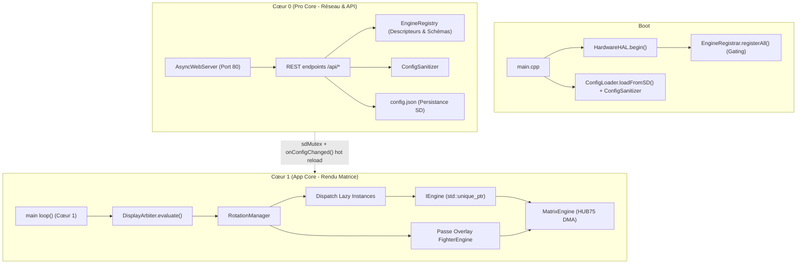
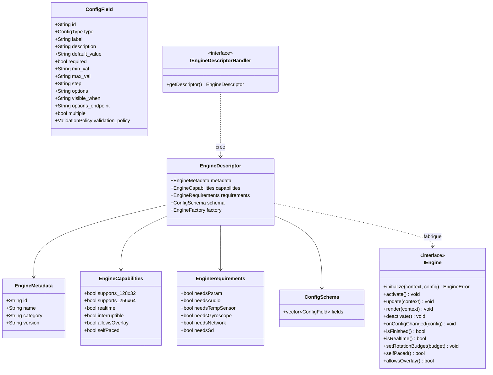
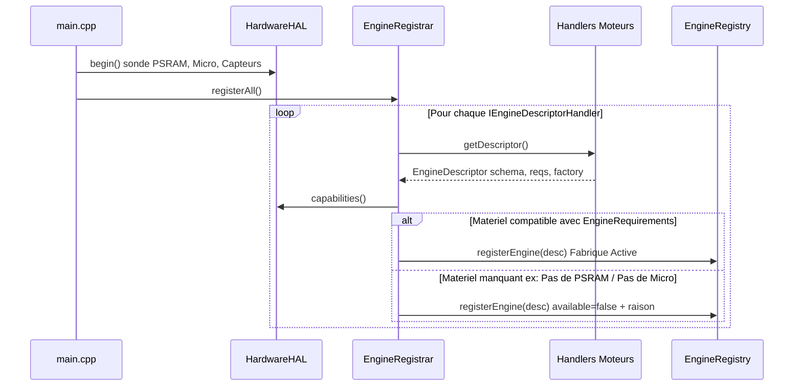
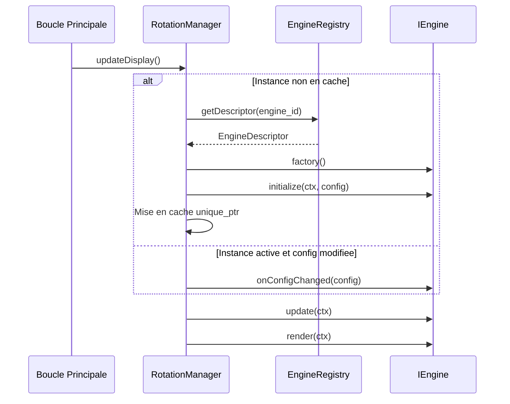

[English](ARCHITECTURE.md) | 🇫🇷 Français | 🇪🇸 [Español](ARCHITECTURE_ES.md)

# Vue d'ensemble de l'Architecture (ESP32 — C++)

Ce document constitue la référence **technique exhaustive** de l'architecture d'ArcadeMatrix sur ESP32 (développé en **C++**). Il couvre la philosophie de conception, les contraintes matérielles sévères de l'embarqué, le contrat complet `IEngine`, le `EngineRegistry` d'auto-découverte, le cycle de vie « Lazy-Once », le pipeline d'auto-réparation de configuration, l'interface utilisateur dynamique pilotée par schéma (y compris les **listes d'options dynamiques / personnalisées**), le `DisplayArbiter`, le compositeur d'overlay Fighter, le modèle de threading FreeRTOS double cœur et la couche d'isolation matérielle.

> Si vous souhaitez **ajouter** un moteur ou un champ de configuration, consultez [DEVELOPER_FR.md](DEVELOPER_FR.md). Ce document explique **pourquoi** et **comment** le système se comporte ; le guide développeur explique **quoi coder**.

---

## Table des Matières

1. [Philosophie de Conception : Contraintes Matérielles & Gestion Mémoire](#1-philosophie-de-conception--contraintes-matérielles--gestion-mémoire)
2. [Cartographie des Composants de Haut Niveau](#2-cartographie-des-composants-de-haut-niveau)
3. [Le Contrat du Moteur (Modèle de Classes)](#3-le-contrat-du-moteur-modèle-de-classes)
4. [Auto-Découverte : Registre, Descripteur & Fabrique](#4-auto-découverte--registre-descripteur--fabrique)
5. [Le Cycle de Vie « Lazy-Once »](#5-le-cycle-de-vie-lazy-once)
6. [Modèle de Configuration : `config.json` → Instances](#6-modèle-de-configuration--configjson--instances)
7. [Auto-Réparation : le ConfigSanitizer](#7-auto-réparation--le-configsanitizer)
8. [Propagation de Configuration & Hot Reload](#8-propagation-de-configuration--hot-reload)
9. [Interface Web Dynamique Pilotée par Schéma & Listes Dynamiques](#9-interface-web-dynamique-pilotée-par-schéma--listes-dynamiques)
10. [Le Display Arbiter](#10-le-display-arbiter)
11. [Le Compositeur d'Overlay Fighter](#11-le-compositeur-doverlay-fighter)
12. [Isolation Runtime & Modèle de Threading Double Cœur](#12-isolation-runtime--modèle-de-threading-double-cœur)
13. [Cadence de Rendu & Limiteur Adaptatif](#13-cadence-de-rendu--limiteur-adaptatif)
14. [Surface de l'API HTTP](#14-surface-de-lapi-http)
15. [Métadonnées de Build](#15-métadonnées-de-build)

---

## 1. Philosophie de Conception : Contraintes Matérielles & Gestion Mémoire

Contrairement aux plates-formes Linux (telles que le Raspberry Pi) qui disposent de centaines de mégaoctets de RAM, l'ESP32 est un microcontrôleur bare-metal sous FreeRTOS :

- **SRAM Interne vs. PSRAM Octale :**
  - **ESP32 Standard (`esp32dev`) :** Dispose de ~320 Ko de SRAM interne partagée entre le noyau FreeRTOS, la pile Wi-Fi, les tampons réseau AsyncTCP et les descripteurs DMA HUB75. La heap résiduelle est généralement de 120 à 180 Ko.
  - **Waveshare ESP32-S3 (`esp32s3_waveshare`) :** Dispose de 320 Ko de SRAM interne plus **16 Mo de PSRAM Octale**, autorisant des résolutions de matrice supérieures (jusqu'à 256x64), des historiques profonds pour la crypto/bourse et des sprites animés.
- **La Fragmentation de la Heap est l'Ennemi n°1 :** En C++, les allocations dynamiques (`malloc`, `new`, concaténations `String`, redimensionnements `std::vector`) dans les boucles de rendu périodiques fragmentent la mémoire et provoquent inévitablement des crashs (`Guru Meditation Error` ou `AsyncTCP failed to start task`).
- **Accès Direct DMA HUB75 :** Les pixels sont écrits directement dans les tampons DMA I2S sans couche d'émulation logicielle intermédiaire.

Trois règles fondamentales en découlent :

1. **Allouer une seule fois, muter sur place.** Les tampons sont pré-alloués dans `initialize()` et modifiés en place pendant `update()` et `render()`.
2. **Instancier paresseusement (lazy), conserver pour toujours.** Un moteur n'est construit que lors de sa première utilisation par la rotation ou l'Arbiter ("Lazy-Once"), évitant de charger des modules inactifs en RAM.
3. **Isoler Cœur 0 et Cœur 1.** Les E/S réseau, le serveur Web et MQTT s'exécutent de façon asynchrone sur le Cœur 0, tandis que la boucle de rendu 60 FPS s'exécute sans interruption sur le Cœur 1.

---

## 2. Cartographie des Composants de Haut Niveau



---

## 3. Le Contrat du Moteur (Modèle de Classes)

Chaque module d'affichage implémente l'interface `IEngine` :



### Cycle de Vie & Responsabilités

| Méthode | Moment d'appel | Rôle | Règle Mémoire |
| :-- | :-- | :-- | :-- |
| `initialize()` | Une seule fois au premier affichage | Allocation des tampons, décodage d'assets, init polices. | **Seul** endroit autorisé pour les grosses allocations dynamiques. |
| `activate()` | À chaque apparition à l'écran | Reset d'état léger (chronomètres, position de sprites). | Zéro allocation. |
| `update()` | Chaque frame d'affichage | Calcul logique et avancement d'état. | Zéro allocation. Modification des variables membres existantes. |
| `render()` | Chaque frame d'affichage | Rendu des pixels dans `MatrixPanel_I2S_DMA`. | Manipulation directe DMA. Zéro allocation. |
| `deactivate()` | Au départ de la rotation | Fermeture des handles de fichiers, pause audio/réseau. | Libération des ressources actives temporaires. |
| `onConfigChanged()`| Lors d'une modification API | Réapplication des paramètres en direct sans recréation. | Zéro ré-allocation. |
| `isFinished()` | Scrutation dans la rotation | Signal de fin anticipée (ex: liste de jetons crypto finie). | Requête const. |
| `isRealtime()` | Scrutation limiteur FPS | Indication de cadence dynamique (~60 FPS vs ~20 FPS). | Requête const. |
| `setRotationBudget()`| À l'activation du module | Fixe le budget par quantité (ex: jouer N GIFs). | Reçoit la valeur numérique du slot de rotation. |
| `selfPaced()` | Scrutation dans la rotation | Si true, le minuteur de durée ne force pas l'avancement. | Piloté par `isFinished()`. |
| `allowsOverlay()` | Scrutation DisplayArbiter | Si true, l'overlay Fighter peut composer par-dessus. | Désactive les overlays si false. |

---

## 4. Auto-Découverte : Registre, Descripteur & Fabrique

### Enregistrement Découplé via `IEngineDescriptorHandler`
Au boot, `EngineRegistrar::registerAll()` itère sur les instances de `IEngineDescriptorHandler` fournies par chaque moteur et remplit le `EngineRegistry` de descripteurs sans aucun type concret hardcodé dans `main.cpp` ni de schéma monolithique.



```cpp
class ClockEngineDescriptorHandler : public IEngineDescriptorHandler {
public:
    EngineDescriptor getDescriptor() const override {
        EngineDescriptor desc;
        desc.metadata = { "clock", "Horloge Digitale & Publisher", "clocks", "3.0.0" };
        desc.capabilities = { .supports_128x32 = true, .supports_256x64 = true, .realtime = true, .allowsOverlay = true };
        desc.requirements = { .needsPsram = false, .needsAudio = false };
        desc.schema.fields = { /* ... */ };
        desc.factory = []() { return std::unique_ptr<IEngine>(new ClockEngine()); };
        return desc;
    }
};
```

### Gating des Prérequis
`EngineRegistrar::checkRequirements()` compare dynamiquement les `EngineRequirements` aux `HardwareHAL::capabilities()`. Si un moteur requiert de la PSRAM ou un micro absent sur la carte :
1. L'enregistrement consigne `available = false` et la `reason` descriptive (*"Nécessite PSRAM"*).
2. La fabrique n'est jamais appelée dans la rotation.
3. `GET /api/engines` transmet la raison à l'UI Web pour griser le moteur avec un badge d'avertissement explicite.


---

## 5. Le Cycle de Vie « Lazy-Once »



---

## 6. Modèle de Configuration : `config.json` → Instances

La configuration est stockée dans un fichier unique `/config.json` sur la microSD :

- **Type de Moteur (`engine_id`)** : L'archétype (ex: `clock`), défini dans `EngineRegistry`.
- **Instance de Moteur (`instance_id`)** : Une occurrence configurée (ex: `clock_main`, `clock_retro`), enregistrée dans `config.instances`.
- **Dictionnaire de Configuration (`DictionaryEngineConfig`)** : Paires clé-valeur fournies de manière isolée au moteur.

---

## 7. Auto-Réparation : le ConfigSanitizer

`ConfigSanitizer::sanitizeInstances()` s'exécute au boot et après chaque écriture API :
- Vérifie l'existence des clés et injecte `default_value` si absente.
- Borne les entiers et flottants (`Clamp`) ou applique la valeur par défaut (`FallbackDefault`).
- Normalise les booléens (`true` / `false`) et vérifie les options enum.

---

## 8. Propagation de Configuration & Hot Reload

1. L'UI envoie un payload JSON à `POST /api/instances`.
2. `ConfigSanitizer` valide et normalise les champs.
3. La configuration est enregistrée sur la carte SD.
4. `rotationManager->notifyConfigChanged(instanceId)` déclenche `onConfigChanged()` directement sur l'instance en cours d'exécution sans redémarrer la carte.

---

## 9. Interface Web Dynamique Pilotée par Schéma

L'interface Web (`data/index.html`) est 100% dynamique :
- **Options Dynamiques (`options_endpoint`)** : Listes déroulantes pour les Thèmes d'horloge (`/api/themes`), Polices (`/api/fonts`) et Playlists (`/api/playlists`).
- **Badges Matériels** : Avertissement sur les modules indisponibles (*"Indisponible : Nécessite PSRAM"*).

---

## 10. Le Display Arbiter

Hiérarchie des priorités d'affichage :
1. Message MQTT (Priorité 10)
2. Marquee Retrogaming (Priorité 8)
3. Animation GIF One-Shot (Priorité 6)
4. Visualiseur Audio Prioritaire (Priorité 4)
5. Boucle de Rotation Idle (Priorité 0)

---

## 11. Le Compositeur d'Overlay Fighter

Le moteur M.U.G.E.N `FighterEngine` fonctionne en **composition additive** :
- Dessine directement par-dessus le tampon de l'horloge/météo lorsque `allowsCurrentOverlay() == true` et `fighter_main.enabled == true`.
- N'efface jamais l'écran (`matrix.fillScreen(0)`) pour garantir un rendu sans scintillement.
- Se masque automatiquement lorsqu'une source prioritaire (MQTT/Marquee/GIF) prend la main.

---

## 12. Isolation Runtime & Threading Double Cœur

- **Cœur 0** : Wi-Fi, serveur Web asynchrone, API REST, MQTT.
- **Cœur 1** : Boucle d'affichage 60 FPS (`update()` + `render()` + DMA buffer flipping).
- **Protection des bus** : Accès à la carte SD protégé par sémaphore `sdMutex`.

---

## 13. Cadence de Rendu & Limiteur Adaptatif

- **Moteurs Temps Réel** (`isRealtime() == true`) : Horloges animées, GIF, Visualiseur, Fighter tournent à **~60 FPS** (`16 ms`).
- **Moteurs Statiques** (`isRealtime() == false`) : Horloge texte, horloge binaire, météo statique tournent à **~20 FPS** (`50 ms`) pour économiser l'énergie et la chauffe CPU.

---

## 14. Surface de l'API HTTP

| Endpoint | Méthode | Rôle |
|---|---|---|
| `/api/hardware` | `GET` | Profil matériel, octets de PSRAM, état du micro et des capteurs. |
| `/api/engines` | `GET` | Liste des descripteurs, schémas, capacités, prérequis et disponibilité. |
| `/api/instances` | `GET`, `POST` | CRUD d'instances avec auto-sanitization et hot reload en direct. |
| `/api/themes` | `GET` | Liste des 30 thèmes d'horloge et de date. |
| `/api/version` | `GET` | Version (`3.0.0`), commit Git, timestamp de build, architecture. |
| `/api/settings` | `GET`, `POST` | Paramètres système globaux (matrice, wifi, mqtt, luminosité). |
| `/api/status` | `GET` | État mémoire, uptime, espace heap libre. |
| `/api/sensor` | `GET` | Température et humidité en direct du capteur SHTC3. |

---

## 15. Métadonnées de Build

Le script `scripts/build_webui.py` injecte automatiquement dans `src/core/BuildInfo.h` :
- `BUILD_GIT_COMMIT` : Hash court du commit Git.
- `BUILD_TIMESTAMP` : Horodatage UTC de compilation.
Exposés via `GET /api/version` et dans le pied de page du tableau de bord Web.
