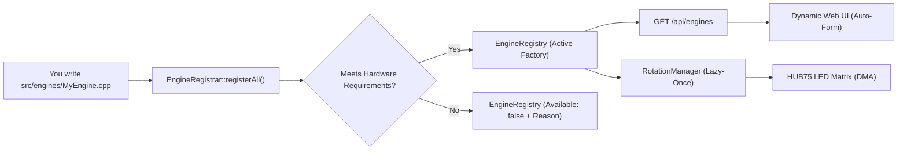
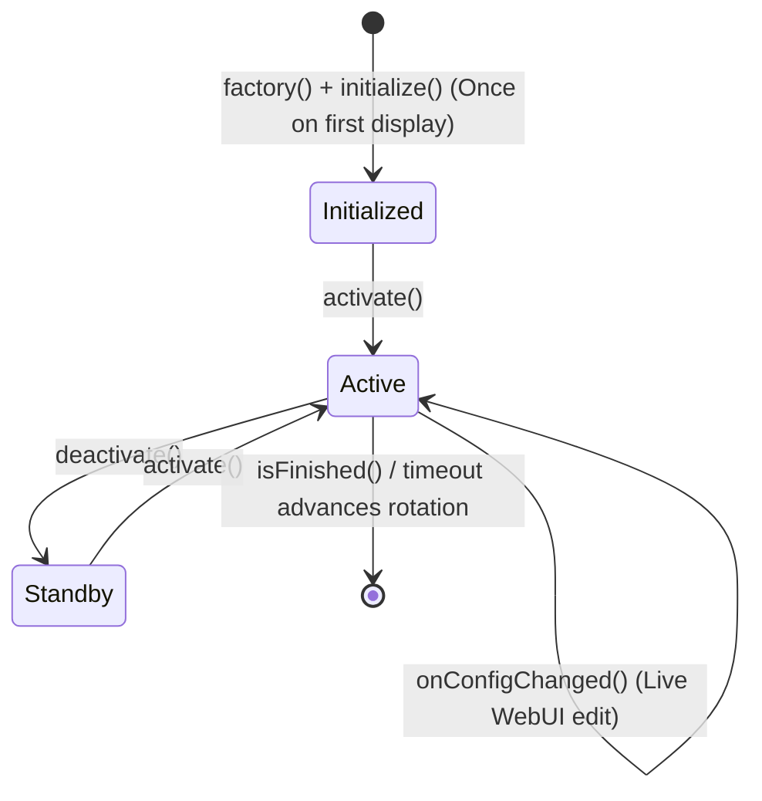

🇬🇧 English | 🇫🇷 [Français](DEVELOPER_FR.md) | 🇪🇸 [Español](DEVELOPER_ES.md)

# Developer Guide (ESP32 — C++)

This is the **complete, exhaustive** guide to extending ArcadeMatrix on ESP32 (written in **C++**). It explains the `IEngine` contract in full, the entire `ConfigField` schema (including **dynamic/custom option lists**, multiselect, conditional visibility and self-healing validation policies), hardware capability gating, and walks through building a new engine end-to-end.

> For the *why* behind the architecture (Registry, Lazy-Once, DisplayArbiter, FreeRTOS threading, overlay compositing), read [ARCHITECTURE.md](ARCHITECTURE.md). This guide is the practical *how-to*.

---

## Table of Contents

1. [Mental Model](#1-mental-model)
2. [The IEngine Contract in Full](#2-the-iengine-contract-in-full)
3. [The Lifecycle & Golden Rules](#3-the-lifecycle--golden-rules)
4. [Capabilities & Hardware Requirements](#4-capabilities--hardware-requirements)
5. [The ConfigSchema & ConfigField Reference](#5-the-configschema--configfield-reference)
6. [Custom / Dynamic Option Lists (`options_endpoint`)](#6-custom--dynamic-option-lists-options_endpoint)
7. [Multiselect Fields](#7-multiselect-fields)
8. [Conditional Fields (`visible_when`)](#8-conditional-fields-visible_when)
9. [Self-Healing Validation Policies](#9-self-healing-validation-policies)
10. [Tutorial: Create a New Engine Step-by-Step](#10-tutorial-create-a-new-engine-step-by-step)
11. [Tutorial: Add a Custom-List Endpoint](#11-tutorial-add-a-custom-list-endpoint)
12. [Reading Config in an Engine](#12-reading-config-in-an-engine)
13. [Rendering into the LED Matrix](#13-rendering-into-the-led-matrix)
14. [Testing & Local Compilation](#14-testing--local-compilation)
15. [Developer Checklist](#15-developer-checklist)

---

## 1. Mental Model

ArcadeMatrix has **no hardcoded list of display features** in `main.cpp`. Each engine is a decoupled plugin registered at startup in the central `EngineRegistry`.



Adding an engine requires **two steps**:
1. Implement your engine class (`IEngine`) in `src/engines/`.
2. Declare its descriptor (metadata, schema, factory) in `src/engines/EngineRegistrar.cpp`.
**`main.cpp` and WebUI HTML files are never edited.**

---

## 2. The IEngine Contract in Full

Every engine implements the `IEngine` interface (`include/core/EngineContract.h`):

```cpp
class IEngine {
public:
    virtual ~IEngine() = default;

    // --- Mandatory lifecycle ---
    virtual EngineError initialize(EngineContext* context, const EngineConfig* config) = 0;
    virtual void activate() = 0;
    virtual void update(EngineContext* context) = 0;
    virtual void render(EngineContext* context) = 0;
    virtual void deactivate() = 0;

    // --- Optional (safe defaults provided) ---
    virtual void onConfigChanged(const EngineConfig* config) {}
    virtual bool isFinished() const { return false; }
    virtual bool isRealtime() const { return true; }
    virtual void setRotationBudget(uint32_t budget) {}
    virtual bool selfPaced() const { return false; }
    virtual bool allowsOverlay() const { return true; }
};
```

| Method | Default | When to Override |
| :-- | :-- | :-- |
| `initialize()` | — | **Always.** Pre-allocate buffers, decode static bitmaps, load fonts. |
| `activate()` | — | **Always.** Cheap reset of transient state (chronometers, frame index). |
| `update()` | — | **Always.** Business and animation logic each frame. |
| `render()` | — | **Always.** Draw pixels into `context->getMatrix()`. |
| `deactivate()` | — | **Always.** Stop audio/network, close file handles. |
| `onConfigChanged()` | no-op | **If engine has settings.** Re-read values in place without recreation. |
| `isFinished()` | `false` | If engine has an intrinsic end (e.g. cycle completed) to advance rotation early. |
| `isRealtime()` | `true` | Return `true` for 60 FPS animations; return `false` for static 20 FPS displays. |
| `setRotationBudget()`| no-op | If count-based (e.g. play N GIFs). Receives the rotation entry count. |
| `selfPaced()` | `false` | If true, duration timer does not force-advance; engine drives advance via `isFinished()`. |
| `allowsOverlay()` | `true` | Return `false` if full-screen engines (GIF player) must not have Fighter overlays. |

---

## 3. The Lifecycle & Golden Rules



### Golden Rules for Embedded C++

1. **Golden Rule #1 — Zero Heap Allocation in Hot Loop:**
   Never instantiate `String`, `std::vector`, or call `malloc`/`new` inside `update()` or `render()`. Pre-allocate all buffers in `initialize()` and mutate in place.
2. **Golden Rule #2 — In-Place Hot Reload:**
   In `onConfigChanged()`, update internal variables directly. The instance is **not** destroyed or recreated.
3. **Golden Rule #3 — Respect Bus Locks:**
   SD card access must be protected with `sdMutex` when reading streaming assets.

---

## 4. Capabilities & Hardware Requirements

Declared in the descriptor, these static hints tell the runtime and UI what the engine can do and what physical hardware it requires:

```cpp
struct EngineCapabilities {
    bool supports_128x32 = true;
    bool supports_256x64 = true;
    bool realtime = true;
    bool interruptible = true;
    bool allowsOverlay = true;
    bool selfPaced = false;
};

struct EngineRequirements {
    bool needsPsram = false;      // e.g. Crypto/Stock quote history caches
    bool needsAudio = false;      // e.g. Visualizer requiring ES7210/I2S mic
    bool needsTempSensor = false; // e.g. Indoor environment sensor
    bool needsGyroscope = false;  // Reserved for orientation
    bool needsNetwork = false;    // Weather, NTP, MQTT
    bool needsSd = false;         // GIF playback, MUGEN sprites
};
```

`EngineRegistrar::registerAll()` evaluates `HardwareHAL::capabilities()` at boot. If a requirement is not met, the engine is cleanly skipped with an explanatory reason (`reason = "Requires PSRAM"`), preventing Out-Of-Memory panics.

---

## 5. The ConfigSchema & ConfigField Reference

The schema is the **single source of truth** for both the WebUI form generator and the `ConfigSanitizer`:

```cpp
struct ConfigField {
    String id;                          // Key in config.json
    ConfigType type;                    // BOOLEAN, INTEGER, FLOAT, STRING, ENUM, COLOR, LIST
    String label;                       // WebUI label
    String description;                 // Tooltip text
    String default_value;               // Injected by sanitizer if missing
    bool required = false;
    String min_val = "";                // Numeric lower bound
    String max_val = "";                // Numeric upper bound
    String step = "";                   // UI stepper granularity
    String options = "";                // Comma-separated static choices
    String visible_when = "";           // Conditional visibility rule
    String options_endpoint = "";       // Dynamic choices endpoint
    bool multiple = false;              // Multiselect flag
    ValidationPolicy validation_policy; // Clamp, FallbackDefault, Reject, Accept
};
```

---

## 6. Custom / Dynamic Option Lists (`options_endpoint`)

When an engine's selectable options are generated dynamically (e.g. clock themes, SD fonts, GIF playlists), set `options_endpoint`:

```cpp
{
    .id = "theme",
    .type = ConfigType::ENUM,
    .label = "Clock Theme",
    .description = "Select pixel-art background theme",
    .default_value = "12",
    .options_endpoint = "/api/themes"
}
```

The WebUI queries `GET /api/themes` asynchronously and populates the `<select>` dropdown.

---

## 7. Multiselect Fields

To allow users to select multiple options (stored as a comma-separated string):

```cpp
{
    .id = "playlists",
    .type = ConfigType::LIST,
    .label = "Active Playlists",
    .description = "Select GIF folders to cycle through",
    .default_value = "arcade,retro",
    .options_endpoint = "/api/playlists",
    .multiple = true
}
```

---

## 8. Conditional Fields (`visible_when`)

Hide or show fields depending on another field's value:

```cpp
{
    .id = "custom_color",
    .type = ConfigType::COLOR,
    .label = "Custom Accent Color",
    .default_value = "#ff0055",
    .visible_when = "theme=20" // Only visible when Custom Gradient theme (20) is selected
}
```

---

## 9. Self-Healing Validation Policies

| Policy | Behavior on Out-of-Bounds Value |
| :-- | :-- |
| `ValidationPolicy::Clamp` | Restricts value to `[min_val, max_val]`. |
| `ValidationPolicy::FallbackDefault` | Resets invalid value to `default_value`. |
| `ValidationPolicy::Accept` | Accepts value as-is. |
| `ValidationPolicy::Reject` | Leaves field unmodified. |

---

## 10. Tutorial: Create a New Engine Step-by-Step

### Step 1: Create Header `src/engines/MatrixRainEngine.h`

```cpp
#pragma once
#include "../../include/core/EngineContract.h"
#include <Arduino.h>

class MatrixRainEngine : public IEngine {
public:
    MatrixRainEngine();
    ~MatrixRainEngine() override = default;

    EngineError initialize(EngineContext* context, const EngineConfig* config) override;
    void activate() override;
    void update(EngineContext* context) override;
    void render(EngineContext* context) override;
    void deactivate() override;
    void onConfigChanged(const EngineConfig* config) override;
    bool isRealtime() const override { return true; }

private:
    MatrixPanel_I2S_DMA* matrix = nullptr;
    int speed = 2;
    int dropY[128];
};
```

### Step 2: Implement Logic `src/engines/MatrixRainEngine.cpp`

```cpp
#include "MatrixRainEngine.h"

MatrixRainEngine::MatrixRainEngine() {
    memset(dropY, 0, sizeof(dropY));
}

EngineError MatrixRainEngine::initialize(EngineContext* context, const EngineConfig* config) {
    if (!context || !context->getMatrix()) return EngineError::InitializationFailed;
    matrix = context->getMatrix();
    if (config) speed = config->getInt("speed", 2);
    return EngineError::OK;
}

void MatrixRainEngine::activate() {
    for (int i = 0; i < 128; i++) dropY[i] = random(-32, 0);
}

void MatrixRainEngine::update(EngineContext* context) {
    if (!matrix) return;
    for (int x = 0; x < matrix->width(); x += 4) {
        dropY[x] += speed;
        if (dropY[x] > matrix->height()) dropY[x] = random(-16, 0);
    }
}

void MatrixRainEngine::render(EngineContext* context) {
    if (!matrix) return;
    matrix->fillScreen(0);
    for (int x = 0; x < matrix->width(); x += 4) {
        matrix->drawPixel(x, dropY[x], matrix->color565(0, 255, 70));
    }
}

void MatrixRainEngine::deactivate() {}

void MatrixRainEngine::onConfigChanged(const EngineConfig* config) {
    if (config) speed = config->getInt("speed", 2);
}
```

### Step 3: Register in `src/engines/EngineRegistrar.cpp`

```cpp
#include "MatrixRainEngine.h"

void EngineRegistrar::registerAll() {
    // ...
    EngineDescriptor desc;
    desc.metadata = { .id = "matrix_rain", .name = "Matrix Digital Rain", .category = "animations", .version = "3.0.0" };
    desc.capabilities = { .supports_128x32 = true, .supports_256x64 = true, .realtime = true, .allowsOverlay = false };
    desc.requirements = { .needsPsram = false, .needsAudio = false };
    desc.schema.fields = {
        {
            .id = "speed",
            .type = ConfigType::INTEGER,
            .label = "Fall Speed",
            .default_value = "2",
            .min_val = "1",
            .max_val = "5",
            .step = "1",
            .validation_policy = ValidationPolicy::Clamp
        }
    };
    desc.factory = []() { return std::unique_ptr<IEngine>(new MatrixRainEngine()); };
    tryRegister(desc);
}
```

---

## 11. Tutorial: Add a Custom-List Endpoint

To serve dynamic options to the WebUI, register a route in `src/api/WebServerAPI.cpp`:

```cpp
server.on("/api/my_options", HTTP_GET, [](AsyncWebServerRequest *request){
    DynamicJsonDocument doc(512);
    JsonArray arr = doc.to<JsonArray>();
    
    JsonObject opt1 = arr.createNestedObject();
    opt1["id"] = "opt_a";
    opt1["name"] = "Option Alpha";
    
    JsonObject opt2 = arr.createNestedObject();
    opt2["id"] = "opt_b";
    opt2["name"] = "Option Beta";

    String response;
    serializeJson(doc, response);
    request->send(200, "application/json", response);
});
```

---

## 12. Reading Config in an Engine

Engines receive an `EngineConfig` proxy:

```cpp
int speed = config->getInt("speed", 2);
String text = config->getString("title", "Arcade");
bool enabled = config->getBool("enabled", true);
float offset = config->getFloat("temp_offset", 0.0f);
```

---

## 13. Rendering into the LED Matrix

Always obtain the matrix pointer via `context->getMatrix()`:

```cpp
MatrixPanel_I2S_DMA* matrix = context->getMatrix();
matrix->drawPixel(x, y, matrix->color565(r, g, b));
matrix->fillRect(x, y, w, h, color);
matrix->setCursor(x, y);
matrix->print("TEXT");
```
*Never call `flipDMABuffer()` inside an engine — the main display loop handles flipping centrally.*

---

## 14. Testing & Local Compilation

Compile both board targets locally:

```bash
# Standard ESP32
pio run -e esp32dev

# Waveshare ESP32-S3
pio run -e esp32s3_waveshare

# Run Unit Tests
pio test -e esp32dev --without-uploading --without-testing
```

---

## 15. Developer Checklist

- [ ] `initialize()` allocates all memory; hot loop (`update`/`render`) has **zero dynamic allocations**.
- [ ] `onConfigChanged()` updates state in place without destroying the instance.
- [ ] Hardware requirements (`needsPsram`, `needsAudio`, `needsTempSensor`) are correctly declared.
- [ ] `options_endpoint` is provided for dynamic options.
- [ ] Code compiles cleanly on both `esp32dev` and `esp32s3_waveshare`.
