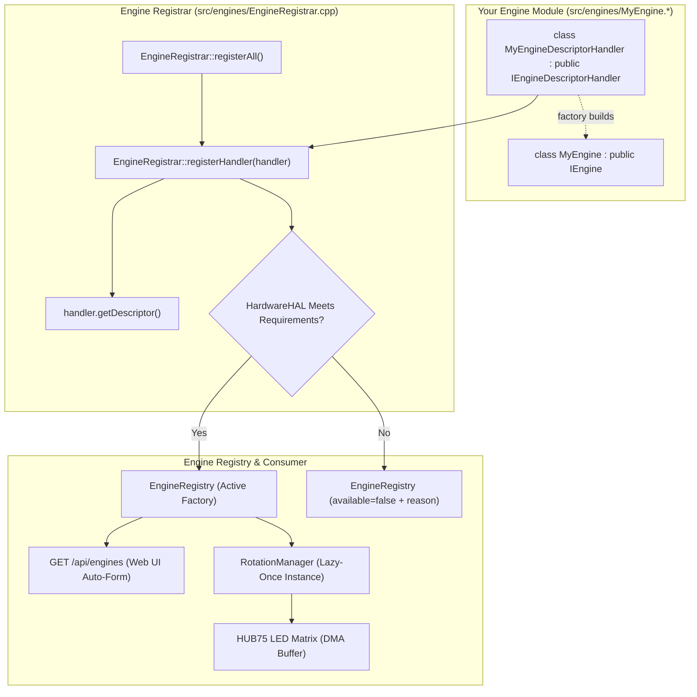
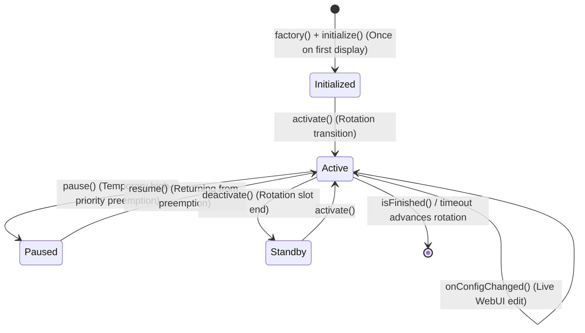

🇬🇧 English | 🇫🇷 [Français](DEVELOPER_FR.md) | 🇪🇸 [Español](DEVELOPER_ES.md)

# Developer Guide (ESP32 — C++)

This is the **complete, exhaustive** guide to extending ArcadeMatrix on ESP32 (written in **C++**). It explains the `IEngine` contract in full, the entire `ConfigField` schema (including **dynamic/custom option lists**, multiselect, conditional visibility and self-healing validation policies), hardware capability gating, and walks through building a new engine end-to-end.

> For the *why* behind the architecture (Registry, Lazy-Once, DisplayArbiter, FreeRTOS threading, overlay compositing), read [ARCHITECTURE.md](ARCHITECTURE.md). This guide is the practical *how-to*.

---

## Table of Contents

1. [Mental Model](#1-mental-model)
2. [The IEngine Contract in Full](#2-the-iengine-contract-in-full)
3. [The Lifecycle & Golden Rules](#3-the-lifecycle--golden-rules)
4. [Capabilities & Hardware Requirements](#4-capabilities--hardware-requirements)
5. [The ConfigSchema & ConfigField Reference](#5-the-configschema--configfield-reference)
6. [Custom / Dynamic Option Lists (`options_endpoint`)](#6-custom--dynamic-option-lists-options_endpoint)
7. [Multiselect Fields](#7-multiselect-fields)
8. [Conditional Fields (`visible_when`)](#8-conditional-fields-visible_when)
9. [Self-Healing Validation Policies](#9-self-healing-validation-policies)
10. [Tutorial: Create a New Engine Step-by-Step](#10-tutorial-create-a-new-engine-step-by-step)
11. [Tutorial: Add a Custom-List Endpoint](#11-tutorial-add-a-custom-list-endpoint)
12. [Tutorial: Add a New Clock Face / Theme Step-by-Step](#12-tutorial-add-a-new-clock-face--theme-step-by-step)
13. [Internationalization & Centralized i18n (Front & Back)](#13-internationalization--centralized-i18n-front--back)
14. [Reading Config in an Engine](#14-reading-config-in-an-engine)
15. [Rendering into the LED Matrix](#15-rendering-into-the-led-matrix)
16. [Testing & Local Compilation](#16-testing--local-compilation)
17. [Developer Checklist](#17-developer-checklist)

---

## 1. Mental Model

ArcadeMatrix has **no hardcoded list of display features** in `main.cpp`. Each engine is a decoupled plugin registered at startup in the central `EngineRegistry`.



Adding an engine requires **two simple steps**:
1. Implement your engine class (`IEngine`) and its companion descriptor handler (`IEngineDescriptorHandler`) in `src/engines/`.
2. Add your descriptor handler instance to the handlers array in `src/engines/EngineRegistrar.cpp`.

> [!NOTE]
> **Why `IEngineDescriptorHandler` on ESP32?**
> Rather than a monolithic registrar with hardcoded schemas (God Class), each engine defines and encapsulates its own metadata, config schema, requirements, and factory. The `EngineRegistrar` then automatically iterates over all handlers and performs runtime hardware gating before registering into `EngineRegistry`.

**`main.cpp` and WebUI HTML files are never edited.**

---

## 2. The IEngine Contract in Full

```cpp
class IDisplayGeometryAware {
public:
    virtual ~IDisplayGeometryAware() = default;
    virtual void onDisplayGeometryChanged(const DisplayGeometry& geometry) = 0;
};

class IEngine : public IDisplayGeometryAware {
public:
    virtual ~IEngine() = default;

    // --- Mandatory lifecycle ---
    virtual EngineError initialize(EngineContext* context, const EngineConfig* config) = 0;
    virtual void activate() = 0;
    virtual void update(EngineContext* context) = 0;
    virtual void render(EngineContext* context) = 0;
    virtual void deactivate() = 0;

    // --- Preemption lifecycle (optional hooks for temporary interruptions) ---
    virtual void pause() {}
    virtual void resume() {}

    // --- Optional (safe defaults provided) ---
    virtual void onConfigChanged(const EngineConfig* config) {}
    virtual void onDisplayGeometryChanged(const DisplayGeometry& geometry) override {}
    virtual bool isFinished() const { return false; }
    virtual bool isRealtime() const { return true; }
    virtual void setRotationBudget(uint32_t budget) {}
    virtual bool selfPaced() const { return false; }
    virtual bool allowsOverlay() const { return true; }
};
```

| Method | Default | When to Override |
| :-- | :-- | :-- |
| `initialize()` | — | **Always.** Pre-allocate buffers, decode static bitmaps, load fonts. |
| `activate()` | — | **Always.** Cheap reset of transient state (chronometers, frame index). |
| `update()` | — | **Always.** Business and animation logic each frame. |
| `render()` | — | **Always.** Draw pixels into `context->getMatrix()`. |
| `deactivate()` | — | **Always.** Stop audio/network, close file handles when exiting rotation slot. |
| `pause()` | no-op | **Optional.** Called when temporarily preempted by a high-priority alert or message. Preserves internal state. |
| `resume()` | no-op | **Optional.** Called when returning from a temporary preemption without losing animation phase or timers. |
| `onConfigChanged()` | no-op | **If engine has settings.** Re-read values in place without recreation. |
| `onDisplayGeometryChanged()` | no-op | **If engine maintains geometry-derived caches** (e.g. column arrays). |
| `isFinished()` | `false` | If engine has an intrinsic end (e.g. cycle completed) to advance rotation early. |
| `isRealtime()` | `true` | Return `true` for 60 FPS animations; return `false` for static 20 FPS displays. |
| `setRotationBudget()`| no-op | If count-based (e.g. play N GIFs). Receives the rotation entry count. |
| `selfPaced()` | `false` | If true, duration timer does not force-advance; engine drives advance via `isFinished()`. |
| `allowsOverlay()` | `true` | Return `false` for bandwidth-heavy engines (e.g. `GifEngine`) to bypass overlay compositing overhead and maintain maximum framerate. |

---

## 3. The Lifecycle & Golden Rules



### Display Decision, Lifecycle & Preemption Matrix

The `DisplayArbiter` resolves display sources deterministically via a static priority scale and dispatches decisions to `DisplayRuntime`:

| Scenario | Action on Outgoing Engine | Action on Incoming Engine | Session State |
| :--- | :--- | :--- | :--- |
| **Temporary Preemption** (e.g. MQTT Alert on Clock) | `oldEngine->pause()` | `alertEngine->activate()` | Session ID increments; previous engine pinned for resume |
| **End of Preemption** (Returning to Clock) | `alertEngine->deactivate()` | `oldEngine->resume()` | Session ID increments; baseline engine resumed in-place |
| **Carousel Rotation** (e.g. Clock → Weather) | `oldEngine->deactivate()` | `newEngine->activate()` | Session ID increments; previous session cleanly torn down |

### Golden Rules for Embedded C++

1. **Golden Rule #1 — Zero Heap Allocation in Hot Loop:**
   Never instantiate `String`, `std::vector`, or call `malloc`/`new` inside `update()` or `render()`. Pre-allocate all buffers in `initialize()` and mutate in place.
2. **Golden Rule #2 — Lock-Free Hot Path & Zero Mutex on Core 1:**
   Core 1 runs `update() -> evaluate() -> render()` completely lock-free. Configuration is accessed exclusively via the linearizable Single-Reader Single-Writer (SRSW) CAS protocol (`ConfigSnapshotGuard guard = config.acquireSnapshot(); const auto& snapshot = guard.get();`).
3. **Golden Rule #3 — Single Producer SPSC Cross-Core Commands:**
   Core 0 submits display requests via `m_displayArbiter.submitRequest(req)`. Core 1 owns the arbiter slots exclusively and drains commands in $O(1)$ without mutex contention.
4. **Golden Rule #4 — In-Place Hot Reload:**
   In `onConfigChanged()`, update internal variables directly. The instance is **not** destroyed or recreated.
5. **Golden Rule #5 — Coarse-Grained SD Ownership, Never Per-Read Locking:**
   `sdMutex` is a **non-recursive** FreeRTOS mutex (`xSemaphoreCreateMutex()`). Take it **once**, around a complete SD transaction (open, directory scan, whole-file read, close), and never inside a callback that the same transaction can re-enter: `AnimatedGIF` invokes its read/seek callbacks synchronously from `gif.open()`, so locking there self-deadlocks.
   Once a streaming handle is open, it belongs exclusively to Core 1 for the lifetime of the playback session and is read **without** locking, as required by Golden Rule #2.
   Core 0 producers (HTTP handlers, MQTT) must always use a **bounded** wait (`pdMS_TO_TICKS(...)`) and degrade gracefully. `portMAX_DELAY` on the AsyncTCP task freezes the entire web server.
6. **Golden Rule #6 — Overlays vs Selectable Engines:**
   - **Selectable Engine:** Replaces the primary framebuffer (e.g. Clock, Weather, GIF, Crypto). Registered in `EngineRegistry` with a descriptor, factory, and canonical `EngineHandle`.
   - **Transverse Overlay:** Composites additively on top of any active display source (e.g. Fighter). Managed exclusively by `OverlayManager`, enabled per rotation slot (`overlays.fighter: true`), never registered in `EngineRegistry`.
7. **Golden Rule #7 — Stateful Network Protocols & Socket Lifecycle (CastV2 / TLS):**
   - Transversal network streaming engines (e.g. `GoogleCastEngine`) MUST maintain a persistent `WiFiClientSecure` connection across polling cycles with active protocol heartbeats (CastV2 `PING` every 5s on `urn:x-cast:com.google.cast.tp.heartbeat` to `receiver-0`).
   - NEVER instantiate and teardown TLS clients in a rapid polling loop (e.g. 1-2s): TCP `TIME_WAIT` states linger for 120 seconds in lwIP. Sockets accumulate up to the OS ceiling (`fd 48`, `ECONNABORTED = 113`), starving `AsyncWebServer` (port 80) and mDNS, resulting in `ERR_ADDRESS_UNREACHABLE`.
   - Reconnect backoff after connection failure MUST be at least 15 seconds to bound maximum concurrent `TIME_WAIT` descriptors to 8 (well below the 48 socket ceiling).
   - **Known limitation:** even with serialization (Golden Rule #11), Google Cast can be denied TLS admission indefinitely once internal DRAM settles into a fragmented steady state (largest block below ~16 KB) with other engines active — mDNS discovery succeeding while the handshake never completes currently presents as "Cast not working". This is accepted graceful degradation, not yet a real fix.
8. **Golden Rule #8 — Resource Hierarchy: Critical Services vs Opportunistic Overlays:**
   - Critical services (Display matrix, Core 0 Web Server, Audio stream, Transversal Cast, SDMMC) have reserved bandwidth and memory.
   - Opportunistic and decorative overlays (`FighterEngine`, `ArtworkService`) MUST be strictly subordinate:
     * Never compete with critical services for RAM, DMA, or bus bandwidth.
     * Cut short immediately upon the first file failure or memory dip (`heap < 30 KB`, `dma < 16 KB`, `psram < 1 MB`), free any partial allocations, and abort without attempting remaining files.
     * Use `NetworkBudget::canStartTlsSession()` before initiating any optional HTTPS/TLS download.
9. **Golden Rule #9 — Hardware DMA Gating for Crypto & Storage:**
   - Hardware SHA (`esp-sha`) in ESP32-S3 and SDMMC block reading require contiguous internal DMA memory (`MALLOC_CAP_DMA | MALLOC_CAP_INTERNAL`). If internal DMA drops below 16 KB or largest DMA block drops below 4096 bytes, `esp-sha: Failed to allocate buf memory` and `sdmmc_read_blocks failed (257) (ESP_ERR_NO_MEM)` will occur.
   - `NetworkBudget::canStartTlsSession()` must evaluate internal DMA headroom (`freeDma >= 16 KB`, `largestDma >= 4 KB`) as well as total DRAM before admitting TLS handshakes.
10. **Golden Rule #10 — Single-Path Peripheral Recovery (Core 0 Exclusive):**
    - Never run parallel recovery watchdogs across cores.
    - If Core 1 detects hardware peripheral anomalies (e.g. ES7210 digital zero freeze), Core 1 evaluates lock-free in $O(1)$ and signals an atomic flag.
    - Recovery (I2C re-initialization) is executed exclusively on Core 0 with bounded rate-limiting/cooldown (3000 ms), completely isolated from the Core 1 audio rendering hot-path.
11. **Golden Rule #11 — mbedTLS Stays 100% Internal DRAM; Admit & Serialize, Never Route TLS to PSRAM:**
    - mbedTLS on this board MUST use the stock ESP-IDF/Arduino allocator (100% internal DRAM), matching `v3.1.0` behavior. **Do not** reintroduce a PSRAM-routing `mbedtls_platform_set_calloc_free()` hook (the previous `MbedTlsAllocator` has been deleted for this exact reason): live hardware testing proved that ANY mbedTLS allocation landing in PSRAM — even only the ~16 KB TLS record buffers — corrupts the HUB75 display within seconds, because the framebuffer is also PSRAM-resident and contends with mbedTLS over the shared PSRAM cache via the HUB75 GDMA engine. See `HardwareHAL::begin()` for the full root-cause comment.
    - Since internal DRAM must now serve TLS, DMA, and networking simultaneously, every TLS call site MUST construct a `NetworkBudget::ScopedTlsHandshakeLock` immediately before `WiFiClientSecure::connect()` and bail out (`if (!tlsLock) { ...; return; }`) if it fails to acquire it. This is a single global mutex: **only one TLS handshake may be in flight anywhere in the firmware at a time.**
    - Hard admission boundary, re-validated **atomically inside the lock's constructor** (not just as a separate pre-check): `NetworkBudget::canStartTlsSession()` requires `freeInternal >= 45 KB` and verified dual-buffer headroom (either `largestInternalBlock >= 34.5 KB` or two independent 16.5 KB blocks) to satisfy mbedTLS's concurrent in/out record buffers (~33.4 KB total). A pre-check before even attempting the lock is allowed as a cheap optimization to avoid blocking on a contended mutex when the budget is already known-insufficient, but it is **never** authoritative by itself — mutex-contention wait time (up to 5s) is enough for a concurrent handshake to invalidate an earlier "OK" result. Only the post-acquire re-check inside the constructor is authoritative.
    - *Security Note:* since mbedTLS is internal-DRAM-only again, there is no PSRAM-residency concern for TLS-sensitive material to document.
12. **Golden Rule #12 — SD Access via `SdLockGuard`, Never Manual `xSemaphoreTake`/`Give`:**
    - Use `SdLockGuard guard(timeoutTicks); if (!guard) { ...; return; }` (`src/core/SdLockGuard.h`) for every `sdMutex` acquisition. It is a move-free RAII wrapper that guarantees the mutex is released on every return path (including early returns), eliminating the lock-leak risk of hand-written `xSemaphoreTake(...) ... xSemaphoreGive(...)` pairs that must otherwise be duplicated on every exit path.
    - This does not relax Golden Rule #5: still take the lock coarse-grained around a whole SD transaction, never inside per-frame/per-byte streaming callbacks (`GIFReadFile`/`GIFSeekFile` deliberately remain **unlocked**, since the file handle is opened once under `SdLockGuard` and then owned exclusively by Core 1 for the rest of the playback session).
13. **Golden Rule #13 — Engine Retirement Release Barrier (Anti-UAF):**
    - Before an engine's `unique_ptr` is moved into the `EngineRetirementQueue` for Core 0 destruction, `RotationManager::retireEngineSlot()` MUST, in order: (1) call `deactivate()`, (2) clear `currentActiveInstanceId` if it matches, (3) call `DisplayRuntime::purgeEngineReferences(engine, instanceId)` to strip the pointer from `m_session.activeEngine` and the preemption stack, (4) mark `EngineResourceState::CORE1_RELEASED`, (5) sever the local `instanceId` slot. Only after all five steps may the engine be handed off to Core 0. Never duplicate this sequence inline elsewhere — always call `retireEngineSlot()`.
14. **Golden Rule #14 — Memory Domain Segregation & PSRAM-First for Large Transient Buffers:**
    - Move application-owned JSON document allocations (`WebServerAPI`, REST endpoints) to PSRAM via `SpiRamJsonDocument`; AsyncTCP/lwIP and server-internal allocations remain in their required internal DRAM domains.
    - Large non-DMA graphical framebuffers (such as `GifEngine`'s 32 KB canvas) MUST prioritize PSRAM allocation (`MALLOC_CAP_SPIRAM | MALLOC_CAP_8BIT`) when PSRAM is available, reserving internal DRAM for mbedTLS and LwIP networking.
    - AsyncTCP background worker stack is sized to 8192 bytes and strictly pinned to Core 0 (`CONFIG_ASYNC_TCP_RUNNING_CORE=0`) to protect the Core 1 display rendering hot-path (Invariant 1).
    - Persistent network services (Google Cast) MUST implement exponential backoff (5s, 10s, 20s, 60s) initialized upon session drop, preventing reconnection storms during bursty HTTP/LwIP activity.

---

## 4. Capabilities & Hardware Requirements

Declared in the descriptor, these static hints tell the runtime and UI what the engine can do and what physical hardware it requires:

```cpp
struct EngineCapabilities {
    bool supports_128x32 = true;
    bool supports_256x64 = true;
    bool realtime = true;
    bool interruptible = true;
    bool selfPaced = false;
};

struct EngineRequirements {
    bool needsPsram = false;      // e.g. Crypto/Stock quote history caches
    bool needsAudio = false;      // e.g. Visualizer requiring ES7210/I2S mic
    bool needsTempSensor = false; // e.g. Indoor environment sensor
    bool needsGyroscope = false;  // Reserved for orientation
    bool needsNetwork = false;    // Weather, NTP, MQTT
    bool needsSd = false;         // GIF playback, MUGEN sprites
};
```

`EngineRegistrar::registerAll()` evaluates `HardwareHAL::capabilities()` at boot. If a requirement is not met, the engine is cleanly skipped with an explanatory reason (`reason = "Requires PSRAM"`), preventing Out-Of-Memory panics.

---

## 5. The ConfigSchema & ConfigField Reference

The schema is the **single source of truth** for both the WebUI form generator and the `ConfigSanitizer`:

```cpp
struct ConfigField {
    String id;                          // Key in config.json
    ConfigType type;                    // BOOLEAN, INTEGER, FLOAT, STRING, ENUM, COLOR, LIST
    String label;                       // WebUI label
    String description;                 // Tooltip text
    String default_value;               // Injected by sanitizer if missing
    bool required = false;
    String min_val = "";                // Numeric lower bound
    String max_val = "";                // Numeric upper bound
    String step = "";                   // UI stepper granularity
    String options = "";                // Comma-separated static choices
    String visible_when = "";           // Conditional visibility rule
    String options_endpoint = "";       // Dynamic choices endpoint
    bool multiple = false;              // Multiselect flag
    ValidationPolicy validation_policy; // Clamp, FallbackDefault, Reject, Accept
};
```

---

## 6. Custom / Dynamic Option Lists (`options_endpoint`)

When an engine's selectable options are generated dynamically (e.g. clock themes, SD fonts, GIF playlists), set `options_endpoint`:

```cpp
{
    .id = "theme",
    .type = ConfigType::ENUM,
    .label = "Clock Theme",
    .description = "Select pixel-art background theme",
    .default_value = "12",
    .options_endpoint = "/api/themes"
}
```

The WebUI queries `GET /api/themes` asynchronously and populates the `<select>` dropdown.

---

## 7. Multiselect Fields

To allow users to select multiple options (stored as a comma-separated string):

```cpp
{
    .id = "playlists",
    .type = ConfigType::LIST,
    .label = "Active Playlists",
    .description = "Select GIF folders to cycle through",
    .default_value = "arcade,retro",
    .options_endpoint = "/api/playlists",
    .multiple = true
}
```

---

## 8. Conditional Fields (`visible_when`)

Hide or show fields depending on another field's value:

```cpp
{
    .id = "custom_color",
    .type = ConfigType::COLOR,
    .label = "Custom Accent Color",
    .default_value = "#ff0055",
    .visible_when = "theme=20" // Only visible when Custom Gradient theme (20) is selected
}
```

---

## 9. Self-Healing Validation Policies

| Policy | Behavior on Out-of-Bounds Value |
| :-- | :-- |
| `ValidationPolicy::Clamp` | Restricts value to `[min_val, max_val]`. |
| `ValidationPolicy::FallbackDefault` | Resets invalid value to `default_value`. |
| `ValidationPolicy::Accept` | Accepts value as-is. |
| `ValidationPolicy::Reject` | Leaves field unmodified. |

---

## 10. Tutorial: Create a New Engine Step-by-Step

### Step 1: Create Header `src/engines/MatrixRainEngine.h`

```cpp
#pragma once
#include "../../include/core/EngineContract.h"
#include <Arduino.h>
#include "core/EngineContract.h"
#include "core/drawing/IDrawingSurface.h"

class MatrixRainEngine : public IEngine {
public:
    MatrixRainEngine();
    ~MatrixRainEngine() override = default;

    EngineError initialize(EngineContext* context, const EngineConfig* config) override;
    void activate() override;
    void update(EngineContext* context) override;
    void render(EngineContext* context) override;
    void deactivate() override;
    void onConfigChanged(const EngineConfig* config) override;
    bool isRealtime() const override { return true; }

private:
    IDrawingSurface* surface = nullptr;
    int speed = 2;
    int dropY[128];
};
```

### Step 2: Implement Logic `src/engines/MatrixRainEngine.cpp`

```cpp
#include "MatrixRainEngine.h"

MatrixRainEngine::MatrixRainEngine() {
    memset(dropY, 0, sizeof(dropY));
}

EngineError MatrixRainEngine::initialize(EngineContext* context, const EngineConfig* config) {
    if (!context || !context->getSurface()) return EngineError::InitializationFailed;
    surface = context->getSurface();
    if (config) speed = config->getInt("speed", 2);
    return EngineError::OK;
}

void MatrixRainEngine::activate() {
    for (int i = 0; i < 128; i++) dropY[i] = random(-32, 0);
}

void MatrixRainEngine::update(EngineContext* context) {
    if (!surface) return;
    for (int x = 0; x < surface->width(); x += 4) {
        dropY[x] += speed;
        if (dropY[x] > surface->height()) dropY[x] = random(-16, 0);
    }
}

void MatrixRainEngine::render(EngineContext* context) {
    if (!surface) return;
    surface->fillScreen(0);
    for (int x = 0; x < surface->width(); x += 4) {
        surface->drawPixel(x, dropY[x], IDrawingSurface::color565(0, 255, 70));
    }
}

void MatrixRainEngine::deactivate() {}

void MatrixRainEngine::onConfigChanged(const EngineConfig* config) {
    if (config) speed = config->getInt("speed", 2);
}
```

### Step 3: Implement `IEngineDescriptorHandler` in your Engine & Register

In your engine file (e.g. `src/engines/MatrixRainEngine.h` / `.cpp`):
```cpp
class MatrixRainEngineDescriptorHandler : public IEngineDescriptorHandler {
public:
    EngineDescriptor getDescriptor() const override {
        EngineDescriptor desc;
        desc.metadata = { "matrix_rain", "Matrix Digital Rain", "animations", FIRMWARE_VERSION };
        desc.capabilities = { .supports_128x32 = true, .supports_256x64 = true, .realtime = true };
        desc.requirements = { .needsPsram = false, .needsAudio = false };
        desc.schema.fields = {
            ConfigField("speed", ConfigType::INTEGER, "Fall Speed", "Falling speed in pixels per frame", "2", false, "1", "5", "1", "", "", false, "", ValidationPolicy::Clamp)
        };
        desc.factory = []() { return std::unique_ptr<IEngine>(new MatrixRainEngine()); };
        return desc;
    }
};
```

Then in `src/engines/EngineRegistrar.cpp`, simply add your handler instance:
```cpp
#include "MatrixRainEngine.h"

void EngineRegistrar::registerAll() {
    // ...
    static const MatrixRainEngineDescriptorHandler matrixRainHandler;

    const IEngineDescriptorHandler* handlers[] = {
        // ...
        &matrixRainHandler
    };

    for (const auto* handler : handlers) {
        if (handler) registerHandler(*handler);
    }
}
```

---

## 11. Tutorial: Add a Custom-List Endpoint

To serve dynamic options to the WebUI, register a route in `src/api/WebServerAPI.cpp`:

```cpp
server.on("/api/my_options", HTTP_GET, [](AsyncWebServerRequest *request){
    DynamicJsonDocument doc(512);
    JsonArray arr = doc.to<JsonArray>();
    
    JsonObject opt1 = arr.createNestedObject();
    opt1["id"] = "opt_a";
    opt1["name"] = "Option Alpha";
    
    JsonObject opt2 = arr.createNestedObject();
    opt2["id"] = "opt_b";
    opt2["name"] = "Option Beta";

    String response;
    serializeJson(doc, response);
    request->send(200, "application/json", response);
});
```

---

## 12. Tutorial: Add a New Clock Face / Theme Step-by-Step

Clocks in ArcadeMatrix are organized into modular `ClockFace` implementations managed by the core `ClockEngine`. To add a new visual theme or clock animation (e.g. *SpaceInvadersClock*):

### Step 1: Create `src/engines/clocks/SpaceInvadersClock.h` & `.cpp`

Inherit from the `ClockFace` base class (`src/engines/ClockEngine.h`):

```cpp
// src/engines/clocks/SpaceInvadersClock.h
#pragma once
#include "../ClockEngine.h"
#include "../../core/drawing/IDrawingSurface.h"

class SpaceInvadersClock : public ClockFace {
public:
    SpaceInvadersClock(IDrawingSurface* display, const EngineConfig* config = nullptr);
    void draw(const TimeData& t) override;
    void update() override;

private:
    int invaderFrame = 0;
    unsigned long lastAnimMs = 0;
};
```

```cpp
// src/engines/clocks/SpaceInvadersClock.cpp
#include "SpaceInvadersClock.h"

SpaceInvadersClock::SpaceInvadersClock(IDrawingSurface* display, const EngineConfig* config)
    : ClockFace(display, config) {}

void SpaceInvadersClock::update() {
    if (millis() - lastAnimMs > 500) {
        invaderFrame = (invaderFrame + 1) % 2;
        lastAnimMs = millis();
    }
}

void SpaceInvadersClock::draw(const TimeData& t) {
    if (!matrix) return;
    matrix->fillScreen(0);
    // Draw animated invaders & formatted time digits
    matrix->setTextSize(1);
    matrix->setTextColor(matrix->color565(0, 255, 100));
    matrix->setCursor(24, 12);
    matrix->printf("%02d:%02d:%02d", t.hour, t.minute, t.second);
}
```

### Step 2: Add Theme Enum ID in `src/engines/DateEngine.h`

Add your new theme identifier to `PublisherTheme`:

```cpp
enum PublisherTheme {
    // ... existing themes (0 to 24)
    THEME_SPACE_INVADERS = 25
};
```

### Step 3: Wire into `ClockEngine::setTheme()` in `src/engines/ClockEngine.cpp`

Include your header and instantiate your `ClockFace`:

```cpp
#include "clocks/SpaceInvadersClock.h"

// In ClockEngine::setTheme():
case THEME_SPACE_INVADERS:
    activeFace = new SpaceInvadersClock(legacy_matrix, config);
    break;
```

### Step 4: Expose in `/api/themes` in `src/api/WebServerAPI.cpp`

Add your theme to the `themes` table so it automatically populates the WebUI dropdown:

```cpp
static const ThemeItem themes[] = {
    // ...
    { 25, "Space Invaders Clock" }
};
```

The WebUI will automatically show "Space Invaders Clock" in the theme dropdown, persist it in `config.json`, and apply it live via hot reload.

---

## 13. Internationalization & Centralized i18n (Front & Back)

ArcadeMatrix features a **fully centralized i18n architecture**.

> [!IMPORTANT]
> **Golden Rule: Never add a `lang` field to your engine's `ConfigSchema`.**
> Language is a global system setting (`system.lang`), chosen by the user in the WebUI header selector (`#lang-selector`). Any language change in the UI automatically sends a `POST /api/system` call and notifies all active engines in real time.

### A. Usage in C++ Engine (`#include "core/I18n.h"`)

All localized strings (weather day labels, weather conditions, text clock words, noise levels, etc.) are centralized in the `I18n` helper class:

```cpp
#include "core/I18n.h"

// 1. Get active language (FR, EN, ES)
Lang currentLang = I18n::getLang();

// 2. Weather day names (e.g., "TODAY", "TOM.", "MON"..)
const char* dayLabel = I18n::getWeatherDayLabel(dayOfWeek, isToday, isTomorrow);

// 3. Translated weather condition strings
String condition = I18n::getWeatherCondition("Thunderstorm with heavy rain");

// 4. WordClock full text lines
std::vector<String> lines = I18n::getWordClockLines(hours, minutes);

// 5. Noise / Decibel level statuses
const char* noise = I18n::getNoiseLevelLabel(levelIndex);
```

### B. Tutorial: Adding a New Language (e.g. German `de`) in 3 Steps

1. **Front-end WebUI (`data/index.html` or `i18n.js`):**
   Add the language code and label to `SUPPORTED_LANGUAGES` and provide translations in `translations`:
   ```javascript
   const SUPPORTED_LANGUAGES = [
     { code: 'fr', label: 'Français' },
     { code: 'en', label: 'English' },
     { code: 'es', label: 'Español' },
     { code: 'de', label: 'Deutsch' }
   ];
   ```
2. **ESP32 Back-end (`src/core/I18n.h` & `src/core/I18n.cpp`):**
   - Add `DE` to the `Lang` enum.
   - Implement localized day labels, conditions, WordClock words, and noise strings in `I18n.cpp`.
3. **Raspberry Pi Back-end (`src/core/i18n.rs`):**
   - Add `De` to `Lang` enum and provide mappings in the lookup tables.

---

## 14. Reading Config in an Engine

Engines receive an `EngineConfig` proxy:

```cpp
int speed = config->getInt("speed", 2);
String text = config->getString("title", "Arcade");
bool enabled = config->getBool("enabled", true);
float offset = config->getFloat("temp_offset", 0.0f);
```

---

## 15. Rendering into the LED Matrix & Responsive Geometry

ArcadeMatrix v4 abstracts display rendering behind the hardware-agnostic `IDrawingSurface` interface (which extends `Adafruit_GFX`). Always obtain the drawing surface pointer via `context->getSurface()`:

```cpp
IDrawingSurface* surface = context->getSurface();
surface->drawPixel(x, y, surface->color565(r, g, b));
surface->fillRect(x, y, w, h, color);
surface->setCursor(x, y);
surface->print("TEXT");

// Or high-performance block blit for streaming animations (GIFs, fighters):
surface->blit565(canvasBuffer, width, height);
```
*(For backwards compatibility, `context->getMatrix()` is preserved as a shim returning `MatrixPanel_I2S_DMA*`).
*Never call `flipDMABuffer()` inside an engine — the main display loop handles presentation centrally.*

### 15.1 The Golden Rule for Multi-Resolution & TATE Responsive Layouts

ArcadeMatrix displays can run in any resolution and orientation (`64x32`, `128x32`, `256x64`, `64x64`, `32x64`, `32x128`, `64x128`, `64x256`).

> [!IMPORTANT]
> **🏆 The Golden Rule of Engine Rendering:**
> 1. **Renderers must NEVER branch on `LayoutClass` or `if (w == 64 && h == 128)` directly.**
> 2. Create a companion pure `*LayoutCalculator` (e.g. `MyEngineLayoutCalculator::calculate(geometry)`) that produces a `MyEngineLayout` containing bounded `Rect`s.
> 3. The `render()` method draws exclusively into the provided `Rect`s.

#### Example: Responsive Music Engine
```cpp
// 1. Define bounded layout rectangles
struct MusicLayout {
    Rect artworkRect;
    Rect metadataRect;
    Rect progressRect;
    Rect visualizerRect;
};

// 2. Pure layout calculator
class MusicLayoutCalculator {
public:
    static MusicLayout calculate(const DisplayGeometry& geometry) {
        MusicLayout layout;
        if (geometry.layoutClass == LayoutClass::PORTRAIT || geometry.layoutClass == LayoutClass::TALL) {
            // Stack vertically: Artwork on top, metadata in middle, visualizer at bottom
            layout.artworkRect = { 2, 2, (uint16_t)(geometry.width - 4), (uint16_t)min((int)geometry.width - 4, (int)(geometry.height * 0.35f)) };
            layout.metadataRect = { 2, (int16_t)(layout.artworkRect.y + layout.artworkRect.height + 2), (uint16_t)(geometry.width - 4), 16 };
            layout.progressRect = { 2, (int16_t)(layout.metadataRect.y + 18), (uint16_t)(geometry.width - 4), 3 };
            layout.visualizerRect = { 2, (int16_t)(geometry.height - 12), (uint16_t)(geometry.width - 4), 10 };
        } else {
            // Landscape: Artwork on left, metadata and visualizer on right
            layout.artworkRect = { 2, 2, (uint16_t)(geometry.height - 4), (uint16_t)(geometry.height - 4) };
            layout.metadataRect = { (int16_t)(layout.artworkRect.width + 6), 2, (uint16_t)(geometry.width - layout.artworkRect.width - 8), 12 };
            layout.progressRect = { (int16_t)(layout.artworkRect.width + 6), 16, (uint16_t)(geometry.width - layout.artworkRect.width - 8), 2 };
            layout.visualizerRect = { (int16_t)(layout.artworkRect.width + 6), (int16_t)(geometry.height - 10), (uint16_t)(geometry.width - layout.artworkRect.width - 8), 8 };
        }
        return layout;
    }
};

// 3. Renderer consumes purely pre-bounded Rects
void MusicEngine::render(EngineContext* context) {
    MusicLayout layout = MusicLayoutCalculator::calculate(context->getGeometry());
    renderArtwork(layout.artworkRect);
    renderMetadata(layout.metadataRect);
    renderProgress(layout.progressRect);
    renderVisualizer(layout.visualizerRect);
}
```

#### Rebuilding Geometry-Derived Caches
Only implement `onDisplayGeometryChanged(const DisplayGeometry& geometry)` if your engine allocates fixed column counts, FFT arrays, or target grids (e.g. `MatrixRainClock`, `TetrisClock`, `VisualizerEngine`). Reallocate or adjust your caches non-destructively without resetting gameplay, scores, or timers.

### 15.2 Full-Motion Video, Canvas Streaming & FastBlit (`blitCanvas565`)

On high-resolution panels (`256x64`) utilizing PSRAM-resident DMA buffers, per-pixel writes (`drawPixel()`) incur read-modify-write operations across multiple bitplanes, capping full-frame animation throughput to 7–14 FPS.

For full-frame animation engines (e.g. video clips, scrolling arcade sequences):
1. **Render into a 16-bit RGB565 memory canvas buffer in PSRAM** (`uint16_t* canvasBuffer`).
2. **Stream via FastBlit:** Call `matrixEngine.blitCanvas565(canvasBuffer, width, height)`. This executes row-burst sequential DMA word writes directly into the back-buffer plane words, bypassing per-pixel overhead and completing a 256×64 frame copy in **~26 ms** (solid 30–33+ FPS).
3. **Opt out of overlays:** If your engine requires maximum frame throughput, override `bool allowsOverlay() const override { return false; }`.

### 15.3 Overlays vs Background Canvas (Transparent Compositing)

Overlays (such as `FighterEngine`) composite dynamically over the active engine:
- **Never erase with opaque rectangles:** Do **not** call `fillRect(..., 0)` to clear old sprite bounding boxes. The underlying engine (e.g. `TetrisClock`) already redraws its frame every tick. Calling `fillRect(..., 0)` will punch black holes into the background digits and canvas.
- **Draw strictly transparently:** Inspect pixel colors before drawing (`if (color != anim->transparentColor) matrix->drawPixel(...)`).
- **Screen clearing (`fillScreen(0)`):** When an engine clears its background, `FastMatrixPanel::fillScreen(0)` automatically clears only the color bits (`BITMASK_RGB12_CLEAR`) on the inactive back buffer. It never touches the active scanning front buffer, preventing horizontal scanline flicker.

## 16. Testing, QEMU Emulation & Local Compilation

ArcadeMatrix adheres to a strict test-driven development workflow. All core lifecycle methods, configuration sanitizers, and atomic concurrency state-machines are covered by automated tests.

### 16.1 Compiling Dual Firmware Targets

Ensure all changes build cleanly on both target hardware platforms:

```bash
# Standard ESP32 Dual-Core (I2S DMA)
rtk pio run -e esp32dev

# Waveshare ESP32-S3 (LCD DMA)
rtk pio run -e esp32s3_waveshare
```

### 16.2 Running Local Unit Tests (Compilation Tier)

Compile and validate test suites locally via PlatformIO:

```bash
# Compile all 8 unit test suites without physical board attached
rtk pio test -e esp32dev --without-uploading --without-testing

# Compile a specific test suite (e.g. test_core)
rtk pio test -e esp32dev -f test_core --without-uploading --without-testing
```

### 16.3 Running QEMU Hardware Emulation Tests

ArcadeMatrix includes an automated QEMU test runner (`scripts/run_qemu_tests.py`) that boots each test firmware image inside an emulated ESP32 CPU and evaluates the serial UART output:

```bash
# Run all 7 test suites inside QEMU emulator
rtk python3 scripts/run_qemu_tests.py

# Verbose output
rtk python3 scripts/run_qemu_tests.py -v
```

### 16.4 How to Write a New Unit Test

Unit tests use the `Unity` testing framework. Follow these conventions:

#### 1. Using `TrackingMockEngine` to Assert Lifecycle Calls
When testing `DisplayArbiter` or `DisplayRuntime`, use `TrackingMockEngine` to record lifecycle invocations:

```cpp
#include <unity.h>
#include "core/DisplayRuntime.h"

void test_my_custom_feature(void) {
    DisplayRuntime runtime;
    TrackingMockEngine mock("my_engine");

    runtime.registerSourceEngine(DisplaySourceId::MQTT, &mock, EngineHandle("my_engine", "inst1"));

    DisplayDecision decision;
    decision.valid = true;
    decision.sourceId = DisplaySourceId::MQTT;
    decision.engineHandle = EngineHandle("my_engine", "inst1");

    runtime.transitionSession(decision);

    TEST_ASSERT_EQUAL(1, mock.activateCalls);
    TEST_ASSERT_EQUAL(0, mock.pauseCalls);
    TEST_ASSERT_EQUAL(0, mock.deactivateCalls);
    TEST_ASSERT_EQUAL(TransitionMode::REPLACE, runtime.getCurrentSession().lastTransitionMode);
}
```

#### 2. Registering Tests in `setup()`
In your test suite file (e.g. `test/test_core/test_core.cpp`), register your test function inside `setup()`:

```cpp
void setup() {
    delay(1000);
    UNITY_BEGIN();
    RUN_TEST(test_my_custom_feature);
    UNITY_END();
}

void loop() {}
```

### 16.5 Documentation & Web Installer Validation Scripts

Run the static validation scripts to verify API sync, documentation tables, and web installer manifests:

```bash
# Validate documentation consistency across EN/FR/ES
rtk python3 scripts/validate_docs.py

# Validate web installer manifest
rtk python3 scripts/validate_webinstaller.py
```

---

## 17. Developer Checklist

- [ ] `initialize()` allocates all memory; hot loop (`update`/`render`) has **zero dynamic allocations**.
- [ ] `onConfigChanged()` updates state in place without destroying the instance.
- [ ] Hardware requirements (`needsPsram`, `needsAudio`, `needsTempSensor`, `needsNetwork`, `needsSd`) are correctly declared.
- [ ] `options_endpoint` is provided for dynamic options.
- [ ] Localized strings use the centralized `I18n` module (no redundant `lang` field in schema).
- [ ] Code compiles cleanly on both `esp32dev` and `esp32s3_waveshare`.
- [ ] All 7 unit test suites pass (`rtk pio test -e esp32dev --without-uploading --without-testing`).
- [ ] Documentation scripts pass (`rtk python3 scripts/validate_docs.py`).
