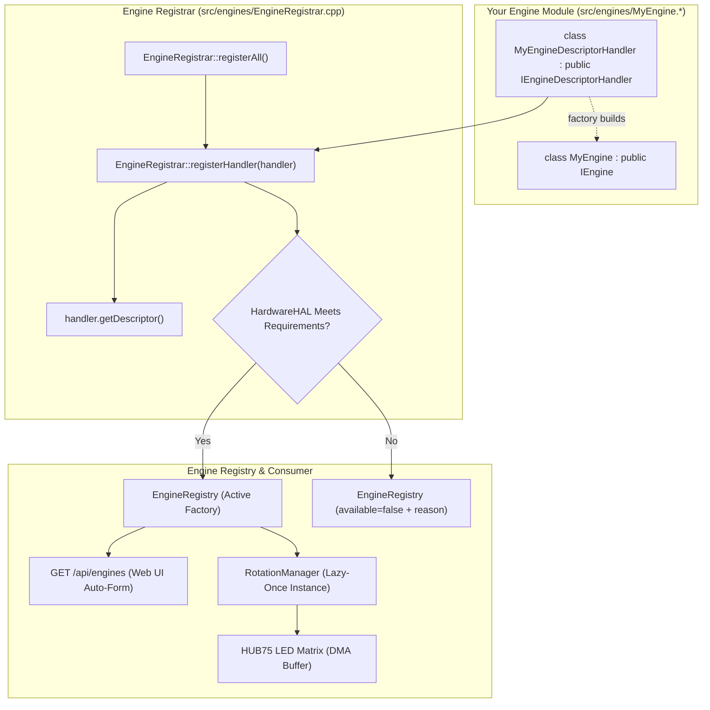
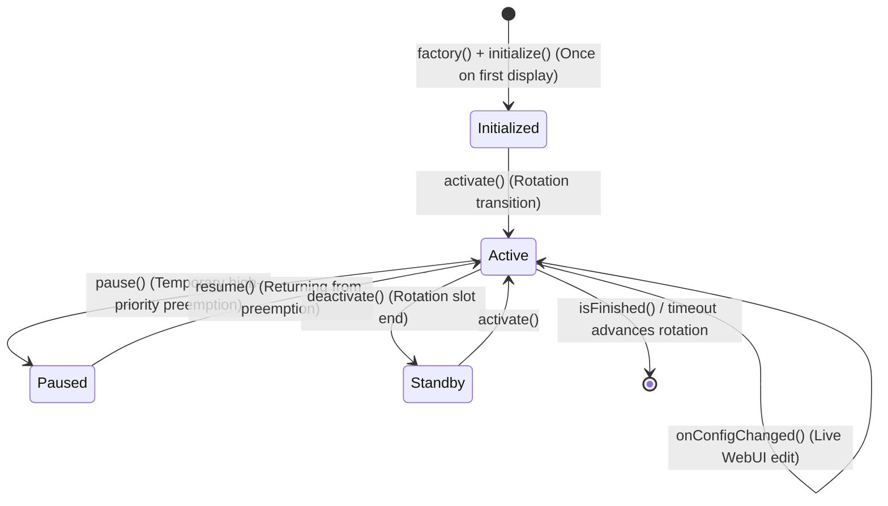

🇬🇧 English | 🇫🇷 [Français](DEVELOPER_FR.md) | 🇪🇸 [Español](DEVELOPER_ES.md)

# Developer Guide (ESP32 — C++)

This is the **complete, exhaustive** guide to extending ArcadeMatrix on ESP32 (written in **C++**). It explains the `IEngine` contract in full, the entire `ConfigField` schema (including **dynamic/custom option lists**, multiselect, conditional visibility and self-healing validation policies), hardware capability gating, and walks through building a new engine end-to-end.

> For the *why* behind the architecture (Registry, Lazy-Once, DisplayArbiter, FreeRTOS threading, overlay compositing), read [ARCHITECTURE.md](ARCHITECTURE.md). This guide is the practical *how-to*.

---

## Table of Contents

1. [Mental Model](#1-mental-model)
2. [The IEngine Contract in Full](#2-the-iengine-contract-in-full)
3. [The Lifecycle & Golden Rules](#3-the-lifecycle--golden-rules)
4. [Capabilities & Hardware Requirements](#4-capabilities--hardware-requirements)
5. [The ConfigSchema & ConfigField Reference](#5-the-configschema--configfield-reference)
6. [Custom / Dynamic Option Lists (`options_endpoint`)](#6-custom--dynamic-option-lists-options_endpoint)
7. [Multiselect Fields](#7-multiselect-fields)
8. [Conditional Fields (`visible_when`)](#8-conditional-fields-visible_when)
9. [Self-Healing Validation Policies](#9-self-healing-validation-policies)
10. [Tutorial: Create a New Engine Step-by-Step](#10-tutorial-create-a-new-engine-step-by-step)
11. [Tutorial: Add a Custom-List Endpoint](#11-tutorial-add-a-custom-list-endpoint)
12. [Tutorial: Add a New Clock Face / Theme Step-by-Step](#12-tutorial-add-a-new-clock-face--theme-step-by-step)
13. [Internationalization & Centralized i18n (Front & Back)](#13-internationalization--centralized-i18n-front--back)
14. [Reading Config in an Engine](#14-reading-config-in-an-engine)
15. [Rendering into the LED Matrix](#15-rendering-into-the-led-matrix)
16. [Testing & Local Compilation](#16-testing--local-compilation)
17. [Developer Checklist](#17-developer-checklist)

---

## 1. Mental Model

ArcadeMatrix has **no hardcoded list of display features** in `main.cpp`. Each engine is a decoupled plugin registered at startup in the central `EngineRegistry`.



Adding an engine requires **two simple steps**:
1. Implement your engine class (`IEngine`) and its companion descriptor handler (`IEngineDescriptorHandler`) in `src/engines/`.
2. Add your descriptor handler instance to the handlers array in `src/engines/EngineRegistrar.cpp`.

> [!NOTE]
> **Why `IEngineDescriptorHandler` on ESP32?**
> Rather than a monolithic registrar with hardcoded schemas (God Class), each engine defines and encapsulates its own metadata, config schema, requirements, and factory. The `EngineRegistrar` then automatically iterates over all handlers and performs runtime hardware gating before registering into `EngineRegistry`.

**`main.cpp` and WebUI HTML files are never edited.**

---

## 2. The IEngine Contract in Full

```cpp
class IDisplayGeometryAware {
public:
    virtual ~IDisplayGeometryAware() = default;
    virtual void onDisplayGeometryChanged(const DisplayGeometry& geometry) = 0;
};

class IEngine : public IDisplayGeometryAware {
public:
    virtual ~IEngine() = default;

    // --- Mandatory lifecycle ---
    virtual EngineError initialize(EngineContext* context, const EngineConfig* config) = 0;
    virtual void activate() = 0;
    virtual void update(EngineContext* context) = 0;
    virtual void render(EngineContext* context) = 0;
    virtual void deactivate() = 0;

    // --- Preemption lifecycle (optional hooks for temporary interruptions) ---
    virtual void pause() {}
    virtual void resume() {}

    // --- Optional (safe defaults provided) ---
    virtual void onConfigChanged(const EngineConfig* config) {}
    virtual void onDisplayGeometryChanged(const DisplayGeometry& geometry) override {}
    virtual bool isFinished() const { return false; }
    virtual bool isRealtime() const { return true; }
    virtual void setRotationBudget(uint32_t budget) {}
    virtual bool selfPaced() const { return false; }
};
```

| Method | Default | When to Override |
| :-- | :-- | :-- |
| `initialize()` | — | **Always.** Pre-allocate buffers, decode static bitmaps, load fonts. |
| `activate()` | — | **Always.** Cheap reset of transient state (chronometers, frame index). |
| `update()` | — | **Always.** Business and animation logic each frame. |
| `render()` | — | **Always.** Draw pixels into `context->getMatrix()`. |
| `deactivate()` | — | **Always.** Stop audio/network, close file handles when exiting rotation slot. |
| `pause()` | no-op | **Optional.** Called when temporarily preempted by a high-priority alert or message. Preserves internal state. |
| `resume()` | no-op | **Optional.** Called when returning from a temporary preemption without losing animation phase or timers. |
| `onConfigChanged()` | no-op | **If engine has settings.** Re-read values in place without recreation. |
| `onDisplayGeometryChanged()` | no-op | **If engine maintains geometry-derived caches** (e.g. column arrays). |
| `isFinished()` | `false` | If engine has an intrinsic end (e.g. cycle completed) to advance rotation early. |
| `isRealtime()` | `true` | Return `true` for 60 FPS animations; return `false` for static 20 FPS displays. |
| `setRotationBudget()`| no-op | If count-based (e.g. play N GIFs). Receives the rotation entry count. |
| `selfPaced()` | `false` | If true, duration timer does not force-advance; engine drives advance via `isFinished()`. |

---

## 3. The Lifecycle & Golden Rules



### Display Decision, Lifecycle & Preemption Matrix

The `DisplayArbiter` resolves display sources deterministically via a static priority scale and dispatches decisions to `DisplayRuntime`:

| Scenario | Action on Outgoing Engine | Action on Incoming Engine | Session State |
| :--- | :--- | :--- | :--- |
| **Temporary Preemption** (e.g. MQTT Alert on Clock) | `oldEngine->pause()` | `alertEngine->activate()` | Session ID increments; previous engine pinned for resume |
| **End of Preemption** (Returning to Clock) | `alertEngine->deactivate()` | `oldEngine->resume()` | Session ID increments; baseline engine resumed in-place |
| **Carousel Rotation** (e.g. Clock → Weather) | `oldEngine->deactivate()` | `newEngine->activate()` | Session ID increments; previous session cleanly torn down |

### Golden Rules for Embedded C++

1. **Golden Rule #1 — Zero Heap Allocation in Hot Loop:**
   Never instantiate `String`, `std::vector`, or call `malloc`/`new` inside `update()` or `render()`. Pre-allocate all buffers in `initialize()` and mutate in place.
2. **Golden Rule #2 — Lock-Free Hot Path & Zero Mutex on Core 1:**
   Core 1 runs `update() -> evaluate() -> render()` completely lock-free. Configuration is read via the Single-Reader Single-Writer (SRSW) Triple-Buffering protocol (`const ConfigSnapshot& snapshot = config.getSnapshot(); ... config.releaseSnapshot();`).
3. **Golden Rule #3 — Single Producer SPSC Cross-Core Commands:**
   Core 0 submits display requests via `m_displayArbiter.submitRequest(req)`. Core 1 owns the arbiter slots exclusively and drains commands in $O(1)$ without mutex contention.
4. **Golden Rule #4 — In-Place Hot Reload:**
   In `onConfigChanged()`, update internal variables directly. The instance is **not** destroyed or recreated.
5. **Golden Rule #5 — Respect Bus Locks:**
   SD card access must be protected with `sdMutex` when reading streaming assets.
6. **Golden Rule #6 — Overlays vs Selectable Engines:**
   - **Selectable Engine:** Replaces the primary framebuffer (e.g. Clock, Weather, GIF, Crypto). Registered in `EngineRegistry` with a descriptor, factory, and canonical `EngineHandle`.
   - **Transverse Overlay:** Composites additively on top of any active display source (e.g. Fighter). Managed exclusively by `OverlayManager`, enabled per rotation slot (`overlays.fighter: true`), never registered in `EngineRegistry`.

---

## 4. Capabilities & Hardware Requirements

Declared in the descriptor, these static hints tell the runtime and UI what the engine can do and what physical hardware it requires:

```cpp
struct EngineCapabilities {
    bool supports_128x32 = true;
    bool supports_256x64 = true;
    bool realtime = true;
    bool interruptible = true;
    bool selfPaced = false;
};

struct EngineRequirements {
    bool needsPsram = false;      // e.g. Crypto/Stock quote history caches
    bool needsAudio = false;      // e.g. Visualizer requiring ES7210/I2S mic
    bool needsTempSensor = false; // e.g. Indoor environment sensor
    bool needsGyroscope = false;  // Reserved for orientation
    bool needsNetwork = false;    // Weather, NTP, MQTT
    bool needsSd = false;         // GIF playback, MUGEN sprites
};
```

`EngineRegistrar::registerAll()` evaluates `HardwareHAL::capabilities()` at boot. If a requirement is not met, the engine is cleanly skipped with an explanatory reason (`reason = "Requires PSRAM"`), preventing Out-Of-Memory panics.

---

## 5. The ConfigSchema & ConfigField Reference

The schema is the **single source of truth** for both the WebUI form generator and the `ConfigSanitizer`:

```cpp
struct ConfigField {
    String id;                          // Key in config.json
    ConfigType type;                    // BOOLEAN, INTEGER, FLOAT, STRING, ENUM, COLOR, LIST
    String label;                       // WebUI label
    String description;                 // Tooltip text
    String default_value;               // Injected by sanitizer if missing
    bool required = false;
    String min_val = "";                // Numeric lower bound
    String max_val = "";                // Numeric upper bound
    String step = "";                   // UI stepper granularity
    String options = "";                // Comma-separated static choices
    String visible_when = "";           // Conditional visibility rule
    String options_endpoint = "";       // Dynamic choices endpoint
    bool multiple = false;              // Multiselect flag
    ValidationPolicy validation_policy; // Clamp, FallbackDefault, Reject, Accept
};
```

---

## 6. Custom / Dynamic Option Lists (`options_endpoint`)

When an engine's selectable options are generated dynamically (e.g. clock themes, SD fonts, GIF playlists), set `options_endpoint`:

```cpp
{
    .id = "theme",
    .type = ConfigType::ENUM,
    .label = "Clock Theme",
    .description = "Select pixel-art background theme",
    .default_value = "12",
    .options_endpoint = "/api/themes"
}
```

The WebUI queries `GET /api/themes` asynchronously and populates the `<select>` dropdown.

---

## 7. Multiselect Fields

To allow users to select multiple options (stored as a comma-separated string):

```cpp
{
    .id = "playlists",
    .type = ConfigType::LIST,
    .label = "Active Playlists",
    .description = "Select GIF folders to cycle through",
    .default_value = "arcade,retro",
    .options_endpoint = "/api/playlists",
    .multiple = true
}
```

---

## 8. Conditional Fields (`visible_when`)

Hide or show fields depending on another field's value:

```cpp
{
    .id = "custom_color",
    .type = ConfigType::COLOR,
    .label = "Custom Accent Color",
    .default_value = "#ff0055",
    .visible_when = "theme=20" // Only visible when Custom Gradient theme (20) is selected
}
```

---

## 9. Self-Healing Validation Policies

| Policy | Behavior on Out-of-Bounds Value |
| :-- | :-- |
| `ValidationPolicy::Clamp` | Restricts value to `[min_val, max_val]`. |
| `ValidationPolicy::FallbackDefault` | Resets invalid value to `default_value`. |
| `ValidationPolicy::Accept` | Accepts value as-is. |
| `ValidationPolicy::Reject` | Leaves field unmodified. |

---

## 10. Tutorial: Create a New Engine Step-by-Step

### Step 1: Create Header `src/engines/MatrixRainEngine.h`

```cpp
#pragma once
#include "../../include/core/EngineContract.h"
#include <Arduino.h>

class MatrixRainEngine : public IEngine {
public:
    MatrixRainEngine();
    ~MatrixRainEngine() override = default;

    EngineError initialize(EngineContext* context, const EngineConfig* config) override;
    void activate() override;
    void update(EngineContext* context) override;
    void render(EngineContext* context) override;
    void deactivate() override;
    void onConfigChanged(const EngineConfig* config) override;
    bool isRealtime() const override { return true; }

private:
    MatrixPanel_I2S_DMA* matrix = nullptr;
    int speed = 2;
    int dropY[128];
};
```

### Step 2: Implement Logic `src/engines/MatrixRainEngine.cpp`

```cpp
#include "MatrixRainEngine.h"

MatrixRainEngine::MatrixRainEngine() {
    memset(dropY, 0, sizeof(dropY));
}

EngineError MatrixRainEngine::initialize(EngineContext* context, const EngineConfig* config) {
    if (!context || !context->getMatrix()) return EngineError::InitializationFailed;
    matrix = context->getMatrix();
    if (config) speed = config->getInt("speed", 2);
    return EngineError::OK;
}

void MatrixRainEngine::activate() {
    for (int i = 0; i < 128; i++) dropY[i] = random(-32, 0);
}

void MatrixRainEngine::update(EngineContext* context) {
    if (!matrix) return;
    for (int x = 0; x < matrix->width(); x += 4) {
        dropY[x] += speed;
        if (dropY[x] > matrix->height()) dropY[x] = random(-16, 0);
    }
}

void MatrixRainEngine::render(EngineContext* context) {
    if (!matrix) return;
    matrix->fillScreen(0);
    for (int x = 0; x < matrix->width(); x += 4) {
        matrix->drawPixel(x, dropY[x], matrix->color565(0, 255, 70));
    }
}

void MatrixRainEngine::deactivate() {}

void MatrixRainEngine::onConfigChanged(const EngineConfig* config) {
    if (config) speed = config->getInt("speed", 2);
}
```

### Step 3: Implement `IEngineDescriptorHandler` in your Engine & Register

In your engine file (e.g. `src/engines/MatrixRainEngine.h` / `.cpp`):
```cpp
class MatrixRainEngineDescriptorHandler : public IEngineDescriptorHandler {
public:
    EngineDescriptor getDescriptor() const override {
        EngineDescriptor desc;
        desc.metadata = { "matrix_rain", "Matrix Digital Rain", "animations", FIRMWARE_VERSION };
        desc.capabilities = { .supports_128x32 = true, .supports_256x64 = true, .realtime = true };
        desc.requirements = { .needsPsram = false, .needsAudio = false };
        desc.schema.fields = {
            ConfigField("speed", ConfigType::INTEGER, "Fall Speed", "Falling speed in pixels per frame", "2", false, "1", "5", "1", "", "", false, "", ValidationPolicy::Clamp)
        };
        desc.factory = []() { return std::unique_ptr<IEngine>(new MatrixRainEngine()); };
        return desc;
    }
};
```

Then in `src/engines/EngineRegistrar.cpp`, simply add your handler instance:
```cpp
#include "MatrixRainEngine.h"

void EngineRegistrar::registerAll() {
    // ...
    static const MatrixRainEngineDescriptorHandler matrixRainHandler;

    const IEngineDescriptorHandler* handlers[] = {
        // ...
        &matrixRainHandler
    };

    for (const auto* handler : handlers) {
        if (handler) registerHandler(*handler);
    }
}
```

---

## 11. Tutorial: Add a Custom-List Endpoint

To serve dynamic options to the WebUI, register a route in `src/api/WebServerAPI.cpp`:

```cpp
server.on("/api/my_options", HTTP_GET, [](AsyncWebServerRequest *request){
    DynamicJsonDocument doc(512);
    JsonArray arr = doc.to<JsonArray>();
    
    JsonObject opt1 = arr.createNestedObject();
    opt1["id"] = "opt_a";
    opt1["name"] = "Option Alpha";
    
    JsonObject opt2 = arr.createNestedObject();
    opt2["id"] = "opt_b";
    opt2["name"] = "Option Beta";

    String response;
    serializeJson(doc, response);
    request->send(200, "application/json", response);
});
```

---

## 12. Tutorial: Add a New Clock Face / Theme Step-by-Step

Clocks in ArcadeMatrix are organized into modular `ClockFace` implementations managed by the core `ClockEngine`. To add a new visual theme or clock animation (e.g. *SpaceInvadersClock*):

### Step 1: Create `src/engines/clocks/SpaceInvadersClock.h` & `.cpp`

Inherit from the `ClockFace` base class (`src/engines/ClockEngine.h`):

```cpp
// src/engines/clocks/SpaceInvadersClock.h
#pragma once
#include "../ClockEngine.h"

class SpaceInvadersClock : public ClockFace {
public:
    SpaceInvadersClock(MatrixPanel_I2S_DMA* display, const EngineConfig* config = nullptr);
    void draw(const TimeData& t) override;
    void update() override;

private:
    int invaderFrame = 0;
    unsigned long lastAnimMs = 0;
};
```

```cpp
// src/engines/clocks/SpaceInvadersClock.cpp
#include "SpaceInvadersClock.h"

SpaceInvadersClock::SpaceInvadersClock(MatrixPanel_I2S_DMA* display, const EngineConfig* config)
    : ClockFace(display, config) {}

void SpaceInvadersClock::update() {
    if (millis() - lastAnimMs > 500) {
        invaderFrame = (invaderFrame + 1) % 2;
        lastAnimMs = millis();
    }
}

void SpaceInvadersClock::draw(const TimeData& t) {
    if (!matrix) return;
    matrix->fillScreen(0);
    // Draw animated invaders & formatted time digits
    matrix->setTextSize(1);
    matrix->setTextColor(matrix->color565(0, 255, 100));
    matrix->setCursor(24, 12);
    matrix->printf("%02d:%02d:%02d", t.hour, t.minute, t.second);
}
```

### Step 2: Add Theme Enum ID in `src/engines/DateEngine.h`

Add your new theme identifier to `PublisherTheme`:

```cpp
enum PublisherTheme {
    // ... existing themes (0 to 24)
    THEME_SPACE_INVADERS = 25
};
```

### Step 3: Wire into `ClockEngine::setTheme()` in `src/engines/ClockEngine.cpp`

Include your header and instantiate your `ClockFace`:

```cpp
#include "clocks/SpaceInvadersClock.h"

// In ClockEngine::setTheme():
case THEME_SPACE_INVADERS:
    activeFace = new SpaceInvadersClock(legacy_matrix, config);
    break;
```

### Step 4: Expose in `/api/themes` in `src/api/WebServerAPI.cpp`

Add your theme to the `themes` table so it automatically populates the WebUI dropdown:

```cpp
static const ThemeItem themes[] = {
    // ...
    { 25, "Space Invaders Clock" }
};
```

The WebUI will automatically show "Space Invaders Clock" in the theme dropdown, persist it in `config.json`, and apply it live via hot reload.

---

## 13. Internationalization & Centralized i18n (Front & Back)

ArcadeMatrix features a **fully centralized i18n architecture**.

> [!IMPORTANT]
> **Golden Rule: Never add a `lang` field to your engine's `ConfigSchema`.**
> Language is a global system setting (`system.lang`), chosen by the user in the WebUI header selector (`#lang-selector`). Any language change in the UI automatically sends a `POST /api/system` call and notifies all active engines in real time.

### A. Usage in C++ Engine (`#include "core/I18n.h"`)

All localized strings (weather day labels, weather conditions, text clock words, noise levels, etc.) are centralized in the `I18n` helper class:

```cpp
#include "core/I18n.h"

// 1. Get active language (FR, EN, ES)
Lang currentLang = I18n::getLang();

// 2. Weather day names (e.g., "TODAY", "TOM.", "MON"..)
const char* dayLabel = I18n::getWeatherDayLabel(dayOfWeek, isToday, isTomorrow);

// 3. Translated weather condition strings
String condition = I18n::getWeatherCondition("Thunderstorm with heavy rain");

// 4. WordClock full text lines
std::vector<String> lines = I18n::getWordClockLines(hours, minutes);

// 5. Noise / Decibel level statuses
const char* noise = I18n::getNoiseLevelLabel(levelIndex);
```

### B. Tutorial: Adding a New Language (e.g. German `de`) in 3 Steps

1. **Front-end WebUI (`data/index.html` or `i18n.js`):**
   Add the language code and label to `SUPPORTED_LANGUAGES` and provide translations in `translations`:
   ```javascript
   const SUPPORTED_LANGUAGES = [
     { code: 'fr', label: 'Français' },
     { code: 'en', label: 'English' },
     { code: 'es', label: 'Español' },
     { code: 'de', label: 'Deutsch' }
   ];
   ```
2. **ESP32 Back-end (`src/core/I18n.h` & `src/core/I18n.cpp`):**
   - Add `DE` to the `Lang` enum.
   - Implement localized day labels, conditions, WordClock words, and noise strings in `I18n.cpp`.
3. **Raspberry Pi Back-end (`src/core/i18n.rs`):**
   - Add `De` to `Lang` enum and provide mappings in the lookup tables.

---

## 14. Reading Config in an Engine

Engines receive an `EngineConfig` proxy:

```cpp
int speed = config->getInt("speed", 2);
String text = config->getString("title", "Arcade");
bool enabled = config->getBool("enabled", true);
float offset = config->getFloat("temp_offset", 0.0f);
```

---

## 15. Rendering into the LED Matrix & Responsive Geometry

Always obtain the matrix pointer via `context->getMatrix()`:

```cpp
MatrixPanel_I2S_DMA* matrix = context->getMatrix();
matrix->drawPixel(x, y, matrix->color565(r, g, b));
matrix->fillRect(x, y, w, h, color);
matrix->setCursor(x, y);
matrix->print("TEXT");
```
*Never call `flipDMABuffer()` inside an engine — the main display loop handles flipping centrally.*

### 15.1 The Golden Rule for Multi-Resolution & TATE Responsive Layouts

ArcadeMatrix displays can run in any resolution and orientation (`64x32`, `128x32`, `256x64`, `64x64`, `32x64`, `32x128`, `64x128`, `64x256`).

> [!IMPORTANT]
> **🏆 The Golden Rule of Engine Rendering:**
> 1. **Renderers must NEVER branch on `LayoutClass` or `if (w == 64 && h == 128)` directly.**
> 2. Create a companion pure `*LayoutCalculator` (e.g. `MyEngineLayoutCalculator::calculate(geometry)`) that produces a `MyEngineLayout` containing bounded `Rect`s.
> 3. The `render()` method draws exclusively into the provided `Rect`s.

#### Example: Responsive Music Engine
```cpp
// 1. Define bounded layout rectangles
struct MusicLayout {
    Rect artworkRect;
    Rect metadataRect;
    Rect progressRect;
    Rect visualizerRect;
};

// 2. Pure layout calculator
class MusicLayoutCalculator {
public:
    static MusicLayout calculate(const DisplayGeometry& geometry) {
        MusicLayout layout;
        if (geometry.layoutClass == LayoutClass::PORTRAIT || geometry.layoutClass == LayoutClass::TALL) {
            // Stack vertically: Artwork on top, metadata in middle, visualizer at bottom
            layout.artworkRect = { 2, 2, (uint16_t)(geometry.width - 4), (uint16_t)min((int)geometry.width - 4, (int)(geometry.height * 0.35f)) };
            layout.metadataRect = { 2, (int16_t)(layout.artworkRect.y + layout.artworkRect.height + 2), (uint16_t)(geometry.width - 4), 16 };
            layout.progressRect = { 2, (int16_t)(layout.metadataRect.y + 18), (uint16_t)(geometry.width - 4), 3 };
            layout.visualizerRect = { 2, (int16_t)(geometry.height - 12), (uint16_t)(geometry.width - 4), 10 };
        } else {
            // Landscape: Artwork on left, metadata and visualizer on right
            layout.artworkRect = { 2, 2, (uint16_t)(geometry.height - 4), (uint16_t)(geometry.height - 4) };
            layout.metadataRect = { (int16_t)(layout.artworkRect.width + 6), 2, (uint16_t)(geometry.width - layout.artworkRect.width - 8), 12 };
            layout.progressRect = { (int16_t)(layout.artworkRect.width + 6), 16, (uint16_t)(geometry.width - layout.artworkRect.width - 8), 2 };
            layout.visualizerRect = { (int16_t)(layout.artworkRect.width + 6), (int16_t)(geometry.height - 10), (uint16_t)(geometry.width - layout.artworkRect.width - 8), 8 };
        }
        return layout;
    }
};

// 3. Renderer consumes purely pre-bounded Rects
void MusicEngine::render(EngineContext* context) {
    MusicLayout layout = MusicLayoutCalculator::calculate(context->getGeometry());
    renderArtwork(layout.artworkRect);
    renderMetadata(layout.metadataRect);
    renderProgress(layout.progressRect);
    renderVisualizer(layout.visualizerRect);
}
```

#### Rebuilding Geometry-Derived Caches
Only implement `onDisplayGeometryChanged(const DisplayGeometry& geometry)` if your engine allocates fixed column counts, FFT arrays, or target grids (e.g. `MatrixRainClock`, `TetrisClock`, `VisualizerEngine`). Reallocate or adjust your caches non-destructively without resetting gameplay, scores, or timers.

---

## 16. Testing & Local Compilation

Compile both board targets locally:

```bash
# Standard ESP32
rtk pio run -e esp32dev

# Waveshare ESP32-S3
rtk pio run -e esp32s3_waveshare

# Run Unit Tests
rtk pio test -e esp32dev --without-uploading --without-testing
```

---

## 17. Developer Checklist

- [ ] `initialize()` allocates all memory; hot loop (`update`/`render`) has **zero dynamic allocations**.
- [ ] `onConfigChanged()` updates state in place without destroying the instance.
- [ ] Hardware requirements (`needsPsram`, `needsAudio`, `needsTempSensor`) are correctly declared.
- [ ] `options_endpoint` is provided for dynamic options.
- [ ] Localized strings use the centralized `I18n` module (no redundant `lang` field in schema).
- [ ] Code compiles cleanly on both `esp32dev` and `esp32s3_waveshare`.
