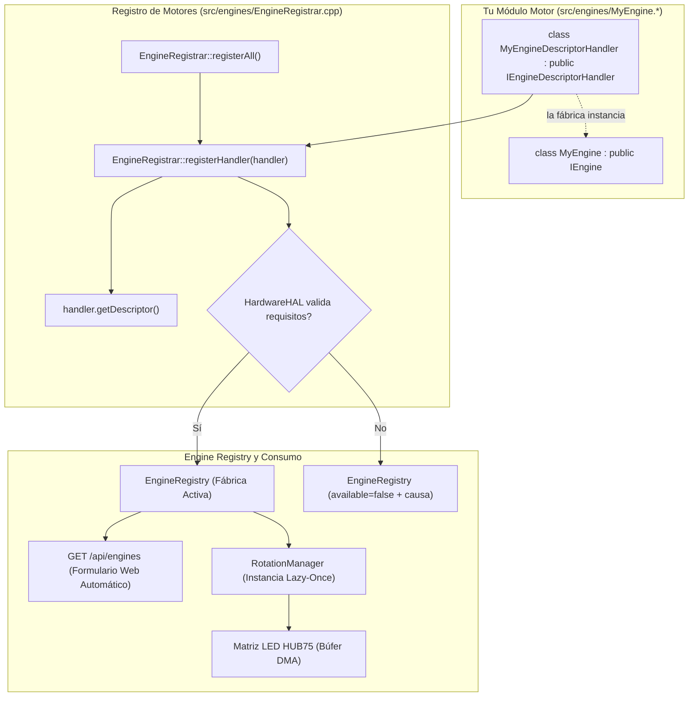

[English](DEVELOPER.md) | 🇫🇷 [Français](DEVELOPER_FR.md) | 🇪🇸 Español

# Guía para Desarrolladores (ESP32 — C++)

Esta es la guía **técnica exhaustiva** para extender ArcadeMatrix en ESP32 (desarrollado en **C++**). Explica en detalle el contrato `IEngine`, el esquema `ConfigField` completo (incluyendo **listas de opciones dinámicas**, selección múltiple, visibilidad condicional y políticas de autorreparación), el filtrado de capacidades de hardware y la creación de un motor paso a paso.

> Para comprender las decisiones de arquitectura (Registro, Lazy-Once, DisplayArbiter, subprocesos FreeRTOS, overlay), consulte [ARCHITECTURE_ES.md](ARCHITECTURE_ES.md). Esta guía es el manual práctico de implementación.

---

## Tabla de Contenidos

1. [Modelo Mental](#1-modelo-mental)
2. [El Contrato IEngine Completo](#2-el-contrato-iengine-completo)
3. [El Ciclo de Vida y Reglas de Oro](#3-el-ciclo-de-vida-y-reglas-de-oro)
4. [Capacidades y Requisitos de Hardware](#4-capacidades-y-requisitos-de-hardware)
5. [Referencia de ConfigSchema y ConfigField](#5-referencia-de-configschema-y-configfield)
6. [Listas de Opciones Dinámicas (`options_endpoint`)](#6-listas-de-opciones-dinámicas-options_endpoint)
7. [Campos de Selección Múltiple](#7-campos-de-selección-múltiple)
8. [Campos Condicionales (`visible_when`)](#8-campos-condicionales-visible_when)
9. [Políticas de Validación y Autorreparación](#9-políticas-de-validación-y-autorreparación)
10. [Tutorial: Crear un Nuevo Motor Paso a Paso](#10-tutorial-crear-un-nuevo-motor-paso-a-paso)
11. [Tutorial: Añadir un Endpoint de Opciones Dinámicas](#11-tutorial-añadir-un-endpoint-de-opciones-dinámicas)
12. [Tutorial: Añadir una Nueva Esfera / Tema de Reloj (ClockFace)](#12-tutorial-añadir-una-nueva-esfera--tema-de-reloj-clockface)
13. [Internacionalización y Centralización i18n (Front y Back)](#13-internacionalización-y-centralización-i18n-front-y-back)
14. [Lectura de Configuración en un Motor](#14-lectura-de-configuración-en-un-motor)
15. [Renderizado en la Matriz LED](#15-renderizado-en-la-matriz-led)
16. [Pruebas y Compilación Local](#16-pruebas-y-compilación-local)
17. [Lista de Verificación del Desarrollador](#17-lista-de-verificación-del-desarrollador)

---

## 1. Modelo Mental

ArcadeMatrix **no tiene ninguna lista de motores prefijada en código** en `main.cpp`. Cada motor se registra al arrancar en `EngineRegistry`.



Añadir un motor requiere **dos pasos sencillos**:
1. Implementar la clase del motor (`IEngine`) y su descriptor (`IEngineDescriptorHandler`) en `src/engines/`.
2. Añadir la instancia del descriptor a la lista de handlers en `src/engines/EngineRegistrar.cpp`.

> [!NOTE]
> **¿Por qué `IEngineDescriptorHandler` en ESP32?**
> En lugar de un registrador monolítico con esquemas prefijados en código (God Class), cada motor define y encapsula sus propios metadatos, esquema de configuración, requisitos de hardware y fábrica. `EngineRegistrar` itera automáticamente sobre todos los handlers y aplica el control de hardware en tiempo de ejecución antes de registrar en `EngineRegistry`.

**`main.cpp` y los archivos HTML del frontend nunca se modifican.**

---

## 2. El Contrato IEngine Completo

```cpp
class IEngine {
public:
    virtual ~IEngine() = default;

    // --- Ciclo de vida obligatorio ---
    virtual EngineError initialize(EngineContext* context, const EngineConfig* config) = 0;
    virtual void activate() = 0;
    virtual void update(EngineContext* context) = 0;
    virtual void render(EngineContext* context) = 0;
    virtual void deactivate() = 0;

    // --- Opcionales (con valores seguros por defecto) ---
    virtual void onConfigChanged(const EngineConfig* config) {}
    virtual bool isFinished() const { return false; }
    virtual bool isRealtime() const { return true; }
    virtual void setRotationBudget(uint32_t budget) {}
    virtual bool selfPaced() const { return false; }
    virtual bool allowsOverlay() const { return true; }
};
```

---

## 3. El Ciclo de Vida y Reglas de Oro

1. **Regla de Oro #1 — Cero Asignaciones en el Bucle Activo:** Nunca instancie `String`, `std::vector` ni use `malloc`/`new` en `update()` o `render()`. Preasigne todo en `initialize()`.
2. **Regla de Oro #2 — Hot Path Sin Bloqueos y Cero Mutex en Core 1:** El Core 1 ejecuta `update() -> evaluate() -> render()` de forma totalmente lock-free. La configuración se accede exclusivamente mediante el protocolo Single-Reader Single-Writer (SRSW) CAS linealizable (`ConfigSnapshotGuard guard = config.acquireSnapshot(); const auto& snapshot = guard.get();`).
3. **Regla de Oro #3 — Cola de Comandos SPSC Entre Núcleos:** El Core 0 envía las solicitudes de visualización mediante `m_displayArbiter.submitRequest(req)`. El Core 1 posee en exclusiva las ranuras de arbitraje y las consume en $O(1)$ sin contención de mutex.
4. **Regla de Oro #4 — Recarga en Caliente en el Lugar:** En `onConfigChanged()`, actualice directamente las variables miembro. La instancia **no** se destruye ni se recrea.
5. **Regla de Oro #5 — Propiedad SD de Grano Grueso, Nunca Bloqueo por Lectura:** `sdMutex` es un mutex FreeRTOS **no recursivo** (`xSemaphoreCreateMutex()`). Tómelo **una sola vez**, alrededor de una transacción SD completa (apertura, escaneo de directorio, lectura del archivo completo, cierre), y nunca dentro de un callback que esa misma transacción pueda reentrar: `AnimatedGIF` invoca sus callbacks de lectura/seek de forma síncrona desde `gif.open()`, por lo que bloquear ahí provoca un auto-bloqueo. Una vez abierto el handle de streaming, pertenece exclusivamente al Core 1 durante toda la sesión de reproducción y se lee **sin** bloqueo, según la Regla de Oro #2. Los productores del Core 0 (handlers HTTP, MQTT) deben usar siempre una espera **acotada** (`pdMS_TO_TICKS(...)`) y degradarse limpiamente: `portMAX_DELAY` en la tarea AsyncTCP congela todo el servidor web.
6. **Regla de Oro #6 — Overlays vs Motores Seleccionables:**
   - **Motor Seleccionable (Engine):** Reemplaza el framebuffer principal (ej: Reloj, Clima, GIF, Cripto). Registrado en `EngineRegistry` con descriptor y fábrica.
   - **Overlay Transversal:** Compone de forma aditiva sobre la fuente activa (ej: Fighter). Administrado exclusivamente por `OverlayManager`, activado por ranura de rotación (`overlays.fighter: true`), nunca registrado en `EngineRegistry`.
7. **Regla de Oro #7 — Protocolos de Red con Estado y Ciclo de Vida de Sockets (CastV2 / TLS):**
   - Los motores de streaming de red transversales (ej: `GoogleCastEngine`) DEBEN mantener una conexión `WiFiClientSecure` persistente entre ciclos de sondeo, con heartbeats de protocolo activos (CastV2 `PING` cada 5s en `urn:x-cast:com.google.cast.tp.heartbeat` hacia `receiver-0`).
   - NUNCA instanciar/destruir clientes TLS en un bucle de sondeo rápido (1-2s): los estados TCP `TIME_WAIT` persisten 120 segundos en lwIP. Los sockets se acumulan hasta el techo del SO (`fd 48`, `ECONNABORTED = 113`), privando a `AsyncWebServer` (puerto 80) y mDNS, provocando `ERR_ADDRESS_UNREACHABLE`.
   - El backoff de reconexión tras un fallo DEBE ser de al menos 15 segundos para acotar a 8 los descriptores `TIME_WAIT` concurrentes (muy por debajo del techo de 48).
   - **Limitación conocida:** incluso con la serialización (Regla de Oro #11), Google Cast puede ver denegada la admisión TLS indefinidamente una vez que la SRAM interna se estabiliza en un estado fragmentado (bloque más grande por debajo de ~16 KB) con otros motores activos — el descubrimiento mDNS teniendo éxito mientras el handshake nunca se completa se presenta actualmente como "Cast no funciona". Es una degradación aceptada, todavía no una solución real.
8. **Regla de Oro #8 — Jerarquía de Recursos: Servicios Críticos vs Overlays Oportunistas:**
   - Los servicios críticos (matriz de pantalla, servidor web Core 0, flujo de audio, Cast transversal, SDMMC) tienen ancho de banda y memoria reservados.
   - Los overlays oportunistas y decorativos (`FighterEngine`, `ArtworkService`) DEBEN ser estrictamente subordinados:
     * Nunca competir con los servicios críticos por RAM, DMA o ancho de banda del bus.
     * Detenerse inmediatamente ante el primer fallo de archivo o caída de memoria (`heap < 30 KB`, `dma < 16 KB`, `psram < 1 MB`), liberar cualquier asignación parcial y abortar sin intentar los archivos restantes.
     * Usar `NetworkBudget::canStartTlsSession()` antes de iniciar cualquier descarga HTTPS/TLS opcional.
9. **Regla de Oro #9 — Restricción de DMA de Hardware para Cripto y Almacenamiento:**
   - El SHA por hardware (`esp-sha`) en ESP32-S3 y la lectura de bloques SDMMC requieren memoria DMA interna contigua (`MALLOC_CAP_DMA | MALLOC_CAP_INTERNAL`). Si el DMA interno cae por debajo de 16 KB o el bloque DMA más grande cae por debajo de 4096 bytes, ocurrirán `esp-sha: Failed to allocate buf memory` y `sdmmc_read_blocks failed (257) (ESP_ERR_NO_MEM)`.
   - `NetworkBudget::canStartTlsSession()` debe evaluar el margen de DMA interno (`freeDma >= 16 KB`, `largestDma >= 4 KB`) además de la DRAM total antes de admitir handshakes TLS.
10. **Regla de Oro #10 — Recuperación de Periféricos de Ruta Única (Exclusivo del Core 0):**
    - Nunca ejecutar watchdogs de recuperación en paralelo entre núcleos.
    - Si el Core 1 detecta anomalías de hardware (ej: congelamiento de cero digital del ES7210), las evalúa sin bloqueo en $O(1)$ y señala una bandera atómica.
    - La recuperación (reinicialización I2C) se ejecuta exclusivamente en el Core 0 con limitación de tasa/cooldown acotados (3000 ms), completamente aislada del hot-path de renderizado de audio del Core 1.
11. **Regla de Oro #11 — mbedTLS Permanece 100% en SRAM Interna; Admitir y Serializar, Nunca Enrutar TLS a PSRAM:**
    - mbedTLS en esta placa DEBE usar el allocador estándar de ESP-IDF/Arduino (100% SRAM interna), igual que en `v3.1.0`. **No** reintroducir un hook `mbedtls_platform_set_calloc_free()` que enrute a PSRAM (el anterior `MbedTlsAllocator` fue eliminado precisamente por este motivo): las pruebas en hardware real demostraron que CUALQUIER asignación de mbedTLS en PSRAM — incluso solo los búferes de registro TLS de ~16 KB — corrompe la pantalla HUB75 en segundos, porque el framebuffer también reside en PSRAM y compite con mbedTLS por la caché PSRAM compartida a través del motor GDMA de HUB75. Ver `HardwareHAL::begin()` para el comentario completo de causa raíz.
    - Dado que la SRAM interna debe servir ahora TLS, DMA y red simultáneamente, cada punto de conexión TLS DEBE construir un `NetworkBudget::ScopedTlsHandshakeLock` inmediatamente antes de `WiFiClientSecure::connect()` y abortar (`if (!tlsLock) { ...; return; }`) si no logra adquirirlo. Es un único mutex global: **solo un handshake TLS puede estar en curso en todo el firmware a la vez.**
    - Límite de admisión estricto, revalidado **atómicamente dentro del constructor del bloqueo** (no solo como verificación previa separada): `NetworkBudget::canStartTlsSession()` requiere `freeInternal >= 45 KB` y capacidad verificada de doble búfer (sea `largestInternalBlock >= 34.5 KB` o dos bloques independientes de 16.5 KB) para satisfacer los búferes concurrentes in/out de mbedTLS (~33.4 KB en total). Se permite una verificación previa antes incluso de intentar el bloqueo, como optimización barata para evitar bloquearse en un mutex disputado cuando el presupuesto ya se sabe insuficiente, pero nunca es autoritativa por sí sola — el tiempo de espera por contención del mutex (hasta 5s) es suficiente para que un handshake concurrente invalide un resultado "OK" anterior. Solo la revalidación posterior a la adquisición, dentro del constructor, es autoritativa.
    - *Nota de seguridad:* al volver mbedTLS a ser 100% SRAM interna, ya no hay ninguna preocupación de residencia en PSRAM que documentar para material sensible de TLS.
12. **Regla de Oro #12 — Acceso a SD vía `SdLockGuard`, Nunca `xSemaphoreTake`/`Give` Manual:**
    - Use `SdLockGuard guard(timeoutTicks); if (!guard) { ...; return; }` (`src/core/SdLockGuard.h`) para cada adquisición de `sdMutex`. Es un wrapper RAII que garantiza la liberación del mutex en cada camino de retorno (incluyendo retornos anticipados), eliminando el riesgo de fuga de bloqueo de los pares manuales `xSemaphoreTake(...) ... xSemaphoreGive(...)` que de otro modo deberían duplicarse en cada camino de salida.
    - Esto no relaja la Regla de Oro #5: el bloqueo sigue tomándose de grano grueso alrededor de toda una transacción SD, nunca dentro de callbacks de streaming por cuadro/byte (`GIFReadFile`/`GIFSeekFile` permanecen deliberadamente **sin bloqueo**, ya que el handle de archivo se abre una sola vez bajo `SdLockGuard` y luego pertenece exclusivamente al Core 1 durante el resto de la sesión de reproducción).
13. **Regla de Oro #13 — Barrera de Liberación en el Retiro de Motores (Anti-UAF):**
    - Antes de que el `unique_ptr` de un motor se mueva a `EngineRetirementQueue` para su destrucción en el Core 0, `RotationManager::retireEngineSlot()` DEBE, en orden: (1) llamar a `deactivate()`, (2) limpiar `currentActiveInstanceId` si coincide, (3) llamar a `DisplayRuntime::purgeEngineReferences(engine, instanceId)` para eliminar el puntero de `m_session.activeEngine` y de la pila de preempción, (4) marcar `EngineResourceState::CORE1_RELEASED`, (5) borrar la ranura local `instanceId`. Solo después de estos cinco pasos puede el motor entregarse al Core 0. Nunca duplicar esta secuencia en línea en otro lugar — siempre llamar a `retireEngineSlot()`.
14. **Regla de Oro #14 — Segregación de Dominios de Memoria y Prioridad a PSRAM para Búferes Grandes :**
    - Mover las asignaciones de documentos JSON de la aplicación (`WebServerAPI`, endpoints REST) a PSRAM mediante `SpiRamJsonDocument`; AsyncTCP/lwIP y las asignaciones internas del servidor permanecen en sus dominios de DRAM interna requeridos.
    - Los búferes gráficos grandes fuera de DMA directo (como el canvas de 32 KB de `GifEngine`) DEBEN priorizar la asignación en PSRAM (`MALLOC_CAP_SPIRAM | MALLOC_CAP_8BIT`) cuando hay PSRAM disponible, reservando la DRAM interna para mbedTLS y la red LwIP.
    - La pila de la tarea en segundo plano AsyncTCP se dimensiona en 8192 bytes y se fija estrictamente al Core 0 (`CONFIG_ASYNC_TCP_RUNNING_CORE=0`) para proteger el hot-path de renderizado del Core 1 (Invariante 1).
    - Los servicios de red persistentes (Google Cast) DEBEN implementar backoff exponencial (5s, 10s, 20s, 60s) inicializado ante la caída de sesión, evitando tormentas de reconexión durante ráfagas de tráfico HTTP/LwIP.

---

## 4. Capacidades y Requisitos de Hardware

```cpp
struct EngineCapabilities {
    bool supports_128x32 = true;
    bool supports_256x64 = true;
    bool realtime = true;
    bool interruptible = true;
    bool selfPaced = false;
};

struct EngineRequirements {
    bool needsPsram = false;      // ej: Historial Cripto/Bolsa
    bool needsAudio = false;      // ej: Visualizador micro I2S
    bool needsTempSensor = false; // ej: Sensor temperatura SHTC3
    bool needsGyroscope = false;
    bool needsNetwork = false;
    bool needsSd = false;
};
```

---

## 5. Referencia de ConfigSchema y ConfigField

```cpp
struct ConfigField {
    String id;                          // Clave en config.json
    ConfigType type;                    // BOOLEAN, INTEGER, FLOAT, STRING, ENUM, COLOR, LIST
    String label;                       // Etiqueta en UI
    String description;                 // Información emergente
    String default_value;               // Valor por defecto
    bool required = false;
    String min_val = "";                // Límite inferior
    String max_val = "";                // Límite superior
    String step = "";                   // Paso numérico
    String options = "";                // Opciones separadas por coma
    String visible_when = "";           // Regla de visibilidad condicional
    String options_endpoint = "";       // Endpoint de opciones dinámicas
    bool multiple = false;              // Selección múltiple
    ValidationPolicy validation_policy; // Clamp, FallbackDefault, Reject, Accept
};
```

---

## 6. Listas de Opciones Dinámicas (`options_endpoint`)

```cpp
{
    .id = "theme",
    .type = ConfigType::ENUM,
    .label = "Tema del reloj",
    .default_value = "12",
    .options_endpoint = "/api/themes"
}
```

---

## 7. Campos de Selección Múltiple

```cpp
{
    .id = "playlists",
    .type = ConfigType::LIST,
    .label = "Playlists Activas",
    .default_value = "arcade,retro",
    .options_endpoint = "/api/playlists",
    .multiple = true
}
```

---

## 8. Campos Condicionales (`visible_when`)

```cpp
{
    .id = "custom_color",
    .type = ConfigType::COLOR,
    .label = "Color Personalizado",
    .default_value = "#ff0055",
    .visible_when = "theme=20"
}
```

---

## 9. Políticas de Validación y Autorreparación

- `Clamp`: Ajusta el valor entre `min_val` y `max_val`.
- `FallbackDefault`: Restablece a `default_value` si el valor es inválido.
- `Accept`: Acepta el valor tal cual.

---

## 10. Tutorial: Crear un Nuevo Motor Paso a Paso

### Paso 1: Crear `src/engines/MatrixRainEngine.h`
```cpp
#pragma once
#include "../../include/core/EngineContract.h"
#include <Arduino.h>

class MatrixRainEngine : public IEngine {
public:
    MatrixRainEngine();
    ~MatrixRainEngine() override = default;

    EngineError initialize(EngineContext* context, const EngineConfig* config) override;
    void activate() override;
    void update(EngineContext* context) override;
    void render(EngineContext* context) override;
    void deactivate() override;
    void onConfigChanged(const EngineConfig* config) override;
    bool isRealtime() const override { return true; }

private:
    MatrixPanel_I2S_DMA* matrix = nullptr;
    int speed = 2;
    int dropY[128];
};
```

### Paso 2: Implementar `src/engines/MatrixRainEngine.cpp`
```cpp
#include "MatrixRainEngine.h"

MatrixRainEngine::MatrixRainEngine() {
    memset(dropY, 0, sizeof(dropY));
}

EngineError MatrixRainEngine::initialize(EngineContext* context, const EngineConfig* config) {
    if (!context || !context->getMatrix()) return EngineError::InitializationFailed;
    matrix = context->getMatrix();
    if (config) speed = config->getInt("speed", 2);
    return EngineError::OK;
}

void MatrixRainEngine::activate() {
    for (int i = 0; i < 128; i++) dropY[i] = random(-32, 0);
}

void MatrixRainEngine::update(EngineContext* context) {
    if (!matrix) return;
    for (int x = 0; x < matrix->width(); x += 4) {
        dropY[x] += speed;
        if (dropY[x] > matrix->height()) dropY[x] = random(-16, 0);
    }
}

void MatrixRainEngine::render(EngineContext* context) {
    if (!matrix) return;
    matrix->fillScreen(0);
    for (int x = 0; x < matrix->width(); x += 4) {
        matrix->drawPixel(x, dropY[x], matrix->color565(0, 255, 70));
    }
}

void MatrixRainEngine::deactivate() {}

void MatrixRainEngine::onConfigChanged(const EngineConfig* config) {
    if (config) speed = config->getInt("speed", 2);
}
```

### Paso 3: Implementar `IEngineDescriptorHandler` y registrar

En el archivo de su motor (ej. `src/engines/MatrixRainEngine.h` / `.cpp`):
```cpp
class MatrixRainEngineDescriptorHandler : public IEngineDescriptorHandler {
public:
    EngineDescriptor getDescriptor() const override {
        EngineDescriptor desc;
        desc.metadata = { "matrix_rain", "Matrix Rain", "animations", FIRMWARE_VERSION };
        desc.capabilities = { .supports_128x32 = true, .supports_256x64 = true, .realtime = true };
        desc.requirements = { .needsPsram = false, .needsAudio = false };
        desc.schema.fields = {
            ConfigField("speed", ConfigType::INTEGER, "Velocidad", "Velocidad de caída en píxeles por frame", "2", false, "1", "5", "1", "", "", false, "", ValidationPolicy::Clamp)
        };
        desc.factory = []() { return std::unique_ptr<IEngine>(new MatrixRainEngine()); };
        return desc;
    }
};
```

Luego en `src/engines/EngineRegistrar.cpp`, simplemente añada la instancia del handler:
```cpp
#include "MatrixRainEngine.h"

void EngineRegistrar::registerAll() {
    // ...
    static const MatrixRainEngineDescriptorHandler matrixRainHandler;

    const IEngineDescriptorHandler* handlers[] = {
        // ...
        &matrixRainHandler
    };

    for (const auto* handler : handlers) {
        if (handler) registerHandler(*handler);
    }
}
```

---

## 11. Tutorial: Añadir un Endpoint de Opciones Dinámicas

```cpp
server.on("/api/my_options", HTTP_GET, [](AsyncWebServerRequest *request){
    DynamicJsonDocument doc(512);
    JsonArray arr = doc.to<JsonArray>();
    JsonObject o1 = arr.createNestedObject();
    o1["id"] = "1"; o1["name"] = "Modo A";
    String response;
    serializeJson(doc, response);
    request->send(200, "application/json", response);
});
```

---

## 12. Tutorial: Añadir una Nueva Esfera / Tema de Reloj (ClockFace)

En ArcadeMatrix, la visualización de la hora es gestionada por un motor central (`ClockEngine`) que delega el renderizado visual a módulos especializados que implementan la interfaz `ClockFace`. Para crear un nuevo reloj animado (ej: *SpaceInvadersClock*):

### Paso 1: Crear `src/engines/clocks/SpaceInvadersClock.h` y `.cpp`

Heredar de la clase abstracta `ClockFace` (`src/engines/ClockEngine.h`):

```cpp
// src/engines/clocks/SpaceInvadersClock.h
#pragma once
#include "../ClockEngine.h"

class SpaceInvadersClock : public ClockFace {
public:
    SpaceInvadersClock(MatrixPanel_I2S_DMA* display, const EngineConfig* config = nullptr);
    void draw(const TimeData& t) override;
    void update() override;

private:
    int invaderFrame = 0;
    unsigned long lastAnimMs = 0;
};
```

```cpp
// src/engines/clocks/SpaceInvadersClock.cpp
#include "SpaceInvadersClock.h"

SpaceInvadersClock::SpaceInvadersClock(MatrixPanel_I2S_DMA* display, const EngineConfig* config)
    : ClockFace(display, config) {}

void SpaceInvadersClock::update() {
    if (millis() - lastAnimMs > 500) {
        invaderFrame = (invaderFrame + 1) % 2;
        lastAnimMs = millis();
    }
}

void SpaceInvadersClock::draw(const TimeData& t) {
    if (!matrix) return;
    matrix->fillScreen(0);
    matrix->setTextSize(1);
    matrix->setTextColor(matrix->color565(0, 255, 100));
    matrix->setCursor(24, 12);
    matrix->printf("%02d:%02d:%02d", t.hour, t.minute, t.second);
}
```

### Paso 2: Declarar el Enum en `src/engines/DateEngine.h`

Añada el identificador del tema en `PublisherTheme`:

```cpp
enum PublisherTheme {
    // ... temas existentes
    THEME_SPACE_INVADERS = 25
};
```

### Paso 3: Instanciar en `ClockEngine::setTheme()` (`src/engines/ClockEngine.cpp`)

Incluya la cabecera e instancie su `ClockFace`:

```cpp
#include "clocks/SpaceInvadersClock.h"

// En ClockEngine::setTheme():
case THEME_SPACE_INVADERS:
    activeFace = new SpaceInvadersClock(legacy_matrix, config);
    break;
```

### Paso 4: Exponer en `/api/themes` (`src/api/WebServerAPI.cpp`)

Añada el tema en la tabla `themes` para rellenar automáticamente el menú desplegable de la interfaz Web:

```cpp
static const ThemeItem themes[] = {
    // ...
    { 25, "Space Invaders Clock" }
};
```

La interfaz Web mostrará automáticamente la nueva opción, la guardará en `config.json` y la recargará en caliente sin reiniciar.

---

## 13. Internacionalización y Centralización i18n (Front y Back)

ArcadeMatrix utiliza una arquitectura **i18n completamente centralizada**.

> [!IMPORTANT]
> **Regla de oro: Nunca añada un campo `lang` en el esquema de sus motores (`ConfigSchema`).**
> El idioma es una configuración global del sistema (`system.lang`), seleccionada por el usuario a través del selector superior de la interfaz Web (`#lang-selector`). Cualquier cambio en la interfaz envía automáticamente una llamada `POST /api/system` y propaga el nuevo idioma a los motores activos en tiempo real.

### A. Uso en un motor C++ (`#include "core/I18n.h"`)

Todos los textos localizados (días de la semana, condiciones climáticas, palabras del reloj de texto, niveles de decibelios, etc.) están centralizados en la clase auxiliar `I18n`:

```cpp
#include "core/I18n.h"

// 1. Obtener idioma activo (FR, EN, ES)
Lang currentLang = I18n::getLang();

// 2. Nombres de días meteorológicos (ej: "HOY", "MAÑ.", "LUN"..)
const char* dayLabel = I18n::getWeatherDayLabel(dayOfWeek, isToday, isTomorrow);

// 3. Traducción de condiciones climáticas
String condition = I18n::getWeatherCondition("Thunderstorm with heavy rain");

// 4. Líneas completas del reloj de texto (WordClock)
std::vector<String> lines = I18n::getWordClockLines(hours, minutes);

// 5. Niveles de ruido / decibelios
const char* noise = I18n::getNoiseLevelLabel(levelIndex);
```

### B. Tutorial: Añadir un nuevo idioma (ej: Alemán `de`) en 3 pasos

1. **Front-end WebUI (`data/index.html` o `i18n.js`):**
   Añada el código y nombre del idioma a `SUPPORTED_LANGUAGES` y proporcione las traducciones en `translations`:
   ```javascript
   const SUPPORTED_LANGUAGES = [
     { code: 'fr', label: 'Français' },
     { code: 'en', label: 'English' },
     { code: 'es', label: 'Español' },
     { code: 'de', label: 'Deutsch' }
   ];
   ```
2. **Back-end ESP32 (`src/core/I18n.h` & `src/core/I18n.cpp`):**
   - Añada `DE` al enum `Lang`.
   - Implemente las cadenas correspondientes en los métodos estáticos de `I18n.cpp`.
3. **Back-end Raspberry Pi (`src/core/i18n.rs`):**
   - Añada `De` al enum `Lang` y complete las tablas de búsqueda.

---

## 14. Lectura de Configuración en un Motor

```cpp
int speed = config->getInt("speed", 2);
String text = config->getString("title", "Arcade");
bool enabled = config->getBool("enabled", true);
float offset = config->getFloat("temp_offset", 0.0f);
```

---

## 15. Renderizado en la Matriz LED

ArcadeMatrix v4 abstrae el renderizado detrás de la interfaz independiente del hardware `IDrawingSurface` (que hereda de `Adafruit_GFX`). Obtenga siempre la superficie mediante `context->getSurface()`:

```cpp
IDrawingSurface* surface = context->getSurface();
surface->drawPixel(x, y, surface->color565(r, g, b));
surface->fillRect(x, y, w, h, color);
surface->setCursor(x, y);
surface->print("TEXT");

// O transferencia por bloques optimizada para animaciones continuas (GIFs, fighters):
surface->blit565(canvasBuffer, width, height);
```
*(Por compatibilidad hacia atrás, `context->getMatrix()` se mantiene como pasarela que devuelve `MatrixPanel_I2S_DMA*`).
*Nunca llame a `flipDMABuffer()` en el motor — el bucle principal lo gestiona de forma centralizada.*

### 15.1 Vídeo en Movimiento Completo, Streaming de Canvas y FastBlit (`blitCanvas565`)

En paneles de alta resolución (`256x64`) con búfer DMA en PSRAM, las escrituras píxel por píxel (`drawPixel()`) sufren penalizaciones por operaciones de lectura-modificación-escritura en múltiples planos de bits, limitando las animaciones a 7–14 FPS.

Para motores de animación a pantalla completa (clips de vídeo, secuencias arcade continuas):
1. **Renderizar en un búfer de memoria canvas RGB565 de 16 bits en PSRAM** (`uint16_t* canvasBuffer`).
2. **Transmitir mediante FastBlit:** Llame a `matrixEngine.blitCanvas565(canvasBuffer, width, height)`. Esto ejecuta escrituras en ráfagas secuenciales por fila directamente en las palabras de planos DMA del back-buffer, eliminando el coste por píxel y completando una copia completa de 256×64 en **~26 ms** (30 a 33+ FPS constantes).
3. **Desactivar overlays:** Si su motor requiere máxima fluidez, anule `bool allowsOverlay() const override { return false; }`.

### 15.2 Overlays vs Lienzo de Fondo (Composición Transparente)

Los overlays (como `FighterEngine`) se superponen dinámicamente al motor de fondo:
- **Nunca borrar con rectángulos opacos:** **No** llame a `fillRect(..., 0)` para limpiar cuadros delimitadores anteriores. El motor subyacente (ej: `TetrisClock`) redibuja todo su cuadro en cada tick. Dibujar rectángulos negros crearía huecos opacos en los números del reloj y en el fondo.
- **Trazado estrictamente transparente:** Compruebe los colores antes de dibujar (`if (color != anim->transparentColor) matrix->drawPixel(...)`).
- **Borrado de pantalla (`fillScreen(0)`):** Cuando un motor limpia su fondo, `FastMatrixPanel::fillScreen(0)` enmascara automáticamente los bits de color (`BITMASK_RGB12_CLEAR`) en el búfer trasero inactivo. Nunca toca el búfer frontal en emisión física, eliminando cualquier parpadeo de barrido o líneas de desgarro.

---

## 16. Pruebas y Compilación Local

```bash
# ESP32 Estándar
rtk pio run -e esp32dev

# Waveshare ESP32-S3
rtk pio run -e esp32s3_waveshare
```

---

## 17. Lista de Verificación del Desarrollador

- [ ] `initialize()` realiza todas las asignaciones de memoria; el bucle activo (`update`/`render`) tiene **cero asignaciones dinámicas**.
- [ ] `onConfigChanged()` actualiza el estado sin destruir la instancia.
- [ ] Los requisitos de hardware (`needsPsram`, `needsAudio`, `needsTempSensor`) están declarados.
- [ ] Las cadenas traducidas utilizan el módulo centralizado `I18n` (ningún campo `lang` redundante en el esquema).
- [ ] La compilación se completa sin errores en `esp32dev` y `esp32s3_waveshare`.
