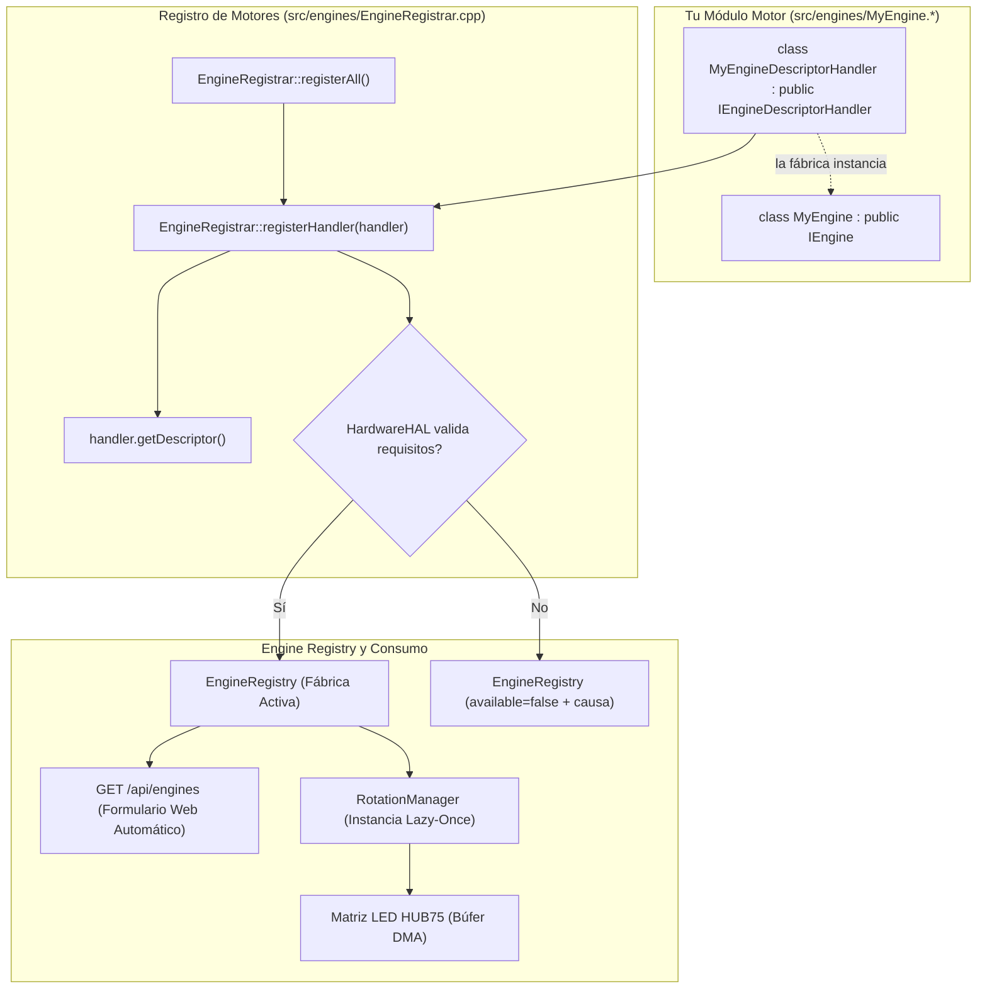

[English](DEVELOPER.md) | 🇫🇷 [Français](DEVELOPER_FR.md) | 🇪🇸 Español

# Guía para Desarrolladores (ESP32 — C++)

Esta es la guía **técnica exhaustiva** para extender ArcadeMatrix en ESP32 (desarrollado en **C++**). Explica en detalle el contrato `IEngine`, el esquema `ConfigField` completo (incluyendo **listas de opciones dinámicas**, selección múltiple, visibilidad condicional y políticas de autorreparación), el filtrado de capacidades de hardware y la creación de un motor paso a paso.

> Para comprender las decisiones de arquitectura (Registro, Lazy-Once, DisplayArbiter, subprocesos FreeRTOS, overlay), consulte [ARCHITECTURE_ES.md](ARCHITECTURE_ES.md). Esta guía es el manual práctico de implementación.

---

## Tabla de Contenidos

1. [Modelo Mental](#1-modelo-mental)
2. [El Contrato IEngine Completo](#2-el-contrato-iengine-completo)
3. [El Ciclo de Vida y Reglas de Oro](#3-el-ciclo-de-vida-y-reglas-de-oro)
4. [Capacidades y Requisitos de Hardware](#4-capacidades-y-requisitos-de-hardware)
5. [Referencia de ConfigSchema y ConfigField](#5-referencia-de-configschema-y-configfield)
6. [Listas de Opciones Dinámicas (`options_endpoint`)](#6-listas-de-opciones-dinámicas-options_endpoint)
7. [Campos de Selección Múltiple](#7-campos-de-selección-múltiple)
8. [Campos Condicionales (`visible_when`)](#8-campos-condicionales-visible_when)
9. [Políticas de Validación y Autorreparación](#9-políticas-de-validación-y-autorreparación)
10. [Tutorial: Crear un Nuevo Motor Paso a Paso](#10-tutorial-crear-un-nuevo-motor-paso-a-paso)
11. [Tutorial: Añadir un Endpoint de Opciones Dinámicas](#11-tutorial-añadir-un-endpoint-de-opciones-dinámicas)
12. [Tutorial: Añadir una Nueva Esfera / Tema de Reloj (ClockFace)](#12-tutorial-añadir-una-nueva-esfera--tema-de-reloj-clockface)
13. [Lectura de Configuración en un Motor](#13-lectura-de-configuración-en-un-motor)
14. [Renderizado en la Matriz LED](#14-renderizado-en-la-matriz-led)
15. [Pruebas y Compilación Local](#15-pruebas-y-compilación-local)
16. [Lista de Verificación del Desarrollador](#16-lista-de-verificación-del-desarrollador)

---

## 1. Modelo Mental

ArcadeMatrix **no tiene ninguna lista de motores prefijada en código** en `main.cpp`. Cada motor se registra al arrancar en `EngineRegistry`.



Añadir un motor requiere **dos pasos sencillos**:
1. Implementar la clase del motor (`IEngine`) y su descriptor (`IEngineDescriptorHandler`) en `src/engines/`.
2. Añadir la instancia del descriptor a la lista de handlers en `src/engines/EngineRegistrar.cpp`.

> [!NOTE]
> **¿Por qué `IEngineDescriptorHandler` en ESP32?**
> En lugar de un registrador monolítico con esquemas prefijados en código (God Class), cada motor define y encapsula sus propios metadatos, esquema de configuración, requisitos de hardware y fábrica. `EngineRegistrar` itera automáticamente sobre todos los handlers y aplica el control de hardware en tiempo de ejecución antes de registrar en `EngineRegistry`.

**`main.cpp` y los archivos HTML del frontend nunca se modifican.**

---

## 2. El Contrato IEngine Completo

```cpp
class IEngine {
public:
    virtual ~IEngine() = default;

    // --- Ciclo de vida obligatorio ---
    virtual EngineError initialize(EngineContext* context, const EngineConfig* config) = 0;
    virtual void activate() = 0;
    virtual void update(EngineContext* context) = 0;
    virtual void render(EngineContext* context) = 0;
    virtual void deactivate() = 0;

    // --- Opcionales (con valores seguros por defecto) ---
    virtual void onConfigChanged(const EngineConfig* config) {}
    virtual bool isFinished() const { return false; }
    virtual bool isRealtime() const { return true; }
    virtual void setRotationBudget(uint32_t budget) {}
    virtual bool selfPaced() const { return false; }
    virtual bool allowsOverlay() const { return true; }
};
```

---

## 3. El Ciclo de Vida y Reglas de Oro

1. **Regla de Oro #1 — Cero Asignaciones en el Bucle Activo:** Nunca instancie `String`, `std::vector` ni use `malloc`/`new` en `update()` o `render()`. Preasigne todo en `initialize()`.
2. **Regla de Oro #2 — Recarga en Caliente en el Lugar:** En `onConfigChanged()`, actualice directamente las variables miembro.
3. **Regla de Oro #3 — Bloqueos de Bus SD:** Las lecturas en la tarjeta SD deben protegerse con `sdMutex`.

---

## 4. Capacidades y Requisitos de Hardware

```cpp
struct EngineCapabilities {
    bool supports_128x32 = true;
    bool supports_256x64 = true;
    bool realtime = true;
    bool interruptible = true;
    bool allowsOverlay = true;
    bool selfPaced = false;
};

struct EngineRequirements {
    bool needsPsram = false;      // ej: Historial Cripto/Bolsa
    bool needsAudio = false;      // ej: Visualizador micro I2S
    bool needsTempSensor = false; // ej: Sensor temperatura SHTC3
    bool needsGyroscope = false;
    bool needsNetwork = false;
    bool needsSd = false;
};
```

---

## 5. Referencia de ConfigSchema y ConfigField

```cpp
struct ConfigField {
    String id;                          // Clave en config.json
    ConfigType type;                    // BOOLEAN, INTEGER, FLOAT, STRING, ENUM, COLOR, LIST
    String label;                       // Etiqueta en UI
    String description;                 // Información emergente
    String default_value;               // Valor por defecto
    bool required = false;
    String min_val = "";                // Límite inferior
    String max_val = "";                // Límite superior
    String step = "";                   // Paso numérico
    String options = "";                // Opciones separadas por coma
    String visible_when = "";           // Regla de visibilidad condicional
    String options_endpoint = "";       // Endpoint de opciones dinámicas
    bool multiple = false;              // Selección múltiple
    ValidationPolicy validation_policy; // Clamp, FallbackDefault, Reject, Accept
};
```

---

## 6. Listas de Opciones Dinámicas (`options_endpoint`)

```cpp
{
    .id = "theme",
    .type = ConfigType::ENUM,
    .label = "Tema del reloj",
    .default_value = "12",
    .options_endpoint = "/api/themes"
}
```

---

## 7. Campos de Selección Múltiple

```cpp
{
    .id = "playlists",
    .type = ConfigType::LIST,
    .label = "Playlists Activas",
    .default_value = "arcade,retro",
    .options_endpoint = "/api/playlists",
    .multiple = true
}
```

---

## 8. Campos Condicionales (`visible_when`)

```cpp
{
    .id = "custom_color",
    .type = ConfigType::COLOR,
    .label = "Color Personalizado",
    .default_value = "#ff0055",
    .visible_when = "theme=20"
}
```

---

## 9. Políticas de Validación y Autorreparación

- `Clamp`: Ajusta el valor entre `min_val` y `max_val`.
- `FallbackDefault`: Restablece a `default_value` si el valor es inválido.
- `Accept`: Acepta el valor tal cual.

---

## 10. Tutorial: Crear un Nuevo Motor Paso a Paso

### Paso 1: Crear `src/engines/MatrixRainEngine.h`
```cpp
#pragma once
#include "../../include/core/EngineContract.h"
#include <Arduino.h>

class MatrixRainEngine : public IEngine {
public:
    MatrixRainEngine();
    ~MatrixRainEngine() override = default;

    EngineError initialize(EngineContext* context, const EngineConfig* config) override;
    void activate() override;
    void update(EngineContext* context) override;
    void render(EngineContext* context) override;
    void deactivate() override;
    void onConfigChanged(const EngineConfig* config) override;
    bool isRealtime() const override { return true; }

private:
    MatrixPanel_I2S_DMA* matrix = nullptr;
    int speed = 2;
    int dropY[128];
};
```

### Paso 2: Implementar `src/engines/MatrixRainEngine.cpp`
```cpp
#include "MatrixRainEngine.h"

MatrixRainEngine::MatrixRainEngine() {
    memset(dropY, 0, sizeof(dropY));
}

EngineError MatrixRainEngine::initialize(EngineContext* context, const EngineConfig* config) {
    if (!context || !context->getMatrix()) return EngineError::InitializationFailed;
    matrix = context->getMatrix();
    if (config) speed = config->getInt("speed", 2);
    return EngineError::OK;
}

void MatrixRainEngine::activate() {
    for (int i = 0; i < 128; i++) dropY[i] = random(-32, 0);
}

void MatrixRainEngine::update(EngineContext* context) {
    if (!matrix) return;
    for (int x = 0; x < matrix->width(); x += 4) {
        dropY[x] += speed;
        if (dropY[x] > matrix->height()) dropY[x] = random(-16, 0);
    }
}

void MatrixRainEngine::render(EngineContext* context) {
    if (!matrix) return;
    matrix->fillScreen(0);
    for (int x = 0; x < matrix->width(); x += 4) {
        matrix->drawPixel(x, dropY[x], matrix->color565(0, 255, 70));
    }
}

void MatrixRainEngine::deactivate() {}

void MatrixRainEngine::onConfigChanged(const EngineConfig* config) {
    if (config) speed = config->getInt("speed", 2);
}
```

### Paso 3: Implementar `IEngineDescriptorHandler` y registrar

En el archivo de su motor (ej. `src/engines/MatrixRainEngine.h` / `.cpp`):
```cpp
class MatrixRainEngineDescriptorHandler : public IEngineDescriptorHandler {
public:
    EngineDescriptor getDescriptor() const override {
        EngineDescriptor desc;
        desc.metadata = { "matrix_rain", "Matrix Rain", "animations", "3.0.0" };
        desc.capabilities = { .supports_128x32 = true, .supports_256x64 = true, .realtime = true, .allowsOverlay = false };
        desc.requirements = { .needsPsram = false, .needsAudio = false };
        desc.schema.fields = {
            ConfigField("speed", ConfigType::INTEGER, "Velocidad", "Velocidad de caída en píxeles por frame", "2", false, "1", "5", "1", "", "", false, "", ValidationPolicy::Clamp)
        };
        desc.factory = []() { return std::unique_ptr<IEngine>(new MatrixRainEngine()); };
        return desc;
    }
};
```

Luego en `src/engines/EngineRegistrar.cpp`, simplemente añada la instancia del handler:
```cpp
#include "MatrixRainEngine.h"

void EngineRegistrar::registerAll() {
    // ...
    static const MatrixRainEngineDescriptorHandler matrixRainHandler;

    const IEngineDescriptorHandler* handlers[] = {
        // ...
        &matrixRainHandler
    };

    for (const auto* handler : handlers) {
        if (handler) registerHandler(*handler);
    }
}
```

---

## 11. Tutorial: Añadir un Endpoint de Opciones Dinámicas

```cpp
server.on("/api/my_options", HTTP_GET, [](AsyncWebServerRequest *request){
    DynamicJsonDocument doc(512);
    JsonArray arr = doc.to<JsonArray>();
    JsonObject o1 = arr.createNestedObject();
    o1["id"] = "1"; o1["name"] = "Modo A";
    String response;
    serializeJson(doc, response);
    request->send(200, "application/json", response);
});
```

---

## 12. Tutorial: Añadir una Nueva Esfera / Tema de Reloj (ClockFace)

En ArcadeMatrix, la visualización de la hora es gestionada por un motor central (`ClockEngine`) que delega el renderizado visual a módulos especializados que implementan la interfaz `ClockFace`. Para crear un nuevo reloj animado (ej: *SpaceInvadersClock*):

### Paso 1: Crear `src/engines/clocks/SpaceInvadersClock.h` y `.cpp`

Heredar de la clase abstracta `ClockFace` (`src/engines/ClockEngine.h`):

```cpp
// src/engines/clocks/SpaceInvadersClock.h
#pragma once
#include "../ClockEngine.h"

class SpaceInvadersClock : public ClockFace {
public:
    SpaceInvadersClock(MatrixPanel_I2S_DMA* display, const EngineConfig* config = nullptr);
    void draw(const TimeData& t) override;
    void update() override;

private:
    int invaderFrame = 0;
    unsigned long lastAnimMs = 0;
};
```

```cpp
// src/engines/clocks/SpaceInvadersClock.cpp
#include "SpaceInvadersClock.h"

SpaceInvadersClock::SpaceInvadersClock(MatrixPanel_I2S_DMA* display, const EngineConfig* config)
    : ClockFace(display, config) {}

void SpaceInvadersClock::update() {
    if (millis() - lastAnimMs > 500) {
        invaderFrame = (invaderFrame + 1) % 2;
        lastAnimMs = millis();
    }
}

void SpaceInvadersClock::draw(const TimeData& t) {
    if (!matrix) return;
    matrix->fillScreen(0);
    matrix->setTextSize(1);
    matrix->setTextColor(matrix->color565(0, 255, 100));
    matrix->setCursor(24, 12);
    matrix->printf("%02d:%02d:%02d", t.hour, t.minute, t.second);
}
```

### Paso 2: Declarar el Enum en `src/engines/DateEngine.h`

Añada el identificador del tema en `PublisherTheme`:

```cpp
enum PublisherTheme {
    // ... temas existentes
    THEME_SPACE_INVADERS = 25
};
```

### Paso 3: Instanciar en `ClockEngine::setTheme()` (`src/engines/ClockEngine.cpp`)

Incluya la cabecera e instancie su `ClockFace`:

```cpp
#include "clocks/SpaceInvadersClock.h"

// En ClockEngine::setTheme():
case THEME_SPACE_INVADERS:
    activeFace = new SpaceInvadersClock(legacy_matrix, config);
    break;
```

### Paso 4: Exponer en `/api/themes` (`src/api/WebServerAPI.cpp`)

Añada el tema en la tabla `themes` para rellenar automáticamente el menú desplegable de la interfaz Web:

```cpp
static const ThemeItem themes[] = {
    // ...
    { 25, "Space Invaders Clock" }
};
```

La interfaz Web mostrará automáticamente la nueva opción, la guardará en `config.json` y la recargará en caliente sin reiniciar.

---

## 13. Lectura de Configuración en un Motor

```cpp
int speed = config->getInt("speed", 2);
String text = config->getString("title", "Arcade");
bool enabled = config->getBool("enabled", true);
float offset = config->getFloat("temp_offset", 0.0f);
```

---

## 14. Renderizado en la Matriz LED

```cpp
MatrixPanel_I2S_DMA* matrix = context->getMatrix();
matrix->drawPixel(x, y, matrix->color565(r, g, b));
matrix->fillRect(x, y, w, h, color);
```
*Nunca llame a `flipDMABuffer()` en el motor — el bucle principal lo gestiona de forma centralizada.*

---

## 15. Pruebas y Compilación Local

```bash
# ESP32 Estándar
pio run -e esp32dev

# Waveshare ESP32-S3
pio run -e esp32s3_waveshare
```

---

## 16. Lista de Verificación del Desarrollador

- [ ] `initialize()` realiza todas las asignaciones de memoria; el bucle activo (`update`/`render`) tiene **cero asignaciones dinámicas**.
- [ ] `onConfigChanged()` actualiza el estado sin destruir la instancia.
- [ ] Los requisitos de hardware (`needsPsram`, `needsAudio`, `needsTempSensor`) están declarados.
- [ ] La compilación se completa sin errores en `esp32dev` y `esp32s3_waveshare`.
