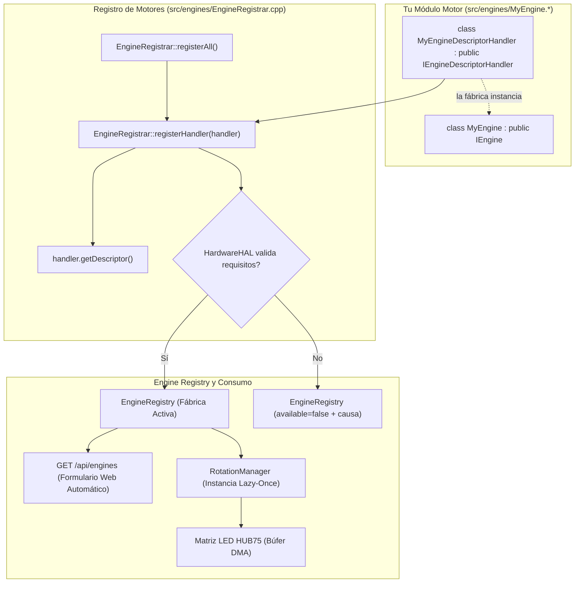
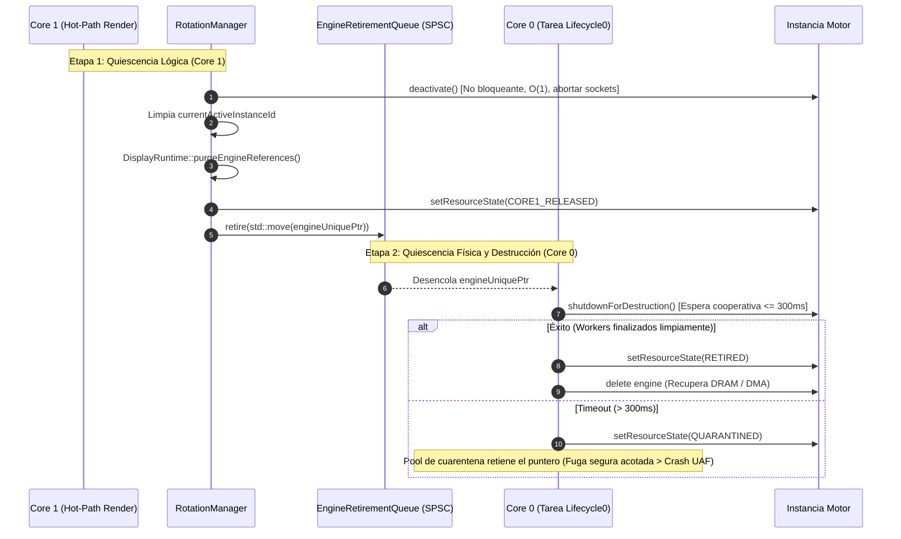

[English](DEVELOPER.md) | 🇫🇷 [Français](DEVELOPER_FR.md) | 🇪🇸 Español

# Guía para Desarrolladores (ESP32 — C++)

Esta es la guía **técnica exhaustiva** para extender ArcadeMatrix en ESP32 (desarrollado en **C++**). Explica en detalle el contrato `IEngine`, el esquema `ConfigField` completo (incluyendo **listas de opciones dinámicas**, selección múltiple, visibilidad condicional y políticas de autorreparación), el filtrado de capacidades de hardware y la creación de un motor paso a paso.

> Para comprender las decisiones de arquitectura (Registro, Lazy-Once, DisplayArbiter, subprocesos FreeRTOS, overlay), consulte [ARCHITECTURE_ES.md](ARCHITECTURE_ES.md). Esta guía es el manual práctico de implementación.

---

## Tabla de Contenidos

1. [Modelo Mental](#1-modelo-mental)
2. [El Contrato IEngine Completo](#2-el-contrato-iengine-completo)
3. [El Ciclo de Vida y Reglas de Oro](#3-el-ciclo-de-vida-y-reglas-de-oro)
4. [Capacidades y Requisitos de Hardware](#4-capacidades-y-requisitos-de-hardware)
5. [Referencia de ConfigSchema y ConfigField](#5-referencia-de-configschema-y-configfield)
6. [Listas de Opciones Dinámicas (`options_endpoint`)](#6-listas-de-opciones-dinámicas-options_endpoint)
7. [Campos de Selección Múltiple](#7-campos-de-selección-múltiple)
8. [Campos Condicionales (`visible_when`)](#8-campos-condicionales-visible_when)
9. [Políticas de Validación y Autorreparación](#9-políticas-de-validación-y-autorreparación)
10. [Tutorial: Crear un Nuevo Motor Paso a Paso](#10-tutorial-crear-un-nuevo-motor-paso-a-paso)
11. [Tutorial: Añadir un Endpoint de Opciones Dinámicas](#11-tutorial-añadir-un-endpoint-de-opciones-dinámicas)
12. [Tutorial: Añadir una Nueva Esfera / Tema de Reloj (ClockFace)](#12-tutorial-añadir-una-nueva-esfera--tema-de-reloj-clockface)
13. [Internacionalización y Centralización i18n (Front y Back)](#13-internacionalización-y-centralización-i18n-front-y-back)
14. [Lectura de Configuración en un Motor](#14-lectura-de-configuración-en-un-motor)
15. [Renderizado en la Matriz LED](#15-renderizado-en-la-matriz-led)
16. [Pruebas y Compilación Local](#16-pruebas-y-compilación-local)
17. [Lista de Verificación del Desarrollador](#17-lista-de-verificación-del-desarrollador)

---

## 1. Modelo Mental

ArcadeMatrix **no tiene ninguna lista de motores prefijada en código** en `main.cpp`. Cada motor se registra al arrancar en `EngineRegistry`.


```mermaid
flowchart TD
    subgraph ModuloMotor["Tu Módulo Motor (src/engines/MyEngine.*)"]
        ENG["class MyEngine : public IEngine"]
        HND["class MyEngineDescriptorHandler : public IEngineDescriptorHandler"]
        HND -.->|"la fábrica instancia"| ENG
    end

    subgraph Registro["Registro de Motores (src/engines/EngineRegistrar.cpp)"]
        REGT["EngineRegistrar::registerAll()"]
        REGT --> CALL["EngineRegistrar::registerHandler(handler)"]
        CALL --> GET["handler.getDescriptor()"]
        CALL --> GATING{HardwareHAL valida requisitos?}
    end

    subgraph Core["Engine Registry y Consumo"]
        GATING -->|"Sí"| REG["EngineRegistry (Fábrica Activa)"]
        GATING -->|"No"| REG2["EngineRegistry (available=false + causa)"]
        REG --> API["GET /api/engines (Formulario Web Automático)"]
        REG --> RM["RotationManager (Instancia Lazy-Once)"]
        RM --> SCREEN["Matriz LED HUB75 (Búfer DMA)"]
    end

    HND --> CALL
```

Añadir un motor requiere **dos pasos sencillos**:
1. Implementar la clase del motor (`IEngine`) y su descriptor (`IEngineDescriptorHandler`) en `src/engines/`.
2. Añadir la instancia del descriptor a la lista de handlers en `src/engines/EngineRegistrar.cpp`.

> [!NOTE]
> **¿Por qué `IEngineDescriptorHandler` en ESP32?**
> En lugar de un registrador monolítico con esquemas prefijados en código (God Class), cada motor define y encapsula sus propios metadatos, esquema de configuración, requisitos de hardware y fábrica. `EngineRegistrar` itera automáticamente sobre todos los handlers y aplica el control de hardware en tiempo de ejecución antes de registrar en `EngineRegistry`.

**`main.cpp` y los archivos HTML del frontend nunca se modifican.**

---

## 2. El Contrato IEngine Completo

```cpp
class IEngine {
public:
    virtual ~IEngine() = default;

    // --- Ciclo de vida obligatorio ---
    virtual EngineError initialize(EngineContext* context, const EngineConfig* config) = 0;
    virtual void activate() = 0;
    virtual void update(EngineContext* context) = 0;
    virtual void render(EngineContext* context) = 0;
    virtual void deactivate() = 0;

    // --- Destrucción física en Core 0 ---
    virtual bool shutdownForDestruction() { return true; }

    // --- Opcionales (con valores seguros por defecto) ---
    virtual void pause() {}
    virtual void resume() {}
    virtual void onConfigChanged(const EngineConfig* config) {}
    virtual bool isFinished() const { return false; }
    virtual bool isRealtime() const { return true; }
    virtual void setRotationBudget(uint32_t budget) {}
    virtual bool selfPaced() const { return false; }
    virtual bool allowsOverlay() const { return true; }
};
```

| Método | Por Defecto | Cuándo Sobrescribirlo |
| :--- | :--- | :--- |
| `initialize()` | — | **Siempre.** Validar contexto/superficie, asignar búferes e inicializar configuración. |
| `activate()` | — | **Siempre.** Reiniciar fase de animación, temporizadores o programar primer refresco. |
| `update()` | — | **Siempre.** Avanzar física/simulación, actualizar coordenadas de sprites. Cero dibujo. |
| `render()` | — | **Siempre.** Dibujar píxeles en `context->getSurface()`. |
| `deactivate()` | — | **Siempre.** Quiescencia lógica no bloqueante en Core 1: desacoplar superficie, cancelar sockets, fijar banderas de parada. Cero esperas, cero asignaciones. |
| `shutdownForDestruction()` | `return true;` | **Si el motor tiene tareas en segundo plano.** Quiescencia física en Core 0: esperar cooperativamente a que terminen los workers, liberar pilas de tareas y búferes DMA antes de borrar la instancia. |
| `pause()` | no-op | **Opcional.** Invocado ante preempción temporal por alerta de alta prioridad. Conserva el estado interno. |
| `resume()` | no-op | **Opcional.** Invocado al regresar de una preempción sin perder la fase de animación ni los temporizadores. |
| `onConfigChanged()` | no-op | **Si el motor tiene ajustes.** Recargar parámetros en el lugar sin recrear la instancia. |

---

## 3. El Ciclo de Vida y Reglas de Oro

1. **Regla de Oro #1 — Cero Asignaciones en el Bucle Activo:** Nunca instancie `String`, `std::vector` ni use `malloc`/`new` en `update()` o `render()`. Preasigne todo en `initialize()`.
2. **Regla de Oro #2 — Hot Path Sin Bloqueos y Cero Mutex en Core 1:** El Core 1 ejecuta `update() -> evaluate() -> render()` de forma totalmente lock-free. La configuración se accede exclusivamente mediante el protocolo Single-Reader Single-Writer (SRSW) CAS linealizable (`ConfigSnapshotGuard guard = config.acquireSnapshot(); const auto& snapshot = guard.get();`).
3. **Regla de Oro #3 — Cola de Comandos SPSC Entre Núcleos:** El Core 0 envía las solicitudes de visualización mediante `m_displayArbiter.submitRequest(req)`. El Core 1 posee en exclusiva las ranuras de arbitraje y las consume en $O(1)$ sin contención de mutex.
4. **Regla de Oro #4 — Recarga en Caliente en el Lugar:** En `onConfigChanged()`, actualice directamente las variables miembro. La instancia **no** se destruye ni se recrea.
5. **Regla de Oro #5 — Propiedad SD de Grano Grueso, Nunca Bloqueo por Lectura:** `sdMutex` es un mutex FreeRTOS **no recursivo** (`xSemaphoreCreateMutex()`). Tómelo **una sola vez**, alrededor de una transacción SD completa (apertura, escaneo de directorio, lectura del archivo completo, cierre), y nunca dentro de un callback que esa misma transacción pueda reentrar: `AnimatedGIF` invoca sus callbacks de lectura/seek de forma síncrona desde `gif.open()`, por lo que bloquear ahí provoca un auto-bloqueo. Una vez abierto el handle de streaming, pertenece exclusivamente al Core 1 durante toda la sesión de reproducción y se lee **sin** bloqueo, según la Regla de Oro #2. Los productores del Core 0 (handlers HTTP, MQTT) deben usar siempre una espera **acotada** (`pdMS_TO_TICKS(...)`) y degradarse limpiamente: `portMAX_DELAY` en la tarea AsyncTCP congela todo el servidor web.
6. **Regla de Oro #6 — Overlays vs Motores Seleccionables:**
   - **Motor Seleccionable (Engine):** Reemplaza el framebuffer principal (ej: Reloj, Clima, GIF, Cripto). Registrado en `EngineRegistry` con descriptor y fábrica.
   - **Overlay Transversal:** Compone de forma aditiva sobre la fuente activa (ej: Fighter). Administrado exclusivamente por `OverlayManager`, activado por ranura de rotación (`overlays.fighter: true`), nunca registrado en `EngineRegistry`.
7. **Regla de Oro #7 — Protocolos de Red con Estado y Ciclo de Vida de Sockets (CastV2 / TLS):**
   - Los motores de streaming de red transversales (ej: `GoogleCastEngine`) DEBEN mantener una conexión `WiFiClientSecure` persistente entre ciclos de sondeo, con heartbeats de protocolo activos (CastV2 `PING` cada 5s en `urn:x-cast:com.google.cast.tp.heartbeat` hacia `receiver-0`).
   - NUNCA instanciar/destruir clientes TLS en un bucle de sondeo rápido (1-2s): los estados TCP `TIME_WAIT` persisten 120 segundos en lwIP. Los sockets se acumulan hasta el techo del SO (`fd 48`, `ECONNABORTED = 113`), privando a `AsyncWebServer` (puerto 80) y mDNS, provocando `ERR_ADDRESS_UNREACHABLE`.
   - El backoff de reconexión tras un fallo DEBE ser de al menos 15 segundos para acotar a 8 los descriptores `TIME_WAIT` concurrentes (muy por debajo del techo de 48).
   - **Limitación conocida:** incluso con la serialización (Regla de Oro #11), Google Cast puede ver denegada la admisión TLS indefinidamente una vez que la SRAM interna se estabiliza en un estado fragmentado (bloque más grande por debajo de ~16 KB) con otros motores activos — el descubrimiento mDNS teniendo éxito mientras el handshake nunca se completa se presenta actualmente como "Cast no funciona". Es una degradación aceptada, todavía no una solución real.
8. **Regla de Oro #8 — Jerarquía de Recursos: Servicios Críticos vs Overlays Oportunistas:**
   - Los servicios críticos (matriz de pantalla, servidor web Core 0, flujo de audio, Cast transversal, SDMMC) tienen ancho de banda y memoria reservados.
   - Los overlays oportunistas y decorativos (`FighterEngine`, `ArtworkService`) DEBEN ser estrictamente subordinados:
     * Nunca competir con los servicios críticos por RAM, DMA o ancho de banda del bus.
     * Detenerse inmediatamente ante el primer fallo de archivo o caída de memoria (`heap < 30 KB`, `dma < 16 KB`, `psram < 1 MB`), liberar cualquier asignación parcial y abortar sin intentar los archivos restantes.
     * Usar `NetworkBudget::canStartTlsSession()` antes de iniciar cualquier descarga HTTPS/TLS opcional.
9. **Regla de Oro #9 — Restricción de DMA de Hardware para Cripto y Almacenamiento:**
   - El SHA por hardware (`esp-sha`) en ESP32-S3 y la lectura de bloques SDMMC requieren memoria DMA interna contigua (`MALLOC_CAP_DMA | MALLOC_CAP_INTERNAL`). Si el DMA interno cae por debajo de 16 KB o el bloque DMA más grande cae por debajo de 4096 bytes, ocurrirán `esp-sha: Failed to allocate buf memory` y `sdmmc_read_blocks failed (257) (ESP_ERR_NO_MEM)`.
   - `NetworkBudget::canStartTlsSession()` debe evaluar el margen de DMA interno (`freeDma >= 16 KB`, `largestDma >= 4 KB`) además de la DRAM total antes de admitir handshakes TLS.
10. **Regla de Oro #10 — Recuperación de Periféricos de Ruta Única (Exclusivo del Core 0):**
    - Nunca ejecutar watchdogs de recuperación en paralelo entre núcleos.
    - Si el Core 1 detecta anomalías de hardware (ej: congelamiento de cero digital del ES7210), las evalúa sin bloqueo en $O(1)$ y señala una bandera atómica.
    - La recuperación (reinicialización I2C) se ejecuta exclusivamente en el Core 0 con limitación de tasa/cooldown acotados (3000 ms), completamente aislada del hot-path de renderizado de audio del Core 1.
11. **Regla de Oro #11 — mbedTLS Permanece 100% en SRAM Interna; Admitir y Serializar, Nunca Enrutar TLS a PSRAM:**
    - mbedTLS en esta placa DEBE usar el allocador estándar de ESP-IDF/Arduino (100% SRAM interna), igual que en `v3.1.0`. **No** reintroducir un hook `mbedtls_platform_set_calloc_free()` que enrute a PSRAM (el anterior `MbedTlsAllocator` fue eliminado precisamente por este motivo): las pruebas en hardware real demostraron que CUALQUIER asignación de mbedTLS en PSRAM — incluso solo los búferes de registro TLS de ~16 KB — corrompe la pantalla HUB75 en segundos, porque el framebuffer también reside en PSRAM y compite con mbedTLS por la caché PSRAM compartida a través del motor GDMA de HUB75. Ver `HardwareHAL::begin()` para el comentario completo de causa raíz.
    - Dado que la SRAM interna debe servir ahora TLS, DMA y red simultáneamente, cada punto de conexión TLS DEBE construir un `NetworkBudget::ScopedTlsHandshakeLock` inmediatamente antes de `WiFiClientSecure::connect()` y abortar (`if (!tlsLock) { ...; return; }`) si no logra adquirirlo. Es un único mutex global: **solo un handshake TLS puede estar en curso en todo el firmware a la vez.**
    - Límite de admisión estricto, revalidado **atómicamente dentro del constructor del bloqueo** (no solo como verificación previa separada): `NetworkBudget::canStartTlsSession()` requiere `freeInternal >= 45 KB` y capacidad verificada de doble búfer (sea `largestInternalBlock >= 34.5 KB` o dos bloques independientes de 16.5 KB) para satisfacer los búferes concurrentes in/out de mbedTLS (~33.4 KB en total). Se permite una verificación previa antes incluso de intentar el bloqueo, como optimización barata para evitar bloquearse en un mutex disputado cuando el presupuesto ya se sabe insuficiente, pero nunca es autoritativa por sí sola — el tiempo de espera por contención del mutex (hasta 5s) es suficiente para que un handshake concurrente invalide un resultado "OK" anterior. Solo la revalidación posterior a la adquisición, dentro del constructor, es autoritativa.
    - *Nota de seguridad:* al volver mbedTLS a ser 100% SRAM interna, ya no hay ninguna preocupación de residencia en PSRAM que documentar para material sensible de TLS.
12. **Regla de Oro #12 — Acceso a SD vía `SdLockGuard`, Nunca `xSemaphoreTake`/`Give` Manual:**
    - Use `SdLockGuard guard(timeoutTicks); if (!guard) { ...; return; }` (`src/core/SdLockGuard.h`) para cada adquisición de `sdMutex`. Es un wrapper RAII que garantiza la liberación del mutex en cada camino de retorno (incluyendo retornos anticipados), eliminando el riesgo de fuga de bloqueo de los pares manuales `xSemaphoreTake(...) ... xSemaphoreGive(...)` que de otro modo deberían duplicarse en cada camino de salida.
    - Esto no relaja la Regla de Oro #5: el bloqueo sigue tomándose de grano grueso alrededor de toda una transacción SD, nunca dentro de callbacks de streaming por cuadro/byte (`GIFReadFile`/`GIFSeekFile` permanecen deliberadamente **sin bloqueo**, ya que el handle de archivo se abre una sola vez bajo `SdLockGuard` y luego pertenece exclusivamente al Core 1 durante el resto de la sesión de reproducción).
13. **Regla de Oro #13 — Barrera de Liberación en el Retiro de Motores (Anti-UAF):**
    - Antes de que el `unique_ptr` de un motor se mueva a `EngineRetirementQueue` para su destrucción en el Core 0, `RotationManager::retireEngineSlot()` DEBE, en orden: (1) llamar a `deactivate()`, (2) limpiar `currentActiveInstanceId` si coincide, (3) llamar a `DisplayRuntime::purgeEngineReferences(engine, instanceId)` para eliminar el puntero de `m_session.activeEngine` y de la pila de preempción, (4) marcar `EngineResourceState::CORE1_RELEASED`, (5) borrar la ranura local `instanceId`. Solo después de estos cinco pasos puede el motor entregarse al Core 0. Nunca duplicar esta secuencia en línea en otro lugar — siempre llamar a `retireEngineSlot()`.
14. **Regla de Oro #14 — Segregación de Dominios de Memoria y Prioridad a PSRAM para Búferes Grandes :**
    - Mover las asignaciones de documentos JSON de la aplicación (`WebServerAPI`, endpoints REST) a PSRAM mediante `SpiRamJsonDocument`; AsyncTCP/lwIP y las asignaciones internas del servidor permanecen en sus dominios de DRAM interna requeridos.
    - Los búferes gráficos grandes fuera de DMA directo (como el canvas de 32 KB de `GifEngine`) DEBEN priorizar la asignación en PSRAM (`MALLOC_CAP_SPIRAM | MALLOC_CAP_8BIT`) cuando hay PSRAM disponible, reservando la DRAM interna para mbedTLS y la red LwIP.
    - La pila de la tarea en segundo plano AsyncTCP se dimensiona en 8192 bytes y se fija estrictamente al Core 0 (`CONFIG_ASYNC_TCP_RUNNING_CORE=0`) para proteger el hot-path de renderizado del Core 1 (Invariante 1).
    - Los servicios de red persistentes (Google Cast) DEBEN implementar backoff exponencial (5s, 10s, 20s, 60s) inicializado ante la caída de sesión, evitando tormentas de reconexión durante ráfagas de tráfico HTTP/LwIP.
15. **Regla de Oro #15 — Renderizado Puro vía `IDrawingSurface` y Aislamiento DMA (Invariantes 18 y 19):**
    - Un motor es un algoritmo puro: NUNCA debe llamar a `context->getMatrix()->fillScreen(0)` ni manipular el framebuffer físico DMA directamente.
    - Todas las operaciones de dibujo DEBEN dirigirse a `context->getSurface()`. Las primitivas de mutación (`drawPixel`, `blit565`, `fillRect`, `clear`) marcan automáticamente la superficie como sucia vía `markModified()`.
    - Si un motor no tiene un nuevo cuadro o es estático entre actualizaciones, `present()` es una operación nula sin costo ni transferencia DMA, eliminando por completo el parpadeo de pantalla DMA en búfer simple.
16. **Regla de Oro #16 — Desactivación Sin Asignaciones Dinámicas y Silente (Invariantes 15 y 16):**
    - `deactivate()` NO DEBE realizar ninguna nueva asignación dinámica de memoria (`malloc`, `new`, redimensionamiento de contenedores). Libere la memoria usando `std::vector<T>().swap(vec)` o `{}` en lugar del no vinculante `shrink_to_fit()`.
    - `deactivate()` se ejecuta en Core 1 de forma estrictamente no bloqueante para garantizar la **quiescencia lógica de renderizado** (cese inmediato de órdenes de dibujo y desvinculación de la superficie). La finalización física de tareas de red y temporizadores se gestiona en Core 0 mediante `shutdownForDestruction()` antes de liberar recursos compartidos. El sistema regresa a la línea base inactiva de referencia ($|\Delta \text{heap}| \le 2\text{ KB}$).
17. **Regla de Oro #17 — Quiescencia de Red y Cancelación de Sockets (Invariante N8):**
    - Los motores de red deben implementar la cancelación cooperativa inmediata (`session.abort()` / `_client.stop()`).
    - `deactivate()` debe detener las interacciones de renderizado en Core 1 y solicitar la cancelación sin bloqueos en sockets.
    - `shutdownForDestruction()` en Core 0 debe cancelar/unir las tareas en segundo plano y finalizar la quiescencia de red antes de liberar recursos compartidos.
    - Una vez cancelada una sesión y alcanzada la quiescencia, no se permite ningún procesamiento de aplicación, callback, análisis JSON ni asignación sobre ella.
18. **Regla de Oro #18 — Pipeline de Presentación Dinámico y Adaptación de Color (Invariante 21):**
    - Los motores no deben asumir una profundidad estática fija. Al alternar entre motores gráficos (hasta 8 bits configurados) y motores TLS (4 bits nominales), el pipeline se reconfigura de forma determinista bajo apagado de hardware OE ($< 30\text{ ms}$).
    - **Garantía P0:** La señal OE solo se libera (LOW) estrictamente tras confirmar el fotograma 0 (`firstFrameCommitted == true`). Si falla, OE permanece en HIGH (`PresentationRecovery`).
    - La telemetría distingue `requestedDepth` (política), `effectiveDepth` (instalada real) y `fallbackUsed = (effectiveDepth != requestedDepth)`.
    - `FastMatrixPanel::initLuts(depth)` recalcula dinámicamente las tablas de cuantificación gamma para evitar distorsiones de color (ver [MEMORY_MODEL_ES.md](MEMORY_MODEL_ES.md) y [MEMORY_OPTIMIZATIONS_ES.md](MEMORY_OPTIMIZATIONS_ES.md)).
19. **Regla de Oro #19 — Consolidación de Transacciones de Red y Agrupamiento Keep-Alive:**
    - Los motores de red que consultan múltiples datos (ej: cotizaciones de mercado, pronósticos del clima) NO DEBEN realizar conexiones TLS secuenciales individuales.
    - Si hay varios elementos disponibles en un único endpoint REST, usar parámetros de lote multi-símbolo (ej: GET CoinGecko con símbolos separados por coma).
    - Si se requieren varias peticiones al mismo host, reutilizar una sesión TLS persistente con keep-alive HTTP/1.1 (`net::SecureHttpSession session("host"); session.get(...)`), realizando **un solo handshake TLS por sesión de lote keep-alive exitosa**.
    - Implementar consolidación por fallo de caché: cuando se obtiene un elemento, actualizar todos los elementos configurados en esa única sesión para que las rotaciones posteriores consuman la caché RAM con cero latencia de red.
20. **Regla de Oro #20 — Caché de Iconos de 3 Niveles y Proscripción de PNGdec en ESP32 Clásico:**
    - `PNGdec` integra una ventana interna zlib de 32 KB (`sizeof(PNG) = 34.288 B`). Invocar `new PNG()` en ESP32 clásico sin PSRAM mientras un panel de 4 bits está activo causa invariablemente `std::bad_alloc`. La instanciación dinámica `new PNG()` está **estrictamente prohibida** en ESP32 clásico.
    - Todos los iconos de mercado y de interfaz DEBEN usar `IconService`:
      * **L1 (Caché RAM):** Mapas de bits RGB565 en memoria para renderizado instantáneo.
      * **L2 (Caché SD):** Caché local persistente (`/crypto_icons/`, `/stock_icons/`).
      * **L3 (Proxy de Red):** Descarga HTTP simple vía `images.weserv.nl` transcodificada a JPEG, decodificada mediante `JPEGDEC` en ~2,5 KB de RAM.
      * Si el proxy o la red no están disponibles, recurrir a la caché SD o mostrar texto de forma elegante sin icono.
21. **Regla de Oro #21 — Sondeo de Red Diferido Sensible a la Presentación:**
    - En hardware sin PSRAM (`!psramFound()`), el sondeo de red en segundo plano DEBE diferirse mientras un panel de 4 bits esté presentando activamente si ya existen datos iniciales en caché. Esto elimina la contención transitoria del heap y previene micro-tirones visuales.
22. **Regla de Oro #22 — Secuenciación de Arranque y Empaquetado de Zona de Sistema Persistente:**
    - Todas las asignaciones permanentes del sistema (driver Wi-Fi, asociación STA, negociación DHCP, DNS públicos, respondedor mDNS con pila de 4 KB, cliente SNTP, clausuras de rutas WebServerAPI con tarea worker `async_tcp` de 8 KB, AudioHub, Core0LifecycleDispatcher "Lifecycle0" con pila de 3 KB) DEBEN inicializarse en el Paso 3 *antes* de asignar la matriz de pantalla (`matrixEngine.begin()`).
    - Esto agrupa toda la memoria permanente en la DRAM baja (`0x3ffe0000..0x3ffee000`), asegurando que la Zona de Sandbox Volátil (`0x3ffee000..0x3fffffff`) permanezca contigua y se fusione a 50–65 KB al liberar el panel.
23. **Regla de Oro #23 — Precarga en Ventana de Transición y Bloqueo TLS en Presentación:**
    - Los motores que requieren datos remotos y puntos históricos (ej. `StockEngine`, `CryptoEngine`) DEBEN implementar `prefetchData()` para consultar cotizaciones y gráficos en la ventana limpia con DMA liberado (donde hay 70 a 90 KB libres), antes de asignar el panel objetivo.
    - El bucle de renderizado (`update()`) DEBE pintar estrictamente desde la caché sin ejecutar handshakes TLS bloqueantes. Toda operación TLS en presentación activa queda bloqueada por `NetworkBudget::canStartTlsSession()` exigiendo `largest >= TLS_MIN_COMBINED_BLOCK` (40 KB).
    - El método `deactivate()` debe dejar **cero cadenas o búferes supervivientes** (ej. `GifEngine` limpiando `lastPlayedGif` e intercambiando vectores) para preservar el bloque contiguo del sandbox.

---

---

## 4. Capacidades, Huella de Memoria Granular y Predicción de Asignación

Declaradas en el descriptor del motor, las capacidades y requisitos estáticos informan al runtime, la WebUI y `CompatibilityEvaluator` sobre dependencias de hardware, presupuestos de presentación y huellas de memoria exactas:

```cpp
struct EngineCapabilities {
    bool supports_128x32 = true;
    bool supports_256x64 = true;
    bool realtime = true;
    bool interruptible = true;
    bool selfPaced = false;
    bool allowsOverlay = true;          // Permite overlays transversales (ej: Fighter)
    bool allowRotation = true;          // Visible en la rotación de WebUI
};

struct EngineRequirements {
    // --- Dependencias de Periféricos de Hardware ---
    bool needsPsram = false;            // SPIRAM externa estrictamente requerida
    bool needsPsramDma = false;         // SPIRAM compatible con DMA requerida (ESP32-S3)
    bool needsAudio = false;            // Hardware de audio requerido (alias de compatibilidad)
    bool needsAudioInput = false;       // Micrófono I2S requerido (ej: Decibel, Spectrum)
    bool needsAudioOutput = false;      // DAC/Altavoz I2S requerido
    bool needsI2s = false;              // Bus I2S general requerido
    bool needsTempSensor = false;       // Sensor de temperatura SHTC3 requerido
    bool needsGyroscope = false;        // IMU QMI8658 requerido
    bool needsNetwork = false;          // Conexión Wi-Fi activa requerida
    bool needsTls = false;              // Handshake criptográfico TLS/HTTPS requerido
    bool needsSd = false;               // Tarjeta MicroSD requerida

    // --- Estrategia de Búfer y Presentación ---
    bool requiresDoubleBuffer = false;  // No tolera parpadeos ni desgarros
    bool prefersDoubleBuffer = false;   // Prefiere doble búfer, funciona degradado en simple búfer
    bool supportsSingleBuffer = true;   // Permite modo simple búfer
    uint16_t targetFps = 60;            // Frecuencia objetivo de visualización (60, 30, 10, 1)

    // --- Modelado Granular de Huella de Memoria ---
    uint32_t internalPersistentBytes = 0;   // DRAM interna persistente entre cuadros
    uint32_t internalContiguousBytes = 0;   // Bloque contiguo más grande requerido en DRAM
    uint32_t psramBytes = 0;                // Búfer de trabajo dedicado en SPIRAM
    uint32_t shadowBytesPerFrame = 0;       // Asignaciones transitorias por cuadro (0 en hot-path)
    uint32_t minFreeInternalHeapBytes = 0;  // Margen dinámico mínimo del montón
    uint32_t minLargestInternalBlockBytes = 0;
    uint32_t minFreeDmaBytes = 0;
    uint32_t minFreePsramBytes = 0;

    // --- Límites Geométricos ---
    uint16_t minWidth = 0;
    uint16_t minHeight = 0;
    uint16_t maxWidth = 0;              // 0 = ilimitado
    uint16_t maxHeight = 0;             // 0 = ilimitado
};
```

---

### 4.1 Modelado Granular de Huella de Memoria (`EngineRequirements`)

ArcadeMatrix V4 sustituye las heurísticas imprecisas por un **modelado de memoria determinista**. Cada descriptor de motor DEBE declarar valores realistas en `EngineRequirements`:

1. **`internalPersistentBytes` (Retención Estática de DRAM):**
   - Cantidad total de DRAM asignada en `initialize()` y retenida entre cuadros mientras el motor reside en memoria (estructuras, cachés, fuentes, estados).
   - *Ejemplo:* `MatrixRainEngine` retiene ~1 KB para los arrays de coordenadas; `WeatherEngine` retiene ~6 KB para el modelo de datos climáticos y proveedores.
2. **`internalContiguousBytes` (Asignación Contigua Máxima):**
   - El bloque contiguo individual más grande necesario durante la ejecución o inicialización (búferes de descompresión, arrays de trabajo, búfer de registro TLS).
   - *Ejemplo:* Un motor que decodifica iconos JPEG requiere `~4 KB` contiguos para el decodificador; los motores TLS requieren al menos `16.000 B` para el registro entrante de mbedTLS.
3. **`psramBytes` (Búfer Dedicado en SPIRAM):**
   - Memoria externa requerida para lienzos fuera de pantalla de alta resolución, efectos de sonido o sprites pesados.
4. **`shadowBytesPerFrame` (Asignaciones Transitorias por Cuadro):**
   - Debe ser `0` para todos los motores estándar. Cualquier valor distinto de cero representa asignaciones transitorias por cuadro, estrictamente prohibidas en el Core 1 (Invariante 1).
5. **Impacto Determinante de `needsTls` en la Selección de Pipeline:**
   - Declarar `needsTls = true` avisa a `PipelineSelectionPolicy` de que el motor ejecutará handshakes HTTPS. En el ESP32 clásico sin PSRAM, esta bandera ordena degradar la profundidad de color HUB75 DMA de **8 bits a 4 bits**, recuperando **18 KB de RAM DMA** y exponiendo **50 a 64 KB de DRAM contigua** (`NetworkBudget::TLS_MIN_LARGEST_BLOCK = 16.717 B`). Esto garantiza el 100% de éxito en conexiones TLS sin agotar la memoria.

---

### 4.2 Predicción de Asignación y Modelo Sandbox Teardown-Then-Measure

ArcadeMatrix V4 utiliza `CompatibilityEvaluator` (`src/core/CompatibilityEvaluator.h`) como la **única autoridad centralizada** para determinar la viabilidad de un motor en el hardware activo:

- **Dos Modos de Evaluación Claros:**
  * `EvaluationMode::ReferenceCapability`: Calificación estática contra el perfil de hardware bajo presupuesto de referencia (`ReferenceMemoryProfile`). Utilizado por el catálogo WebUI (`/api/engines`) y los controles de mutación (`POST /api/rotation`, `POST /api/instances`), completamente inmune a la presión de memoria volátil del Core 1 (p. ej. reproducción de GIFs). Evalúa contra el *pipeline solicitado* (`targetPipeline`).
  * `EvaluationMode::RuntimeAdmission`: Validación dinámica que comprueba las restricciones de memoria en tiempo real antes de instanciar componentes pesados.
- **Profundidad de Color Adaptativa (`COLOR_DEPTH_AUTO = 0`):** `PipelineSelectionPolicy` evalúa dinámicamente la profundidad de color HUB75 DMA óptima según la geometría, la disponibilidad de PSRAM y los requisitos del motor entrante (`EngineRequirements`). Los candidatos se evalúan desde la máxima calidad (8 bits) hacia abajo ($8 \dots 2$) en todas las plataformas, incluyendo ESP32 clásico sin PSRAM. Para motores gráficos (Reloj, Fecha, Temperatura, Marquee, GIFs), el ESP32 clásico en paneles 128×32 y 64×32 alcanza plena calidad de **8 bits**. Cuando un motor entrante requiere TLS (`needsTls = true`), el pipeline se reduce matemáticamente a **4 bits** (2 bits solo si el cálculo demuestra que 4 bits no caben), liberando entre 16 y 24 KB de DRAM contigua y garantizando el 100% de éxito en las conexiones TLS mbedTLS.
- **Modelo Sandbox Teardown-Then-Measure en `RotationManager`:** Las transiciones se ejecutan en una secuencia estricta:
  1. `oldEngine->deactivate()`: Desencadena la quiescencia lógica no bloqueante en Core 1 y la cancelación inmediata de sockets.
  2. `maybeReconfigurePipelineFor(newEngine)`: Evalúa la memoria disponible bajo apagado completo de hardware OE ($< 30\text{ ms}$). En ESP32 clásico sin PSRAM, desmontar el motor anterior libera el canvas y los búferes DMA (`panelReleased == true`), exponiendo el sandbox limpio de ~72 KB (0 bytes de fuga entre rotaciones).
  3. La evaluación de candidatos ($8 \dots 2$ bits) permite a los motores TLS comprobar `NetworkBudget::TLS_MIN_LARGEST_BLOCK` (16.717 B) en esta zona liberada, garantizando una admisión determinista a 4 bits sin oscilaciones.
  4. `newEngine->activate()`: Instancia el motor con la máxima memoria contigua disponible.
  5. La señal OE se libera (LOW) estrictamente tras confirmar el fotograma 0 (`firstFrameCommitted == true`). Si falla, OE permanece en HIGH (`PresentationRecovery`).
- **Consolidación del Heap en el Arranque (Paso 3c):** `WebServerAPI` y su tarea `async_tcp` (pila de 8 KB) se preinicializan inmediatamente tras el pre-init de Wi-Fi en Core 0, anclando la pila en la base del heap (`0x3ffe4d20`) antes de las reservas DMA de HUB75. Esto elimina el "pilar de cemento" en SRAM 1 (`0x3fff3d70`) que fragmentaba la memoria contigua.
- **Concurrencia HTTP Declarativa:** El firmware anuncia `capabilities.http.recommendedConcurrency` (1 en `ESP32_STD`, 3 en `WAVESHARE_S3`). La cola frontend `HttpRequestQueue` limita las llamadas `fetch()` a este valor, erradicando la saturación de sockets LwIP.
- **Safe Fallback Estático Calificado:** Si la asignación dinámica de memoria falla durante la transición (`initialize(new)`), el runtime activa un motor de emergencia que requiere 0 PSRAM, 0 audio, 0 red y $\le 2$ KB acotados.

---

### 4.3 Pipeline de Retiro y Destrucción de Motores (Core 1 vs Core 0)

Para asegurar una presentación a 60 FPS sin micro-tirones y prevenir fallos Use-After-Free (UAF) y fugas de memoria, ArcadeMatrix impone una **separación estricta del ciclo de vida en dos etapas** (Invariantes 15 y 16):


```mermaid
sequenceDiagram
    autonumber
    participant Core1 as Core 1 (Hot-Path Render)
    participant RM as RotationManager
    participant Queue as EngineRetirementQueue (SPSC)
    participant Core0 as Core 0 (Tarea Lifecycle0)
    participant Engine as Instancia Motor

    Note over Core1,RM: Etapa 1: Quiescencia Lógica (Core 1)
    RM->>Engine: deactivate() [No bloqueante, O(1), abortar sockets]
    RM->>RM: Limpia currentActiveInstanceId
    RM->>RM: DisplayRuntime::purgeEngineReferences()
    RM->>Engine: setResourceState(CORE1_RELEASED)
    RM->>Queue: retire(std::move(engineUniquePtr))

    Note over Queue,Core0: Etapa 2: Quiescencia Física y Destrucción (Core 0)
    Queue-->>Core0: Desencola engineUniquePtr
    Core0->>Engine: shutdownForDestruction() [Espera cooperativa <= 300ms]
    alt Éxito (Workers finalizados limpiamente)
        Core0->>Engine: setResourceState(RETIRED)
        Core0->>Engine: delete engine (Recupera DRAM / DMA)
    else Timeout (> 300ms)
        Core0->>Engine: setResourceState(QUARANTINED)
        Note over Core0: Pool de cuarentena retiene el puntero (Fuga segura acotada > Crash UAF)
    end
```

#### 1. Etapa 1: Quiescencia Lógica en Core 1 (`deactivate()`)
- **Contexto de Ejecución:** Hilo de renderizado Core 1.
- **Contrato:** Debe ser $O(1)$, estrictamente no bloqueante, cero esperas (`vTaskDelay`), cero mutex, cero asignaciones dinámicas.
- **Acciones Requeridas:**
  * Establecer banderas atómicas de parada a `false` (`m_running.store(false)`).
  * Desacoplar el puntero de superficie de dibujo (`surface = nullptr`).
  * Disparar la cancelación inmediata de sockets: `net::SecureHttpClient::abortSessionsOwnedBy(ownerId)` (o `session.abort()`).
  * **Prohibición Estricta:** ¡NUNCA bloquear el Core 1 esperando a que termine una tarea FreeRTOS o se cierre un socket de red!

#### 2. Etapa 2: Quiescencia Física y Destrucción en Core 0 (`shutdownForDestruction()`)
- **Contexto de Ejecución:** Tarea en segundo plano `Lifecycle0` en Core 0 (`Core0LifecycleDispatcher`).
- **Contrato:** Se ejecuta de forma asíncrona tras retirar el motor de la rotación del Core 1.
- **Acciones Requeridas:**
  * Solicitar a las tareas de fondo que salgan cooperativamente (`m_stopWorker.store(true)`).
  * Esperar cooperativamente en intervalos cortos (`vTaskDelay(pdMS_TO_TICKS(10))`) hasta un límite acotado (ej: 300 ms).
  * Cerrar archivos abiertos, liberar búferes anulares DMA, eliminar colas FreeRTOS.
  * Devolver `true` si todos los workers salieron limpiamente y los recursos están en reposo.
  * Devolver `false` si se supera el tiempo límite.
- **Prohibición Estricta de Terminación Forzada:** ¡Está TERMINANTEMENTE PROHIBIDO invocar `vTaskDelete(taskHandle)` de forma forzada sobre una tarea activa! Si se mata una tarea mientras ejecuta mbedTLS o lwIP, los bloqueos internos quedan tomados, las estructuras del heap se corrompen y el ESP32 colapsa.

#### 3. Los 6 Pasos de la Barrera Anti-UAF en `RotationManager::retireEngineSlot()`
Cuando un motor es reemplazado o eliminado durante la rotación, `RotationManager` ejecuta la barrera formal de 6 pasos:
1. `eng->deactivate()`: Señala la quiescencia lógica y cancela sockets.
2. Limpia `currentActiveInstanceId` si coincide.
3. `DisplayRuntime::purgeEngineReferences(eng, instId)`: Purga cualquier puntero residual de la sesión activa y la pila de preempción.
4. `eng->setResourceState(EngineResourceState::CORE1_RELEASED)`: Transición atómica de estado.
5. Borra la ranura local `instanceId`: El motor nunca más podrá ser localizado mediante `findActiveEngine()`.
6. Transfiere el `std::unique_ptr<IEngine>` a la cola `EngineRetirementQueue` para su gestión en Core 0.

#### 4. El Mecanismo de Cuarentena (Fuga Segura Acotada > Use-After-Free)
Si `shutdownForDestruction()` devuelve `false` (tarea atascada o no cooperativa dentro de los 300 ms):
- El motor pasa al estado `EngineResourceState::QUARANTINED`.
- Se almacena en una lista acotada de cuarentena en Core 0. El despachador reintenta periódicamente `shutdownForDestruction()`.
- Si se alcanza la capacidad de cuarentena (8 motores), el puntero se preserva intencionadamente sin eliminar (`engine.release()`).
- **Garantía Arquitectónica:** Una fuga de memoria controlada y acotada es infinitamente preferible a una corrupción de memoria o un cuelgue por Use-After-Free.

#### 5. Barrera de Seguridad del Destructor (`~MyEngine()`)
El destructor C++ DEBE ofrecer una barrera de seguridad de respaldo:
```cpp
MyEngine::~MyEngine() {
    // Barrera de Seguridad Anti-UAF:
    // En funcionamiento normal, shutdownForDestruction() en Core 0 ya detuvo los workers.
    // Si se destruye directamente o fuera del ciclo normal, garantizar la salida del worker.
    if (m_workerTask && !m_workerExited.load(std::memory_order_acquire)) {
        m_stopWorker.store(true, std::memory_order_release);
        net::SecureHttpClient::abortSessionsOwnedBy(OWNER_MY_ENGINE);
        while (!m_workerExited.load(std::memory_order_acquire)) {
            vTaskDelay(pdMS_TO_TICKS(10));
        }
        m_workerTask = nullptr;
    }
    // Liberación limpia de colecciones mediante swap o reset
    std::vector<MyItem>().swap(m_items);
}
```

> [!IMPORTANT]
> **Procedimiento Obligatorio al Agregar un Motor:**
> 1. Declarar con precisión todas las restricciones en `EngineRequirements` del descriptor.
> 2. Agregar el descriptor del motor en `getCanonicalEngineDescriptors()` en `test/native/tools/matrix_generator.cpp`.
> 3. Ejecutar `rtk python3 scripts/generate_engine_matrix.py` para regenerar [docs/ENGINE_COMPATIBILITY_MATRIX.md](ENGINE_COMPATIBILITY_MATRIX.md).
> 4. Validar la integridad en CI con `rtk python3 scripts/validate_docs.py` (que ejecuta `generate_engine_matrix.py --check`).

---

## 5. Referencia de ConfigSchema y ConfigField

```cpp
struct ConfigField {
    String id;                          // Clave en config.json
    ConfigType type;                    // BOOLEAN, INTEGER, FLOAT, STRING, ENUM, COLOR, LIST
    String label;                       // Etiqueta en UI
    String description;                 // Información emergente
    String default_value;               // Valor por defecto
    bool required = false;
    String min_val = "";                // Límite inferior
    String max_val = "";                // Límite superior
    String step = "";                   // Paso numérico
    String options = "";                // Opciones separadas por coma
    String visible_when = "";           // Regla de visibilidad condicional
    String options_endpoint = "";       // Endpoint de opciones dinámicas
    bool multiple = false;              // Selección múltiple
    ValidationPolicy validation_policy; // Clamp, FallbackDefault, Reject, Accept
};
```

---

## 6. Listas de Opciones Dinámicas (`options_endpoint`)

```cpp
{
    .id = "theme",
    .type = ConfigType::ENUM,
    .label = "Tema del reloj",
    .default_value = "12",
    .options_endpoint = "/api/themes"
}
```

---

## 7. Campos de Selección Múltiple

```cpp
{
    .id = "playlists",
    .type = ConfigType::LIST,
    .label = "Playlists Activas",
    .default_value = "arcade,retro",
    .options_endpoint = "/api/playlists",
    .multiple = true
}
```

---

## 8. Campos Condicionales (`visible_when`)

```cpp
{
    .id = "custom_color",
    .type = ConfigType::COLOR,
    .label = "Color Personalizado",
    .default_value = "#ff0055",
    .visible_when = "theme=20"
}
```

---

## 9. Políticas de Validación y Autorreparación

- `Clamp`: Ajusta el valor entre `min_val` y `max_val`.
- `FallbackDefault`: Restablece a `default_value` si el valor es inválido.
- `Accept`: Acepta el valor tal cual.

---

## 10. Tutorial: Crear un Nuevo Motor Paso a Paso

### Paso 1: Crear `src/engines/MatrixRainEngine.h`

```cpp
#pragma once
#include <Arduino.h>
#include "core/EngineContract.h"
#include "core/drawing/IDrawingSurface.h"

class MatrixRainEngine : public IEngine {
public:
    MatrixRainEngine();
    ~MatrixRainEngine() override;

    // --- Hooks de Ciclo de Vida Core 1 ---
    EngineError initialize(EngineContext* context, const EngineConfig* config) override;
    void activate() override;
    void update(EngineContext* context) override;
    void render(EngineContext* context) override;
    void deactivate() override; // Quiescencia lógica no bloqueante en Core 1

    // --- Hook de Destrucción Core 0 ---
    bool shutdownForDestruction() override; // Quiescencia física en Core 0

    // --- Configuración Dinámica y Cuadros ---
    void onConfigChanged(const EngineConfig* config) override;
    bool isRealtime() const override { return true; }

private:
    IDrawingSurface* surface = nullptr;
    int speed = 2;
    int dropY[128];
};
```

### Paso 2: Implementar `src/engines/MatrixRainEngine.cpp`

```cpp
#include "MatrixRainEngine.h"

MatrixRainEngine::MatrixRainEngine() {
    memset(dropY, 0, sizeof(dropY));
}

MatrixRainEngine::~MatrixRainEngine() {
    // Barrera de seguridad del destructor: desacoplar superficie
    surface = nullptr;
}

EngineError MatrixRainEngine::initialize(EngineContext* context, const EngineConfig* config) {
    if (!context || !context->getSurface()) return EngineError::InitializationFailed;
    surface = context->getSurface();
    if (config) speed = config->getInt("speed", 2);
    return EngineError::OK;
}

void MatrixRainEngine::activate() {
    for (int i = 0; i < 128; i++) dropY[i] = random(-32, 0);
}

void MatrixRainEngine::update(EngineContext* context) {
    if (!surface) return;
    for (int x = 0; x < surface->width(); x += 4) {
        dropY[x] += speed;
        if (dropY[x] > surface->height()) dropY[x] = random(-16, 0);
    }
}

void MatrixRainEngine::render(EngineContext* context) {
    if (!surface) return;
    surface->fillScreen(0);
    for (int x = 0; x < surface->width(); x += 4) {
        surface->drawPixel(x, dropY[x], IDrawingSurface::color565(0, 255, 70));
    }
}

void MatrixRainEngine::deactivate() {
    // Etapa 1 (Core 1): Quiescencia lógica no bloqueante. Desacoplar superficie inmediatamente.
    surface = nullptr;
}

bool MatrixRainEngine::shutdownForDestruction() {
    // Etapa 2 (Core 0): Quiescencia física.
    // MatrixRain no tiene tareas en segundo plano ni sockets abiertos; destrucción inmediatamente segura.
    return true;
}

void MatrixRainEngine::onConfigChanged(const EngineConfig* config) {
    if (config) speed = config->getInt("speed", 2);
}
```

### Paso 3: Implementar `IEngineDescriptorHandler` con Requisitos Realistas

En el archivo de su motor (ej. `src/engines/MatrixRainEngine.h` / `.cpp`):
```cpp
class MatrixRainEngineDescriptorHandler : public IEngineDescriptorHandler {
public:
    EngineDescriptor getDescriptor() const override {
        EngineDescriptor desc;
        desc.metadata = { "matrix_rain", "Matrix Digital Rain", "animations", FIRMWARE_VERSION };
        desc.capabilities = {
            .supports_128x32 = true,
            .supports_256x64 = true,
            .realtime = true,
            .interruptible = true,
            .allowsOverlay = true,
            .allowRotation = true
        };
        // Modelado de memoria realista para predicción determinista de asignación
        desc.requirements.needsPsram = false;
        desc.requirements.needsAudio = false;
        desc.requirements.needsNetwork = false;
        desc.requirements.needsTls = false;
        desc.requirements.targetFps = 60;
        desc.requirements.supportsSingleBuffer = true;
        desc.requirements.prefersDoubleBuffer = true;
        desc.requirements.internalPersistentBytes = 1024;    // 128 enteros + estado
        desc.requirements.internalContiguousBytes = 2048;    // Margen de trabajo

        desc.schema.fields = {
            ConfigField("speed", ConfigType::INTEGER, "Velocidad", "Velocidad de caída en píxeles por frame", "2", false, "1", "5", "1", "", "", false, "", ValidationPolicy::Clamp)
        };
        desc.factory = []() { return std::unique_ptr<IEngine>(new MatrixRainEngine()); };
        return desc;
    }
};
```

### Paso 4: Registrar en `EngineRegistrar.cpp` y `matrix_generator.cpp`

1. **Registro en el Hardware de Destino (`src/engines/EngineRegistrar.cpp`):**
```cpp
#include "MatrixRainEngine.h"

void EngineRegistrar::registerAll() {
    // ...
    static const MatrixRainEngineDescriptorHandler matrixRainHandler;

    const IEngineDescriptorHandler* handlers[] = {
        // ...
        &matrixRainHandler
    };

    for (const auto* handler : handlers) {
        if (handler) registerHandler(*handler);
    }
}
```

2. **Registro en la Herramienta de Calificación CI (`test/native/tools/matrix_generator.cpp`):**
Para garantizar que la CI y la matriz de compatibilidad evalúen su nuevo motor en los 5 perfiles de hardware, añada su descriptor a `getCanonicalEngineDescriptors()`:
```cpp
    // Matrix Rain
    {
        EngineDescriptor d;
        d.metadata = {"matrix_rain", "Matrix Digital Rain", "animations", FIRMWARE_VERSION};
        d.requirements.targetFps = 60;
        d.requirements.prefersDoubleBuffer = true;
        d.requirements.supportsSingleBuffer = true;
        d.requirements.internalPersistentBytes = 1024;
        d.requirements.internalContiguousBytes = 2048;
        engines.push_back(d);
    }
```

### Paso 5: Regenerar la Matriz de Compatibilidad y Validar la CI

Tras registrar el descriptor, regenere la matriz documental y verifique la integridad:
```bash
# 1. Regenerar matriz Markdown
rtk python3 scripts/generate_engine_matrix.py

# 2. Ejecutar validaciones documentales y guardas arquitectónicas
rtk python3 scripts/validate_docs.py
```

---

### 10.1 Patrón Avanzado: Motor de Red con Tarea de Fondo (Worker) y TLS

Los motores que realizan consultas de red y sondeos periódicos (cotizaciones bursátiles, meteorología) DEBEN implementar coordinación asíncrona, agrupamiento keep-alive y destrucción anti-UAF estricta:

```cpp
// --- Patrón de Cabecera (ej: MyNetworkEngine.h) ---
class MyNetworkEngine : public IEngine {
public:
    MyNetworkEngine();
    ~MyNetworkEngine() override;

    EngineError initialize(EngineContext* context, const EngineConfig* config) override;
    void activate() override;
    void update(EngineContext* context) override;
    void render(EngineContext* context) override;
    void deactivate() override;                 // Core 1 no bloqueante
    bool shutdownForDestruction() override;     // Core 0 espera cooperativa <= 300ms

private:
    static void workerTaskEntry(void* arg);
    void fetchQuotes();

    TaskHandle_t m_workerTask = nullptr;
    std::atomic<bool> m_stopWorker{false};
    std::atomic<bool> m_workerExited{true};
    IDrawingSurface* surface = nullptr;
};
```

```cpp
// --- Patrón de Implementación (ej: MyNetworkEngine.cpp) ---
EngineError MyNetworkEngine::initialize(EngineContext* context, const EngineConfig* config) {
    surface = context ? context->getSurface() : nullptr;
    if (!surface) return EngineError::InitializationFailed;

    // Iniciar tarea de sondeo en segundo plano fijada al Core 0
    m_stopWorker.store(false, std::memory_order_relaxed);
    m_workerExited.store(false, std::memory_order_relaxed);
    BaseType_t ret = xTaskCreatePinnedToCore(
        workerTaskEntry, "NetWorker", 4096, this, 1, &m_workerTask, 0 // Core 0
    );
    return (ret == pdPASS) ? EngineError::OK : EngineError::InitializationFailed;
}

void MyNetworkEngine::deactivate() {
    // Etapa 1 (Core 1): ¡Estrictamente no bloqueante!
    // 1. Señalar parada al worker
    m_stopWorker.store(true, std::memory_order_release);
    // 2. Abortar inmediatamente todas las sesiones TCP/TLS en curso (desbloquea recv/connect)
    net::SecureHttpClient::abortSessionsOwnedBy(net::OWNER_MY_NETWORK);
    // 3. Desacoplar superficie
    surface = nullptr;
}

bool MyNetworkEngine::shutdownForDestruction() {
    // Etapa 2 (Core 0): Espera cooperativa acotada a 300 ms
    if (!m_workerTask) return true;

    m_stopWorker.store(true, std::memory_order_release);
    net::SecureHttpClient::abortSessionsOwnedBy(net::OWNER_MY_NETWORK);

    for (int i = 0; i < 30 && !m_workerExited.load(std::memory_order_acquire); i++) {
        vTaskDelay(pdMS_TO_TICKS(10));
    }

    if (m_workerExited.load(std::memory_order_acquire)) {
        m_workerTask = nullptr;
        return true; // ¡Salida limpia! Destrucción segura en Core 0.
    }

    // Tiempo agotado: ¡NUNCA invocar vTaskDelete()! Devolver false para cuarentena.
    LOGW("MyNetworkEngine", "El worker no salió en 300ms; el motor pasará a cuarentena.");
    return false;
}

MyNetworkEngine::~MyNetworkEngine() {
    // Barrera de Seguridad del Destructor: asegurar que el worker esté muerto
    if (m_workerTask && !m_workerExited.load(std::memory_order_acquire)) {
        m_stopWorker.store(true, std::memory_order_release);
        net::SecureHttpClient::abortSessionsOwnedBy(net::OWNER_MY_NETWORK);
        while (!m_workerExited.load(std::memory_order_acquire)) {
            vTaskDelay(pdMS_TO_TICKS(10));
        }
        m_workerTask = nullptr;
    }
}

void MyNetworkEngine::workerTaskEntry(void* arg) {
    auto* self = static_cast<MyNetworkEngine*>(arg);
    while (!self->m_stopWorker.load(std::memory_order_acquire)) {
        self->fetchQuotes();
        // Dormir en fragmentos pequeños para detectar órdenes de parada al instante
        for (int i = 0; i < 600 && !self->m_stopWorker.load(std::memory_order_acquire); i++) {
            vTaskDelay(pdMS_TO_TICKS(100));
        }
    }
    self->m_workerExited.store(true, std::memory_order_release);
    vTaskDelete(NULL); // El worker termina limpiamente por sí mismo
}
```

#### Reglas de Diseño para Motores de Red:
1. **Declarar `needsTls = true`:** Adapta automáticamente a 4 bits de profundidad en ESP32 clásico, recuperando 18 KB de RAM DMA.
2. **Reutilizar Sesiones Keep-Alive (Regla de Oro #19):** Utilizar `net::SecureHttpSession` para agrupar peticiones con **un solo handshake TLS**.
3. **Usar `IconService` + `JPEGDEC` (Regla de Oro #20):** NUNCA instanciar `new PNG()` en ESP32 clásico (su huella de 34 KB colapsa el sistema). Usar `IconService` con transcodificación a JPEG decodificado en ~2,5 KB de RAM.
4. **Diferir Sondeo durante Presentación Activa (Regla de Oro #21):** En hardware sin PSRAM, posponer peticiones de red mientras un panel de 4 bits presenta activamente si los datos iniciales están en caché.

---

## 11. Tutorial: Añadir un Endpoint de Opciones Dinámicas

```cpp
server.on("/api/my_options", HTTP_GET, [](AsyncWebServerRequest *request){
    DynamicJsonDocument doc(512);
    JsonArray arr = doc.to<JsonArray>();
    JsonObject o1 = arr.createNestedObject();
    o1["id"] = "1"; o1["name"] = "Modo A";
    String response;
    serializeJson(doc, response);
    request->send(200, "application/json", response);
});
```

---

## 12. Tutorial: Añadir una Nueva Esfera / Tema de Reloj (ClockFace)

En ArcadeMatrix, la visualización de la hora es gestionada por un motor central (`ClockEngine`) que delega el renderizado visual a módulos especializados que implementan la interfaz `ClockFace`. Para crear un nuevo reloj animado (ej: *SpaceInvadersClock*):

### Paso 1: Crear `src/engines/clocks/SpaceInvadersClock.h` y `.cpp`

Heredar de la clase abstracta `ClockFace` (`src/engines/ClockEngine.h`):

```cpp
// src/engines/clocks/SpaceInvadersClock.h
#pragma once
#include "../ClockEngine.h"
#include "../../core/drawing/IDrawingSurface.h"

class SpaceInvadersClock : public ClockFace {
public:
    SpaceInvadersClock(IDrawingSurface* display, const EngineConfig* config = nullptr);
    void draw(const TimeData& t) override;
    void update() override;

private:
    int invaderFrame = 0;
    unsigned long lastAnimMs = 0;
};
```

```cpp
// src/engines/clocks/SpaceInvadersClock.cpp
#include "SpaceInvadersClock.h"

SpaceInvadersClock::SpaceInvadersClock(IDrawingSurface* display, const EngineConfig* config)
    : ClockFace(display, config) {}

void SpaceInvadersClock::update() {
    if (millis() - lastAnimMs > 500) {
        invaderFrame = (invaderFrame + 1) % 2;
        lastAnimMs = millis();
    }
}

void SpaceInvadersClock::draw(const TimeData& t) {
    if (!matrix) return;
    matrix->fillScreen(0);
    matrix->setTextSize(1);
    matrix->setTextColor(matrix->color565(0, 255, 100));
    matrix->setCursor(24, 12);
    matrix->printf("%02d:%02d:%02d", t.hour, t.minute, t.second);
}
```

### Paso 2: Declarar el Enum en `src/engines/DateEngine.h`

Añada el identificador del tema en `PublisherTheme`:

```cpp
enum PublisherTheme {
    // ... temas existentes
    THEME_SPACE_INVADERS = 25
};
```

### Paso 3: Instanciar en `ClockEngine::setTheme()` (`src/engines/ClockEngine.cpp`)

Incluya la cabecera e instancie su `ClockFace`:

```cpp
#include "clocks/SpaceInvadersClock.h"

// En ClockEngine::setTheme():
case THEME_SPACE_INVADERS:
    activeFace = new SpaceInvadersClock(legacy_matrix, config);
    break;
```

### Paso 4: Exponer el tema en `scripts/extract_engine_catalog.py`

Añada su tema en `CANONICAL_THEMES` en `scripts/extract_engine_catalog.py` para que se precompile automáticamente en la interfaz Web durante la compilación:

```python
CANONICAL_THEMES = [
    # ...
    {"id": 25, "name": "Space Invaders Clock"},
]
```

La interfaz Web mostrará automáticamente la nueva opción (con cero sobrecarga de RAM en el ESP32), la guardará en `config.json` y la recargará en caliente sin reiniciar.

---

## 13. Internacionalización y Centralización i18n (Front y Back)

ArcadeMatrix utiliza una arquitectura **i18n completamente centralizada**.

> [!IMPORTANT]
> **Regla de oro: Nunca añada un campo `lang` en el esquema de sus motores (`ConfigSchema`).**
> El idioma es una configuración global del sistema (`system.lang`), seleccionada por el usuario a través del selector superior de la interfaz Web (`#lang-selector`). Cualquier cambio en la interfaz envía automáticamente una llamada `POST /api/system` y propaga el nuevo idioma a los motores activos en tiempo real.

### A. Uso en un motor C++ (`#include "core/I18n.h"`)

Todos los textos localizados (días de la semana, condiciones climáticas, palabras del reloj de texto, niveles de decibelios, etc.) están centralizados en la clase auxiliar `I18n`:

```cpp
#include "core/I18n.h"

// 1. Obtener idioma activo (FR, EN, ES)
Lang currentLang = I18n::getLang();

// 2. Nombres de días meteorológicos (ej: "HOY", "MAÑ.", "LUN"..)
const char* dayLabel = I18n::getWeatherDayLabel(dayOfWeek, isToday, isTomorrow);

// 3. Traducción de condiciones climáticas
String condition = I18n::getWeatherCondition("Thunderstorm with heavy rain");

// 4. Líneas completas del reloj de texto (WordClock)
std::vector<String> lines = I18n::getWordClockLines(hours, minutes);

// 5. Niveles de ruido / decibelios
const char* noise = I18n::getNoiseLevelLabel(levelIndex);
```

### B. Tutorial: Añadir un nuevo idioma (ej: Alemán `de`) en 3 pasos

1. **Front-end WebUI (`data/index.html` o `i18n.js`):**
   Añada el código y nombre del idioma a `SUPPORTED_LANGUAGES` y proporcione las traducciones en `translations`:
   ```javascript
   const SUPPORTED_LANGUAGES = [
     { code: 'fr', label: 'Français' },
     { code: 'en', label: 'English' },
     { code: 'es', label: 'Español' },
     { code: 'de', label: 'Deutsch' }
   ];
   ```
2. **Back-end ESP32 (`src/core/I18n.h` & `src/core/I18n.cpp`):**
   - Añada `DE` al enum `Lang`.
   - Implemente las cadenas correspondientes en los métodos estáticos de `I18n.cpp`.
3. **Back-end Raspberry Pi (`src/core/i18n.rs`):**
   - Añada `De` al enum `Lang` y complete las tablas de búsqueda.

---

## 14. Lectura de Configuración en un Motor

```cpp
int speed = config->getInt("speed", 2);
String text = config->getString("title", "Arcade");
bool enabled = config->getBool("enabled", true);
float offset = config->getFloat("temp_offset", 0.0f);
```

---

## 15. Renderizado en la Matriz LED

ArcadeMatrix v4 abstrae el renderizado detrás de la interfaz independiente del hardware `IDrawingSurface` (que hereda de `Adafruit_GFX`). Obtenga siempre la superficie mediante `context->getSurface()`:

```cpp
IDrawingSurface* surface = context->getSurface();
surface->drawPixel(x, y, surface->color565(r, g, b));
surface->fillRect(x, y, w, h, color);
surface->setCursor(x, y);
surface->print("TEXT");

// O transferencia por bloques optimizada para animaciones continuas (GIFs, fighters):
surface->blit565(canvasBuffer, width, height);
```
*(Por compatibilidad hacia atrás, `context->getMatrix()` se mantiene como pasarela que devuelve `MatrixPanel_I2S_DMA*`).
*Nunca llame a `flipDMABuffer()` en el motor — el bucle principal lo gestiona de forma centralizada.*

### 15.1 Vídeo en Movimiento Completo, Streaming de Canvas y FastBlit (`blitCanvas565`)

En paneles de alta resolución (`256x64`) con búfer DMA en PSRAM, las escrituras píxel por píxel (`drawPixel()`) sufren penalizaciones por operaciones de lectura-modificación-escritura en múltiples planos de bits, limitando las animaciones a 7–14 FPS.

Para motores de animación a pantalla completa (clips de vídeo, secuencias arcade continuas):
1. **Renderizar en un búfer de memoria canvas RGB565 de 16 bits en PSRAM** (`uint16_t* canvasBuffer`).
2. **Transmitir mediante FastBlit:** Llame a `matrixEngine.blitCanvas565(canvasBuffer, width, height)`. Esto ejecuta escrituras en ráfagas secuenciales por fila directamente en las palabras de planos DMA del back-buffer, eliminando el coste por píxel y completando una copia completa de 256×64 en **~26 ms** (30 a 33+ FPS constantes).
3. **Desactivar overlays:** Si su motor requiere máxima fluidez, anule `bool allowsOverlay() const override { return false; }`.

### 15.2 Overlays vs Lienzo de Fondo (Composición Transparente)

Los overlays (como `FighterEngine`) se superponen dinámicamente al motor de fondo:
- **Nunca borrar con rectángulos opacos:** **No** llame a `fillRect(..., 0)` para limpiar cuadros delimitadores anteriores. El motor subyacente (ej: `TetrisClock`) redibuja todo su cuadro en cada tick. Dibujar rectángulos negros crearía huecos opacos en los números del reloj y en el fondo.
- **Trazado estrictamente transparente:** Compruebe los colores antes de dibujar (`if (color != anim->transparentColor) matrix->drawPixel(...)`).
- **Borrado de pantalla (`fillScreen(0)`):** Cuando un motor limpia su fondo, `FastMatrixPanel::fillScreen(0)` enmascara automáticamente los bits de color (`BITMASK_RGB12_CLEAR`) en el búfer trasero inactivo. Nunca toca el búfer frontal en emisión física, eliminando cualquier parpadeo de barrido o líneas de desgarro.

---

## 16. Pruebas y Compilación Local

```bash
# ESP32 Estándar
rtk pio run -e esp32dev

# Waveshare ESP32-S3
rtk pio run -e esp32s3_waveshare
```

---

## 17. Lista de Verificación del Desarrollador

### Arquitectura y Hot-Path (Core 1)
- [ ] `initialize()` realiza todas las asignaciones persistentes; el bucle activo (`update()` / `render()`) tiene **cero asignaciones dinámicas** (`malloc`, `new`, `String`, crecimiento de vectores).
- [ ] El renderizado en Core 1 utiliza `IDrawingSurface` exclusivamente (cero acceso directo al hardware o a registros DMA).
- [ ] Los diseños adaptativos multirresolución usan un `*LayoutCalculator` puro que devuelve `Rect`s acotados (sin bifurcaciones inline de resolución).
- [ ] `onConfigChanged()` actualiza el estado en el lugar sin destruir ni recrear la instancia.
- [ ] `deactivate()` es **estrictamente no bloqueante y en $O(1)$** en Core 1: desacopla la superficie, cancela sesiones de red, fija banderas atómicas de parada. Cero bloqueos mutex, cero `vTaskDelay()`, cero asignaciones.

### Destrucción de Motores y Recuperación de Recursos (Core 0)
- [ ] Los motores con tareas en segundo plano implementan `shutdownForDestruction()` ejecutándose cooperativamente en Core 0.
- [ ] El apagado cooperativo espera en intervalos cortos (`vTaskDelay(pdMS_TO_TICKS(10))`) hasta 300 ms como máximo la finalización de los workers.
- [ ] **Cero eliminación forzada de tareas:** `vTaskDelete(taskHandle)` NUNCA se invoca por la fuerza; los motores en timeout devuelven `false` para cuarentena anti-UAF.
- [ ] El destructor `~MyEngine()` implementa la barrera de seguridad anti-UAF para asegurar la muerte definitiva de los workers antes de liberar los búferes miembros.
- [ ] Los búferes de memoria se liberan limpiamente mediante RAII o modismo swap (`std::vector<T>().swap(vec)`).
- [ ] `deactivate()` limpia todas las cadenas y vectores dinámicos (`std::vector<T>().swap(vec)` o `String()`), dejando **cero supervivientes** en la Zona de Sandbox Volátil.

### Modelado de Memoria y Predicción de Asignación
- [ ] `EngineRequirements` declara huellas realistas:
  * `internalPersistentBytes`: DRAM interna conservada entre cuadros mientras el motor reside en memoria.
  * `internalContiguousBytes`: Asignación contigua máxima necesaria (descompresión / área de trabajo / búfer de registro TLS).
  * `shadowBytesPerFrame`: Debe ser `0` para motores de bucle activo.
- [ ] `needsTls` se fija en `true` para cualquier motor que use HTTPS/TLS, activando la adaptación dinámica a 4 bits de profundidad en ESP32 clásico.
- [ ] El descriptor del motor está registrado en `src/engines/EngineRegistrar.cpp` Y en `test/native/tools/matrix_generator.cpp`.

### Optimizaciones de Red y Multimedia
- [ ] Los motores de datos remotos y gráficos implementan `prefetchData()` vía `fetchCombined()` en keep-alive durante la ventana de transición antes de asignar el panel.
- [ ] Los motores de red utilizan agrupamiento keep-alive `net::SecureHttpSession` para peticiones múltiples (un solo handshake TLS por lote).
- [ ] Todos los iconos usan `IconService` + `JPEGDEC` en ~2,5 KB de RAM; la instanciación dinámica de `new PNG()` / `PNGdec` está **estrictamente prohibida** en ESP32 clásico.
- [ ] El sondeo de red en segundo plano se pospone durante la presentación activa a 4 bits en hardware sin PSRAM.

### Internacionalización y Validación
- [ ] Las cadenas traducidas utilizan el módulo centralizado `I18n` (ninguna cadena en código duro ni campo `lang` redundante en el esquema).
- [ ] `options_endpoint` está definido para listas de opciones dinámicas.
- [ ] La compilación dual-target tiene éxito: `rtk pio run -e esp32dev -e esp32s3_waveshare`.
- [ ] Las suites de pruebas unitarias pasan: `rtk pio test -e esp32dev --without-uploading --without-testing`.
- [ ] La matriz de compatibilidad está regenerada: `rtk python3 scripts/generate_engine_matrix.py`.
- [ ] La validación documental tiene éxito: `rtk python3 scripts/validate_docs.py`.
