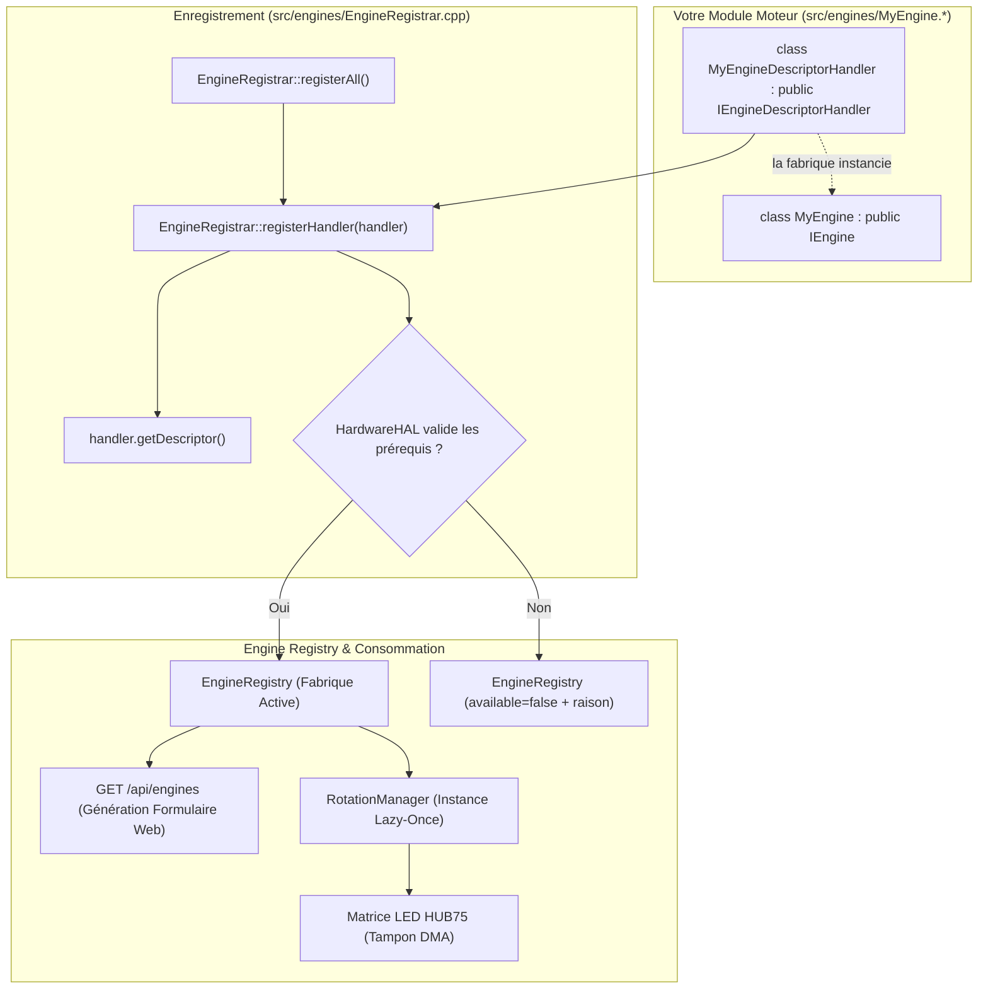
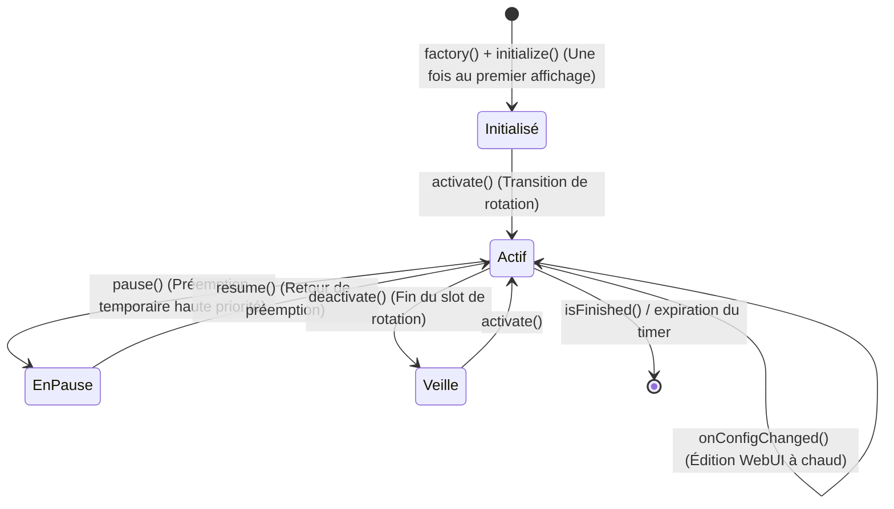

[English](DEVELOPER.md) | 🇫🇷 Français | 🇪🇸 [Español](DEVELOPER_ES.md)

# Guide Développeur (ESP32 — C++)

Ce document est le guide **technique exhaustif** pour étendre ArcadeMatrix sur ESP32 (développé en **C++**). Il détaille l'intégralité du contrat `IEngine`, le schéma `ConfigField` complet (incluant les **listes d'options dynamiques**, la sélection multiple, la visibilité conditionnelle et les politiques d'auto-réparation), le filtrage des capacités matérielles et la création d'un moteur étape par étape.

> Pour comprendre les choix d'architecture (Registre, Lazy-Once, DisplayArbiter, threading FreeRTOS, overlay), consultez [ARCHITECTURE_FR.md](ARCHITECTURE_FR.md). Ce guide est le manuel pratique de mise en œuvre.

---

## Table des Matières

1. [Modèle Mental](#1-modèle-mental)
2. [Le Contrat IEngine Complet](#2-le-contrat-iengine-complet)
3. [Le Cycle de Vie & Règles d'Or](#3-le-cycle-de-vie--règles-dor)
4. [Capacités & Prérequis Matériels](#4-capacités--prérequis-matériels)
5. [Référence du ConfigSchema & ConfigField](#5-référence-du-configschema--configfield)
6. [Listes d'Options Dynamiques (`options_endpoint`)](#6-listes-doptions-dynamiques-options_endpoint)
7. [Champs à Sélection Multiple](#7-champs-à-sélection-multiple)
8. [Champs Conditionnels (`visible_when`)](#8-champs-conditionnels-visible_when)
9. [Politiques de Validation & Auto-Réparation](#9-politiques-de-validation--auto-réparation)
10. [Tutoriel : Créer un Nouveau Moteur Pas-à-Pas](#10-tutoriel--créer-un-nouveau-moteur-pas-à-pas)
11. [Tutoriel : Ajouter un Endpoint d'Options Dynamiques](#11-tutoriel--ajouter-un-endpoint-doptions-dynamiques)
12. [Tutoriel : Ajouter un Nouveau Thème / Horloge (ClockFace)](#12-tutoriel--ajouter-un-nouveau-thème--horloge-clockface)
13. [Internationalisation & Centralisation i18n (Front & Back)](#13-internationalisation--centralisation-i18n-front--back)
14. [Lecture de la Configuration dans un Moteur](#14-lecture-de-la-configuration-dans-un-moteur)
15. [Rendu sur la Matrice LED](#15-rendu-sur-la-matrice-led)
16. [Tests & Compilation Locale](#16-tests--compilation-locale)
17. [Checklist du Développeur](#17-checklist-du-développeur)

---

## 1. Modèle Mental

ArcadeMatrix **n'a aucune liste de moteurs codée en dur** dans `main.cpp`. Chaque moteur s'enregistre au démarrage dans le `EngineRegistry`.



Ajouter un moteur nécessite **deux étapes simples** :
1. Implémenter votre classe de moteur (`IEngine`) et son descripteur (`IEngineDescriptorHandler`) dans `src/engines/`.
2. Ajouter l'instance de votre descripteur dans la liste des handlers de `src/engines/EngineRegistrar.cpp`.

> [!NOTE]
> **Pourquoi `IEngineDescriptorHandler` sur ESP32 ?**
> Plutôt qu'un registre centralisé monolithique avec tous les schémas en dur (God Class), chaque moteur définit et encapsule ses propres métadonnées, son schéma de configuration, ses besoins matériels et sa fabrique. Le `EngineRegistrar` se charge d'itérer sur l'ensemble des handlers et d'appliquer le gating matériel au runtime avant enregistrement dans `EngineRegistry`.

**`main.cpp` et les fichiers HTML du frontend ne sont jamais modifiés.**

---

## 2. Le Contrat IEngine Complet

```cpp
class IEngine {
public:
    virtual ~IEngine() = default;

    // --- Cycle de vie obligatoire ---
    virtual EngineError initialize(EngineContext* context, const EngineConfig* config) = 0;
    virtual void activate() = 0;
    virtual void update(EngineContext* context) = 0;
    virtual void render(EngineContext* context) = 0;
    virtual void deactivate() = 0;

    // --- Cycle de vie de préemption (optionnel) ---
    virtual void pause() {}
    virtual void resume() {}

    // --- Optionnels (comportements par défaut fournis) ---
    virtual void onConfigChanged(const EngineConfig* config) {}
    virtual bool isFinished() const { return false; }
    virtual bool isRealtime() const { return true; }
    virtual void setRotationBudget(uint32_t budget) {}
    virtual bool selfPaced() const { return false; }
    virtual bool allowsOverlay() const { return true; }
};
```

---

## 3. Le Cycle de Vie & Règles d'Or



### Matrice de Décision d'Affichage & Cycle de Vie

Le `DisplayArbiter` résout les sources d'affichage de manière déterministe via une échelle statique de priorités et transmet ses décisions au `DisplayRuntime` :

| Scénario | Action sur l'Ancien Moteur | Action sur le Nouveau Moteur | État de la Session |
| :--- | :--- | :--- | :--- |
| **Préemption Temporaire** (ex. Alerte MQTT sur Horloge) | `oldEngine->pause()` | `alertEngine->activate()` | Nouvel identifiant de session ; ancien moteur conservé pour reprise |
| **Fin de Préemption** (Retour à l'Horloge) | `alertEngine->deactivate()` | `oldEngine->resume()` | Reprise transparente de l'horloge sans perte d'état ni d'animation |
| **Rotation Carrousel** (ex. Horloge → Météo) | `oldEngine->deactivate()` | `newEngine->activate()` | Démarrage propre du nouveau slot de carrousel |

### Règles d'Or pour le C++ Embarqué

1. **Règle d'Or #1 — Zéro Allocation dans la Boucle Chaude :** Ne jamais instancier de `String`, de `std::vector` ou appeler `malloc`/`new` dans `update()` ou `render()`. Pré-allouez vos structures dans `initialize()`.
2. **Règle d'Or #2 — Hot Path Lock-Free & Zéro Mutex sur Core 1 :** Le Core 1 exécute `update() -> evaluate() -> render()` de manière totalement lock-free. La configuration est accédée exclusivement via le protocole Single-Reader Single-Writer (SRSW) CAS linéarisable (`ConfigSnapshotGuard guard = config.acquireSnapshot(); const auto& snapshot = guard.get();`).
3. **Règle d'Or #3 — File de Commandes SPSC Cross-Core :** Le Core 0 soumet les requêtes d'affichage via `m_displayArbiter.submitRequest(req)`. Le Core 1 possède exclusivement les slots d'arbitrage et dépile les commandes en $O(1)$ sans verrouillage mutex.
4. **Règle d'Or #4 — Hot Reload sur Place :** Dans `onConfigChanged()`, mettez à jour les variables internes directement. L'instance n'est **pas** détruite ni recréée.
5. **Règle d'Or #5 — Propriété SD à Gros Grain, Jamais de Verrou par Lecture :** `sdMutex` est un mutex FreeRTOS **non récursif** (`xSemaphoreCreateMutex()`). Prenez-le **une seule fois**, autour d'une transaction SD complète (ouverture, scan de répertoire, lecture de fichier entier, fermeture), et jamais à l'intérieur d'un callback que cette même transaction peut ré-entrer : `AnimatedGIF` appelle ses callbacks de lecture/seek de façon synchrone depuis `gif.open()`, donc y poser un verrou provoque un auto-blocage. Une fois le handle de streaming ouvert, il appartient exclusivement au Core 1 pour toute la durée de la session de lecture et est lu **sans** verrou, conformément à la Règle d'Or #2. Les producteurs Core 0 (handlers HTTP, MQTT) doivent toujours utiliser une attente **bornée** (`pdMS_TO_TICKS(...)`) et se dégrader proprement : `portMAX_DELAY` sur la tâche AsyncTCP gèle l'intégralité du serveur web.
6. **Règle d'Or #6 — Overlays vs Moteurs Sélectionnables :**
   - **Moteur Sélectionnable (Engine) :** Remplace le framebuffer principal (ex: Horloge, Météo, GIF, Crypto). Enregistré dans `EngineRegistry` avec un descripteur, une fabrique et un `EngineHandle` canonique.
   - **Overlay Transverse :** Compose de manière additive au-dessus de la source active (ex: Fighter). Géré exclusivement par `OverlayManager`, activé par entrée de rotation (`overlays.fighter: true`), jamais enregistré dans `EngineRegistry`.
7. **Règle d'Or #7 — Protocoles Réseau à État & Cycle de Vie des Sockets (CastV2 / TLS) :**
   - Les moteurs de streaming réseau transversaux (ex: `GoogleCastEngine`) DOIVENT maintenir une connexion `WiFiClientSecure` persistante à travers les cycles de sondage, avec des heartbeats de protocole actifs (CastV2 `PING` toutes les 5s sur `urn:x-cast:com.google.cast.tp.heartbeat` vers `receiver-0`).
   - NE JAMAIS instancier/détruire des clients TLS dans une boucle de sondage rapide (1-2s) : les états TCP `TIME_WAIT` persistent 120 secondes dans lwIP. Les sockets s'accumulent jusqu'au plafond de l'OS (`fd 48`, `ECONNABORTED = 113`), privant `AsyncWebServer` (port 80) et mDNS, ce qui provoque `ERR_ADDRESS_UNREACHABLE`.
   - Le backoff de reconnexion après un échec DOIT être d'au moins 15 secondes pour borner à 8 le nombre de descripteurs `TIME_WAIT` concurrents (bien en dessous du plafond de 48).
   - **Limite connue :** même avec la sérialisation (Règle d'Or #11), Google Cast peut se voir refuser l'admission TLS indéfiniment une fois que la SRAM interne se stabilise dans un état fragmenté (plus gros bloc sous ~16 Ko) avec d'autres moteurs actifs — la découverte mDNS réussissant pendant que la poignée de main n'aboutit jamais se traduit actuellement par « Cast ne fonctionne pas ». C'est une dégradation acceptée, pas encore une vraie correction.
8. **Règle d'Or #8 — Hiérarchie des Ressources : Services Critiques vs Overlays Opportunistes :**
   - Les services critiques (matrice d'affichage, serveur web Core 0, flux audio, Cast transversal, SDMMC) ont une bande passante et une mémoire réservées.
   - Les overlays opportunistes et décoratifs (`FighterEngine`, `ArtworkService`) DOIVENT être strictement subordonnés :
     * Ne jamais concurrencer les services critiques pour la RAM, le DMA ou la bande passante du bus.
     * S'arrêter immédiatement dès le premier échec de fichier ou baisse mémoire (`heap < 30 Ko`, `dma < 16 Ko`, `psram < 1 Mo`), libérer toute allocation partielle et abandonner sans tenter les fichiers restants.
     * Utiliser `NetworkBudget::canStartTlsSession()` avant tout téléchargement HTTPS/TLS optionnel.
9. **Règle d'Or #9 — Verrouillage DMA Matériel pour Crypto & Stockage :**
   - Le SHA matériel (`esp-sha`) sur ESP32-S3 et la lecture de blocs SDMMC nécessitent une mémoire DMA interne contiguë (`MALLOC_CAP_DMA | MALLOC_CAP_INTERNAL`). Si le DMA interne descend sous 16 Ko ou le plus gros bloc DMA sous 4096 octets, `esp-sha: Failed to allocate buf memory` et `sdmmc_read_blocks failed (257) (ESP_ERR_NO_MEM)` surviennent.
   - `NetworkBudget::canStartTlsSession()` doit évaluer la marge DMA interne (`freeDma >= 16 Ko`, `largestDma >= 4 Ko`) en plus de la DRAM totale avant d'admettre une poignée de main TLS.
10. **Règle d'Or #10 — Récupération de Périphérique à Chemin Unique (Core 0 Exclusif) :**
    - Ne jamais exécuter de watchdogs de récupération en parallèle sur plusieurs cœurs.
    - Si le Core 1 détecte une anomalie matérielle (ex : gel du zéro numérique de l'ES7210), il l'évalue sans verrou en $O(1)$ et signale un drapeau atomique.
    - La récupération (réinitialisation I2C) s'exécute exclusivement sur Core 0 avec limitation de fréquence/cooldown bornés (3000 ms), totalement isolée du hot-path de rendu audio Core 1.
11. **Règle d'Or #11 — mbedTLS Reste 100% SRAM Interne ; Admettre & Sérialiser, Jamais Router le TLS vers la PSRAM :**
    - mbedTLS sur cette carte DOIT utiliser l'allocateur standard ESP-IDF/Arduino (100% SRAM interne), comme en `v3.1.0`. **Ne pas** réintroduire un hook `mbedtls_platform_set_calloc_free()` routant vers la PSRAM (l'ancien `MbedTlsAllocator` a été supprimé précisément pour cette raison) : les tests sur matériel réel ont prouvé que TOUTE allocation mbedTLS atterrissant en PSRAM — même seulement les buffers d'enregistrement TLS de ~16 Ko — corrompt l'affichage HUB75 en quelques secondes, car le framebuffer réside lui aussi en PSRAM et entre en contention avec mbedTLS sur le cache PSRAM partagé via le moteur GDMA HUB75. Voir `HardwareHAL::begin()` pour le commentaire complet de cause racine.
    - La SRAM interne devant désormais servir simultanément le TLS, le DMA et le réseau, chaque point d'appel TLS DOIT construire un `NetworkBudget::ScopedTlsHandshakeLock` immédiatement avant `WiFiClientSecure::connect()` et abandonner (`if (!tlsLock) { ...; return; }`) en cas d'échec d'acquisition. C'est un mutex global unique : **une seule poignée de main TLS peut être en cours dans tout le firmware à un instant donné.**
    - Limite d'admission stricte, revalidée **atomiquement dans le constructeur du verrou** (pas seulement en pré-vérification séparée) : `NetworkBudget::canStartTlsSession()` exige `freeInternal >= 45 Ko` et une marge de double buffer vérifiée (soit `largestInternalBlock >= 34.5 Ko` soit deux blocs indépendants de 16.5 Ko) pour satisfaire les tampons d'enregistrement simultanés in/out de mbedTLS (~33.4 Ko au total). Une pré-vérification avant même de tenter le verrou est autorisée comme optimisation bon marché pour éviter de bloquer sur un mutex contesté quand le budget est déjà connu insuffisant, mais elle n'est **jamais** autoritaire à elle seule — le temps d'attente de contention du mutex (jusqu'à 5s) suffit pour qu'une poignée de main concurrente invalide un résultat « OK » antérieur. Seule la revérification après acquisition, dans le constructeur, fait autorité.
    - *Note sécurité :* mbedTLS étant à nouveau 100% SRAM interne, il n'y a plus de risque de résidence PSRAM à documenter pour le matériel sensible TLS.
12. **Règle d'Or #12 — Accès SD via `SdLockGuard`, Jamais de `xSemaphoreTake`/`Give` Manuel :**
    - Utilisez `SdLockGuard guard(timeoutTicks); if (!guard) { ...; return; }` (`src/core/SdLockGuard.h`) pour chaque acquisition de `sdMutex`. C'est un wrapper RAII qui garantit la libération du mutex sur chaque chemin de retour (y compris les retours anticipés), éliminant le risque de fuite de verrou des paires manuelles `xSemaphoreTake(...) ... xSemaphoreGive(...)` qui devraient sinon être dupliquées sur chaque chemin de sortie.
    - Cela n'assouplit pas la Règle d'Or #5 : le verrou reste pris à gros grain autour d'une transaction SD complète, jamais à l'intérieur de callbacks de streaming par image/octet (`GIFReadFile`/`GIFSeekFile` restent délibérément **non verrouillés**, le handle de fichier étant ouvert une seule fois sous `SdLockGuard` puis possédé exclusivement par le Core 1 pour le reste de la session de lecture).
13. **Règle d'Or #13 — Barrière de Libération pour la Retraite des Moteurs (Anti-UAF) :**
    - Avant que le `unique_ptr` d'un moteur ne soit déplacé dans `EngineRetirementQueue` pour destruction sur Core 0, `RotationManager::retireEngineSlot()` DOIT, dans l'ordre : (1) appeler `deactivate()`, (2) effacer `currentActiveInstanceId` si correspondance, (3) appeler `DisplayRuntime::purgeEngineReferences(engine, instanceId)` pour retirer le pointeur de `m_session.activeEngine` et de la pile de préemption, (4) marquer `EngineResourceState::CORE1_RELEASED`, (5) effacer le slot `instanceId` local. Ce n'est qu'après ces cinq étapes que le moteur peut être transmis au Core 0. Ne jamais dupliquer cette séquence ailleurs en ligne — toujours appeler `retireEngineSlot()`.
14. **Règle d'Or #14 — Ségrégation des Domaines Mémoire & PSRAM en Priorité pour les Gros Tampons :**
    - Déplacer les allocations de documents JSON applicatifs (`WebServerAPI`, endpoints REST) vers la PSRAM via `SpiRamJsonDocument` ; AsyncTCP/lwIP et les allocations internes au serveur restent dans leurs domaines de DRAM interne requis.
    - Les gros framebuffers graphiques hors DMA direct (comme le canvas de 32 Ko de `GifEngine`) DOIVENT prioriser l'allocation en PSRAM (`MALLOC_CAP_SPIRAM | MALLOC_CAP_8BIT`) lorsque la PSRAM est disponible, réservant la DRAM interne pour mbedTLS et la pile réseau LwIP.
    - La pile de la tâche de fond AsyncTCP est dimensionnée à 8192 octets et strictement épinglée au Core 0 (`CONFIG_ASYNC_TCP_RUNNING_CORE=0`) pour protéger le hot-path de rendu d'affichage du Core 1 (Invariant 1).
    - Les services réseau persistants (Google Cast) DOIVENT appliquer un backoff exponentiel (5s, 10s, 20s, 60s) initialisé dès la rupture de session, évitant les tempêtes de reconnexion pendant les salves de trafic HTTP/LwIP.

---

## 4. Capacités & Prérequis Matériels

```cpp
struct EngineCapabilities {
    bool supports_128x32 = true;
    bool supports_256x64 = true;
    bool realtime = true;
    bool interruptible = true;
    bool selfPaced = false;
};

struct EngineRequirements {
    bool needsPsram = false;      // ex: Historique Crypto/Bourse, Lecteur Spotify
    bool needsAudio = false;      // ex: Visualiseur micro I2S
    bool needsTempSensor = false; // ex: Capteur température SHTC3
    bool needsGyroscope = false;
    bool needsNetwork = false;
    bool needsSd = false;
};
```

> [!TIP]
> **Modèle Adaptatif Dual-Mode (PSRAM vs Non-PSRAM)** :
> Si votre moteur dispose d'une fonctionnalité avancée gourmande en mémoire (ex: décodage de pochettes d'albums dans `GoogleCastEngine`) mais peut fonctionner avec un rendu alternatif plus léger sur les ESP32 classiques sans PSRAM (ex: égaliseur de barres audio animé + texte défilant), définissez `needsPsram = false` dans `EngineRequirements` et interrogez dynamiquement `context->hasPsram()` dans `initialize()` / `render()`. Si le moteur nécessite obligatoirement de la PSRAM pour fonctionner sans risquer de Heap OOM (ex: `SpotifyEngine`, `CryptoEngine`), définissez impérativement `needsPsram = true`.

---

## 5. Référence du ConfigSchema & ConfigField

```cpp
struct ConfigField {
    String id;                          // Clé dans config.json
    ConfigType type;                    // BOOLEAN, INTEGER, FLOAT, STRING, ENUM, COLOR, LIST
    String label;                       // Libellé UI
    String description;                 // Infobulle
    String default_value;               // Valeur injectée si absente
    bool required = false;
    String min_val = "";                // Borne minimale
    String max_val = "";                // Borne maximale
    String step = "";                   // Pas du curseur
    String options = "";                // Choix statiques séparés par des virgules
    String visible_when = "";           // Règle de visibilité conditionnelle
    String options_endpoint = "";       // Endpoint d'options dynamiques
    bool multiple = false;              // Sélection multiple
    ValidationPolicy validation_policy; // Clamp, FallbackDefault, Reject, Accept
};
```

---

## 6. Listes d'Options Dynamiques (`options_endpoint`)

```cpp
{
    .id = "theme",
    .type = ConfigType::ENUM,
    .label = "Thème de l'horloge",
    .default_value = "12",
    .options_endpoint = "/api/themes"
}
```

---

## 7. Champs à Sélection Multiple

```cpp
{
    .id = "playlists",
    .type = ConfigType::LIST,
    .label = "Playlists Actives",
    .default_value = "arcade,retro",
    .options_endpoint = "/api/playlists",
    .multiple = true
}
```

---

## 8. Champs Conditionnels (`visible_when`)

```cpp
{
    .id = "custom_color",
    .type = ConfigType::COLOR,
    .label = "Couleur d'accentuation",
    .default_value = "#ff0055",
    .visible_when = "theme=20"
}
```

---

## 9. Politiques de Validation & Auto-Réparation

- `Clamp` : Borne la valeur entre `min_val` et `max_val`.
- `FallbackDefault` : Réinitialise à `default_value` si la valeur est invalide.
- `Accept` : Conserve la valeur telle quelle.

---

## 10. Tutoriel : Créer un Nouveau Moteur Pas-à-Pas

### Étape 1 : Créer `src/engines/MatrixRainEngine.h`
```cpp
#pragma once
#include "../../include/core/EngineContract.h"
#include <Arduino.h>

class MatrixRainEngine : public IEngine {
public:
    MatrixRainEngine();
    ~MatrixRainEngine() override = default;

    EngineError initialize(EngineContext* context, const EngineConfig* config) override;
    void activate() override;
    void update(EngineContext* context) override;
    void render(EngineContext* context) override;
    void deactivate() override;
    void onConfigChanged(const EngineConfig* config) override;
    bool isRealtime() const override { return true; }

private:
    MatrixPanel_I2S_DMA* matrix = nullptr;
    int speed = 2;
    int dropY[128];
};
```

### Étape 2 : Implémenter `src/engines/MatrixRainEngine.cpp`
```cpp
#include "MatrixRainEngine.h"

MatrixRainEngine::MatrixRainEngine() {
    memset(dropY, 0, sizeof(dropY));
}

EngineError MatrixRainEngine::initialize(EngineContext* context, const EngineConfig* config) {
    if (!context || !context->getMatrix()) return EngineError::InitializationFailed;
    matrix = context->getMatrix();
    if (config) speed = config->getInt("speed", 2);
    return EngineError::OK;
}

void MatrixRainEngine::activate() {
    for (int i = 0; i < 128; i++) dropY[i] = random(-32, 0);
}

void MatrixRainEngine::update(EngineContext* context) {
    if (!matrix) return;
    for (int x = 0; x < matrix->width(); x += 4) {
        dropY[x] += speed;
        if (dropY[x] > matrix->height()) dropY[x] = random(-16, 0);
    }
}

void MatrixRainEngine::render(EngineContext* context) {
    if (!matrix) return;
    matrix->fillScreen(0);
    for (int x = 0; x < matrix->width(); x += 4) {
        matrix->drawPixel(x, dropY[x], matrix->color565(0, 255, 70));
    }
}

void MatrixRainEngine::deactivate() {}

void MatrixRainEngine::onConfigChanged(const EngineConfig* config) {
    if (config) speed = config->getInt("speed", 2);
}
```

### Étape 3 : Implémenter `IEngineDescriptorHandler` et enregistrer

Dans le fichier de votre moteur (ex. `src/engines/MatrixRainEngine.h` / `.cpp`) :
```cpp
class MatrixRainEngineDescriptorHandler : public IEngineDescriptorHandler {
public:
    EngineDescriptor getDescriptor() const override {
        EngineDescriptor desc;
        desc.metadata = { "matrix_rain", "Matrix Rain", "animations", FIRMWARE_VERSION };
        desc.capabilities = { .supports_128x32 = true, .supports_256x64 = true, .realtime = true };
        desc.requirements = { .needsPsram = false, .needsAudio = false };
        desc.schema.fields = {
            ConfigField("speed", ConfigType::INTEGER, "Vitesse", "Vitesse de chute en pixels par frame", "2", false, "1", "5", "1", "", "", false, "", ValidationPolicy::Clamp)
        };
        desc.factory = []() { return std::unique_ptr<IEngine>(new MatrixRainEngine()); };
        return desc;
    }
};
```

Puis dans `src/engines/EngineRegistrar.cpp`, ajoutez simplement l'instance du handler :
```cpp
#include "MatrixRainEngine.h"

void EngineRegistrar::registerAll() {
    // ...
    static const MatrixRainEngineDescriptorHandler matrixRainHandler;

    const IEngineDescriptorHandler* handlers[] = {
        // ...
        &matrixRainHandler
    };

    for (const auto* handler : handlers) {
        if (handler) registerHandler(*handler);
    }
}
```

---

## 11. Tutoriel : Ajouter un Endpoint d'Options Dynamiques

```cpp
server.on("/api/my_options", HTTP_GET, [](AsyncWebServerRequest *request){
    DynamicJsonDocument doc(512);
    JsonArray arr = doc.to<JsonArray>();
    JsonObject o1 = arr.createNestedObject();
    o1["id"] = "1"; o1["name"] = "Mode A";
    String response;
    serializeJson(doc, response);
    request->send(200, "application/json", response);
});
```

---

## 12. Tutoriel : Ajouter un Nouveau Thème / Horloge (ClockFace)

Dans ArcadeMatrix, l'affichage de l'heure est géré par un moteur unique (`ClockEngine`) qui délègue le rendu visuel à des modules spécialisés implémentant l'interface `ClockFace`. Pour créer une nouvelle horloge animée (ex : *SpaceInvadersClock*) :

### Étape 1 : Créer `src/engines/clocks/SpaceInvadersClock.h` & `.cpp`

Héritez de la classe abstraite `ClockFace` (`src/engines/ClockEngine.h`) :

```cpp
// src/engines/clocks/SpaceInvadersClock.h
#pragma once
#include "../ClockEngine.h"

class SpaceInvadersClock : public ClockFace {
public:
    SpaceInvadersClock(MatrixPanel_I2S_DMA* display, const EngineConfig* config = nullptr);
    void draw(const TimeData& t) override;
    void update() override;

private:
    int invaderFrame = 0;
    unsigned long lastAnimMs = 0;
};
```

```cpp
// src/engines/clocks/SpaceInvadersClock.cpp
#include "SpaceInvadersClock.h"

SpaceInvadersClock::SpaceInvadersClock(MatrixPanel_I2S_DMA* display, const EngineConfig* config)
    : ClockFace(display, config) {}

void SpaceInvadersClock::update() {
    if (millis() - lastAnimMs > 500) {
        invaderFrame = (invaderFrame + 1) % 2;
        lastAnimMs = millis();
    }
}

void SpaceInvadersClock::draw(const TimeData& t) {
    if (!matrix) return;
    matrix->fillScreen(0);
    matrix->setTextSize(1);
    matrix->setTextColor(matrix->color565(0, 255, 100));
    matrix->setCursor(24, 12);
    matrix->printf("%02d:%02d:%02d", t.hour, t.minute, t.second);
}
```

### Étape 2 : Déclarer l'Enum dans `src/engines/DateEngine.h`

Ajoutez l'identifiant du thème dans `PublisherTheme` :

```cpp
enum PublisherTheme {
    // ... thèmes existants
    THEME_SPACE_INVADERS = 25
};
```

### Étape 3 : Instancier dans `ClockEngine::setTheme()` (`src/engines/ClockEngine.cpp`)

Incluez l'en-tête et instanciez votre `ClockFace` :

```cpp
#include "clocks/SpaceInvadersClock.h"

// Dans ClockEngine::setTheme():
case THEME_SPACE_INVADERS:
    activeFace = new SpaceInvadersClock(legacy_matrix, config);
    break;
```

### Étape 4 : Exposer dans `/api/themes` (`src/api/WebServerAPI.cpp`)

Ajoutez le thème dans le tableau `themes` pour peupler automatiquement la liste déroulante de l'interface Web :

```cpp
static const ThemeItem themes[] = {
    // ...
    { 25, "Space Invaders Clock" }
};
```

L'interface Web affichera automatiquement la nouvelle option, l'enregistrera dans `config.json` et la rechargera à chaud sans redémarrage.

---

## 13. Internationalisation & Centralisation i18n (Front & Back)

ArcadeMatrix utilise une architecture **i18n entièrement centralisée**.

> [!IMPORTANT]
> **Règle d'or : Ne jamais ajouter de champ `lang` dans les schémas de vos moteurs (`ConfigSchema`).**
> La langue est une configuration globale du système (`system.lang`), sélectionnée par l'utilisateur via le menu déroulant en haut de l'interface Web (`#lang-selector`). Tout changement de langue dans l'interface envoie automatiquement un appel `POST /api/system` et propage la nouvelle langue aux moteurs actifs en direct.

### A. Utilisation dans un moteur C++ (`#include "core/I18n.h"`)

Tous les textes traduits (jours de la semaine, conditions météo, heures en mots, statuts de décibels, etc.) sont centralisés dans le module `I18n` :

```cpp
#include "core/I18n.h"

// 1. Obtenir la langue active (FR, EN, ES)
Lang currentLang = I18n::getLang();

// 2. Libellés des jours météo (ex: "AUJ.", "DEM.", "LUN"..)
const char* dayLabel = I18n::getWeatherDayLabel(dayOfWeek, isToday, isTomorrow);

// 3. Traduction des conditions météo
String condition = I18n::getWeatherCondition("Thunderstorm with heavy rain");

// 4. Lignes complètes de l'horloge en mots (WordClock)
std::vector<String> lines = I18n::getWordClockLines(hours, minutes);

// 5. Niveaux sonores / décibels
const char* noise = I18n::getNoiseLevelLabel(levelIndex);
```

### B. Tutoriel : Ajouter une nouvelle langue (ex : Allemand `de`) en 3 étapes

1. **Front-end WebUI (`data/index.html` ou `i18n.js`) :**
   Ajoutez la langue dans `SUPPORTED_LANGUAGES` et fournissez son dictionnaire dans `translations` :
   ```javascript
   const SUPPORTED_LANGUAGES = [
     { code: 'fr', label: 'Français' },
     { code: 'en', label: 'English' },
     { code: 'es', label: 'Español' },
     { code: 'de', label: 'Deutsch' }
   ];
   ```
2. **Back-end ESP32 (`src/core/I18n.h` & `src/core/I18n.cpp`) :**
   - Ajoutez la valeur `DE` à l'enum `Lang`.
   - Renseignez les traductions dans les méthodes statiques de `I18n.cpp`.
3. **Back-end Raspberry Pi (`src/core/i18n.rs`) :**
   - Ajoutez `De` à l'enum `Lang` et implémentez les correspondances dans les fonctions de lookup.

---

## 14. Lecture de la Configuration dans un Moteur

```cpp
int speed = config->getInt("speed", 2);
String text = config->getString("title", "Arcade");
bool enabled = config->getBool("enabled", true);
float offset = config->getFloat("temp_offset", 0.0f);
```

---

## 15. Rendu sur la Matrice LED & Géométrie Responsif

ArcadeMatrix v4 abstrait le rendu d'affichage derrière l'interface matérielle agnostique `IDrawingSurface` (qui hérite de `Adafruit_GFX`). Obtenez toujours la surface via `context->getSurface()` :

```cpp
IDrawingSurface* surface = context->getSurface();
surface->drawPixel(x, y, surface->color565(r, g, b));
surface->fillRect(x, y, w, h, color);
surface->setCursor(x, y);
surface->print("TEXT");

// Ou transfert par bloc optimisé pour animations en continu (GIFs, fighters) :
surface->blit565(canvasBuffer, width, height);
```
*(Par rétrocompatibilité, `context->getMatrix()` reste accessible comme passerelle retournant `MatrixPanel_I2S_DMA*`).
*Ne jamais appeler `flipDMABuffer()` dans le moteur — la boucle principale s'en charge.*

### 15.1 La Règle d'Or du Rendu Responsif Multi-Résolutions & TATE

ArcadeMatrix fonctionne sur toutes les résolutions et orientations (`64x32`, `128x32`, `256x64`, `64x64`, `32x64`, `32x128`, `64x128`, `64x256`).

> [!IMPORTANT]
> **🏆 La Règle d'Or du Rendu :**
> 1. **Les moteurs de rendu ne doivent JAMAIS contenir d'embranchements `if (layoutClass)` directs.**
> 2. Créer une calculatrice pure associée `*LayoutCalculator` (ex: `MyEngineLayoutCalculator::calculate(geometry)`) retournant une structure `MyEngineLayout` composée de `Rect`s bornés.
> 3. La méthode `render()` dessine exclusivement à l'intérieur des `Rect`s fournis.

#### Exemple de Calculatrice de Layout Déclarative
```cpp
struct MusicLayout {
    Rect artworkRect;
    Rect metadataRect;
    Rect progressRect;
    Rect visualizerRect;
};

class MusicLayoutCalculator {
public:
    static MusicLayout calculate(const DisplayGeometry& geometry) {
        MusicLayout layout;
        if (geometry.layoutClass == LayoutClass::PORTRAIT || geometry.layoutClass == LayoutClass::TALL) {
            layout.artworkRect = { 2, 2, (uint16_t)(geometry.width - 4), (uint16_t)min((int)geometry.width - 4, (int)(geometry.height * 0.35f)) };
            layout.metadataRect = { 2, (int16_t)(layout.artworkRect.y + layout.artworkRect.height + 2), (uint16_t)(geometry.width - 4), 16 };
            layout.progressRect = { 2, (int16_t)(layout.metadataRect.y + 18), (uint16_t)(geometry.width - 4), 3 };
            layout.visualizerRect = { 2, (int16_t)(geometry.height - 12), (uint16_t)(geometry.width - 4), 10 };
        } else {
            layout.artworkRect = { 2, 2, (uint16_t)(geometry.height - 4), (uint16_t)(geometry.height - 4) };
            layout.metadataRect = { (int16_t)(layout.artworkRect.width + 6), 2, (uint16_t)(geometry.width - layout.artworkRect.width - 8), 12 };
            layout.progressRect = { (int16_t)(layout.artworkRect.width + 6), 16, (uint16_t)(geometry.width - layout.artworkRect.width - 8), 2 };
            layout.visualizerRect = { (int16_t)(layout.artworkRect.width + 6), (int16_t)(geometry.height - 10), (uint16_t)(geometry.width - layout.artworkRect.width - 8), 8 };
        }
        return layout;
    }
};
```

### 15.2 Vidéo Plein Mouvement, Streaming Canvas & FastBlit (`blitCanvas565`)

Sur les panneaux haute résolution (`256x64`) avec mémoire tampon DMA en PSRAM, l'écriture pixel par pixel (`drawPixel()`) subit des opérations read-modify-write coûteuses à travers plusieurs plans de bits, bridant le débit d'animation globale à 7–14 FPS.

Pour les moteurs d'animation plein écran (clips vidéo, défilements arcade rapides) :
1. **Rendu dans un tampon canvas mémoire RGB565 en PSRAM** (`uint16_t* canvasBuffer`).
2. **Streaming via FastBlit :** Appelez `matrixEngine.blitCanvas565(canvasBuffer, width, height)`. Cela exécute des écritures en rafale séquentielle par ligne directement dans les mots de plans DMA du back-buffer, court-circuitant le surcoût pixel par pixel et achevant la copie d'un écran 256×64 en **~26 ms** (30 à 33+ FPS constants).
3. **Désactivation d'overlay :** Si votre moteur exige une fluidité maximale, surchargez `bool allowsOverlay() const override { return false; }`.

### 15.3 Overlays vs Toile d'Arrière-Plan (Composition Transparente)

Les overlays (comme `FighterEngine`) se superposent dynamiquement au moteur d'arrière-plan :
- **Ne jamais effacer avec des rectangles opaques :** N'appelez **pas** `fillRect(..., 0)` pour effacer d'anciennes boîtes englobantes de sprites. Le moteur sous-jacent (ex: `TetrisClock`) redessine déjà l'intégralité de son image à chaque frame. Dessiner des rectangles noirs créerait des trous opaques dans les chiffres et le décor.
- **Dessin strictement transparent :** Vérifiez les couleurs avant tracé (`if (color != anim->transparentColor) matrix->drawPixel(...)`).
- **Effacement d'écran (`fillScreen(0)`) :** Quand un moteur efface son arrière-plan, `FastMatrixPanel::fillScreen(0)` masque automatiquement les bits de couleur (`BITMASK_RGB12_CLEAR`) sur le back-buffer inactif. Il ne touche jamais au front-buffer en cours de balayage physique, éliminant tout scintillement ou déchirement de lignes.

---

## 16. Tests & Compilation Locale

```bash
# ESP32 Standard
rtk pio run -e esp32dev

# Waveshare ESP32-S3
rtk pio run -e esp32s3_waveshare
```

---

## 17. Checklist du Développeur

- [ ] `initialize()` effectue toutes les allocations ; la boucle chaude (`update`/`render`) a **zéro allocation dynamique**.
- [ ] `onConfigChanged()` met à jour l'état sans détruire l'instance.
- [ ] Les prérequis matériels (`needsPsram`, `needsAudio`, `needsTempSensor`) sont déclarés.
- [ ] Les textes localisés utilisent le module centralisé `I18n` (aucun champ `lang` redondant dans le schéma).
- [ ] La compilation réussit sur `esp32dev` et `esp32s3_waveshare`.

