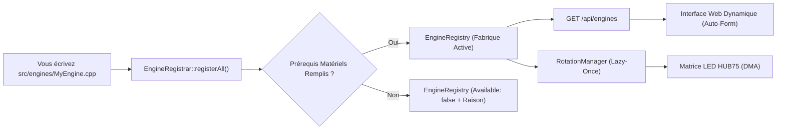

[English](DEVELOPER.md) | 🇫🇷 Français | 🇪🇸 [Español](DEVELOPER_ES.md)

# Guide Développeur (ESP32 — C++)

Ce document est le guide **technique exhaustif** pour étendre ArcadeMatrix sur ESP32 (développé en **C++**). Il détaille l'intégralité du contrat `IEngine`, le schéma `ConfigField` complet (incluant les **listes d'options dynamiques**, la sélection multiple, la visibilité conditionnelle et les politiques d'auto-réparation), le filtrage des capacités matérielles et la création d'un moteur étape par étape.

> Pour comprendre les choix d'architecture (Registre, Lazy-Once, DisplayArbiter, threading FreeRTOS, overlay), consultez [ARCHITECTURE_FR.md](ARCHITECTURE_FR.md). Ce guide est le manuel pratique de mise en œuvre.

---

## Table des Matières

1. [Modèle Mental](#1-modèle-mental)
2. [Le Contrat IEngine Complet](#2-le-contrat-iengine-complet)
3. [Le Cycle de Vie & Règles d'Or](#3-le-cycle-de-vie--règles-dor)
4. [Capacités & Prérequis Matériels](#4-capacités--prérequis-matériels)
5. [Référence du ConfigSchema & ConfigField](#5-référence-du-configschema--configfield)
6. [Listes d'Options Dynamiques (`options_endpoint`)](#6-listes-doptions-dynamiques-options_endpoint)
7. [Champs à Sélection Multiple](#7-champs-à-sélection-multiple)
8. [Champs Conditionnels (`visible_when`)](#8-champs-conditionnels-visible_when)
9. [Politiques de Validation & Auto-Réparation](#9-politiques-de-validation--auto-réparation)
10. [Tutoriel : Créer un Nouveau Moteur Pas-à-Pas](#10-tutoriel--créer-un-nouveau-moteur-pas-à-pas)
11. [Tutoriel : Ajouter un Endpoint d'Options Dynamiques](#11-tutoriel--ajouter-un-endpoint-doptions-dynamiques)
12. [Lecture de la Configuration dans un Moteur](#12-lecture-de-la-configuration-dans-un-moteur)
13. [Rendu sur la Matrice LED](#13-rendu-sur-la-matrice-led)
14. [Tests & Compilation Locale](#14-tests--compilation-locale)
15. [Checklist du Développeur](#15-checklist-du-développeur)

---

## 1. Modèle Mental

ArcadeMatrix **n'a aucune liste de moteurs codée en dur** dans `main.cpp`. Chaque moteur s'enregistre au démarrage dans le `EngineRegistry`.



Ajouter un moteur nécessite **deux étapes** :
1. Implémenter votre classe de moteur (`IEngine`) dans `src/engines/`.
2. Déclarer son descripteur dans `src/engines/EngineRegistrar.cpp`.
**`main.cpp` et les fichiers HTML du frontend ne sont jamais modifiés.**

---

## 2. Le Contrat IEngine Complet

```cpp
class IEngine {
public:
    virtual ~IEngine() = default;

    // --- Cycle de vie obligatoire ---
    virtual EngineError initialize(EngineContext* context, const EngineConfig* config) = 0;
    virtual void activate() = 0;
    virtual void update(EngineContext* context) = 0;
    virtual void render(EngineContext* context) = 0;
    virtual void deactivate() = 0;

    // --- Optionnels (comportements par défaut fournis) ---
    virtual void onConfigChanged(const EngineConfig* config) {}
    virtual bool isFinished() const { return false; }
    virtual bool isRealtime() const { return true; }
    virtual void setRotationBudget(uint32_t budget) {}
    virtual bool selfPaced() const { return false; }
    virtual bool allowsOverlay() const { return true; }
};
```

---

## 3. Le Cycle de Vie & Règles d'Or

1. **Règle d'Or #1 — Zéro Allocation dans la Boucle Chaude :** Ne jamais instancier de `String`, de `std::vector` ou appeler `malloc`/`new` dans `update()` ou `render()`. Pré-allouez vos structures dans `initialize()`.
2. **Règle d'Or #2 — Hot Reload sur Place :** Dans `onConfigChanged()`, mettez à jour les variables internes directement. L'instance n'est **pas** détruite ni recréée.
3. **Règle d'Or #3 — Verrous de Bus SD :** Les lectures d'assets sur carte SD doivent utiliser le sémaphore `sdMutex`.

---

## 4. Capacités & Prérequis Matériels

```cpp
struct EngineCapabilities {
    bool supports_128x32 = true;
    bool supports_256x64 = true;
    bool realtime = true;
    bool interruptible = true;
    bool allowsOverlay = true;
    bool selfPaced = false;
};

struct EngineRequirements {
    bool needsPsram = false;      // ex: Historique Crypto/Bourse
    bool needsAudio = false;      // ex: Visualiseur micro I2S
    bool needsTempSensor = false; // ex: Capteur température SHTC3
    bool needsGyroscope = false;
    bool needsNetwork = false;
    bool needsSd = false;
};
```

---

## 5. Référence du ConfigSchema & ConfigField

```cpp
struct ConfigField {
    String id;                          // Clé dans config.json
    ConfigType type;                    // BOOLEAN, INTEGER, FLOAT, STRING, ENUM, COLOR, LIST
    String label;                       // Libellé UI
    String description;                 // Infobulle
    String default_value;               // Valeur injectée si absente
    bool required = false;
    String min_val = "";                // Borne minimale
    String max_val = "";                // Borne maximale
    String step = "";                   // Pas du curseur
    String options = "";                // Choix statiques séparés par des virgules
    String visible_when = "";           // Règle de visibilité conditionnelle
    String options_endpoint = "";       // Endpoint d'options dynamiques
    bool multiple = false;              // Sélection multiple
    ValidationPolicy validation_policy; // Clamp, FallbackDefault, Reject, Accept
};
```

---

## 6. Listes d'Options Dynamiques (`options_endpoint`)

```cpp
{
    .id = "theme",
    .type = ConfigType::ENUM,
    .label = "Thème de l'horloge",
    .default_value = "12",
    .options_endpoint = "/api/themes"
}
```

---

## 7. Champs à Sélection Multiple

```cpp
{
    .id = "playlists",
    .type = ConfigType::LIST,
    .label = "Playlists Actives",
    .default_value = "arcade,retro",
    .options_endpoint = "/api/playlists",
    .multiple = true
}
```

---

## 8. Champs Conditionnels (`visible_when`)

```cpp
{
    .id = "custom_color",
    .type = ConfigType::COLOR,
    .label = "Couleur d'accentuation",
    .default_value = "#ff0055",
    .visible_when = "theme=20"
}
```

---

## 9. Politiques de Validation & Auto-Réparation

- `Clamp` : Borne la valeur entre `min_val` et `max_val`.
- `FallbackDefault` : Réinitialise à `default_value` si la valeur est invalide.
- `Accept` : Conserve la valeur telle quelle.

---

## 10. Tutoriel : Créer un Nouveau Moteur Pas-à-Pas

### Étape 1 : Créer `src/engines/MatrixRainEngine.h`
```cpp
#pragma once
#include "../../include/core/EngineContract.h"
#include <Arduino.h>

class MatrixRainEngine : public IEngine {
public:
    MatrixRainEngine();
    ~MatrixRainEngine() override = default;

    EngineError initialize(EngineContext* context, const EngineConfig* config) override;
    void activate() override;
    void update(EngineContext* context) override;
    void render(EngineContext* context) override;
    void deactivate() override;
    void onConfigChanged(const EngineConfig* config) override;
    bool isRealtime() const override { return true; }

private:
    MatrixPanel_I2S_DMA* matrix = nullptr;
    int speed = 2;
    int dropY[128];
};
```

### Étape 2 : Implémenter `src/engines/MatrixRainEngine.cpp`
```cpp
#include "MatrixRainEngine.h"

MatrixRainEngine::MatrixRainEngine() {
    memset(dropY, 0, sizeof(dropY));
}

EngineError MatrixRainEngine::initialize(EngineContext* context, const EngineConfig* config) {
    if (!context || !context->getMatrix()) return EngineError::InitializationFailed;
    matrix = context->getMatrix();
    if (config) speed = config->getInt("speed", 2);
    return EngineError::OK;
}

void MatrixRainEngine::activate() {
    for (int i = 0; i < 128; i++) dropY[i] = random(-32, 0);
}

void MatrixRainEngine::update(EngineContext* context) {
    if (!matrix) return;
    for (int x = 0; x < matrix->width(); x += 4) {
        dropY[x] += speed;
        if (dropY[x] > matrix->height()) dropY[x] = random(-16, 0);
    }
}

void MatrixRainEngine::render(EngineContext* context) {
    if (!matrix) return;
    matrix->fillScreen(0);
    for (int x = 0; x < matrix->width(); x += 4) {
        matrix->drawPixel(x, dropY[x], matrix->color565(0, 255, 70));
    }
}

void MatrixRainEngine::deactivate() {}

void MatrixRainEngine::onConfigChanged(const EngineConfig* config) {
    if (config) speed = config->getInt("speed", 2);
}
```

### Étape 3 : Enregistrer dans `src/engines/EngineRegistrar.cpp`
```cpp
#include "MatrixRainEngine.h"

void EngineRegistrar::registerAll() {
    // ...
    EngineDescriptor desc;
    desc.metadata = { .id = "matrix_rain", .name = "Matrix Rain", .category = "animations", .version = "3.0.0" };
    desc.capabilities = { .supports_128x32 = true, .supports_256x64 = true, .realtime = true, .allowsOverlay = false };
    desc.requirements = { .needsPsram = false, .needsAudio = false };
    desc.schema.fields = {
        {
            .id = "speed",
            .type = ConfigType::INTEGER,
            .label = "Vitesse",
            .default_value = "2",
            .min_val = "1",
            .max_val = "5",
            .validation_policy = ValidationPolicy::Clamp
        }
    };
    desc.factory = []() { return std::unique_ptr<IEngine>(new MatrixRainEngine()); };
    tryRegister(desc);
}
```

---

## 11. Tutoriel : Ajouter un Endpoint d'Options Dynamiques

```cpp
server.on("/api/my_options", HTTP_GET, [](AsyncWebServerRequest *request){
    DynamicJsonDocument doc(512);
    JsonArray arr = doc.to<JsonArray>();
    JsonObject o1 = arr.createNestedObject();
    o1["id"] = "1"; o1["name"] = "Mode A";
    String response;
    serializeJson(doc, response);
    request->send(200, "application/json", response);
});
```

---

## 12. Lecture de la Configuration dans un Moteur

```cpp
int speed = config->getInt("speed", 2);
String text = config->getString("title", "Arcade");
bool enabled = config->getBool("enabled", true);
float offset = config->getFloat("temp_offset", 0.0f);
```

---

## 13. Rendu sur la Matrice LED

```cpp
MatrixPanel_I2S_DMA* matrix = context->getMatrix();
matrix->drawPixel(x, y, matrix->color565(r, g, b));
matrix->fillRect(x, y, w, h, color);
```
*Ne jamais appeler `flipDMABuffer()` dans le moteur — la boucle principale s'en charge.*

---

## 14. Tests & Compilation Locale

```bash
# ESP32 Standard
pio run -e esp32dev

# Waveshare ESP32-S3
pio run -e esp32s3_waveshare
```

---

## 15. Checklist du Développeur

- [ ] `initialize()` effectue toutes les allocations ; la boucle chaude (`update`/`render`) a **zéro allocation dynamique**.
- [ ] `onConfigChanged()` met à jour l'état sans détruire l'instance.
- [ ] Les prérequis matériels (`needsPsram`, `needsAudio`, `needsTempSensor`) sont déclarés.
- [ ] La compilation réussit sur `esp32dev` et `esp32s3_waveshare`.
