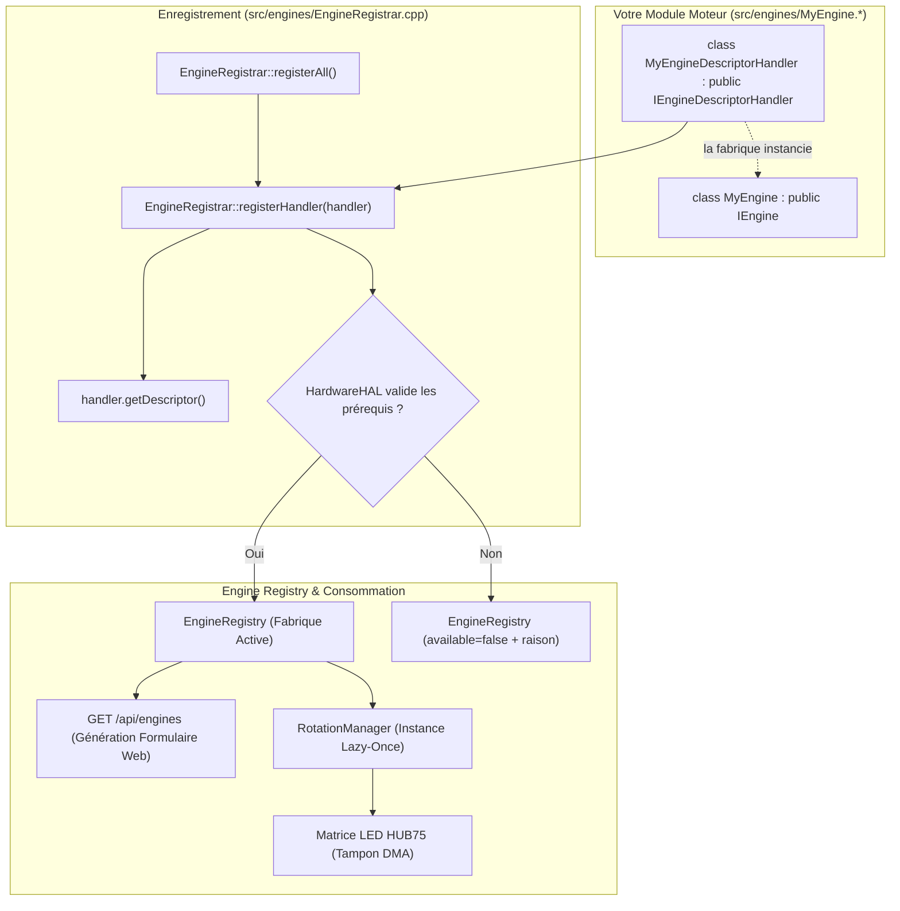
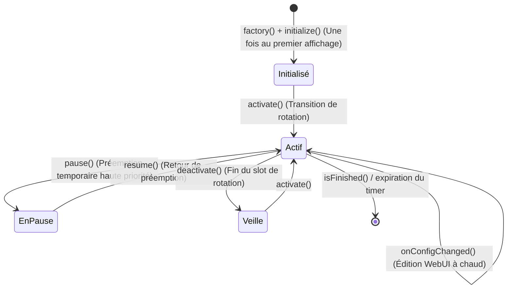
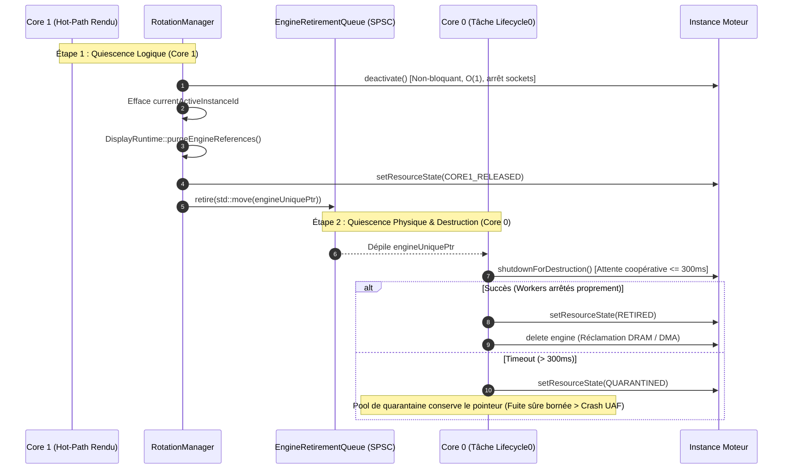

[English](DEVELOPER.md) | 🇫🇷 Français | 🇪🇸 [Español](DEVELOPER_ES.md)

# Guide Développeur (ESP32 — C++)

Ce document est le guide **technique exhaustif** pour étendre ArcadeMatrix sur ESP32 (développé en **C++**). Il détaille l'intégralité du contrat `IEngine`, le schéma `ConfigField` complet (incluant les **listes d'options dynamiques**, la sélection multiple, la visibilité conditionnelle et les politiques d'auto-réparation), le filtrage des capacités matérielles et la création d'un moteur étape par étape.

> Pour comprendre les choix d'architecture (Registre, Lazy-Once, DisplayArbiter, threading FreeRTOS, overlay), consultez [ARCHITECTURE_FR.md](ARCHITECTURE_FR.md). Ce guide est le manuel pratique de mise en œuvre.

---

## Table des Matières

1. [Modèle Mental](#1-modèle-mental)
2. [Le Contrat IEngine Complet](#2-le-contrat-iengine-complet)
3. [Le Cycle de Vie & Règles d'Or](#3-le-cycle-de-vie--règles-dor)
4. [Capacités & Prérequis Matériels](#4-capacités--prérequis-matériels)
5. [Référence du ConfigSchema & ConfigField](#5-référence-du-configschema--configfield)
6. [Listes d'Options Dynamiques (`options_endpoint`)](#6-listes-doptions-dynamiques-options_endpoint)
7. [Champs à Sélection Multiple](#7-champs-à-sélection-multiple)
8. [Champs Conditionnels (`visible_when`)](#8-champs-conditionnels-visible_when)
9. [Politiques de Validation & Auto-Réparation](#9-politiques-de-validation--auto-réparation)
10. [Tutoriel : Créer un Nouveau Moteur Pas-à-Pas](#10-tutoriel--créer-un-nouveau-moteur-pas-à-pas)
11. [Tutoriel : Ajouter un Endpoint d'Options Dynamiques](#11-tutoriel--ajouter-un-endpoint-doptions-dynamiques)
12. [Tutoriel : Ajouter un Nouveau Thème / Horloge (ClockFace)](#12-tutoriel--ajouter-un-nouveau-thème--horloge-clockface)
13. [Internationalisation & Centralisation i18n (Front & Back)](#13-internationalisation--centralisation-i18n-front--back)
14. [Lecture de la Configuration dans un Moteur](#14-lecture-de-la-configuration-dans-un-moteur)
15. [Rendu sur la Matrice LED](#15-rendu-sur-la-matrice-led)
16. [Tests & Compilation Locale](#16-tests--compilation-locale)
17. [Checklist du Développeur](#17-checklist-du-développeur)

---

## 1. Modèle Mental

ArcadeMatrix **n'a aucune liste de moteurs codée en dur** dans `main.cpp`. Chaque moteur s'enregistre au démarrage dans le `EngineRegistry`.


```mermaid
flowchart TD
    subgraph ModuleMoteur["Votre Module Moteur (src/engines/MyEngine.*)"]
        ENG["class MyEngine : public IEngine"]
        HND["class MyEngineDescriptorHandler : public IEngineDescriptorHandler"]
        HND -.->|"la fabrique instancie"| ENG
    end

    subgraph Registre["Enregistrement (src/engines/EngineRegistrar.cpp)"]
        REGT["EngineRegistrar::registerAll()"]
        REGT --> CALL["EngineRegistrar::registerHandler(handler)"]
        CALL --> GET["handler.getDescriptor()"]
        CALL --> GATING{HardwareHAL valide les prérequis ?}
    end

    subgraph Core["Engine Registry & Consommation"]
        GATING -->|"Oui"| REG["EngineRegistry (Fabrique Active)"]
        GATING -->|"Non"| REG2["EngineRegistry (available=false + raison)"]
        REG --> API["GET /api/engines (Génération Formulaire Web)"]
        REG --> RM["RotationManager (Instance Lazy-Once)"]
        RM --> SCREEN["Matrice LED HUB75 (Tampon DMA)"]
    end

    HND --> CALL
```

Ajouter un moteur nécessite **deux étapes simples** :
1. Implémenter votre classe de moteur (`IEngine`) et son descripteur (`IEngineDescriptorHandler`) dans `src/engines/`.
2. Ajouter l'instance de votre descripteur dans la liste des handlers de `src/engines/EngineRegistrar.cpp`.

> [!NOTE]
> **Pourquoi `IEngineDescriptorHandler` sur ESP32 ?**
> Plutôt qu'un registre centralisé monolithique avec tous les schémas en dur (God Class), chaque moteur définit et encapsule ses propres métadonnées, son schéma de configuration, ses besoins matériels et sa fabrique. Le `EngineRegistrar` se charge d'itérer sur l'ensemble des handlers et d'appliquer le gating matériel au runtime avant enregistrement dans `EngineRegistry`.

**`main.cpp` et les fichiers HTML du frontend ne sont jamais modifiés.**

---

## 2. Le Contrat IEngine Complet

```cpp
class IEngine {
public:
    virtual ~IEngine() = default;

    // --- Cycle de vie obligatoire ---
    virtual EngineError initialize(EngineContext* context, const EngineConfig* config) = 0;
    virtual void activate() = 0;
    virtual void update(EngineContext* context) = 0;
    virtual void render(EngineContext* context) = 0;
    virtual void deactivate() = 0;

    // --- Destruction physique sur Core 0 ---
    virtual bool shutdownForDestruction() { return true; }

    // --- Cycle de vie de préemption (optionnel) ---
    virtual void pause() {}
    virtual void resume() {}

    // --- Optionnels (comportements par défaut fournis) ---
    virtual void onConfigChanged(const EngineConfig* config) {}
    virtual bool isFinished() const { return false; }
    virtual bool isRealtime() const { return true; }
    virtual void setRotationBudget(uint32_t budget) {}
    virtual bool selfPaced() const { return false; }
    virtual bool allowsOverlay() const { return true; }
};
```

| Méthode | Défaut | Quand la surcharger |
| :--- | :--- | :--- |
| `initialize()` | — | **Toujours.** Valider le contexte/surface, allouer les tampons et initialiser la config. |
| `activate()` | — | **Toujours.** Réinitialiser la phase d'animation, démarrer les timers ou planifier le premier rafraîchissement. |
| `update()` | — | **Toujours.** Faire progresser la simulation/physique, mettre à jour les coordonnées des sprites. Zéro dessin. |
| `render()` | — | **Toujours.** Dessiner les pixels dans `context->getSurface()`. |
| `deactivate()` | — | **Toujours.** Quiescence logique non bloquante sur Core 1 : détacher la surface, interrompre les sockets, positionner les drapeaux d'arrêt. Zéro attente, zéro allocation. |
| `shutdownForDestruction()` | `return true;` | **Si le moteur a des tâches de fond.** Quiescence physique sur Core 0 : attendre coopérativement l'arrêt des workers, libérer les piles de tâches et tampons DMA avant suppression de l'instance. |
| `pause()` | no-op | **Optionnel.** Appelé lors d'une préemption temporaire par une alerte haute priorité. Préserve l'état interne. |
| `resume()` | no-op | **Optionnel.** Appelé lors du retour après préemption sans perdre la phase d'animation ni les timers. |
| `onConfigChanged()` | no-op | **Si le moteur a des réglages.** Recharger les paramètres sur place sans recréer l'instance. |

---

## 3. Le Cycle de Vie & Règles d'Or


```mermaid
stateDiagram-v2
    [*] --> Initialisé : factory() + initialize() (Une fois au premier affichage)
    Initialisé --> Actif : activate() (Transition de rotation)
    Actif --> Actif : update() + render() (Boucle Chaude 60 FPS)
    Actif --> Actif : onConfigChanged() (Édition WebUI à chaud)
    Actif --> EnPause : pause() (Préemption temporaire haute priorité)
    EnPause --> Actif : resume() (Retour de préemption)
    Actif --> Veille : deactivate() (Fin du slot de rotation)
    Veille --> Actif : activate()
    Actif --> [*] : isFinished() / expiration du timer
```

### Matrice de Décision d'Affichage & Cycle de Vie

Le `DisplayArbiter` résout les sources d'affichage de manière déterministe via une échelle statique de priorités et transmet ses décisions au `DisplayRuntime` :

| Scénario | Action sur l'Ancien Moteur | Action sur le Nouveau Moteur | État de la Session |
| :--- | :--- | :--- | :--- |
| **Préemption Temporaire** (ex. Alerte MQTT sur Horloge) | `oldEngine->pause()` | `alertEngine->activate()` | Nouvel identifiant de session ; ancien moteur conservé pour reprise |
| **Fin de Préemption** (Retour à l'Horloge) | `alertEngine->deactivate()` | `oldEngine->resume()` | Reprise transparente de l'horloge sans perte d'état ni d'animation |
| **Rotation Carrousel** (ex. Horloge → Météo) | `oldEngine->deactivate()` | `newEngine->activate()` | Démarrage propre du nouveau slot de carrousel |

### Règles d'Or pour le C++ Embarqué

1. **Règle d'Or #1 — Zéro Allocation dans la Boucle Chaude :** Ne jamais instancier de `String`, de `std::vector` ou appeler `malloc`/`new` dans `update()` ou `render()`. Pré-allouez vos structures dans `initialize()`.
2. **Règle d'Or #2 — Hot Path Lock-Free & Zéro Mutex sur Core 1 :** Le Core 1 exécute `update() -> evaluate() -> render()` de manière totalement lock-free. La configuration est accédée exclusivement via le protocole Single-Reader Single-Writer (SRSW) CAS linéarisable (`ConfigSnapshotGuard guard = config.acquireSnapshot(); const auto& snapshot = guard.get();`).
3. **Règle d'Or #3 — File de Commandes SPSC Cross-Core :** Le Core 0 soumet les requêtes d'affichage via `m_displayArbiter.submitRequest(req)`. Le Core 1 possède exclusivement les slots d'arbitrage et dépile les commandes en $O(1)$ sans verrouillage mutex.
4. **Règle d'Or #4 — Hot Reload sur Place :** Dans `onConfigChanged()`, mettez à jour les variables internes directement. L'instance n'est **pas** détruite ni recréée.
5. **Règle d'Or #5 — Propriété SD à Gros Grain, Jamais de Verrou par Lecture :** `sdMutex` est un mutex FreeRTOS **non récursif** (`xSemaphoreCreateMutex()`). Prenez-le **une seule fois**, autour d'une transaction SD complète (ouverture, scan de répertoire, lecture de fichier entier, fermeture), et jamais à l'intérieur d'un callback que cette même transaction peut ré-entrer : `AnimatedGIF` appelle ses callbacks de lecture/seek de façon synchrone depuis `gif.open()`, donc y poser un verrou provoque un auto-blocage. Une fois le handle de streaming ouvert, il appartient exclusivement au Core 1 pour toute la durée de la session de lecture et est lu **sans** verrou, conformément à la Règle d'Or #2. Les producteurs Core 0 (handlers HTTP, MQTT) doivent toujours utiliser une attente **bornée** (`pdMS_TO_TICKS(...)`) et se dégrader proprement : `portMAX_DELAY` sur la tâche AsyncTCP gèle l'intégralité du serveur web.
6. **Règle d'Or #6 — Overlays vs Moteurs Sélectionnables :**
   - **Moteur Sélectionnable (Engine) :** Remplace le framebuffer principal (ex: Horloge, Météo, GIF, Crypto). Enregistré dans `EngineRegistry` avec un descripteur, une fabrique et un `EngineHandle` canonique.
   - **Overlay Transverse :** Compose de manière additive au-dessus de la source active (ex: Fighter). Géré exclusivement par `OverlayManager`, activé par entrée de rotation (`overlays.fighter: true`), jamais enregistré dans `EngineRegistry`.
7. **Règle d'Or #7 — Protocoles Réseau à État & Cycle de Vie des Sockets (CastV2 / TLS) :**
   - Les moteurs de streaming réseau transversaux (ex: `GoogleCastEngine`) DOIVENT maintenir une connexion `WiFiClientSecure` persistante à travers les cycles de sondage, avec des heartbeats de protocole actifs (CastV2 `PING` toutes les 5s sur `urn:x-cast:com.google.cast.tp.heartbeat` vers `receiver-0`).
   - NE JAMAIS instancier/détruire des clients TLS dans une boucle de sondage rapide (1-2s) : les états TCP `TIME_WAIT` persistent 120 secondes dans lwIP. Les sockets s'accumulent jusqu'au plafond de l'OS (`fd 48`, `ECONNABORTED = 113`), privant `AsyncWebServer` (port 80) et mDNS, ce qui provoque `ERR_ADDRESS_UNREACHABLE`.
   - Le backoff de reconnexion après un échec DOIT être d'au moins 15 secondes pour borner à 8 le nombre de descripteurs `TIME_WAIT` concurrents (bien en dessous du plafond de 48).
   - **Limite connue :** même avec la sérialisation (Règle d'Or #11), Google Cast peut se voir refuser l'admission TLS indéfiniment une fois que la SRAM interne se stabilise dans un état fragmenté (plus gros bloc sous ~16 Ko) avec d'autres moteurs actifs — la découverte mDNS réussissant pendant que la poignée de main n'aboutit jamais se traduit actuellement par « Cast ne fonctionne pas ». C'est une dégradation acceptée, pas encore une vraie correction.
8. **Règle d'Or #8 — Hiérarchie des Ressources : Services Critiques vs Overlays Opportunistes :**
   - Les services critiques (matrice d'affichage, serveur web Core 0, flux audio, Cast transversal, SDMMC) ont une bande passante et une mémoire réservées.
   - Les overlays opportunistes et décoratifs (`FighterEngine`, `ArtworkService`) DOIVENT être strictement subordonnés :
     * Ne jamais concurrencer les services critiques pour la RAM, le DMA ou la bande passante du bus.
     * S'arrêter immédiatement dès le premier échec de fichier ou baisse mémoire (`heap < 30 Ko`, `dma < 16 Ko`, `psram < 1 Mo`), libérer toute allocation partielle et abandonner sans tenter les fichiers restants.
     * Utiliser `NetworkBudget::canStartTlsSession()` avant tout téléchargement HTTPS/TLS optionnel.
9. **Règle d'Or #9 — Verrouillage DMA Matériel pour Crypto & Stockage :**
   - Le SHA matériel (`esp-sha`) sur ESP32-S3 et la lecture de blocs SDMMC nécessitent une mémoire DMA interne contiguë (`MALLOC_CAP_DMA | MALLOC_CAP_INTERNAL`). Si le DMA interne descend sous 16 Ko ou le plus gros bloc DMA sous 4096 octets, `esp-sha: Failed to allocate buf memory` et `sdmmc_read_blocks failed (257) (ESP_ERR_NO_MEM)` surviennent.
   - `NetworkBudget::canStartTlsSession()` doit évaluer la marge DMA interne (`freeDma >= 16 Ko`, `largestDma >= 4 Ko`) en plus de la DRAM totale avant d'admettre une poignée de main TLS.
10. **Règle d'Or #10 — Récupération de Périphérique à Chemin Unique (Core 0 Exclusif) :**
    - Ne jamais exécuter de watchdogs de récupération en parallèle sur plusieurs cœurs.
    - Si le Core 1 détecte une anomalie matérielle (ex : gel du zéro numérique de l'ES7210), il l'évalue sans verrou en $O(1)$ et signale un drapeau atomique.
    - La récupération (réinitialisation I2C) s'exécute exclusivement sur Core 0 avec limitation de fréquence/cooldown bornés (3000 ms), totalement isolée du hot-path de rendu audio Core 1.
11. **Règle d'Or #11 — mbedTLS Reste 100% SRAM Interne ; Admettre & Sérialiser, Jamais Router le TLS vers la PSRAM :**
    - mbedTLS sur cette carte DOIT utiliser l'allocateur standard ESP-IDF/Arduino (100% SRAM interne), comme en `v3.1.0`. **Ne pas** réintroduire un hook `mbedtls_platform_set_calloc_free()` routant vers la PSRAM (l'ancien `MbedTlsAllocator` a été supprimé précisément pour cette raison) : les tests sur matériel réel ont prouvé que TOUTE allocation mbedTLS atterrissant en PSRAM — même seulement les buffers d'enregistrement TLS de ~16 Ko — corrompt l'affichage HUB75 en quelques secondes, car le framebuffer réside lui aussi en PSRAM et entre en contention avec mbedTLS sur le cache PSRAM partagé via le moteur GDMA HUB75. Voir `HardwareHAL::begin()` pour le commentaire complet de cause racine.
    - La SRAM interne devant désormais servir simultanément le TLS, le DMA et le réseau, chaque point d'appel TLS DOIT construire un `NetworkBudget::ScopedTlsHandshakeLock` immédiatement avant `WiFiClientSecure::connect()` et abandonner (`if (!tlsLock) { ...; return; }`) en cas d'échec d'acquisition. C'est un mutex global unique : **une seule poignée de main TLS peut être en cours dans tout le firmware à un instant donné.**
    - Limite d'admission stricte, revalidée **atomiquement dans le constructeur du verrou** (pas seulement en pré-vérification séparée) : `NetworkBudget::canStartTlsSession()` exige `freeInternal >= 45 Ko` et une marge de double buffer vérifiée (soit `largestInternalBlock >= 34.5 Ko` soit deux blocs indépendants de 16.5 Ko) pour satisfaire les tampons d'enregistrement simultanés in/out de mbedTLS (~33.4 Ko au total). Une pré-vérification avant même de tenter le verrou est autorisée comme optimisation bon marché pour éviter de bloquer sur un mutex contesté quand le budget est déjà connu insuffisant, mais elle n'est **jamais** autoritaire à elle seule — le temps d'attente de contention du mutex (jusqu'à 5s) suffit pour qu'une poignée de main concurrente invalide un résultat « OK » antérieur. Seule la revérification après acquisition, dans le constructeur, fait autorité.
    - *Note sécurité :* mbedTLS étant à nouveau 100% SRAM interne, il n'y a plus de risque de résidence PSRAM à documenter pour le matériel sensible TLS.
12. **Règle d'Or #12 — Accès SD via `SdLockGuard`, Jamais de `xSemaphoreTake`/`Give` Manuel :**
    - Utilisez `SdLockGuard guard(timeoutTicks); if (!guard) { ...; return; }` (`src/core/SdLockGuard.h`) pour chaque acquisition de `sdMutex`. C'est un wrapper RAII qui garantit la libération du mutex sur chaque chemin de retour (y compris les retours anticipés), éliminant le risque de fuite de verrou des paires manuelles `xSemaphoreTake(...) ... xSemaphoreGive(...)` qui devraient sinon être dupliquées sur chaque chemin de sortie.
    - Cela n'assouplit pas la Règle d'Or #5 : le verrou reste pris à gros grain autour d'une transaction SD complète, jamais à l'intérieur de callbacks de streaming par image/octet (`GIFReadFile`/`GIFSeekFile` restent délibérément **non verrouillés**, le handle de fichier étant ouvert une seule fois sous `SdLockGuard` puis possédé exclusivement par le Core 1 pour le reste de la session de lecture).
13. **Règle d'Or #13 — Barrière de Libération pour la Retraite des Moteurs (Anti-UAF) :**
    - Avant que le `unique_ptr` d'un moteur ne soit déplacé dans `EngineRetirementQueue` pour destruction sur Core 0, `RotationManager::retireEngineSlot()` DOIT, dans l'ordre : (1) appeler `deactivate()`, (2) effacer `currentActiveInstanceId` si correspondance, (3) appeler `DisplayRuntime::purgeEngineReferences(engine, instanceId)` pour retirer le pointeur de `m_session.activeEngine` et de la pile de préemption, (4) marquer `EngineResourceState::CORE1_RELEASED`, (5) effacer le slot `instanceId` local. Ce n'est qu'après ces cinq étapes que le moteur peut être transmis au Core 0. Ne jamais dupliquer cette séquence ailleurs en ligne — toujours appeler `retireEngineSlot()`.
14. **Règle d'Or #14 — Ségrégation des Domaines Mémoire & PSRAM en Priorité pour les Gros Tampons :**
    - Déplacer les allocations de documents JSON applicatifs (`WebServerAPI`, endpoints REST) vers la PSRAM via `SpiRamJsonDocument` ; AsyncTCP/lwIP et les allocations internes au serveur restent dans leurs domaines de DRAM interne requis.
    - Les gros framebuffers graphiques hors DMA direct (comme le canvas de 32 Ko de `GifEngine`) DOIVENT prioriser l'allocation en PSRAM (`MALLOC_CAP_SPIRAM | MALLOC_CAP_8BIT`) lorsque la PSRAM est disponible, réservant la DRAM interne pour mbedTLS et la pile réseau LwIP.
    - La pile de la tâche de fond AsyncTCP est dimensionnée à 8192 octets et strictement épinglée au Core 0 (`CONFIG_ASYNC_TCP_RUNNING_CORE=0`) pour protéger le hot-path de rendu d'affichage du Core 1 (Invariant 1).
    - Les services réseau persistants (Google Cast) DOIVENT appliquer un backoff exponentiel (5s, 10s, 20s, 60s) initialisé dès la rupture de session, évitant les tempêtes de reconnexion pendant les salves de trafic HTTP/LwIP.
15. **Règle d'Or #15 — Rendu Pur via `IDrawingSurface` & Isolation DMA (Invariants 18 & 19) :**
    - Les moteurs ne doivent JAMAIS interagir directement avec le pilote matériel physique ou `FastMatrixPanel` (`getMatrix()->fillScreen(0)` est strictement proscrit).
    - Tous les effacements et opérations de pixels doivent obligatoirement passer par `context->getSurface()->clear(0)` ou `fillScreen(0)`.
    - `CanvasBufferedSurface` garantit que l'effacement du canvas modifie uniquement la SRAM interne et n'écrit jamais dans le buffer DMA HUB75 en cours de balayage actif, éliminant intégralement le scintillement d'écran noir sur les systèmes à simple buffer.
16. **Règle d'Or #16 — Désactivation Sans Allocation & Quiescente (Invariants 15 & 16) :**
    - `deactivate()` doit être 100% sans allocation : ne jamais appeler `std::vector::shrink_to_fit()` ou de redimensionnement dynamique pendant la désactivation ; utiliser `std::vector<T>().swap(vec)` ou `{}` pour désallouer inconditionnellement sans allouer de métadonnées.
    - `deactivate()` s'exécute sur le Core 1 de manière strictement non bloquante pour garantir la **quiescence logique de rendu** (cessation immédiate de tout ordre de tracé et détachement de la surface). L'arrêt physique complet des workers d'arrière-plan, timers et sockets réseau est pris en charge sur Core 0 par `shutdownForDestruction()` avant la libération des ressources partagées.
17. **Règle d'Or #17 — Quiescence Réseau & Interruption Ciblée de Sockets (Invariant N8) :**
    - Tout moteur réseau doit supporter l'annulation coopérative immédiate (`session.abort()` / `_client.stop()`).
    - `deactivate()` doit cesser toute interaction de rendu sur Core 1 et signaler l'annulation de session sans attente active ni blocage sur des sockets.
    - `shutdownForDestruction()` sur Core 0 doit interrompre/joindre les workers d'arrière-plan et finaliser la quiescence des ressources réseau avant toute destruction ou libération partagée.
    - Dès qu'une session est annulée et son propriétaire quiescent, aucun traitement applicatif, callback, parsing JSON ou allocation ne peut avoir lieu sur cette session.
18. **Règle d'Or #18 — Pipeline de Présentation Dynamique & Fidélité des Couleurs (Invariant 21) :**
    - Les moteurs ne doivent pas supposer une profondeur de couleur statique figée. Lors du passage entre moteurs graphiques (jusqu'à 8 bits configurés) et moteurs TLS (4 bits nominal), le pipeline se reconfigure de manière déterministe sous extinction matérielle OE ($< 30\text{ ms}$).
    - **Garantie P0 :** L'extinction matérielle OE n'est relâchée (LOW) qu'après le commit et la présentation validée de la Frame 0 (`firstFrameCommitted == true`). En cas d'échec de la cible et des replis progressifs, OE reste à HIGH (`PresentationRecovery`).
    - La télémétrie distingue `requestedDepth` (politique), `effectiveDepth` (réelle installée) et `fallbackUsed = (effectiveDepth != requestedDepth)`.
    - `FastMatrixPanel::initLuts(depth)` recalcule à la volée les tables de quantification gamma pour garantir un rendu fidèle sans distorsion des couleurs (voir [MEMORY_MODEL_FR.md](MEMORY_MODEL_FR.md) et [MEMORY_OPTIMIZATIONS_FR.md](MEMORY_OPTIMIZATIONS_FR.md)).
19. **Règle d'Or #19 — Consolidation des Transactions Réseau & Batching Keep-Alive :**
    - Les moteurs réseau interrogeant plusieurs données (ex : cours boursiers, prévisions météo) NE DOIVENT PAS ouvrir de connexions TLS individuelles séquentielles.
    - Si plusieurs éléments sont disponibles sur un seul endpoint REST, utiliser des paramètres de lot multi-symboles (ex : GET CoinGecko avec symboles séparés par des virgules).
    - Si plusieurs requêtes vers le même hôte sont nécessaires, réutiliser une session TLS persistante avec keep-alive HTTP/1.1 (`net::SecureHttpSession session("host"); session.get(...)`), effectuant **une seule poignée de main TLS par session de lot keep-alive réussie**.
    - Implémenter la consolidation sur défaut de cache : lorsqu'un élément est récupéré, rafraîchir tous les éléments configurés dans cette session unique pour que les rotations suivantes consomment le cache RAM avec zéro latence réseau.
20. **Règle d'Or #20 — Cache d'Icônes à 3 Niveaux & Proscription de PNGdec sur ESP32 Standard :**
    - `PNGdec` intègre une fenêtre interne zlib de 32 Ko (`sizeof(PNG) = 34 288 o`). Appeler `new PNG()` sur ESP32 standard sans PSRAM lorsqu'un panneau 4 bits est actif provoque inévitablement un `std::bad_alloc`. L'instanciation dynamique `new PNG()` est **strictement proscrite** sur ESP32 standard.
    - Toutes les icônes de marché et d'interface DOIVENT utiliser `IconService` :
      * **L1 (Cache RAM) :** Bitmaps RGB565 en mémoire pour rendu instantané.
      * **L2 (Cache SD) :** Cache local persistant (`/crypto_icons/`, `/stock_icons/`).
      * **L3 (Proxy Réseau) :** Téléchargement HTTP simple via `images.weserv.nl` transcodé en JPEG, décodé via `JPEGDEC` en ~2,5 Ko de RAM.
      * Si le proxy ou le réseau est indisponible, se replier sur le cache SD ou afficher du texte élégamment sans icône.
21. **Règle d'Or #21 — Sondage Réseau Différé Sensible à la Présentation :**
    - Sur le matériel sans PSRAM (`!psramFound()`), le sondage réseau d'arrière-plan DOIT être différé pendant qu'un panneau 4 bits présente activement si des données initiales sont déjà en cache. Cela élimine les contentions transitoires du tas et prévient les micro-saccades visuelles.
22. **Règle d'Or #22 — Séquençage de Boot & Compactage de la Zone Système Persistante :**
    - Toutes les allocations système permanentes (pilote Wi-Fi, association STA, négociation DHCP, DNS publics, répondeur mDNS avec pile de 4 Ko, client SNTP, fermetures de routes WebServerAPI avec tâche worker `async_tcp` de 8 Ko, AudioHub, Core0LifecycleDispatcher "Lifecycle0" avec pile de 3 Ko) DOIVENT être initialisées à l'Étape 3 *avant* l'allocation de la matrice d'affichage (`matrixEngine.begin()`).
    - Cela rassemble l'ensemble de la mémoire permanente en DRAM basse (`0x3ffe0000..0x3ffee000`), garantissant que la Zone Sandbox Volatile (`0x3ffee000..0x3fffffff`) demeure contiguë et fusionne à 50–65 Ko lors de la libération du panneau.
23. **Règle d'Or #23 — Préchangement en Fenêtre de Transition & Verrouillage TLS en Présentation :**
    - Les moteurs nécessitant des données distantes et des points d'historique (ex. `StockEngine`, `CryptoEngine`) DOIVENT implémenter `prefetchData()` pour récupérer cours et graphiques dans la fenêtre de transition propre avec DMA libéré (où 70 à 90 Ko sont disponibles), avant l'allocation du panneau cible.
    - La boucle de rendu (`update()`) DOIT afficher strictement depuis le cache sans exécuter de négociations TLS bloquantes. Tout appel TLS en cours de présentation est verrouillé par `NetworkBudget::canStartTlsSession()` exigeant `largest >= TLS_MIN_COMBINED_BLOCK` (40 Ko).
    - La méthode `deactivate()` doit laisser **zéro chaîne ou tampon survivant** (ex. `GifEngine` réinitialisant `lastPlayedGif` et échangeant ses vecteurs) pour préserver le bloc contigu du sandbox.

---

---

## 4. Capacités, Empreinte Mémoire Granulaire & Prédiction d'Allocation

Déclarées dans le descripteur du moteur, les capacités et exigences statiques informent le runtime, le WebUI et le `CompatibilityEvaluator` des dépendances matérielles, des budgets de présentation et des empreintes mémoire exactes :

```cpp
struct EngineCapabilities {
    bool supports_128x32 = true;
    bool supports_256x64 = true;
    bool realtime = true;
    bool interruptible = true;
    bool selfPaced = false;
    bool allowsOverlay = true;          // Autorise les overlays transverses (ex : Fighter)
    bool allowRotation = true;          // Éligible au carrousel de rotation WebUI
};

struct EngineRequirements {
    // --- Dépendances Périphériques Matérielles ---
    bool needsPsram = false;            // SPIRAM externe strictement requise
    bool needsPsramDma = false;         // SPIRAM compatible DMA requise (ESP32-S3)
    bool needsAudio = false;            // Matériel audio requis (alias de compatibilité)
    bool needsAudioInput = false;       // Microphone I2S requis (ex : Décibel, Visualiseur)
    bool needsAudioOutput = false;      // DAC/Haut-parleur I2S requis
    bool needsI2s = false;              // Bus I2S général requis
    bool needsTempSensor = false;       // Capteur de température SHTC3 requis
    bool needsGyroscope = false;        // IMU QMI8658 requis
    bool needsNetwork = false;          // Connexion Wi-Fi active requise
    bool needsTls = false;              // Handshake cryptographique TLS/HTTPS requis
    bool needsSd = false;               // Stockage carte MicroSD requis

    // --- Stratégie de Buffer & Présentation ---
    bool requiresDoubleBuffer = false;  // Ne tolère pas le déchirement d'écran
    bool prefersDoubleBuffer = false;   // Préfère le double buffer, tourne dégradé en simple buffer
    bool supportsSingleBuffer = true;   // Autorise le mode simple buffer
    uint16_t targetFps = 60;            // Fréquence cible d'affichage (60, 30, 10, 1)

    // --- Modélisation Granulaire de l'Empreinte Mémoire ---
    uint32_t internalPersistentBytes = 0;   // DRAM interne persistante entre frames
    uint32_t internalContiguousBytes = 0;   // Plus grand bloc contigu requis en DRAM
    uint32_t psramBytes = 0;                // Tampon de travail dédié en SPIRAM
    uint32_t shadowBytesPerFrame = 0;       // Allocations transitoires par frame (0 sur boucle chaude)
    uint32_t minFreeInternalHeapBytes = 0;  // Seuil plancher de mémoire dynamique interne
    uint32_t minLargestInternalBlockBytes = 0;
    uint32_t minFreeDmaBytes = 0;
    uint32_t minFreePsramBytes = 0;

    // --- Limites Géométriques ---
    uint16_t minWidth = 0;
    uint16_t minHeight = 0;
    uint16_t maxWidth = 0;              // 0 = illimité
    uint16_t maxHeight = 0;             // 0 = illimité
};
```

---

### 4.1 Modélisation Granulaire de l'Empreinte Mémoire (`EngineRequirements`)

ArcadeMatrix V4 remplace les heuristiques approximatives par une **modélisation mémoire déterministe**. Chaque descripteur de moteur DOIT déclarer des valeurs réalistes dans `EngineRequirements` :

1. **`internalPersistentBytes` (Rétention Statique en DRAM) :**
   - Quantité totale de DRAM allouée dans `initialize()` et conservée entre les frames tant que le moteur réside en mémoire (structures de données, caches, tables d'ondes, polices, états).
   - *Exemple :* `MatrixRainEngine` retient ~1 Ko pour les tableaux de coordonnées des gouttes ; `WeatherEngine` retient ~6 Ko pour le modèle de données météo et les instances de fournisseurs.
2. **`internalContiguousBytes` (Allocation Contiguë Maximale) :**
   - Plus grand bloc contigu individuel nécessaire lors de l'exécution ou de l'initialisation (tampons de décompression, scratchpads de traitement, tampons de paquets TLS).
   - *Exemple :* Un moteur décodant des icônes JPEG a besoin d'`~4 Ko` contigus pour l'état du décodeur ; les moteurs TLS requièrent au moins `16 000 o` pour le tampon d'enregistrement mbedTLS entrant.
3. **`psramBytes` (Tampon de Travail Dédié en SPIRAM) :**
   - Mémoire externe requise pour les canevas hors-écran haute résolution, échantillons audio ou feuilles de sprites volumineuses.
4. **`shadowBytesPerFrame` (Allocations Transitoires par Image) :**
   - Doit être égal à `0` pour tous les moteurs standards. Toute valeur non nulle représente des allocations dynamiques transitoires par frame, strictement proscrites sur le hot-path Core 1 (Invariant 1).
5. **Rôle Déterminant de `needsTls` sur la Sélection du Pipeline :**
   - Déclarer `needsTls = true` avertit la `PipelineSelectionPolicy` que le moteur effectuera des poignées de main HTTPS. Sur l'ESP32 standard sans PSRAM, ce drapeau déclenche la rétrogradation dynamique de la profondeur de couleur HUB75 DMA de **8 bits à 4 bits**, récupérant **18 Ko de RAM DMA** et exposant **50 à 64 Ko de DRAM contiguë** (`NetworkBudget::TLS_MIN_LARGEST_BLOCK = 16 717 o`). Cela garantit 100 % de succès sur les handshakes TLS sans plantage mémoire.

---

### 4.2 Prédiction d'Allocation & Modèle Sandbox Teardown-Then-Measure

ArcadeMatrix V4 s'appuie sur `CompatibilityEvaluator` (`src/core/CompatibilityEvaluator.h`) comme **unique autorité centralisée** pour déterminer si un moteur est exécutable sur le matériel actif :

- **Deux Modes d'Évaluation Distincts :**
  * `EvaluationMode::ReferenceCapability` : Qualification statique contre le profil matériel sous budget de référence (`ReferenceMemoryProfile`). Utilisé par le catalogue WebUI (`/api/engines`) et les gardes de mutation (`POST /api/rotation`, `POST /api/instances`), totalement immunisé contre la pression mémoire transitoire du Core 1 (ex. lecture de GIFs). Évalue le *pipeline demandé* (`targetPipeline`).
  * `EvaluationMode::RuntimeAdmission` : Validation d'admission dynamique vérifiant les contraintes instantanées du tas volatile avant d'allouer des ressources lourdes.
- **Profondeur de Couleur Adaptative (`COLOR_DEPTH_AUTO = 0`) :** `PipelineSelectionPolicy` évalue dynamiquement la profondeur de couleur HUB75 DMA optimale selon la géométrie, la présence de PSRAM et les exigences du moteur entrant (`EngineRequirements`). Les profondeurs candidates sont évaluées de la meilleure qualité (8 bits) vers le bas ($8 \dots 2$) sur toutes les plateformes, y compris l'ESP32 standard sans PSRAM. Pour les moteurs graphiques (Horloge, Date, Température, Marquee, GIFs), l'ESP32 standard sur matrices 128×32 et 64×32 atteint la pleine qualité **8 bits**. Lorsqu'un moteur nécessite TLS (`needsTls = true`), le pipeline rétrograde mathématiquement à **4 bits** (2 bits uniquement si l'admission prouve que 4 bits ne rentrent pas), libérant de 16 à 24 Ko de DRAM contiguë et garantissant 100 % de succès sur les handshakes TLS mbedTLS.
- **Modèle Sandbox Teardown-Then-Measure dans `RotationManager` :** Les transitions s'exécutent selon une séquence déterministe stricte :
  1. `oldEngine->deactivate()` : Déclenche la quiescence logique non bloquante sur Core 1 et l'annulation ciblée des sockets.
  2. `maybeReconfigurePipelineFor(newEngine)` : Évalue la marge disponible sous extinction matérielle complète OE ($< 30\text{ ms}$). Sur ESP32 standard sans PSRAM, la destruction de l'ancien moteur libère le canevas et les tampons DMA (`panelReleased == true`), exposant le pool mémoire sandbox sain de ~72 Ko (fuite de 0 octet vérifiée sur les rotations).
  3. L'évaluation de la profondeur candidate ($8 \dots 2$ bits) permet aux moteurs TLS de vérifier `NetworkBudget::TLS_MIN_LARGEST_BLOCK` (16 717 o) sur cette zone propre libérée, assurant une admission déterministe à 4 bits sans battement de profondeur.
  4. `newEngine->activate()` : Instancie le moteur avec le maximum de mémoire contiguë disponible.
  5. L'extinction matérielle OE n'est relâchée (LOW) qu'après le commit et la présentation validée de la Frame 0 (`firstFrameCommitted == true`). En cas d'échec de la cible et des replis progressifs, OE reste à HIGH (`PresentationRecovery`).
- **Consolidation du Tas au Démarrage (Étape 3c) :** `WebServerAPI` et sa tâche `async_tcp` (pile de 8 Ko) sont pré-initialisés immédiatement après le pré-init du Wi-Fi sur le Core 0, ancrant la pile au bas du tas (`0x3ffe4d20`) avant toute allocation DMA HUB75. Cela élimine définitivement le "pilier de béton" en SRAM 1 (`0x3fff3d70`) qui fragmentait la mémoire contiguë.
- **Concurrence HTTP Déclarative :** Le firmware déclare `capabilities.http.recommendedConcurrency` (1 sur `ESP32_STD`, 3 sur `WAVESHARE_S3`). La file frontend `HttpRequestQueue` borne les appels `fetch()` à cette valeur, éliminant la saturation des sockets LwIP.
- **Safe Fallback Statique Garanti :** En cas d'échec d'allocation dynamique lors de la transition (`initialize(new)`), le système bascule sur un moteur de repli garanti sans PSRAM, sans audio, sans réseau et borné à $\le 2$ Ko.

---

### 4.3 Pipeline de Retraite & Destruction des Moteurs (Core 1 vs Core 0)

Pour concilier une présentation 60 FPS sans saccades visuelles avec la prévention absolue des crashs Use-After-Free (UAF) et des fuites de ressources, ArcadeMatrix impose une **séparation stricte du cycle de vie en deux étapes** (Invariants 15 & 16) :


```mermaid
sequenceDiagram
    autonumber
    participant Core1 as Core 1 (Hot-Path Rendu)
    participant RM as RotationManager
    participant Queue as EngineRetirementQueue (SPSC)
    participant Core0 as Core 0 (Tâche Lifecycle0)
    participant Engine as Instance Moteur

    Note over Core1,RM: Étape 1 : Quiescence Logique (Core 1)
    RM->>Engine: deactivate() [Non-bloquant, O(1), arrêt sockets]
    RM->>RM: Efface currentActiveInstanceId
    RM->>RM: DisplayRuntime::purgeEngineReferences()
    RM->>Engine: setResourceState(CORE1_RELEASED)
    RM->>Queue: retire(std::move(engineUniquePtr))

    Note over Queue,Core0: Étape 2 : Quiescence Physique & Destruction (Core 0)
    Queue-->>Core0: Dépile engineUniquePtr
    Core0->>Engine: shutdownForDestruction() [Attente coopérative <= 300ms]
    alt Succès (Workers arrêtés proprement)
        Core0->>Engine: setResourceState(RETIRED)
        Core0->>Engine: delete engine (Réclamation DRAM / DMA)
    else Timeout (> 300ms)
        Core0->>Engine: setResourceState(QUARANTINED)
        Note over Core0: Pool de quarantaine conserve le pointeur (Fuite sûre bornée > Crash UAF)
    end
```

#### 1. Étape 1 : Quiescence Logique sur Core 1 (`deactivate()`)
- **Contexte d'Exécution :** Thread de rendu Core 1.
- **Contrat :** Doit être $O(1)$, strictement non bloquant, zéro attente (`vTaskDelay`), zéro mutex, zéro allocation dynamique.
- **Actions Requises :**
  * Positionner les drapeaux d'arrêt atomiques internes à `false` (`m_running.store(false)`).
  * Détacher le pointeur de surface de dessin (`surface = nullptr`).
  * Déclencher l'interruption ciblée immédiate des sockets : `net::SecureHttpClient::abortSessionsOwnedBy(ownerId)` (ou `session.abort()`).
  * **Interdiction Absolue :** Ne JAMAIS bloquer le Core 1 en attendant la terminaison d'une tâche FreeRTOS ou la fermeture de sockets réseau !

#### 2. Étape 2 : Quiescence Physique & Destruction sur Core 0 (`shutdownForDestruction()`)
- **Contexte d'Exécution :** Tâche d'arrière-plan `Lifecycle0` sur Core 0 (`Core0LifecycleDispatcher`).
- **Contrat :** S'exécute de manière asynchrone une fois le moteur retiré du Core 1.
- **Actions Requises :**
  * Demander aux tâches de fond de s'arrêter coopérativement (`m_stopWorker.store(true)`).
  * Attendre coopérativement par tranches courtes (`vTaskDelay(pdMS_TO_TICKS(10))`) jusqu'à un délai borné (ex : 300 ms).
  * Fermer les fichiers ouverts, libérer les tampons annulaires DMA, détruire les files FreeRTOS.
  * Retourner `true` si tous les workers ont quitté proprement et que les ressources sont quiescentes.
  * Retourner `false` en cas de dépassement de délai (timeout).
- **Proscription Formelle du Meurtre Forcé :** Il est STRICTEMENT INTERDIT d'appeler `vTaskDelete(taskHandle)` de manière forcée sur une tâche en cours d'exécution ! Si une tâche est tuée de force alors qu'elle exécute du code dans mbedTLS ou lwIP, les verrous internes restent bloqués, les structures mémoire sont corrompues et l'ESP32 panique.

#### 3. Les 6 Étapes de la Barrière Anti-UAF dans `RotationManager::retireEngineSlot()`
Lorsqu'un slot de moteur est remplacé ou supprimé pendant la rotation, `RotationManager` exécute la barrière de libération formelle en 6 étapes :
1. `eng->deactivate()` : Signale la quiescence logique et annule les sockets réseau.
2. Efface `currentActiveInstanceId` si correspondance.
3. `DisplayRuntime::purgeEngineReferences(eng, instId)` : Purge tout pointeur résiduel de la session active et de la pile de préemption.
4. `eng->setResourceState(EngineResourceState::CORE1_RELEASED)` : Transition d'état atomique.
5. Efface le slot `instanceId` local : Le moteur ne peut plus jamais être retrouvé via `findActiveEngine()`.
6. Transfère le `std::unique_ptr<IEngine>` dans la file `EngineRetirementQueue` pour prise en charge sur Core 0.

#### 4. Le Mécanisme de Quarantaine (Fuite Sûre > Use-After-Free)
Si `shutdownForDestruction()` renvoie `false` (tâche bloquée ou ne répondant pas dans la fenêtre de 300 ms) :
- Le moteur bascule dans l'état `EngineResourceState::QUARANTINED`.
- Il est placé dans un tableau de quarantaine borné sur le Core 0. Le dispatcher retente périodiquement `shutdownForDestruction()`.
- Si la capacité du tableau de quarantaine (8 moteurs) est atteinte, le pointeur est volontairement préservé sans suppression (`engine.release()`).
- **Garantie Architecturale :** Une fuite mémoire bornée et maîtrisée est infiniment préférable à une corruption mémoire ou un crash Use-After-Free.

#### 5. Barrière de Sécurité du Destructeur (`~MyEngine()`)
Le destructeur C++ DOIT fournir une barrière de sécurité ultime :
```cpp
MyEngine::~MyEngine() {
    // Barrière de sécurité Anti-UAF :
    // En fonctionnement normal, shutdownForDestruction() sur Core 0 a déjà arrêté les workers.
    // Si l'objet est détruit directement ou hors cycle normal, garantir l'arrêt du worker.
    if (m_workerTask && !m_workerExited.load(std::memory_order_acquire)) {
        m_stopWorker.store(true, std::memory_order_release);
        net::SecureHttpClient::abortSessionsOwnedBy(OWNER_MY_ENGINE);
        while (!m_workerExited.load(std::memory_order_acquire)) {
            vTaskDelay(pdMS_TO_TICKS(10));
        }
        m_workerTask = nullptr;
    }
    // Libération propre des conteneurs via swap ou reset
    std::vector<MyItem>().swap(m_items);
}
```

> [!IMPORTANT]
> **Procédure Obligatoire Lors de l'Ajout d'un Moteur :**
> 1. Déclarer fidèlement toutes les exigences dans `EngineRequirements` du descripteur.
> 2. Ajouter le descripteur du moteur dans `getCanonicalEngineDescriptors()` dans `test/native/tools/matrix_generator.cpp`.
> 3. Exécuter `rtk python3 scripts/generate_engine_matrix.py` pour régénérer [docs/ENGINE_COMPATIBILITY_MATRIX.md](ENGINE_COMPATIBILITY_MATRIX.md).
> 4. Valider l'intégrité CI avec `rtk python3 scripts/validate_docs.py` (qui lance `generate_engine_matrix.py --check`).

---

## 5. Référence du ConfigSchema & ConfigField

```cpp
struct ConfigField {
    String id;                          // Clé dans config.json
    ConfigType type;                    // BOOLEAN, INTEGER, FLOAT, STRING, ENUM, COLOR, LIST
    String label;                       // Libellé UI
    String description;                 // Infobulle
    String default_value;               // Valeur injectée si absente
    bool required = false;
    String min_val = "";                // Borne minimale
    String max_val = "";                // Borne maximale
    String step = "";                   // Pas du curseur
    String options = "";                // Choix statiques séparés par des virgules
    String visible_when = "";           // Règle de visibilité conditionnelle
    String options_endpoint = "";       // Endpoint d'options dynamiques
    bool multiple = false;              // Sélection multiple
    ValidationPolicy validation_policy; // Clamp, FallbackDefault, Reject, Accept
};
```

---

## 6. Listes d'Options Dynamiques (`options_endpoint`)

```cpp
{
    .id = "theme",
    .type = ConfigType::ENUM,
    .label = "Thème de l'horloge",
    .default_value = "12",
    .options_endpoint = "/api/themes"
}
```

---

## 7. Champs à Sélection Multiple

```cpp
{
    .id = "playlists",
    .type = ConfigType::LIST,
    .label = "Playlists Actives",
    .default_value = "arcade,retro",
    .options_endpoint = "/api/playlists",
    .multiple = true
}
```

---

## 8. Champs Conditionnels (`visible_when`)

```cpp
{
    .id = "custom_color",
    .type = ConfigType::COLOR,
    .label = "Couleur d'accentuation",
    .default_value = "#ff0055",
    .visible_when = "theme=20"
}
```

---

## 9. Politiques de Validation & Auto-Réparation

- `Clamp` : Borne la valeur entre `min_val` et `max_val`.
- `FallbackDefault` : Réinitialise à `default_value` si la valeur est invalide.
- `Accept` : Conserve la valeur telle quelle.

---

## 10. Tutoriel : Créer un Nouveau Moteur Pas-à-Pas

### Étape 1 : Créer `src/engines/MatrixRainEngine.h`

```cpp
#pragma once
#include <Arduino.h>
#include "core/EngineContract.h"
#include "core/drawing/IDrawingSurface.h"

class MatrixRainEngine : public IEngine {
public:
    MatrixRainEngine();
    ~MatrixRainEngine() override;

    // --- Hooks de Cycle de Vie Core 1 ---
    EngineError initialize(EngineContext* context, const EngineConfig* config) override;
    void activate() override;
    void update(EngineContext* context) override;
    void render(EngineContext* context) override;
    void deactivate() override; // Quiescence logique non bloquante sur Core 1

    // --- Hook de Destruction Core 0 ---
    bool shutdownForDestruction() override; // Quiescence physique sur Core 0

    // --- Configuration Dynamique & Cadence ---
    void onConfigChanged(const EngineConfig* config) override;
    bool isRealtime() const override { return true; }

private:
    IDrawingSurface* surface = nullptr;
    int speed = 2;
    int dropY[128];
};
```

### Étape 2 : Implémenter `src/engines/MatrixRainEngine.cpp`

```cpp
#include "MatrixRainEngine.h"

MatrixRainEngine::MatrixRainEngine() {
    memset(dropY, 0, sizeof(dropY));
}

MatrixRainEngine::~MatrixRainEngine() {
    // Barrière de sécurité du destructeur : détacher la surface
    surface = nullptr;
}

EngineError MatrixRainEngine::initialize(EngineContext* context, const EngineConfig* config) {
    if (!context || !context->getSurface()) return EngineError::InitializationFailed;
    surface = context->getSurface();
    if (config) speed = config->getInt("speed", 2);
    return EngineError::OK;
}

void MatrixRainEngine::activate() {
    for (int i = 0; i < 128; i++) dropY[i] = random(-32, 0);
}

void MatrixRainEngine::update(EngineContext* context) {
    if (!surface) return;
    for (int x = 0; x < surface->width(); x += 4) {
        dropY[x] += speed;
        if (dropY[x] > surface->height()) dropY[x] = random(-16, 0);
    }
}

void MatrixRainEngine::render(EngineContext* context) {
    if (!surface) return;
    surface->fillScreen(0);
    for (int x = 0; x < surface->width(); x += 4) {
        surface->drawPixel(x, dropY[x], IDrawingSurface::color565(0, 255, 70));
    }
}

void MatrixRainEngine::deactivate() {
    // Étape 1 (Core 1) : Quiescence logique non bloquante. Détacher la surface immédiatement.
    surface = nullptr;
}

bool MatrixRainEngine::shutdownForDestruction() {
    // Étape 2 (Core 0) : Quiescence physique.
    // MatrixRain n'a pas de tâche de fond ni de socket ouverte, destruction immédiatement sûre.
    return true;
}

void MatrixRainEngine::onConfigChanged(const EngineConfig* config) {
    if (config) speed = config->getInt("speed", 2);
}
```

### Étape 3 : Implémenter `IEngineDescriptorHandler` avec Exigences Réalistes

Dans le fichier de votre moteur (ex. `src/engines/MatrixRainEngine.h` / `.cpp`) :
```cpp
class MatrixRainEngineDescriptorHandler : public IEngineDescriptorHandler {
public:
    EngineDescriptor getDescriptor() const override {
        EngineDescriptor desc;
        desc.metadata = { "matrix_rain", "Matrix Digital Rain", "animations", FIRMWARE_VERSION };
        desc.capabilities = {
            .supports_128x32 = true,
            .supports_256x64 = true,
            .realtime = true,
            .interruptible = true,
            .allowsOverlay = true,
            .allowRotation = true
        };
        // Modélisation mémoire réaliste pour prédiction d'allocation déterministe
        desc.requirements.needsPsram = false;
        desc.requirements.needsAudio = false;
        desc.requirements.needsNetwork = false;
        desc.requirements.needsTls = false;
        desc.requirements.targetFps = 60;
        desc.requirements.supportsSingleBuffer = true;
        desc.requirements.prefersDoubleBuffer = true;
        desc.requirements.internalPersistentBytes = 1024;    // 128 entiers + état
        desc.requirements.internalContiguousBytes = 2048;    // Marge de travail

        desc.schema.fields = {
            ConfigField("speed", ConfigType::INTEGER, "Vitesse", "Vitesse de chute en pixels par frame", "2", false, "1", "5", "1", "", "", false, "", ValidationPolicy::Clamp)
        };
        desc.factory = []() { return std::unique_ptr<IEngine>(new MatrixRainEngine()); };
        return desc;
    }
};
```

### Étape 4 : Enregistrer dans `EngineRegistrar.cpp` et `matrix_generator.cpp`

1. **Enregistrement sur le Matériel Cible (`src/engines/EngineRegistrar.cpp`) :**
```cpp
#include "MatrixRainEngine.h"

void EngineRegistrar::registerAll() {
    // ...
    static const MatrixRainEngineDescriptorHandler matrixRainHandler;

    const IEngineDescriptorHandler* handlers[] = {
        // ...
        &matrixRainHandler
    };

    for (const auto* handler : handlers) {
        if (handler) registerHandler(*handler);
    }
}
```

2. **Enregistrement dans l'Outil de Qualification CI (`test/native/tools/matrix_generator.cpp`) :**
Pour garantir que la CI et la matrice de compatibilité valident votre moteur sur les 5 profils matériels, ajoutez son descripteur dans `getCanonicalEngineDescriptors()` :
```cpp
    // Matrix Rain
    {
        EngineDescriptor d;
        d.metadata = {"matrix_rain", "Matrix Digital Rain", "animations", FIRMWARE_VERSION};
        d.requirements.targetFps = 60;
        d.requirements.prefersDoubleBuffer = true;
        d.requirements.supportsSingleBuffer = true;
        d.requirements.internalPersistentBytes = 1024;
        d.requirements.internalContiguousBytes = 2048;
        engines.push_back(d);
    }
```

### Étape 5 : Régénérer la Matrice de Compatibilité & Valider la CI

Après avoir déclaré le descripteur, régénérez la matrice et validez la documentation :
```bash
# 1. Régénérer la matrice Markdown
rtk python3 scripts/generate_engine_matrix.py

# 2. Valider l'intégrité de la documentation et les gardes d'architecture
rtk python3 scripts/validate_docs.py
```

---

### 10.1 Modèle Avancé : Moteur Réseau avec Tâche de Fond (Worker) & TLS

Les moteurs exécutant des requêtes réseau et du sondage périodique (cours de bourse, météo) DOIVENT mettre en œuvre une coordination asynchrone, le batching keep-alive et une destruction anti-UAF stricte :

```cpp
// --- Exemple d'En-tête (ex : MyNetworkEngine.h) ---
class MyNetworkEngine : public IEngine {
public:
    MyNetworkEngine();
    ~MyNetworkEngine() override;

    EngineError initialize(EngineContext* context, const EngineConfig* config) override;
    void activate() override;
    void update(EngineContext* context) override;
    void render(EngineContext* context) override;
    void deactivate() override;                 // Quiescence Core 1 non bloquante
    bool shutdownForDestruction() override;     // Attente coopérative Core 0 <= 300ms

private:
    static void workerTaskEntry(void* arg);
    void fetchQuotes();

    TaskHandle_t m_workerTask = nullptr;
    std::atomic<bool> m_stopWorker{false};
    std::atomic<bool> m_workerExited{true};
    IDrawingSurface* surface = nullptr;
};
```

```cpp
// --- Exemple d'Implémentation (ex : MyNetworkEngine.cpp) ---
EngineError MyNetworkEngine::initialize(EngineContext* context, const EngineConfig* config) {
    surface = context ? context->getSurface() : nullptr;
    if (!surface) return EngineError::InitializationFailed;

    // Démarrer la tâche de sondage en arrière-plan épinglée au Core 0
    m_stopWorker.store(false, std::memory_order_relaxed);
    m_workerExited.store(false, std::memory_order_relaxed);
    BaseType_t ret = xTaskCreatePinnedToCore(
        workerTaskEntry, "NetWorker", 4096, this, 1, &m_workerTask, 0 // Core 0
    );
    return (ret == pdPASS) ? EngineError::OK : EngineError::InitializationFailed;
}

void MyNetworkEngine::deactivate() {
    // Étape 1 (Core 1) : Strictement non bloquant !
    // 1. Signaler l'arrêt au worker
    m_stopWorker.store(true, std::memory_order_release);
    // 2. Annuler immédiatement toutes les sessions TCP/TLS en vol (débloque recv/connect)
    net::SecureHttpClient::abortSessionsOwnedBy(net::OWNER_MY_NETWORK);
    // 3. Détacher la surface
    surface = nullptr;
}

bool MyNetworkEngine::shutdownForDestruction() {
    // Étape 2 (Core 0) : Attente coopérative bornée à 300 ms
    if (!m_workerTask) return true;

    m_stopWorker.store(true, std::memory_order_release);
    net::SecureHttpClient::abortSessionsOwnedBy(net::OWNER_MY_NETWORK);

    for (int i = 0; i < 30 && !m_workerExited.load(std::memory_order_acquire); i++) {
        vTaskDelay(pdMS_TO_TICKS(10));
    }

    if (m_workerExited.load(std::memory_order_acquire)) {
        m_workerTask = nullptr;
        return true; // Sortie propre ! Destruction sûre sur Core 0.
    }

    // Dépassement de délai : Ne JAMAIS appeler vTaskDelete() ! Renvoyer false pour mise en quarantaine.
    LOGW("MyNetworkEngine", "Le worker n'a pas quitté en 300ms ; mise en quarantaine anti-UAF.");
    return false;
}

MyNetworkEngine::~MyNetworkEngine() {
    // Barrière de Sécurité du Destructeur : garantir que le worker est arrêté
    if (m_workerTask && !m_workerExited.load(std::memory_order_acquire)) {
        m_stopWorker.store(true, std::memory_order_release);
        net::SecureHttpClient::abortSessionsOwnedBy(net::OWNER_MY_NETWORK);
        while (!m_workerExited.load(std::memory_order_acquire)) {
            vTaskDelay(pdMS_TO_TICKS(10));
        }
        m_workerTask = nullptr;
    }
}

void MyNetworkEngine::workerTaskEntry(void* arg) {
    auto* self = static_cast<MyNetworkEngine*>(arg);
    while (!self->m_stopWorker.load(std::memory_order_acquire)) {
        self->fetchQuotes();
        // Sommeil par tranches courtes pour réactivité immédiate à l'ordre d'arrêt
        for (int i = 0; i < 600 && !self->m_stopWorker.load(std::memory_order_acquire); i++) {
            vTaskDelay(pdMS_TO_TICKS(100));
        }
    }
    self->m_workerExited.store(true, std::memory_order_release);
    vTaskDelete(NULL); // Le worker se termine proprement de lui-même
}
```

#### Règles de Conception pour Moteurs Réseau :
1. **Déclarer `needsTls = true` :** Déclenche automatiquement l'adaptation à 4 bits de profondeur sur ESP32 standard, récupérant 18 Ko de RAM DMA.
2. **Réutiliser les Sessions Keep-Alive (Règle d'Or #19) :** Utiliser `net::SecureHttpSession` pour regrouper plusieurs requêtes avec **une seule poignée de main TLS**.
3. **Utiliser `IconService` + `JPEGDEC` (Règle d'Or #20) :** Ne JAMAIS instancier dynamiquement `new PNG()` sur ESP32 standard (l'empreinte de 34 Ko provoque un crash). Passer par `IconService` et le transcodage proxy JPEG décodé en ~2,5 Ko de RAM.
4. **Différer le Sondage pendant la Présentation Active (Règle d'Or #21) :** Sur matériel sans PSRAM, différer les requêtes réseau pendant la présentation active d'un panneau 4 bits si des données initiales sont présentes en cache.

---

## 11. Tutoriel : Ajouter un Endpoint d'Options Dynamiques

```cpp
server.on("/api/my_options", HTTP_GET, [](AsyncWebServerRequest *request){
    DynamicJsonDocument doc(512);
    JsonArray arr = doc.to<JsonArray>();
    JsonObject o1 = arr.createNestedObject();
    o1["id"] = "1"; o1["name"] = "Mode A";
    String response;
    serializeJson(doc, response);
    request->send(200, "application/json", response);
});
```

---

## 12. Tutoriel : Ajouter un Nouveau Thème / Horloge (ClockFace)

Dans ArcadeMatrix, l'affichage de l'heure est géré par un moteur unique (`ClockEngine`) qui délègue le rendu visuel à des modules spécialisés implémentant l'interface `ClockFace`. Pour créer une nouvelle horloge animée (ex : *SpaceInvadersClock*) :

### Étape 1 : Créer `src/engines/clocks/SpaceInvadersClock.h` & `.cpp`

Héritez de la classe abstraite `ClockFace` (`src/engines/ClockEngine.h`) :

```cpp
// src/engines/clocks/SpaceInvadersClock.h
#pragma once
#include "../ClockEngine.h"
#include "../../core/drawing/IDrawingSurface.h"

class SpaceInvadersClock : public ClockFace {
public:
    SpaceInvadersClock(IDrawingSurface* display, const EngineConfig* config = nullptr);
    void draw(const TimeData& t) override;
    void update() override;

private:
    int invaderFrame = 0;
    unsigned long lastAnimMs = 0;
};
```

```cpp
// src/engines/clocks/SpaceInvadersClock.cpp
#include "SpaceInvadersClock.h"

SpaceInvadersClock::SpaceInvadersClock(IDrawingSurface* display, const EngineConfig* config)
    : ClockFace(display, config) {}

void SpaceInvadersClock::update() {
    if (millis() - lastAnimMs > 500) {
        invaderFrame = (invaderFrame + 1) % 2;
        lastAnimMs = millis();
    }
}

void SpaceInvadersClock::draw(const TimeData& t) {
    if (!matrix) return;
    matrix->fillScreen(0);
    matrix->setTextSize(1);
    matrix->setTextColor(matrix->color565(0, 255, 100));
    matrix->setCursor(24, 12);
    matrix->printf("%02d:%02d:%02d", t.hour, t.minute, t.second);
}
```

### Étape 2 : Déclarer l'Enum dans `src/engines/DateEngine.h`

Ajoutez l'identifiant du thème dans `PublisherTheme` :

```cpp
enum PublisherTheme {
    // ... thèmes existants
    THEME_SPACE_INVADERS = 25
};
```

### Étape 3 : Instancier dans `ClockEngine::setTheme()` (`src/engines/ClockEngine.cpp`)

Incluez l'en-tête et instanciez votre `ClockFace` :

```cpp
#include "clocks/SpaceInvadersClock.h"

// Dans ClockEngine::setTheme():
case THEME_SPACE_INVADERS:
    activeFace = new SpaceInvadersClock(legacy_matrix, config);
    break;
```

### Étape 4 : Exposer le thème dans `scripts/extract_engine_catalog.py`

Ajoutez votre thème dans `CANONICAL_THEMES` dans `scripts/extract_engine_catalog.py` pour qu'il soit automatiquement pré-compilé dans l'interface Web à la compilation :

```python
CANONICAL_THEMES = [
    # ...
    {"id": 25, "name": "Space Invaders Clock"},
]
```

L'interface Web affichera automatiquement la nouvelle option (avec zéro allocation RAM sur l'ESP32), l'enregistrera dans `config.json` et la rechargera à chaud sans redémarrage.

---

## 13. Internationalisation & Centralisation i18n (Front & Back)

ArcadeMatrix utilise une architecture **i18n entièrement centralisée**.

> [!IMPORTANT]
> **Règle d'or : Ne jamais ajouter de champ `lang` dans les schémas de vos moteurs (`ConfigSchema`).**
> La langue est une configuration globale du système (`system.lang`), sélectionnée par l'utilisateur via le menu déroulant en haut de l'interface Web (`#lang-selector`). Tout changement de langue dans l'interface envoie automatiquement un appel `POST /api/system` et propage la nouvelle langue aux moteurs actifs en direct.

### A. Utilisation dans un moteur C++ (`#include "core/I18n.h"`)

Tous les textes traduits (jours de la semaine, conditions météo, heures en mots, statuts de décibels, etc.) sont centralisés dans le module `I18n` :

```cpp
#include "core/I18n.h"

// 1. Obtenir la langue active (FR, EN, ES)
Lang currentLang = I18n::getLang();

// 2. Libellés des jours météo (ex: "AUJ.", "DEM.", "LUN"..)
const char* dayLabel = I18n::getWeatherDayLabel(dayOfWeek, isToday, isTomorrow);

// 3. Traduction des conditions météo
String condition = I18n::getWeatherCondition("Thunderstorm with heavy rain");

// 4. Lignes complètes de l'horloge en mots (WordClock)
std::vector<String> lines = I18n::getWordClockLines(hours, minutes);

// 5. Niveaux sonores / décibels
const char* noise = I18n::getNoiseLevelLabel(levelIndex);
```

### B. Tutoriel : Ajouter une nouvelle langue (ex : Allemand `de`) en 3 étapes

1. **Front-end WebUI (`data/index.html` ou `i18n.js`) :**
   Ajoutez la langue dans `SUPPORTED_LANGUAGES` et fournissez son dictionnaire dans `translations` :
   ```javascript
   const SUPPORTED_LANGUAGES = [
     { code: 'fr', label: 'Français' },
     { code: 'en', label: 'English' },
     { code: 'es', label: 'Español' },
     { code: 'de', label: 'Deutsch' }
   ];
   ```
2. **Back-end ESP32 (`src/core/I18n.h` & `src/core/I18n.cpp`) :**
   - Ajoutez la valeur `DE` à l'enum `Lang`.
   - Renseignez les traductions dans les méthodes statiques de `I18n.cpp`.
3. **Back-end Raspberry Pi (`src/core/i18n.rs`) :**
   - Ajoutez `De` à l'enum `Lang` et implémentez les correspondances dans les fonctions de lookup.

---

## 14. Lecture de la Configuration dans un Moteur

```cpp
int speed = config->getInt("speed", 2);
String text = config->getString("title", "Arcade");
bool enabled = config->getBool("enabled", true);
float offset = config->getFloat("temp_offset", 0.0f);
```

---

## 15. Rendu sur la Matrice LED & Géométrie Responsif

ArcadeMatrix v4 abstrait le rendu d'affichage derrière l'interface matérielle agnostique `IDrawingSurface` (qui hérite de `Adafruit_GFX`). Obtenez toujours la surface via `context->getSurface()` :

```cpp
IDrawingSurface* surface = context->getSurface();
surface->drawPixel(x, y, surface->color565(r, g, b));
surface->fillRect(x, y, w, h, color);
surface->setCursor(x, y);
surface->print("TEXT");

// Ou transfert par bloc optimisé pour animations en continu (GIFs, fighters) :
surface->blit565(canvasBuffer, width, height);
```
*(Par rétrocompatibilité, `context->getMatrix()` reste accessible comme passerelle retournant `MatrixPanel_I2S_DMA*`).
*Ne jamais appeler `flipDMABuffer()` dans le moteur — la boucle principale s'en charge.*

### 15.1 La Règle d'Or du Rendu Responsif Multi-Résolutions & TATE

ArcadeMatrix fonctionne sur toutes les résolutions et orientations (`64x32`, `128x32`, `256x64`, `64x64`, `32x64`, `32x128`, `64x128`, `64x256`).

> [!IMPORTANT]
> **🏆 La Règle d'Or du Rendu :**
> 1. **Les moteurs de rendu ne doivent JAMAIS contenir d'embranchements `if (layoutClass)` directs.**
> 2. Créer une calculatrice pure associée `*LayoutCalculator` (ex: `MyEngineLayoutCalculator::calculate(geometry)`) retournant une structure `MyEngineLayout` composée de `Rect`s bornés.
> 3. La méthode `render()` dessine exclusivement à l'intérieur des `Rect`s fournis.

#### Exemple de Calculatrice de Layout Déclarative
```cpp
struct MusicLayout {
    Rect artworkRect;
    Rect metadataRect;
    Rect progressRect;
    Rect visualizerRect;
};

class MusicLayoutCalculator {
public:
    static MusicLayout calculate(const DisplayGeometry& geometry) {
        MusicLayout layout;
        if (geometry.layoutClass == LayoutClass::PORTRAIT || geometry.layoutClass == LayoutClass::TALL) {
            layout.artworkRect = { 2, 2, (uint16_t)(geometry.width - 4), (uint16_t)min((int)geometry.width - 4, (int)(geometry.height * 0.35f)) };
            layout.metadataRect = { 2, (int16_t)(layout.artworkRect.y + layout.artworkRect.height + 2), (uint16_t)(geometry.width - 4), 16 };
            layout.progressRect = { 2, (int16_t)(layout.metadataRect.y + 18), (uint16_t)(geometry.width - 4), 3 };
            layout.visualizerRect = { 2, (int16_t)(geometry.height - 12), (uint16_t)(geometry.width - 4), 10 };
        } else {
            layout.artworkRect = { 2, 2, (uint16_t)(geometry.height - 4), (uint16_t)(geometry.height - 4) };
            layout.metadataRect = { (int16_t)(layout.artworkRect.width + 6), 2, (uint16_t)(geometry.width - layout.artworkRect.width - 8), 12 };
            layout.progressRect = { (int16_t)(layout.artworkRect.width + 6), 16, (uint16_t)(geometry.width - layout.artworkRect.width - 8), 2 };
            layout.visualizerRect = { (int16_t)(layout.artworkRect.width + 6), (int16_t)(geometry.height - 10), (uint16_t)(geometry.width - layout.artworkRect.width - 8), 8 };
        }
        return layout;
    }
};
```

### 15.2 Vidéo Plein Mouvement, Streaming Canvas & FastBlit (`blitCanvas565`)

Sur les panneaux haute résolution (`256x64`) avec mémoire tampon DMA en PSRAM, l'écriture pixel par pixel (`drawPixel()`) subit des opérations read-modify-write coûteuses à travers plusieurs plans de bits, bridant le débit d'animation globale à 7–14 FPS.

Pour les moteurs d'animation plein écran (clips vidéo, défilements arcade rapides) :
1. **Rendu dans un tampon canvas mémoire RGB565 en PSRAM** (`uint16_t* canvasBuffer`).
2. **Streaming via FastBlit :** Appelez `matrixEngine.blitCanvas565(canvasBuffer, width, height)`. Cela exécute des écritures en rafale séquentielle par ligne directement dans les mots de plans DMA du back-buffer, court-circuitant le surcoût pixel par pixel et achevant la copie d'un écran 256×64 en **~26 ms** (30 à 33+ FPS constants).
3. **Désactivation d'overlay :** Si votre moteur exige une fluidité maximale, surchargez `bool allowsOverlay() const override { return false; }`.

### 15.3 Overlays vs Toile d'Arrière-Plan (Composition Transparente)

Les overlays (comme `FighterEngine`) se superposent dynamiquement au moteur d'arrière-plan :
- **Ne jamais effacer avec des rectangles opaques :** N'appelez **pas** `fillRect(..., 0)` pour effacer d'anciennes boîtes englobantes de sprites. Le moteur sous-jacent (ex: `TetrisClock`) redessine déjà l'intégralité de son image à chaque frame. Dessiner des rectangles noirs créerait des trous opaques dans les chiffres et le décor.
- **Dessin strictement transparent :** Vérifiez les couleurs avant tracé (`if (color != anim->transparentColor) matrix->drawPixel(...)`).
- **Effacement d'écran (`fillScreen(0)`) :** Quand un moteur efface son arrière-plan, `FastMatrixPanel::fillScreen(0)` masque automatiquement les bits de couleur (`BITMASK_RGB12_CLEAR`) sur le back-buffer inactif. Il ne touche jamais au front-buffer en cours de balayage physique, éliminant tout scintillement ou déchirement de lignes.

---

## 16. Tests & Compilation Locale

```bash
# ESP32 Standard
rtk pio run -e esp32dev

# Waveshare ESP32-S3
rtk pio run -e esp32s3_waveshare
```

---

## 17. Checklist du Développeur

### Architecture & Hot-Path (Core 1)
- [ ] `initialize()` effectue toutes les allocations persistantes ; la boucle chaude (`update()` / `render()`) a **zéro allocation dynamique** (`malloc`, `new`, `String`, agrandissement de vecteur).
- [ ] Le rendu Core 1 utilise `IDrawingSurface` exclusivement (zéro accès direct au matériel ou aux registres DMA).
- [ ] Les mises en page multi-résolutions réactives s'appuient sur un `*LayoutCalculator` pur renvoyant des `Rect` bornés (aucun branchement inline sur la résolution).
- [ ] `onConfigChanged()` met à jour l'état sur place sans détruire ni recréer l'instance.
- [ ] `deactivate()` est **strictement non bloquant et en $O(1)$** sur Core 1 : détache la surface, annule les sessions réseau, positionne les drapeaux atomiques d'arrêt. Zéro verrou mutex, zéro `vTaskDelay()`, zéro allocation.

### Destruction du Moteur & Récupération des Ressources (Core 0)
- [ ] Les moteurs dotés de tâches de fond implémentent `shutdownForDestruction()` s'exécutant coopérativement sur Core 0.
- [ ] L'arrêt coopératif attend par tranches courtes (`vTaskDelay(pdMS_TO_TICKS(10))`) jusqu'à 300 ms maximum la fin des workers.
- [ ] **Zéro meurtre forcé de tâche :** `vTaskDelete(taskHandle)` n'est JAMAIS appelé de force ; les moteurs en timeout renvoient `false` pour mise en quarantaine anti-UAF.
- [ ] Le destructeur `~MyEngine()` implémente la barrière de sécurité anti-UAF pour garantir l'arrêt définitif des workers avant la libération des tampons membres.
- [ ] Les tampons mémoire sont libérés proprement via RAII ou swap idiomatique (`std::vector<T>().swap(vec)`).
- [ ] `deactivate()` nettoie toutes les chaînes et vecteurs dynamiques (`std::vector<T>().swap(vec)` ou `String()`), laissant **zéro survivant** dans la Zone Sandbox Volatile.

### Modélisation Mémoire & Prédiction d'Allocation
- [ ] `EngineRequirements` déclare des empreintes réalistes :
  * `internalPersistentBytes` : DRAM interne conservée entre les frames tant que le moteur réside en mémoire.
  * `internalContiguousBytes` : Allocation contiguë maximale nécessaire (décompression / scratchpad / tampon d'enregistrement TLS).
  * `shadowBytesPerFrame` : Doit être `0` pour les moteurs de boucle chaude.
- [ ] `needsTls` est positionné à `true` pour tout moteur utilisant HTTPS/TLS, déclenchant l'adaptation dynamique à 4 bits de profondeur sur ESP32 standard.
- [ ] Le descripteur du moteur est enregistré dans `src/engines/EngineRegistrar.cpp` ET dans `test/native/tools/matrix_generator.cpp`.

### Optimisations Réseau & Médias
- [ ] Les moteurs de données distantes et de graphiques implémentent `prefetchData()` via `fetchCombined()` en keep-alive pendant la fenêtre de transition avant l'allocation du panneau.
- [ ] Les moteurs réseau utilisent le regroupement keep-alive `net::SecureHttpSession` pour les requêtes multiples (une seule poignée de main TLS par lot).
- [ ] Toutes les icônes utilisent `IconService` + `JPEGDEC` en ~2,5 Ko de RAM ; l'instanciation dynamique de `new PNG()` / `PNGdec` est **strictement proscrite** sur ESP32 standard.
- [ ] Le sondage réseau d'arrière-plan est différé pendant la présentation active 4 bits sur matériel sans PSRAM.

### Internationalisation & Validation
- [ ] Les textes localisés utilisent le module centralisé `I18n` (aucune chaîne localisée en dur ni champ `lang` redondant dans le schéma).
- [ ] `options_endpoint` est renseigné pour les listes de sélection dynamiques.
- [ ] La compilation dual-target réussit : `rtk pio run -e esp32dev -e esp32s3_waveshare`.
- [ ] Les suites de tests unitaires passent : `rtk pio test -e esp32dev --without-uploading --without-testing`.
- [ ] La matrice de compatibilité est régénérée : `rtk python3 scripts/generate_engine_matrix.py`.
- [ ] La validation documentaire réussit : `rtk python3 scripts/validate_docs.py`.

