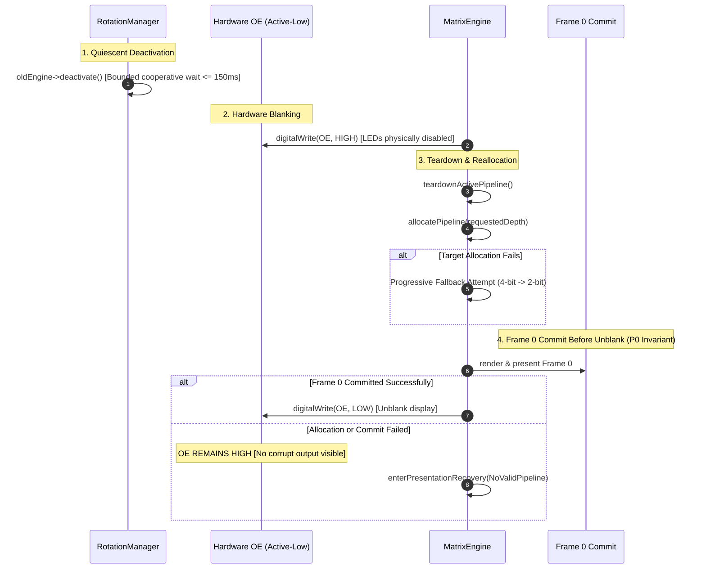

# ArcadeMatrix V4 Memory Model & Hardware Presentation Architecture

> **Authoritative Specification**  
> **Status:** Normative Core Architecture  
> **Target Platforms:** ESP32 Classic (`esp32dev`) & ESP32-S3 (`esp32s3_waveshare`)

---

## 1. Architectural Philosophy & Memory Domains

ArcadeMatrix treats memory as a dynamic, capability-tiered resource subject to strict real-time and physical DMA constraints. ESP-IDF memory allocations are capability-based; different peripherals and subsystems require memory with specific hardware attributes:

```
┌────────────────────────────────────────────────────────────────────────┐
│                        ESP32 Physical Memory                           │
├──────────────────────────────────────────┬─────────────────────────────┤
│         Internal SRAM (320–512 KB)       │   External PSRAM (8 MB)     │
│                                          │  (ESP32-S3 Targets Only)    │
├────────────────────┬─────────────────────┼─────────────────────────────┤
│ General Heap       │ DMA-Capable SRAM    │ Large Asset Caches          │
│ MALLOC_CAP_8BIT    │ MALLOC_CAP_DMA      │ MALLOC_CAP_SPIRAM           │
│                    │                     │                             │
│ • FreeRTOS Stacks  │ • HUB75 Bitplanes   │ • Pre-decoded GIF Frames    │
│ • Core Structures  │ • I2S Audio Buffers │ • Audio PCM Buffers         │
│ • mbedTLS Records  │ • SPI Master DMA    │ • Font Glyph Caches         │
└────────────────────┴─────────────────────┴─────────────────────────────┘
```

> [!WARNING]
> **Capability-Filtered Views (Not Disjoint Pools):**  
> On ESP32 architectures, `MALLOC_CAP_DMA` is a capability attribute satisfied by a subset of internal SRAM. Therefore:
> $$\text{dmaFreeBytes} \subseteq \text{internalFreeBytes}$$
> **It is strictly prohibited to sum** `internalFreeBytes + dmaFreeBytes`. Doing so double-counts memory and causes catastrophic Out-Of-Memory (OOM) prediction errors.

---

## 2. Quantitative HUB75 DMA Memory Footprint

The authoritative source of truth for DMA bitplane sizing is `Hub75DmaLayout::calculateBytes()`:
$$\text{DMA Bytes} = \left(\frac{\text{Height}}{2}\right) \times \text{Depth} \times (\text{Width} \times 2) \times \text{Buffers}$$

### 2.1 Authoritative DMA Sizing Table

| Geometry | Color Depth | Single Buffer (`canvas_single`) | Double Buffer (`direct_double`) |
| :--- | :---: | :---: | :---: |
| **64 × 32** | 8 bits | 4,096 B | 8,192 B |
| **64 × 32** | 4 bits | **2,048 B** | 4,096 B |
| **128 × 32** | 8 bits | 16,384 B | 32,768 B |
| **128 × 32** | 6 bits | 12,288 B | 24,576 B |
| **128 × 32** | 4 bits | **8,192 B** | 16,384 B |
| **128 × 32** | 2 bits | **4,096 B** | 8,192 B |
| **128 × 64** | 8 bits | 32,768 B | 65,536 B |
| **128 × 64** | 4 bits | **16,384 B** | 32,768 B |
| **256 × 64** | 8 bits | 65,536 B | 131,072 B |
| **256 × 64** | 4 bits | **32,768 B** | 65,536 B |

---

## 3. Deterministic Dynamic Color Depth ($8 \leftrightarrow 4$)

In ArcadeMatrix V4, when `dynamic_color_depth` is enabled, the runtime commutes deterministically during rotation transitions:

```
[Graphics Engine: Clock, GIF, Marquee] ───(Rotation)───► [TLS Network Engine: Crypto, Stock, Weather]
         Depth = 8 bits (Configured)                                Depth = 4 bits (TLS Nominal)
         DMA = 16,384 B (128x32)                                    DMA = 8,192 B (128x32)
         Contiguous DRAM = Ample                                    Reclaims +8,192 B for mbedTLS
```

### 3.1 Depth Concepts & Semantics
- **`configuredDepth` :** User preference configured via `/api/settings` (defaults to 8 bits).
- **`requestedDepth` :** Deterministic policy decision for the incoming engine:
  $$\text{requestedDepth} = (\text{targetNeedsTls} \land \text{dynamicColorDepth}) \;?\; \min(\text{configuredDepth}, 4) \;:\; \text{configuredDepth}$$
- **`effectiveDepth` :** Actual hardware bit depth successfully allocated in the controller.
- **`fallbackUsed` :** Strict telemetry indicator:
  $$\text{fallbackUsed} = (\text{effectiveDepth} \neq \text{requestedDepth})$$

---

## 4. Hardware Presentation Transaction (Invariant 21)

Every pipeline reconfiguration executes under **hardware Output Enable (OE) blanking** to ensure no optical glitches, tearing, or corrupt scanlines reach the physical display:



### 4.1 Invariant Formel P0
`digitalWrite(OE, LOW)` is strictly prohibited until:
1. Physical DMA memory is allocated.
2. Color LUTs are rebuilt (`FastMatrixPanel::initLuts(effectiveDepth)`).
3. Frame 0 is rendered and committed to the active hardware pipeline (`firstFrameCommitted == true`).

---

## 5. Memory Health Score & Domain Metrics

The `MemoryManager` computes empirical domain metrics:
- **Fragmentation Ratio per Domain :**
  $$\text{fragmentationPct} = 100 - \left( \frac{\text{largestBlock} \times 100}{\text{freeBytes}} \right)$$
- **Memory Health Score ($0 \dots 100$) :**
  $$\text{Score} = 0.4 \times \min\left(100, \frac{\text{freeInternal}}{60\,\text{KB}} \times 100\right) + 0.4 \times \min\left(100, \frac{\text{largestBlock}}{35\,\text{KB}} \times 100\right) + 0.2 \times (100 - \text{fragmentationPct})$$
